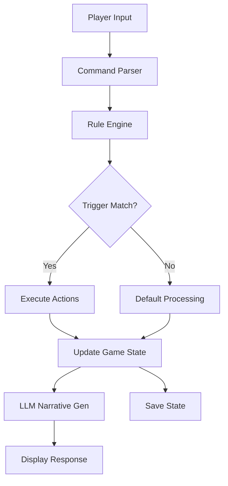

# ChatBotRPG Project

## Overview

**Creator**: [[User-appl2613]] (aka monkeyrithms, Newbiks Cube)
**Type**: Turn-based RPG engine with visual rule editor
**Architecture**: PyQt5 desktop application
**Key Innovation**: StarCraft-inspired trigger system for non-coders
**GitHub**: https://github.com/NewbiksCube/ChatBotRPG
**Release Date**: July 13, 2025 (first public release in community)
**Status**: Open source, actively developed

## Project Philosophy

> **Core Principle**: "Visual programming over code - no programming required for quest design"

ChatBotRPG proves that complex LLM game engines are accessible to non-programmers:
- **GUI-first design**: Desktop application with visual editors
- **Trigger-based logic**: "If this, then that" rules in JSON
- **Separation of concerns**: TXT files for content, JSON for logic
- **Programmatic magic**: State changes are code, not AI decisions

> "As a not-coder, when i see brackets and indentations and stuff im like, 'thats for the devs lol'" (January 2024)
>
> By July 2025: Proficient in Python, PyQt5, published working game engine on GitHub

## Architecture

### High-Level System Design



### Technology Stack

**Core**:
- **Language**: Python 3.10.11
- **GUI Framework**: PyQt5 (desktop application)
- **Database**: SQLite (.world and .save files)
- **Data Format**: JSON (rules, state), TXT (character sheets)
- **LLM Integration**: OpenRouter (multi-model support planned)

**Design Philosophy**:
- Desktop-first (not web-based)
- Self-contained (single executable goal)
- User-friendly (visual editors, no code required)
- Modder-friendly (human-readable TXT files)

### Core Systems

#### 1. Visual Rule Editor

**Inspiration**: StarCraft campaign editor trigger system

**Interface**:
```
┌─────────────────────────────────────────┐
│ Chat Triggers    Timer Triggers    [+]  │
├─────────────────────────────────────────┤
│ IF:                                      │
│  ├─ Variable: player_inventory          │
│  ├─ Contains: ancient_artifact          │
│                                          │
│ THEN:                                    │
│  ├─ Action: advance_quest_stage(2)      │
│  ├─ Action: spawn_npc("Old Man")        │
│  ├─ Action: add_item("gold", 100)       │
│                                          │
│ [Update] [Duplicate] [Delete]           │
└─────────────────────────────────────────┘
```

**Rule JSON Structure**:
```json
{
  "trigger_type": "chat",
  "condition": {
    "type": "variable",
    "scope": "player",
    "var_name": "inventory",
    "operator": "contains",
    "value": "ancient_artifact"
  },
  "actions": [
    {"type": "quest_stage", "quest_id": "find_artifact", "stage": 2},
    {"type": "spawn_npc", "name": "Old Man", "mood": "relieved"},
    {"type": "add_item", "item": "gold", "quantity": 100}
  ]
}
```

**Scopes Supported**:
- Global (world state)
- Player (player character)
- Character (specific NPC)
- Scene (current location)
- Setting (environment)

See: [[01-Pattern-to-Code-Mapping]] for implementation

#### 2. Item System with Programmatic Effects

**Design**: Items trigger code, not just narrative

**Example - Time Stop Potion**:
```python
class MagicItem:
    effect = "time_freeze"

    def consume(self, scene):
        # Programmatically freeze all entities
        for entity in scene.entities:
            entity.frozen = True
            entity.prompt = entity.frozen_prompt

        # Update scene description
        scene.description = scene.frozen_description

        # Disable all NPC actions
        scene.allow_npc_actions = False

    def restore(self, scene):
        # Programmatically unfreeze
        for entity in scene.entities:
            entity.frozen = False
            entity.prompt = entity.standard_prompt

        scene.description = scene.normal_description
        scene.allow_npc_actions = True
```

**Why Programmatic?**:
> "If this is not programmatically controlled... various agents will still describe things moving or ignore the effect entirely while others adhere to it, and occasionally it will write that time starts again, randomly"

**Item Categories**:
- Consumables (food, potions, one-time effects)
- Equipment (weapons, armor, stat modifiers)
- Readable (books, notes, lore triggers)
- Quest items (trigger-based progression)
- Magic items (world-state alterations)

See: [[item-schema]] for data structure

#### 3. Map/Scene System

**Architecture**: Graph-based world navigation

**Map Editor Interface**:
```
┌───────────────────────────────────┐
│  World Map: Fantasy Realm         │
├───────────────────────────────────┤
│                                    │
│    [New RPG]                       │
│         │                          │
│    [Goldsprings]───[Combat Arena]  │
│         │                          │
│    [Post-Apocalyptic]              │
│                                    │
│  [Add Scene] [Connect] [Edit]     │
└───────────────────────────────────┘
```

**Scene Data Structure**:
```json
{
  "id": "goldsprings_tavern",
  "name": "Golden Oak Inn",
  "description": "A cozy tavern with oak beams...",
  "exits": [
    {"direction": "north", "leads_to": "goldsprings_square"},
    {"direction": "upstairs", "leads_to": "inn_rooms"}
  ],
  "entities": ["Mara_Emberlight", "Barkeep_Tom"],
  "items": ["ale", "bread", "quest_note"],
  "state": {
    "time_of_day": 14,
    "lighting": "natural",
    "crowd_level": "moderate"
  }
}
```

**Travel Commands** (extensive synonym support):
```python
TRAVEL_COMMANDS = [
    "enter", "go", "walk", "jog", "join", "run",
    "scene", "transit", "travel", "change", "switch",
    "move", "teleport", "warp", "fasttravel", "skip"
]
```

> "Im a big fan of multiple things meaning the same thing"

See: [[ux-flows]] for interaction patterns

#### 4. Quest Staging System

**Problem**: LLMs one-shot everything, collapsing multi-turn quests

**Solution**: Turn-based pacing with stage injection

**Quest Stage Structure**:
```json
{
  "quest_id": "find_artifact",
  "stages": [
    {
      "stage": 1,
      "turns_required": 3,
      "prompt_injection": "Introduce the problem vaguely. Do not reveal full details.",
      "completion_condition": "turn_count >= 3"
    },
    {
      "stage": 2,
      "turns_required": 2,
      "prompt_injection": "Reveal the stakes and emotional weight.",
      "completion_condition": "player_emotion == 'engaged'"
    },
    {
      "stage": 3,
      "turns_required": 1,
      "prompt_injection": "Provide solution path. Allow player action.",
      "completion_condition": "player_inventory.contains('ancient_artifact')"
    },
    {
      "stage": 4,
      "turns_required": 2,
      "prompt_injection": "Resolve quest. Show consequences.",
      "completion_condition": "artifact_delivered"
    }
  ]
}
```

**Implementation**:
```python
def process_turn(player_input, quest_state):
    current_stage = quest_state.get_stage()

    # Inject stage-specific prompt
    prompt = build_prompt(
        base_context,
        stage_injection=current_stage.prompt_injection
    )

    response = llm_generate(prompt)

    # Check stage completion
    if current_stage.is_complete(game_state):
        quest_state.advance_stage()

    return response
```

**Result**: Multi-turn story development instead of instant resolution

See: [[turn-based-pacing]] for pacing patterns

#### 5. Character Management

**NPC System**: Context-aware behavior based on location and time

**Character Data (TXT Format)**:
```
NAME
Mara Emberlight

DESCRIPTION
A skilled blacksmith who runs the forge in Goldsprings.

PERSONALITY
Direct, hardworking, secretly kind-hearted

APPEARANCE
Muscular build, soot-stained apron, calloused hands

CAREER
Blacksmith

WORK_LOCATION
Goldsprings Forge

WORK_HOURS
08:00-17:00

STANDARD_PROMPT
You are Mara, a blacksmith. You're straightforward and focused on your craft.

CAREER_PROMPT
You are at work at your forge. You're focused on orders and less chatty.
```

**Context-Aware Prompting**:
```python
def get_npc_prompt(npc, current_time, current_location):
    if (npc.location == current_location and
        current_time in npc.work_hours):
        return npc.career_prompt  # At work, professional
    else:
        return npc.standard_prompt  # Off work, relaxed
```

**Dynamic NPC Generation**:
```
┌────────────────────────────────────┐
│  Character Generator               │
├────────────────────────────────────┤
│  Name: Jane Doe                    │
│  [Generate Description]            │
│  [Generate Personality]            │
│  [Generate Appearance]             │
│  [Generate Goals]                  │
│  [Generate Equipment]              │
│  [Generate Abilities]              │
│  [Generate Story]                  │
│                                     │
│  [Save Character]                  │
└────────────────────────────────────┘
```

See: [[actor-schema]] for full schema

## Development Timeline

### Q1 2024 (Jan-Mar): Foundation
- Joined LLM World Engine Discord discussions
- Started learning Python and PyQt5
- Built basic chat interface prototype
- Experimented with LLM integration

**Challenge** (February 2024):
> "once again, GUI stuff becomes my achilles heel. it is such a twisted puzzle trying to get it to simply update the buttons when the scene changes"

### Q2 2024 (Apr-Jun): Core Systems
- Implemented rule engine
- Developed item consumption mechanics
- Built scene management system
- Created map editor prototype

**First Demo** (June 2024):
- Golden Oak Inn tavern scene
- NPC: Mara Emberlight (blacksmith)
- Quest: Old Man's ancient artifact
- Item system working
- Basic rule triggers functional

### Late 2024 (Jul-Dec): Refinement
- Model compatibility testing (Hathor, Mixtral, small 7B models)
- Improved rule reliability
- Implemented character generation system
- Added career/schedule logic for NPCs
- Extensive debugging and stability improvements

**Model Testing Findings** ([[User-yukidaore]]):
- **Hathor**: Too creative (diamond horses, spontaneous teleportation)
- **Mixtral**: Reliable rule following
- **Small 7B models**: Needed explicit constraints

### 2025 (Jan-Jul): Polish and Release
- Final stability pass
- SQLite migration (.world and .save files)
- Documentation writing
- Visual screenshots compilation
- **GitHub setup and learning**
- **Public release: July 13, 2025**

> "So today is the day... my first major public project released on Github which I learned how to use like yesterday"

## Key Features

### Completed Features ✅
- Visual rule editor (trigger-based logic)
- Item consumption with programmatic effects
- Scene/map navigation system
- Quest staging with turn pacing
- Character generation (LLM-assisted)
- Context-aware NPC behavior
- Save/load system (SQLite)
- Hunger/thirst mechanics
- Magic item effects (time stop, teleport)
- Map editor with visual graph
- Multi-model support (OpenRouter)
- Slash command system (20+ synonyms per action)

### Known Issues at Release 🐛
- In-game map viewer broken
- Scene switching has minor bugs
- Limited model provider support (OpenRouter initially)
- Missing features vs established AI RP platforms (portraits, backgrounds)

### Planned Features 📋
- Expand model provider support
- Fix in-game map viewer
- Add character portraits
- Scene background images
- Collaborative worldbuilding tools
- Community content sharing

## Visual Documentation

### Interface Screenshots (May 2025 Reveal)

#### Main Game Interface
![[Media/ChatbotRPG1-B43DA.jpg]]

**Features**:
- Retro CRT green-on-black aesthetic (customizable color)
- Scene tabs for quick navigation
- Turn counter display
- ASCII art branding
- Save/Load buttons
- Clean separation of input/output

> "Its supposed to have an old crt monitor theme... paying respects to the original text-adventures like Zork"

#### NPC Interaction System
![[Media/ChatbotRPG2-203E4.jpg]]

**Demonstrates**:
- Natural conversation flow
- Party mechanics ("Follow" command)
- Scene transitions
- Context-aware dialogue
- Multi-character interactions

#### Visual Rule Editor
![[Media/ChatbotRPG3-F77A8.jpg]]

**Core Innovation**:
- Chat Triggers vs Timer Triggers
- Condition builder (Variable, following, ischatting)
- Scope selectors (Global, Player, Character, Scene, Setting)
- CRUD operations (Update, Duplicate, Delete)
- Model selection dropdown
- No code required

> "trigger-based 'if this, then that' system. Provides an entire RPG's worth of flexibility without having to write code"

#### Map Editor & Scene System
![[Media/ChatbotRPG4-423EF.jpg]]

**Shows**:
- Visual map (Goldsprings, Combat Arena, Post-Apocalyptic)
- Scene relationship diagram
- Route connections
- Integrated map viewer
- Natural language navigation

> "can define your whole game world and how all that stuff links together in a working map editor"

#### Character Creation Interface
![[Media/ChatbotRPG5-64BE7.jpg]]

**Features**:
- Complete character sheet (Jane Doe example)
- LLM-assisted generation buttons
- Sections: Name, Description, Personality, Appearance, Goals, Equipment, Abilities, Story
- Mix of manual editing and AI generation
- JSON-based architecture

> "all the building-blocks of the game essentially--are in json format, the LLM will soon become involved in the process of writing these rules, auto-generating characters, etc."

## Technical Innovations

### 1. Multiple Inference Passes

**Philosophy**: Human brains don't one-shot complex decisions

> "the brain has multiple regions that calculate for different things... we as human beings don't always one-shot our answers to things, sometimes there is a quick deliberation or setup in the brain first"

**Application**:
1. Parse player input (inference 1)
2. Check rule violations (inference 2)
3. Generate NPC response (inference 3)
4. Update quest stage if needed (inference 4)

**Trade-off**: Slower with local models, but more reliable

### 2. Programmatic Magic Effects

**Time Stop Example**:
```python
if magic_effect == "time_freeze":
    # Programmatically freeze ALL entities
    for entity in scene.entities:
        entity.frozen = True
        entity.prompt = entity.frozen_prompt

    # Environment reflects frozen state
    scene.description = scene.frozen_description

    # Setting responds when time restarts
    scene.on_unfreeze = lambda: describe_world_resuming()
```

**Why It Matters**:
- Prevents inconsistent LLM behavior
- Ensures all NPCs adhere to effect
- Avoids random effect cancellation
- Creates reliable magic systems

### 3. Extensive Command Synonyms

**Design Philosophy**: User convenience over code elegance

```python
# Scene transition command patterns
SCENE_PATTERNS = [
    r'^/(enter|go|walk|jog|join|run)',
    r'^/(scene|transit|travel|change|switch)',
    r'^/(move|teleport|warp|fasttravel|skip)'
]

def parse_command(user_input):
    for pattern in SCENE_PATTERNS:
        if re.match(pattern, user_input):
            return change_scene(extract_location(user_input))
```

> "call me obsessive" (on extensive command synonyms)

### 4. SQLite-Based World Files

**Data Architecture**:
```
game_directory/
  my_epic_rpg.world     # Complete game definition
  save_001.save         # Player save file 1
  save_002.save         # Player save file 2
```

**Benefits**:
- Self-contained game files
- No nested folder mess
- Easy sharing and backup
- Clean version control

> "not using nested folders and .json files for everything anymore either. no more mess on the computer."

## Performance & Results

### Model Compatibility
- **GPT-4**: Very good, only model that can "kinda-sorta one-shot" with all rules
- **Mixtral**: Reliable rule following
- **Hathor**: Too creative, breaks constraints
- **Small 7B models**: Work with explicit constraints and multi-inference

### Code Scale
- Python codebase (exact LOC unknown)
- Extensive JSON rule library
- TXT-based content library
- SQLite database schema

### Community Testing
- Extensive testing by [[User-yukidaore]]
- Windows compatibility testing by [[User-hermokratesthelate]]
- Feature suggestions from [[User-casual_autopsy]]
- Multiple bug reports and iterations

### Public Reception (July 2025)
- First public GitHub release in community
- Proof that non-programmers can build complex engines
- Validation of visual programming approach
- Reference implementation for trigger-based systems

## Lessons Shared with Community

### On Item Systems
> "you do want consumables to have the capability of imparting 'something happens' to the player... it would be nice if the Thing the potion is supposed to do was the same between scene A and scene B"

### On Model Selection
> "gpt-4 was very good, its the only model that can kinda-sorta one-shot a good RP with all the rules... a big model can handle a huge one-shot validation question with tons of detail"

### On Development Motivation
> "I need to do some worldbuilding for myself as I go or I will get tired of just code all day"

### On Upscaling vs One-Shotting
> "what I'm really getting at here is the concept of upscaling vs. one-shotting high resolution... If the answer is 'very important', upscale your posts instead of one-shotting them"

### On LLM Behavior
> "LLMs don't really have much concept of 'time' -- each time they're prompted... to their perspective, they're posting the very first time"

### On Community
> "its definitely not [a competition], lol, feels more like were all a team in here"

## Related Documentation

### Core Pages
- [[User-appl2613]] - Creator profile and development journey
- [[01-Architecture-and-Design]] - Architectural contributions
- [[02-Prompt-Engineering]] - Pacing and turn-counting techniques

### ChatBotRPG Analysis
- [[00-CHATBOTRPG-INDEX]] - Complete code analysis master index
- [[01-Repository-Overview]] - System architecture breakdown
- [[01-Pattern-to-Code-Mapping]] - Pattern implementation mapping
- [[actor-schema]] - Character data structure
- [[00-DISCOVERED-PROMPTS-INDEX]] - 18 extracted prompts

### Architectural Patterns
- [[event-driven-architecture]] - Trigger-based systems
- [[turn-based-pacing]] - Quest pacing pattern
- [[scene-based-persistence]] - Scene state management

## Comparison with Other Projects

### vs ReallmCraft ([[ReallmCraft-Project]])

**Shared Principles**:
- LLM as narration layer only
- Programmatic state management
- Template-based content
- Modular/extensible architecture

**Differences**:

| Aspect | ChatBotRPG | ReallmCraft |
|--------|------------|-------------|
| Architecture | Desktop (PyQt5) | Web (Flask + React) |
| Core Innovation | Visual rule editor | NDL translation layer |
| Design Philosophy | GUI-first | Backend-first |
| Target User | Non-programmers | Programmers |
| Release Status | Public (GitHub) | Private (in development) |
| Iteration Count | ~1-2 major rewrites | ~12 iterations |
| Development Style | Incremental | Revolutionary |

**Unique to ChatBotRPG**:
- StarCraft-inspired trigger system
- TXT-based content editing
- SQLite world files
- Visual map editor
- First public release in community

## Community Impact

### Achievements
- ✅ First community member to publicly release working engine (July 13, 2025)
- ✅ Proved non-programmers can build complex systems
- ✅ Validated visual programming approach for LLM games
- ✅ Demonstrated importance of turn-based pacing
- ✅ Popularized trigger-based rule systems

### Contributions to Knowledge Base
- Turn-counting for quest pacing
- Programmatic magic effect patterns
- Context-aware NPC behavior
- Multi-inference architecture
- Model compatibility data (Hathor, Mixtral, GPT-4)

### Inspired Discussions
- Visual programming vs code-first
- Accessibility for non-technical creators
- Desktop vs web deployment
- Trigger systems vs scripting languages
- Community content creation

## GitHub Repository

**URL**: https://github.com/NewbiksCube/ChatBotRPG
**License**: (Check repository for current license)
**Release Date**: July 13, 2025

**Initial Release Contents**:
- Complete engine source code
- Small demo scene (Golden Oak Inn)
- Character generation system
- Rule engine
- Map editor
- Installation instructions

**Vision**:
> "I think it'd be awesome to collab with others in the worldbuilding process on top of it and multiple people contribute to the development of the same game world"

## Future Directions

### Immediate Priorities
- Expand model provider support (beyond OpenRouter)
- Fix in-game map viewer
- Stabilize scene switching
- Improve documentation

### Planned Features
- Character portrait system
- Scene background images
- Enhanced visual editors
- Community content marketplace
- Collaborative worldbuilding tools

### Long-term Vision
- Multi-creator game worlds
- Content sharing platform
- Advanced rule templates
- Visual scripting expansions
- Educational tutorials for non-coders

---

> [!success] Achievement Unlocked
> **First Public Release**: appl2613 became the first member of the LLM World Engine community to publicly release a complete, working game engine on GitHub (July 13, 2025).

> [!info] Impact Assessment
> ChatBotRPG demonstrated that complex LLM game engines are accessible to non-programmers willing to learn. The visual rule editor and StarCraft-inspired trigger system represent a unique approach distinct from code-first architectures.

> [!quote] Developer's Journey
> From "not a coder" (January 2024) to publishing a working game engine on GitHub (July 2025) - a testament to iterative learning, community support, and focused execution.
