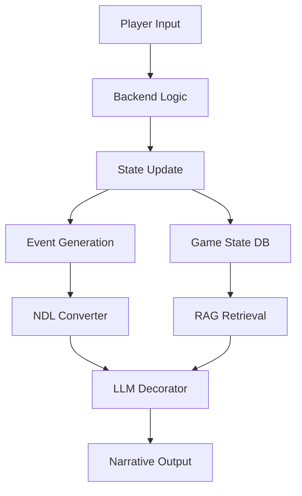

# ReallmCraft Project

## Overview

**Creator**: [[User-veritasr]]
**Type**: LLM-powered Minecraft-inspired world engine
**Architecture**: Flask backend + React frontend
**Key Innovation**: Natural Description Language (NDL) for controlled narrative generation
**Code Scale**: ~7,500+ lines (July 2024)
**Status**: Active development, ~12th iteration, not publicly released

## Project Philosophy

> **Core Principle**: "The program decides, NDL describes, LLM narrates"

ReallmCraft represents a paradigm shift in LLM game design:
- **Program-first architecture**: Backend logic determines all game state changes
- **LLM as decorator**: AI only generates narrative text, makes no decisions
- **NDL translation layer**: Converts programmatic events to natural language markup
- **Constraint-based reasoning**: Uses expert systems and rule engines over probability

> "Turns out that when you take away decision making from the LLM it behaves much better."

## Architecture

### High-Level System Design



### Technology Stack

**Backend**:
- **Framework**: Flask (Python)
- **Database**: PostgreSQL (production), SQLite (development)
- **Vector DB**: ChromaDB for semantic search
- **State Management**: JSON-based save files
- **Task Processing**: Background workers for generation

**Frontend**:
- **Framework**: React/Next.js
- **UI Paradigm**: Selection-based menus (reduce typing fatigue)
- **State Machine**: FSM-based contextual menus
- **Deployment**: Considered Tauri for desktop

**AI/LLM**:
- **Primary Models**: Gemma, Llama3, Mistral, Stheno (7B-9B range)
- **Inference Backends**: Ooba, Kobold, OpenAI, OpenRouter, Mancer
- **Multi-model support**: Different models for different tasks

### Core Systems

#### 1. Natural Description Language (NDL)

**Purpose**: Translate programmatic events into controlled narrative prompts

**Flow**:
```
Backend Event → NDL Markup → LLM Processing → Natural Narrative
```

**Example NDL Markup**:
```ndl
[scene:tavern]
  [character:Elara|mood:concerned]
    [dialogue|intent:request_help]
      "The ancient ruins are dangerous..."
    [/dialogue]
  [/character]
  [action:player|type:accept_quest]
[/scene]
```

**Results**:
- Consistent subtext and emotional beats
- Reliable character motivation without explicit scripting
- Works across small and large models
- Prevents LLM hallucination of state changes

See: [[08-NDL-Natural-Description-Language]] for complete specification

#### 2. Hybrid RAG System

**Retrieval Strategy**: Multi-method fusion for context

**Three Retrieval Types**:
1. **Exact Match**: Direct name/ID lookups
2. **Boolean Search**: Tag-based filtering
3. **Semantic Similarity**: Vector search for descriptions

**Key Innovation**: Store experiences, not descriptions
> "Semantic similarity isn't meant to locate stuff like keywords... it's meant to find similar paragraphs of text."

**Implementation**:
```python
def hybrid_retrieve(query, context):
    # Exact matches first (O(1) lookup)
    exact = exact_match(query)

    # Boolean tag search (O(n) with indexing)
    tags = boolean_search(extract_tags(query))

    # Semantic search (vector similarity)
    semantic = vector_search(query, top_k=10)

    # RRF-style fusion
    ranked = reciprocal_rank_fusion(exact, tags, semantic)

    return ranked[:context_limit]
```

**Context Management**:
- Token estimation with 1/50 ratio padding
- Priority-based inclusion (exact > tags > semantic)
- Dynamic pruning to fit context window

See: [[03-RAG-and-Memory]] for implementation details

#### 3. World Generation System

**Approach**: Just-In-Time generation with template fixation

**Principles**:
- Don't generate everything upfront
- Generate as needed (player proximity/interaction)
- Fix values once created (consistency)
- Cache generated content

**Template System**:
```json
{
  "entity_type": "npc",
  "template": "innkeeper",
  "attributes": {
    "name": "${generate:name|culture:fantasy}",
    "personality": "${template:friendly_merchant}",
    "inventory": "${generate:shop_items|type:general_goods}",
    "schedule": "${template:innkeeper_schedule}"
  }
}
```

**Generation Pipeline**:
1. Player triggers generation (enters area, asks question)
2. Backend selects appropriate template
3. LLM fills in ${generate:} placeholders
4. Results cached and persisted
5. Future references use cached data

See: [[04-World-Generation]] for generation patterns

#### 4. Constraint Programming System

**Paradigm Shift** (July 2024): From probability to constraints

**Four Component Types**:

1. **Generators**: Create and cache options/choices
   ```python
   def generate_combat_actions(character):
       # Generate possible actions
       actions = []
       if character.has_weapon():
           actions.extend(weapon_attacks(character.weapon))
       if character.has_magic():
           actions.extend(spell_list(character.spells))
       return cache_actions(actions)
   ```

2. **Assemblers**: Compose elements from choices
   ```python
   def assemble_character(race, class_type):
       base_stats = race_template[race]
       class_mods = class_template[class_type]
       equipment = starting_gear[class_type]
       return Character(base_stats, class_mods, equipment)
   ```

3. **Evaluators**: Parse conditions, score, make choices
   ```python
   def evaluate_action(action, context):
       if not meets_prerequisites(action, context):
           return None
       score = utility_score(action, context)
       return (action, score)
   ```

4. **Analyzers**: Abstract data, derive metrics
   ```python
   def analyze_world_state():
       metrics = {
           'danger_level': calculate_threat(),
           'quest_progress': track_objectives(),
           'npc_moods': aggregate_relationships()
       }
       return metrics
   ```

#### 5. Modding Framework

**Design Goal**: Support user-created content from day one

**Mod Structure**:
```
mods/
  my_mod/
    mod.json           # Manifest
    templates/         # Entity templates
    scripts/           # Game logic
    locales/           # Translations
    assets/            # Images, sounds
```

**Template Inheritance**:
```json
{
  "extends": "core:npc",
  "overrides": {
    "name_generator": "my_mod:custom_names"
  },
  "additions": {
    "reputation_system": "my_mod:faction_rep"
  }
}
```

**Tooling Focus**:
- LLM-generated templates (reviewed by humans)
- GUI editors for non-coders
- Crowdsourced content creation
- Easy testing and validation

## Development Timeline

### Early 2024 (Jan-Mar)
- Joined LLM World Engine Discord thread
- Established core architecture principles
- Built world generation system
- Implemented initial RAG retrieval
- Iteration 1-4: Exploration phase

### Mid 2024 (Apr-Jun)
- React frontend development
- Micromamba integration (cross-platform support)
- Workflow systems
- Random table generation
- Extensive playtesting (Zweihander-inspired world)
- Iteration 5-8: Feature expansion

### Late 2024 (Jul-Dec)
- Character generation systems
- Behavior systems
- NDL initial development
- Constraint programming exploration
- Modding framework architecture
- Iteration 9-11: Architectural pivot

### 2025 (Jan-Jul)
- NDL refinement and validation
- Advanced prompting workflows
- Selection-based UI (FSM menus)
- Subtext and implicit dialogue systems
- Iteration 12: Current "expert system + LLM decorator" architecture
- Still in "very WIP" state (~2 weeks into iteration 12 as of July 2025)

## Key Features

### Completed Features
- ✅ Modular world generation
- ✅ Template-based entity system
- ✅ Hybrid RAG retrieval (exact + boolean + semantic)
- ✅ NDL translation layer
- ✅ Multi-model support (7B-9B models work reliably)
- ✅ Context window management with token estimation
- ✅ Selection-based UI with FSM menus
- ✅ Save/load system with state persistence
- ✅ Mod framework architecture

### In Development
- 🔄 Custom scripting language for game logic
- 🔄 Constraint programming full integration
- 🔄 Advanced behavior trees
- 🔄 Fractal location generation
- 🔄 Complete mod tooling and editors

### Planned Features
- 📋 Public GitHub release (when ready)
- 📋 Multiplayer/shared world exploration
- 📋 Community content marketplace
- 📋 Visual node editor for logic
- 📋 Replay/spectator mode

## Technical Challenges Overcome

### 1. Cross-Platform Support
**Problem**: Conda/Python environment complexity on Windows
**Solution**: Micromamba integration with automated environment setup

### 2. Context Window Management
**Problem**: Limited context for complex worlds
**Solution**: Dynamic token estimation (1/50 ratio), priority-based pruning, hybrid retrieval

### 3. Retrieval Quality
**Problem**: Vector search alone insufficient for game queries
**Solution**: Hybrid exact + boolean + semantic with RRF fusion

### 4. UI Complexity
**Problem**: Typing fatigue in text-based games
**Solution**: Selection-based menus, FSM-driven contextual options

### 5. LLM Consistency
**Problem**: Models hallucinate state changes and break game logic
**Solution**: NDL system - program controls all state, LLM only narrates

### 6. Iteration Fatigue
**Problem**: Rebuilding same features multiple times
**Solution**: Modular architecture, embrace iterative design, template everything

## Philosophical Insights

### On LLM Role
> "Sort of like it just narrating what happens in the world rather than the LLM trying to continue the story"

> "LLMs are terrible at state management - Keep state programmatic"

### On Architecture
> "Essentially half simulation half story"

### On Development
> "A lot of these ideas make it to partial implementations before throwing them out"

> "I'm like on iteration 12 for this thing"

### On Sharing Work
> "I don't typically share projects, since that means people want me to support them. I've been burned by that in the past."

### On Innovation
> "It sort of feels like the industry is catching up to what we were doing in here _last_ year"

## Performance & Results

### NDL Validation (July 2025)
- ✅ Consistent subtext in narrative
- ✅ Controlled emotional beats
- ✅ Reliable dialogue with implicit intent
- ✅ Works across Gemma, Llama3, Mistral, Stheno (7B-9B)
- ✅ No state hallucinations
- ✅ Character motivation preserved without explicit scripting

### RAG Performance
- Exact match: ~O(1) with dictionary lookup
- Boolean search: ~O(n) with tag indexing
- Semantic search: ~100ms for top-10 (ChromaDB)
- Combined fusion: ~150ms total retrieval time

### Code Scale
- ~7,500+ lines Python (backend)
- Unknown lines React (frontend)
- Template library: Extensive JSON data
- 12 major iterations over 18 months

## Lessons Shared with Community

### On Context Management
- Token estimation with padding (1/50 ratio)
- Priority-based context inclusion
- Exact matches first, semantic search second

### On Content Generation
- LLM-generated templates work well when reviewed
- Cache and refine generated content
- Focus tooling on data creation, not code
- Consider crowdsourcing for scale

### On Retrieval
- Three approaches: RAG, boolean, knowledge graphs
- Hybrid works best for game engines
- Store experiences, not just descriptions
- Generate hypothetical questions for better matching

### On Architecture
- Backend work easier than frontend (for veritasr)
- Security concerns only matter for multi-user
- Local-first design simplifies considerably
- Plan for modding from start, not as afterthought

### On LLM Usage
- Small models (7B-9B) work fine with NDL
- Multiple inference passes > one-shotting
- Constraint-based > probabilistic generation
- Program decides, LLM decorates

## Related Documentation

### Core Pages
- [[User-veritasr]] - Creator profile and contributions
- [[08-NDL-Natural-Description-Language]] - NDL complete specification
- [[01-Architecture-and-Design]] - Architectural patterns
- [[03-RAG-and-Memory]] - RAG implementation details
- [[04-World-Generation]] - Generation system patterns

### NDL Documentation
- [[00-NDL-INDEX]] - NDL master index
- [[02-grammar]] - EBNF grammar specification
- [[scene-transitions]] - Scene transition patterns
- [[intention]] - Character intention construct
- [[ndl-to-llm-flow]] - How to integrate NDL with LLMs

### Architectural Patterns
- [[program-first-architecture]] - Core design pattern
- [[ndl-bridge]] - NDL integration pattern
- [[multi-model-routing]] - Multi-model strategy
- [[jit-generation]] - JIT generation pattern

### Prompts
- [[scene-description]] - Scene narrative generation
- [[format-enforcement]] - Constraint enforcement
- [[character-generation]] - Character creation

## Community Impact

### Influence on Discussions
- Set standards for architectural thinking
- Provided working code examples
- Debugged others' implementations
- Pushed boundaries of LLM game design

### Contributions to Knowledge Base
- Most prolific technical contributor (by message volume)
- Introduced NDL paradigm (now formally specified)
- Pioneered constraint programming approach
- Validated small model viability (7B-9B)

### Open Questions Answered
- Can small models work? Yes, with NDL
- How to prevent hallucination? Separate state from narration
- What's the right retrieval strategy? Hybrid (exact + boolean + semantic)
- Should LLMs make decisions? No, program should decide

## Comparison with Other Projects

### vs ChatBotRPG ([[ChatBotRPG-Project]])
**Similarities**:
- LLM as narration layer only
- Programmatic state management
- Template-based content
- Modular/extensible architecture

**Differences**:
- ReallmCraft: Backend-first (Flask + React)
- ChatBotRPG: Desktop-first (PyQt5 GUI)
- ReallmCraft: NDL translation layer
- ChatBotRPG: Visual rule editor (StarCraft-inspired)
- ReallmCraft: Not publicly released
- ChatBotRPG: GitHub release (July 2025)

### Unique to ReallmCraft
- Natural Description Language (NDL)
- Constraint programming integration
- Fractal world generation approach
- Advanced RAG with RRF fusion
- Multi-iteration evolutionary design (12+ iterations)

## Future Directions

### Immediate Priorities (veritasr's focus)
- Complete iteration 12 stabilization
- Full constraint programming integration
- Polish NDL implementation
- Improve mod tooling

### Long-term Vision
- Public release when ready (no timeline)
- Community-driven content creation
- Potential collaboration on shared worlds
- Advanced AI director systems
- Procedural quest generation

### Research Directions
- Further constraint programming exploration
- Knowledge graph integration
- Multi-agent NPC systems
- Emergent storytelling from rule interactions

---

> [!info] Project Status
> ReallmCraft remains in active development with no public release date. The project has gone through ~12 major iterations over 18 months, with the current iteration focusing on expert systems + LLM decorator architecture.

> [!success] Key Achievement
> Successfully demonstrated that small models (7B-9B) can generate consistent, high-quality narrative when combined with NDL translation layer and program-first architecture. This validates the "program decides, LLM decorates" paradigm.

> [!quote] Developer's Perspective
> "Very WIP... like 2 weeks in or something like that" (re: iteration 12, July 2025)
>
> The willingness to throw out and rebuild demonstrates commitment to finding the right architecture over rushing to release.
