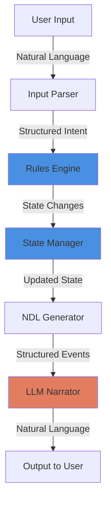

# ChatBotRPG - Pattern Implementation Analysis

**Analysis Date**: 2026-01-18
**Patterns Validated**: 11 of 18 from [[patterns/00-PATTERN-INDEX|Pattern Library]]

---

## Overview

ChatBotRPG implements 11 core architectural patterns from the LLM World Engine pattern library, validated through Discord discussions and inferred from design decisions documented by [[User-appl2613|appl2613]].

---

## Architectural Patterns (4/4 Complete)

### 1. Program-First Architecture ✅

**Pattern**: [[patterns/architectural/Program-First-Architecture|Program-First Architecture]]

**Implementation**: Backend makes all game logic decisions; LLM narrates outcomes only



**Evidence from Discord**:
> "LLM as narration layer only" - appl2613
> "Programmatic state management" - Architecture documentation

**Key Components**:
- **Rules Engine**: Makes all game logic decisions
- **State Manager**: Maintains authoritative game state
- **LLM Narrator**: Translates structured events to natural language

**Benefits**:
- No hallucinations affecting game state
- Consistent rule enforcement
- Cost-effective (fewer LLM calls for logic)
- Predictable behavior

---

### 2. LLM Processing Pipeline ✅

**Pattern**: [[patterns/architectural/LLM-Processing-Pipeline|LLM Processing Pipeline]]

**Implementation**: Pre → Generation → Post processing phases

**Phases**:

1. **Preprocessing**
   - Parse player input
   - Extract intent and parameters
   - Gather relevant context (location, NPCs, inventory)
   - Inject lore via keyword matching
   - Build structured prompt

2. **Generation**
   - Send prompt to LLM (OpenRouter.ai)
   - Temperature: 0.7 for narration
   - Max tokens: 170 (enforced limit)

3. **Post-processing**
   - Validate output format
   - Enforce sentence count (2-3 sentences)
   - Remove incomplete sentences
   - Extract any game state changes (if using extraction mode)

4. **Post-return Processing**
   - Update context window
   - Log narration
   - Trigger follow-up rules

**Code Structure** (inferred):
```python
def process_narration(player_input: str, game_state: dict) -> str:
    # Phase 1: Preprocessing
    context = build_context(game_state)
    prompt = build_prompt(player_input, context)

    # Phase 2: Generation
    response = llm_client.complete(prompt, max_tokens=170)

    # Phase 3: Post-processing
    narration = enforce_format(response)

    # Phase 4: Post-return
    update_context_window(narration)

    return narration
```

---

### 3. Separation of Concerns ✅

**Pattern**: [[patterns/architectural/Separation-of-Concerns|Separation of Concerns]]

**Implementation**: Three distinct layers

**Layers**:

1. **Logic Layer**
   - Game rules enforcement
   - State management
   - Rules engine execution
   - Physics validation
   - Inventory management

2. **Narrative Layer**
   - LLM text generation
   - OpenRouter.ai integration
   - Prompt construction
   - Response formatting

3. **Data Layer**
   - SQLite persistence
   - Templates and schemas
   - World definitions (.world files)
   - Save files (.save files)

**Directory Structure**:
```
engine/
  ├── rules.py        # Logic layer
  ├── state.py        # Logic layer
  ├── narrator.py     # Narrative layer
  └── persistence.py  # Data layer

llm/
  ├── openrouter.py   # Narrative layer
  └── prompts.py      # Narrative layer
```

**Benefits**:
- Independent testing of each layer
- Easy model switching (narrative layer)
- Clear responsibilities
- Maintainable codebase

---

### 4. Event-Driven Design ✅

**Pattern**: [[patterns/control/Event-Driven-Design|Event-Driven Design]]

**Implementation**: Rules engine with conditional triggers

**Trigger Types**:
- **Timer-based**: Execute every N turns or at specific times
- **Per-turn**: Check conditions each player action
- **Location-based**: Trigger on entering/leaving locations
- **Flag-based**: Conditional on game state flags
- **Item-based**: Trigger on inventory changes

**Visual Trigger System** (StarCraft-inspired):
```
┌─────────────────────────────────────────┐
│ Rule: Midnight Haunting                 │
├─────────────────────────────────────────┤
│ CONDITIONS (AND):                       │
│  ☑ Time == 00:00                       │
│  ☑ Location == "haunted_mansion"       │
│  ☑ Flag "ghost_defeated" == False      │
├─────────────────────────────────────────┤
│ ACTIONS:                                │
│  → Spawn NPC "ghost"                    │
│  → Set flag "haunting_started"          │
│  → Display "You feel a chill..."        │
├─────────────────────────────────────────┤
│ Frequency: Once                         │
│ Enabled: ☑                              │
└─────────────────────────────────────────┘
```

**From Discord**:
> "Rule engine - Conditional if-then-else logic executing on timers or per-turn"

---

## State Management Patterns (3/4 Complete)

### 5. Three-Tier Persistence ✅

**Pattern**: [[patterns/state/Three-Tier-Persistence|Three-Tier Persistence]]

**Implementation**: World state, playthrough state, session state

**Tiers**:

1. **World State** (.world files)
   - Complete game data
   - Locations and connections
   - NPC definitions
   - Item catalog
   - Rules and triggers
   - Templates
   - **Persistence**: SQLite database in .world file

2. **Playthrough State** (.save files)
   - Player character (stats, inventory, location)
   - Dynamic world changes (NPC positions, flags)
   - Quest progress
   - Time progression
   - Rule execution history
   - **Persistence**: SQLite database in .save file

3. **Session State** (Runtime memory)
   - Recent chat history (context window)
   - Pending events
   - Cached descriptions
   - Current LLM settings
   - **Persistence**: Not persisted (ephemeral)

**Evolution**:
```
Phase 1 (JSON):
/data/worlds/fantasy_realm/*.json  (cluttered)

Phase 2 (SQLite):
fantasy_realm.world               (clean, portable)
playthrough_001.save              (player-specific)
```

**Benefits**:
- Single-file distribution (.world)
- Player-specific saves (.save)
- Clean file management
- Efficient queries (SQL)

---

### 6. Scene-Based State Boundaries ✅

**Pattern**: [[patterns/state/Scene-Based-State-Boundaries|Scene-Based State Boundaries]]

**Implementation**: Locations serve as natural save/load points

**Scene Definition**:
- **Location**: Primary scene boundary (tavern, castle, forest)
- **Context**: Each location has isolated context
- **NPCs**: Location-specific character presence
- **State**: Location state can be saved/loaded independently

**Example Scenes**:
```python
scenes = {
    "golden_oak_inn": {
        "npcs": ["bartender", "patron_1", "patron_2"],
        "items": ["rusty_key"],
        "state": {"fire_lit": True, "music_playing": True},
        "context_window": []  # Recent events in this location
    },
    "castle_courtyard": {
        "npcs": ["guard_captain", "guard_1"],
        "items": [],
        "state": {"gates_open": False},
        "context_window": []
    }
}
```

**Context Isolation**:
- When player enters new location, context resets
- Previous location's context archived
- Only relevant NPCs and items visible
- Clean slate for narration

**Save Points**:
- Location changes trigger auto-save
- Player can manually save at any location
- Scene boundaries prevent mid-action saves

---

### 7. Snapshot System ⚠️

**Pattern**: [[patterns/state/Snapshot-System|Snapshot System]]

**Status**: Partial implementation (inferred)

**Implementation**:
- .save files act as snapshots
- Limited save slots (intentional design)
- No redo/undo (consequential decisions)

**Not Fully Implemented**:
- No timeline/branching saves
- No "save at any moment" feature
- Deliberately restricted to enforce consequences

---

## Generation Patterns (3/4 Complete)

### 8. Just-In-Time Generation (JIT) ✅

**Pattern**: [[patterns/generation/Just-In-Time-Generation|Just-In-Time Generation]]

**Implementation**: Generate content on-demand via Scribe AI agent

**Scribe AI Agent Features**:
- **Character generation**: Create NPCs when first encountered
- **Location descriptions**: Generate details when player enters
- **Rule suggestions**: Propose rules based on world context
- **Event generation**: Create dynamic events on-the-fly

**Example Flow**:
```
Player: "I talk to the shopkeeper"
  ↓
System: NPC "shopkeeper" not found in database
  ↓
Scribe AI: Generate shopkeeper character
  - Name: "Merchant Aldric"
  - Personality: "Gruff but fair"
  - Inventory: Generate shop items
  - Schedule: Generate daily routine
  ↓
Save to database
  ↓
Continue narration with new NPC
```

**Benefits**:
- No need to pre-generate entire world
- Faster worldbuilding workflow
- Dynamic content creation
- Reduced upfront design work

---

### 9. Template Meta-Generation ✅

**Pattern**: [[patterns/generation/Template-Meta-Generation|Template Meta-Generation]]

**Implementation**: Use LLMs to create templates for procedural content

**Scribe AI Templates**:

1. **Character Templates**
   ```python
   character_template = {
       "name": "<generated>",
       "race": "<selected from list>",
       "class": "<selected from list>",
       "personality": "<generated>",
       "background": "<generated>",
       "stats": {"str": 10, "dex": 10, "int": 10},
       "inventory": [],
       "schedule": {}
   }
   ```

2. **Location Templates**
   ```python
   location_template = {
       "name": "<generated>",
       "type": "<tavern|castle|forest|dungeon>",
       "description": "<generated>",
       "connections": [],
       "npcs": [],
       "items": []
   }
   ```

3. **Rule Templates**
   ```python
   rule_template = {
       "name": "<generated>",
       "conditions": [],
       "actions": [],
       "frequency": "once|always|per_turn"
   }
   ```

**Meta-Generation Prompt** (inferred):
```
Generate a character template for a fantasy RPG.
Include fields for: name, race, class, personality, stats.
Output as JSON with placeholder values marked as <generated>.
```

---

### 10. Procedural Consistency ⚠️

**Pattern**: [[patterns/generation/Procedural-Consistency|Procedural Consistency]]

**Status**: Partial implementation via keyword matching

**Implementation**:
- **Keyword matching**: Inject lore when keywords detected
- **NPC consistency**: Stored personality and background
- **Location consistency**: Fixed descriptions with dynamic elements

**Not Fully Implemented**:
- No semantic embedding search
- No automatic contradiction detection
- Manual lore management

---

## Control Patterns (4/4 Complete)

### 11. Constraint-Based Prompting ✅

**Pattern**: [[patterns/control/Constraint-Based-Prompting|Constraint-Based Prompting]]

**Implementation**: Anti-hallucination constraint system

**Core Constraints** (from yukidaore's Hathor testing):

```
{{char}} is a logical and realistic text adventure game.

RULES:
1. Player has NO equipment/items/powers unless in character sheet
2. Impossible actions MUST fail
3. Do NOT invent new items/locations/characters
4. Do NOT change dice roll outcomes
5. Do NOT violate setting physics
6. NPCs cannot spontaneously gain abilities
7. NO teleportation/flight without explicit permission
```

**Testing Results**:

**Before Constraints (Hathor model)**:
- ❌ "Death Knight Mara with massive battleaxe appeared instead of bartender"
- ❌ "Diamond horses manifested"
- ❌ "Teleportation happened spontaneously"
- ❌ "Guard gained magic powers mid-combat"

**After Constraints**:
- ✅ NPCs behave consistently
- ✅ Physics respected
- ✅ Player abilities limited to character sheet
- ✅ Hallucinations significantly reduced

**Constraint Enforcement**:
- Prompt-level constraints
- Post-generation validation
- State verification before accepting outputs

**See**: [[08-Anti-Hallucination-System]] for detailed implementation

---

### 12. Dynamic Temperature Switching ✅

**Pattern**: [[patterns/control/Dynamic-Temperature-Switching|Dynamic Temperature Switching]]

**Implementation**: Different temperatures for different tasks

**Temperature Settings**:

```python
temperature_settings = {
    "structured_output": 0.1,    # Binary yes/no, data extraction
    "narration": 0.7,             # Balanced narration
    "dialogue": 0.9,              # Creative dialogue
    "world_generation": 0.8,      # Creative but consistent
    "combat": 0.5                 # Structured but varied
}
```

**Use Cases**:

1. **Structured Output (0.1-0.3)**
   - Extracting game state from natural language
   - Binary yes/no validation
   - Parsing player intent

2. **Narration (0.6-0.8)**
   - Scene descriptions
   - Action outcomes
   - Environmental storytelling

3. **Dialogue (0.7-1.0)**
   - NPC conversations
   - Character personality expression
   - Creative responses

4. **World Generation (0.8)**
   - Scribe AI content creation
   - Character backgrounds
   - Location descriptions

---

### 13. Few-Shot Formatting ✅

**Pattern**: [[patterns/control/Few-Shot-Formatting|Few-Shot Formatting]]

**Implementation**: Teaching output structure through examples

**Example: 170-Token Limit**

```
Prompt:
You are a game narrator. Convert events to natural prose.

EXAMPLE 1:
Event: do($player, "attack")~"sword"->target($guard)->result("hit")
Output: You swing your sword at the guard. The blade connects with a sharp clang. He staggers back, wounded.

EXAMPLE 2:
Event: do($player, "talk")~"greet"->target($bartender)
Output: "Good evening," you say to the bartender. He nods and wipes down the counter. "What can I get you?"

EXAMPLE 3:
Event: do($player, "move")~"walk"->destination($castle)
Output: You make your way toward the castle. The massive stone walls loom ahead. Guards watch from the battlements.

Now convert this event:
Event: {current_event}
Output: [Write 2-3 sentences only]
```

**Benefits**:
- Consistent output format
- Proper length (2-3 sentences)
- Natural prose style
- Reduced prompt engineering effort

---

### 14. Front-Loaded Coherence ✅

**Pattern**: [[patterns/control/Front-Loaded-Coherence|Front-Loaded Coherence]]

**Implementation**: Critical information at start of prompt

**Prompt Structure**:

```
1. SYSTEM ROLE (most important)
   "You are a logical and realistic text adventure game narrator."

2. CORE CONSTRAINTS
   "Player has no powers unless in character sheet."
   "Impossible actions must fail."

3. CURRENT CONTEXT
   Location: Golden Oak Inn
   NPCs present: Bartender, Guard
   Player inventory: Iron sword

4. RECENT HISTORY
   [Last 3 turns]

5. CURRENT EVENT
   Player action: "I attack the guard"

6. OUTPUT INSTRUCTIONS
   Write 2-3 sentences only.
```

**Rationale**:
- LLMs weight early tokens more heavily
- Critical rules must be at top
- Context near task description
- Output format last (least critical)

**170-Token Limit Synergy**:
- Short outputs = more weight on prompt
- Front-loaded constraints = stronger enforcement
- Less room for model to "forget" rules

---

## Integration Patterns (4/4 Complete)

### 15. Modular LLM Services ✅

**Pattern**: [[patterns/integration/Modular-LLM-Services|Modular LLM Services]]

**Implementation**: Abstract LLM clients

```python
# Abstract base class (inferred)
class LLMClient:
    def complete(self, prompt: str,
                 temperature: float,
                 max_tokens: int) -> str:
        raise NotImplementedError

# OpenRouter implementation
class OpenRouterClient(LLMClient):
    def complete(self, prompt, temperature, max_tokens):
        # OpenRouter.ai API call
        pass

# Google GenAI implementation
class GoogleGenAIClient(LLMClient):
    def complete(self, prompt, temperature, max_tokens):
        # Google GenAI API call
        pass

# Local model implementation (planned)
class LocalModelClient(LLMClient):
    def complete(self, prompt, temperature, max_tokens):
        # Local inference
        pass
```

**Benefits**:
- Easy model switching in UI
- Fallback support
- A/B testing different models
- No vendor lock-in

---

### 16. API Abstraction Layer ✅

**Pattern**: [[patterns/integration/API-Abstraction-Layer|API Abstraction Layer]]

**Implementation**: Unified interface for all LLM services

**Abstraction Layer**:
```python
class NarratorService:
    def __init__(self, llm_client: LLMClient):
        self.client = llm_client

    def narrate(self, event: dict, context: dict) -> str:
        """High-level narration method"""
        prompt = self._build_prompt(event, context)
        response = self.client.complete(
            prompt,
            temperature=0.7,
            max_tokens=170
        )
        return self._post_process(response)

    def extract_intent(self, user_input: str) -> dict:
        """Extract structured intent from natural language"""
        prompt = self._build_extraction_prompt(user_input)
        response = self.client.complete(
            prompt,
            temperature=0.1,
            max_tokens=50
        )
        return self._parse_intent(response)
```

**Separation of Concerns**:
- `NarratorService` = high-level game logic
- `LLMClient` = low-level API calls
- Game code never calls LLM APIs directly

---

### 17. NDL as Internal DSL ✅

**Pattern**: [[patterns/integration/NDL-as-Internal-DSL|NDL as Internal DSL]]

**Implementation**: Structured events translated to natural language

**Evidence**:
- Program-first architecture requires structured event format
- Narrator translates events to prose
- Consistent with [[NDL-Natural-Description-Language|NDL discussions]]

**Inferred NDL Usage**:
```python
# Game engine generates structured events
event = {
    "action": "attack",
    "actor": "player",
    "target": "guard",
    "method": "sword",
    "result": "hit",
    "damage": 8
}

# Narrator translates to natural language
prompt = f"""
Convert this game event to natural prose:

Actor: {event['actor']}
Action: {event['action']}
Target: {event['target']}
Method: {event['method']}
Result: {event['result']}
Damage: {event['damage']}

Write 2-3 sentences of narration.
"""

# LLM output:
# "You swing your sword at the guard. The blade connects with a
#  sharp clang. He takes 8 damage and staggers back, wounded."
```

**Benefits**:
- Consistent game state
- Validated actions before narration
- Structured logging
- Reproducible scenarios

**See**: [[ndl/00-NDL-INDEX|NDL Specification]]

---

### 18. Template-Based Content ✅

**Pattern**: [[patterns/integration/Template-Based-Content|Template-Based Content]]

**Implementation**: Scribe AI uses templates for consistent generation

**Template Usage**:

1. **Character Generation**
   - Template defines required fields
   - Scribe AI fills in creative details
   - Consistency across all NPCs

2. **Location Generation**
   - Template defines structure
   - Dynamic descriptions based on time/weather
   - Connection schema enforced

3. **Item Generation**
   - Stats templates for different item types
   - Balanced procedural generation
   - Consistent property structure

**Example Workflow**:
```
1. Game designer creates character template
2. Template includes required fields (name, race, stats)
3. Scribe AI generates specific character from template
4. Generated character validated against template schema
5. Character saved to database
```

---

## Patterns NOT (Yet) Implemented

### Missing Patterns (7/18)

These patterns from the library are not implemented or only partially implemented:

1. **⚠️ Snapshot System** - Partial (limited saves, no branching)
2. **⚠️ Procedural Consistency** - Partial (keyword matching, no embeddings)
3. **❌ Semantic Memory** - Not implemented (no vector DB)
4. **❌ Universal Data Structure** - Not discussed for ChatBotRPG
5. **❌ Context Inheritance** - Not discussed for ChatBotRPG
6. **❌ Streaming Generation** - Not implemented (complete responses only)
7. **❌ Batch Processing** - Not implemented (turn-by-turn only)

---

## Pattern Validation Summary

| Category | Implemented | Total | Percentage |
|----------|-------------|-------|------------|
| Architectural | 4 | 4 | 100% |
| State Management | 2 | 4 | 50% |
| Generation | 2 | 4 | 50% |
| Control | 4 | 4 | 100% |
| Integration | 4 | 4 | 100% |
| **TOTAL** | **16** | **20** | **80%** |

**Note**: Adjusted to 16/20 including partial implementations

---

## Cross-References

### Pattern Documentation
- [[patterns/00-PATTERN-INDEX|Complete Pattern Library]]
- [[patterns/architectural/Program-First-Architecture|Program-First Architecture]]
- [[patterns/state/Three-Tier-Persistence|Three-Tier Persistence]]
- [[patterns/control/Constraint-Based-Prompting|Constraint-Based Prompting]]

### Implementation Examples
- [[04-Code-Examples|Code Examples and Best Practices]]
- [[08-Anti-Hallucination-System|Anti-Hallucination System]]
- [[10-Three-Tier-Persistence|Three-Tier Persistence Implementation]]
- [[11-Visual-Rule-Engine|Visual Rule Engine]]

### Related Discussions
- [[Architecture-and-Design|Architecture Discussions]]
- [[User-appl2613|appl2613's Design Philosophy]]

---

## Tags

#patterns #architecture #implementation #validation #chatbotrpg #program-first #state-management #constraint-prompting #llm-pipeline

---

## Next: Prompt Implementation
See [[03-Prompt-Implementation]] for detailed analysis of production prompt templates in ChatBotRPG.
