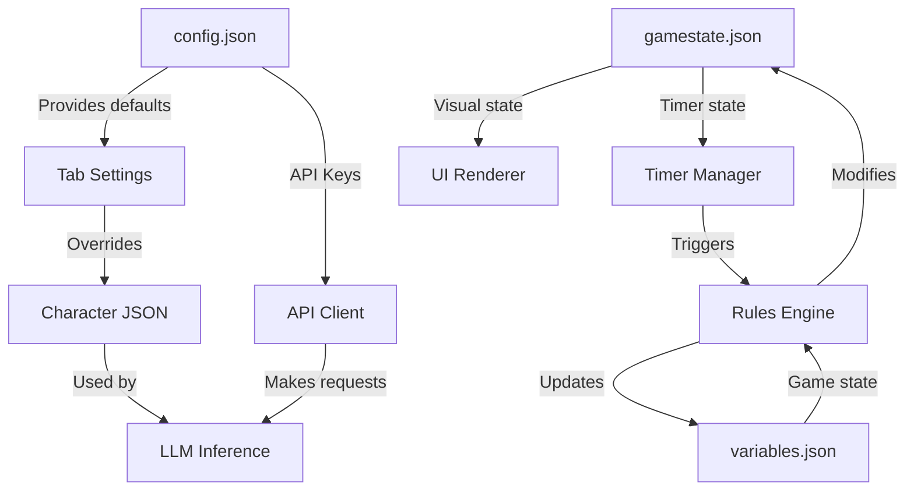

# ChatBotRPG Configuration Reference

> **Comprehensive mapping of all configuration options, defaults, and system behavior controls**

## Overview

ChatBotRPG uses a multi-layered configuration system spanning:
- **Global Configuration** (`config.json`) - API keys, service selection, default models
- **Tab-Level Settings** - Per-tab themes, models, streaming options
- **Game State Configuration** - Visual effects, timers, runtime state
- **Hardcoded Constants** - Fallback models, file paths, limits

---

## 1. Global Configuration (`config.json`)

**Location:** `ChatBotRPG/config.json`
**Loader:** `src/config.py`
**Scope:** Application-wide API and model settings

### 1.1 Service Provider Configuration

```json
{
  "current_service": "google",
  "openrouter_api_key": "sk-or-v1-...",
  "openrouter_base_url": "https://openrouter.ai/api/v1",
  "google_api_key": "AIzaSy...",
  "google_base_url": "https://generativelanguage.googleapis.com/v1beta",
  "local_api_key": "",
  "local_base_url": "http://127.0.0.1:1234/v1"
}
```

#### Configuration Options

| Option | Type | Default | Description |
|--------|------|---------|-------------|
| `current_service` | `string` | `"openrouter"` | Active LLM provider: `"openrouter"`, `"google"`, or `"local"` |
| `openrouter_api_key` | `string` | `""` | OpenRouter API key for multi-provider access |
| `openrouter_base_url` | `string` | `"https://openrouter.ai/api/v1"` | OpenRouter API endpoint |
| `google_api_key` | `string` | `""` | Google GenAI API key (direct access) |
| `google_base_url` | `string` | `"https://generativelanguage.googleapis.com/v1beta"` | Google GenAI endpoint |
| `local_api_key` | `string` | `""` | Optional API key for local LLM server |
| `local_base_url` | `string` | `"http://127.0.0.1:1234/v1"` | Local LLM server endpoint (LM Studio, etc.) |

**Service Selection Behavior:**
```python
# src/config.py:43-45
def get_current_service():
    config = load_config()
    return config.get("current_service", "openrouter")
```

**API Key Validation:**
```python
# src/core/make_inference.py:83-88
current_service = get_current_service()
api_key = get_api_key_for_service()

if not api_key and current_service != "local":
    service_names = {"openrouter": "OpenRouter", "google": "Google GenAI"}
    service_name = service_names.get(current_service, current_service.title())
    return f"Sorry, API error: {service_name} API key not configured."
```

### 1.2 Model Configuration

```json
{
  "default_model": "google/gemini-2.5-flash-lite-preview-06-17",
  "default_cot_model": "google/gemini-2.5-flash-lite-preview-06-17",
  "default_utility_model": "google/gemini-2.5-flash-lite-preview-06-17"
}
```

| Option | Type | Default | Description |
|--------|------|---------|-------------|
| `default_model` | `string` | `"google/gemini-2.5-flash-lite-preview-06-17"` | Primary model for character inference and narration |
| `default_cot_model` | `string` | `"google/gemini-2.5-flash-lite-preview-06-17"` | Chain-of-thought reasoning model |
| `default_utility_model` | `string` | `"google/gemini-2.5-flash-lite-preview-06-17"` | Utility tasks (summarization, parsing, generation) |

**Model Override Hierarchy:**
1. Per-character model specification (in character JSON)
2. Tab-level model setting (`tab_settings["model"]`)
3. Global default model (`config.json`)
4. Fallback models (if API fails)

### 1.3 Generation Parameters

```json
{
  "default_temperature": 0.3,
  "default_max_tokens": 2048
}
```

| Option | Type | Default | Valid Range | Description |
|--------|------|---------|-------------|-------------|
| `default_temperature` | `float` | `0.3` | `0.0 - 2.0` | Sampling temperature for generation randomness |
| `default_max_tokens` | `int` | `2048` | `1 - 100000` | Maximum tokens per LLM response |

**Additional Parameters (Hardcoded):**
```python
# src/core/make_inference.py:98
final_data = {
    "model": url_type,
    "temperature": temperature,
    "max_tokens": max_tokens,
    "top_p": 0.95,  # Hardcoded nucleus sampling
    "messages": context
}
```

### 1.4 Setup State

```json
{
  "setup_complete": true
}
```

| Option | Type | Default | Description |
|--------|------|---------|-------------|
| `setup_complete` | `bool` | `false` | Whether initial configuration wizard has been completed |

**Effects:**
- Controls whether setup wizard displays on application launch
- Validates API key presence before allowing gameplay

---

## 2. Hardcoded Constants

### 2.1 Fallback Models

**Location:** `src/chatBotRPG.py:36-38`

```python
FALLBACK_MODEL_1 = "cognitivecomputations/dolphin-mistral-24b-venice-edition:free"
FALLBACK_MODEL_2 = "thedrummer/anubis-70b-v1.1"
FALLBACK_MODEL_3 = "google/gemini-2.5-flash-lite-preview-06-17"
```

**Usage:** Automatic retry with fallback models when primary model fails due to:
- Rate limiting (HTTP 429)
- Bad request (HTTP 400)
- Context length exceeded
- Content policy violations

**Fallback Logic:**
```python
# src/chatBotRPG.py:3674-3805
fallback_models = [FALLBACK_MODEL_1, FALLBACK_MODEL_2, FALLBACK_MODEL_3]
for fallback_model in fallback_models:
    if "refused" in error_msg.lower():
        print(f"[FALLBACK] Trying next model due to refusal...")
    # Retry with fallback model
```

### 2.2 File Naming Constants

**Location:** `src/chatBotRPG.py:30-35`, `src/core/add_tab.py:281-286`

```python
FAVORITES_FILE = "model_favorites.json"
BASE_LOG_FILE = "conversation_log"
BASE_CONTEXT_FILE = "context_history"
BASE_SYSTEM_CONTEXT_FILE = "system_context"
BASE_THOUGHT_RULES_FILE = "thought_rules"
BASE_VARIABLES_FILE = "workflow_variables"
BASE_AGENT_NOTES_FILE = "agent_notes"
```

**Directory Structure:**
```
data/
└── {game_name}/
    ├── game/
    │   ├── conversation_log.html
    │   ├── context_history.json
    │   ├── variables.json
    │   ├── agent_notes.json
    │   └── gamestate.json
    ├── tabs/
    │   └── {tab_name}/
    │       └── conversation_log.html
    └── resources/
        └── data files/
            ├── actors/
            ├── items/
            ├── settings/
            └── keywords/
```

### 2.3 API Request Limits

**Location:** `src/scribe/agent_chat.py:38`, `src/core/make_inference.py:110`

```python
MAX_HISTORY = 200           # Maximum context messages retained
TIMEOUT = 180               # API request timeout (seconds)
```

**Context Management:**
```python
# src/scribe/agent_chat.py:1051-1052
if len(self.context) > MAX_HISTORY:
    self.context = self.context[-MAX_HISTORY:]
```

### 2.4 Supported Media Formats

**Location:** `src/scribe/agent_chat.py:40`

```python
SUPPORTED_IMAGE_FORMATS = ["jpg", "jpeg", "png", "gif", "webp"]
```

**Usage:** Validates image attachments in Scribe agent chat interface

### 2.5 Audio Configuration

**Location:** `src/editor_panel/audio_manager.py:28-31`

```python
# FFmpeg conversion settings
cmd = [
    'ffmpeg', '-i', input_file,
    '-c:a', 'libvorbis',    # Audio codec
    '-b:a', '128k',         # Bitrate
    '-ar', '44100',         # Sample rate
    '-y', output_file
]
```

**Supported Workflows:**
- Convert audio files to `.ogg` format using FFmpeg
- Playback via `ffplay` or `pygame.mixer`
- Volume adjustment: `'-af', 'volume=0.5'` (50% volume)

---

## 3. Tab-Level Configuration

**Location:** `src/core/add_tab.py:264-276`

Tab settings control per-tab appearance, model selection, and streaming behavior.

### 3.1 Default Tab Settings

```python
DEFAULT_TAB_SETTINGS = {
    "theme_name": "Default Dark",
    "base_color": "#00FF66",
    "intensity": 0.8,
    "contrast": 0.35,
    "model": get_default_model(),
    "temperature": 0.5,
    "streaming_enabled": False,
    "streaming_speed": 35,
    "cot_model": get_default_cot_model(),
    "crt_enabled": True,
    "crt_speed": 160
}
```

### 3.2 Theme Configuration

| Option | Type | Default | Valid Range | Description |
|--------|------|---------|-------------|-------------|
| `theme_name` | `string` | `"Default Dark"` | Any string | Descriptive theme name |
| `base_color` | `string` | `"#00FF66"` | Hex color | Primary accent color (neon green) |
| `intensity` | `float` | `0.8` | `0.0 - 1.0` | Color saturation/brightness |
| `contrast` | `float` | `0.35` | `0.0 - 1.0` | Background contrast adjustment |

**Color Hierarchy:**
```python
# src/scribe/agent_chat.py:32-36
STANDALONE_PRIMARY_COLOR = "#00FF66"   # Primary accent
STANDALONE_BG_COLOR = "#1E1E1E"        # Background
STANDALONE_SECONDARY_COLOR = "#2A2A2A" # Secondary UI elements
STANDALONE_TERTIARY_COLOR = "#3D3D3D"  # Tertiary UI elements
STANDALONE_LINK_COLOR = "#99FFBB"      # Hyperlink color
```

### 3.3 Model Override

| Option | Type | Default | Description |
|--------|------|---------|-------------|
| `model` | `string` | `get_default_model()` | Override model for this tab |
| `temperature` | `float` | `0.5` | Override temperature for this tab |
| `cot_model` | `string` | `get_default_cot_model()` | Chain-of-thought model for this tab |

**Usage:**
- Each tab can use different models simultaneously
- Useful for testing model performance side-by-side

### 3.4 Streaming Configuration

| Option | Type | Default | Valid Range | Description |
|--------|------|---------|-------------|-------------|
| `streaming_enabled` | `bool` | `False` | `true/false` | Enable character-by-character text streaming |
| `streaming_speed` | `int` | `35` | `1 - 1000` | Delay between characters (milliseconds) |

**Streaming Behavior:**
```python
# src/chatBotRPG.py:2011-2012
streaming_enabled = theme_settings.get("streaming_enabled", False)
if not narrator_msg_widget or not streaming_enabled or not should_display:
    # Display message immediately
```

**Effects:**
- `streaming_enabled=True`: Text appears character-by-character (typewriter effect)
- `streaming_enabled=False`: Text appears instantly
- Lower `streaming_speed` = faster typing

### 3.5 CRT Effect Configuration

| Option | Type | Default | Valid Range | Description |
|--------|------|---------|-------------|-------------|
| `crt_enabled` | `bool` | `True` | `true/false` | Enable retro CRT monitor effect |
| `crt_speed` | `int` | `160` | `50 - 1000` | Scanline animation speed (milliseconds) |

**CRT Effect Behavior:**
```python
# src/chatBotRPG.py:3469-3477
crt_enabled = theme_settings.get("crt_enabled", True)
crt_overlay.setVisible(crt_enabled)

if crt_enabled:
    crt_overlay.animation_timer.start(crt_speed)
```

**Effects:**
- Animated horizontal scanlines
- Chromatic aberration (optional)
- Phosphor glow simulation

---

## 4. Game State Configuration

**Location:** `data/{game_name}/game/gamestate.json`

Stores runtime state for visual effects, timers, and active conditions.

### 4.1 Visual Effects

```json
{
  "effects": {
    "blur": {
      "enabled": false,
      "radius": 0,
      "animation_speed": 2000,
      "animate": false
    },
    "flicker": {
      "enabled": false,
      "intensity": 0,
      "frequency": 1000,
      "color": "white"
    },
    "static": {
      "enabled": false,
      "intensity": 0,
      "frequency": 200,
      "dot_size": 1
    },
    "darken_brighten": {
      "enabled": false,
      "factor": 1.0,
      "animation_speed": 2000,
      "animate": false
    }
  }
}
```

#### Blur Effect

| Option | Type | Default | Valid Range | Description |
|--------|------|---------|-------------|-------------|
| `enabled` | `bool` | `false` | `true/false` | Toggle blur effect |
| `radius` | `int` | `0` | `0 - 50` | Blur intensity (pixels) |
| `animation_speed` | `int` | `2000` | `100 - 10000` | Fade in/out duration (ms) |
| `animate` | `bool` | `false` | `true/false` | Smooth transition vs instant |

**Typical Use Cases:**
- Intoxication (alcohol consumption)
- Confusion/dazed status effects
- Dream sequences

#### Flicker Effect

| Option | Type | Default | Valid Range | Description |
|--------|------|---------|-------------|-------------|
| `enabled` | `bool` | `false` | `true/false` | Toggle flicker effect |
| `intensity` | `float` | `0` | `0.0 - 1.0` | Opacity variation strength |
| `frequency` | `int` | `1000` | `50 - 5000` | Time between flickers (ms) |
| `color` | `string` | `"white"` | CSS color | Flicker overlay color |

**Typical Use Cases:**
- Torch/candle lighting
- Electrical malfunctions
- Horror atmosphere

#### Static Noise Effect

| Option | Type | Default | Valid Range | Description |
|--------|------|---------|-------------|-------------|
| `enabled` | `bool` | `false` | `true/false` | Toggle static noise |
| `intensity` | `float` | `0` | `0.0 - 1.0` | Noise density |
| `frequency` | `int` | `200` | `50 - 2000` | Refresh rate (ms) |
| `dot_size` | `int` | `1` | `1 - 10` | Noise grain size (pixels) |

**Typical Use Cases:**
- Television/monitor screens
- Radio interference
- Reality distortion

#### Darken/Brighten Effect

| Option | Type | Default | Valid Range | Description |
|--------|------|---------|-------------|-------------|
| `enabled` | `bool` | `false` | `true/false` | Toggle brightness adjustment |
| `factor` | `float` | `1.0` | `0.0 - 3.0` | Brightness multiplier (1.0 = normal) |
| `animation_speed` | `int` | `2000` | `100 - 10000` | Transition duration (ms) |
| `animate` | `bool` | `false` | `true/false` | Smooth transition vs instant |

**Typical Use Cases:**
- Day/night transitions
- Entering dark areas
- Flashbang effects (`factor > 2.0`)

### 4.2 Timer Configuration

```json
{
  "timers": {
    "active_timers": [
      {
        "rule_id": "AlcoholInstantSober",
        "key": "global",
        "is_character": false,
        "character": null,
        "time_remaining_ms": 126771,
        "interval_ms": 300000,
        "is_random": false
      }
    ],
    "last_saved": "2025-08-21T18:43:01.655621"
  }
}
```

#### Timer Structure

| Field | Type | Description |
|-------|------|-------------|
| `rule_id` | `string` | ID of rule to execute when timer fires |
| `key` | `string` | Unique identifier for timer (`"global"` or character-specific) |
| `is_character` | `bool` | Whether timer is bound to a character |
| `character` | `string\|null` | Character name if `is_character=true` |
| `time_remaining_ms` | `int` | Milliseconds until timer fires |
| `interval_ms` | `int` | Original interval duration |
| `is_random` | `bool` | Whether interval is randomized each cycle |
| `last_saved` | `string` | ISO timestamp of last state save |

**Timer Persistence:**
- Timers persist across game sessions
- `time_remaining_ms` decrements in real-time
- When `time_remaining_ms <= 0`, rule executes and timer resets (or removes if one-shot)

---

## 5. Configuration Patterns & Best Practices

### 5.1 Configuration Loading Hierarchy

```
1. Hardcoded Constants (fallback defaults)
   ↓
2. config.json (global defaults)
   ↓
3. Tab Settings (per-tab overrides)
   ↓
4. Character JSON (per-character overrides)
   ↓
5. Runtime Overrides (API calls, user actions)
```

**Example: Model Selection**
```python
# Priority: Character > Tab > Global > Hardcoded
model = character.get("model") or \
        tab_settings.get("model") or \
        get_default_model() or \
        "google/gemini-2.5-flash-lite-preview-06-17"
```

### 5.2 Configuration Validation

**API Key Validation:**
```python
# src/config.py:47-58
def get_api_key_for_service(service=None):
    if service is None:
        service = get_current_service()
    config = load_config()

    if service == "local":
        return "local"  # Local APIs don't need real keys

    api_key = config.get(f"{service}_api_key", "").strip()
    if not api_key:
        return None
    return api_key
```

**Service Validation:**
```python
# src/core/make_inference.py:82-88
current_service = get_current_service()
api_key = get_api_key_for_service()

if not api_key and current_service != "local":
    service_names = {"openrouter": "OpenRouter", "google": "Google GenAI"}
    service_name = service_names.get(current_service, current_service.title())
    return f"Sorry, API error: {service_name} API key not configured."
```

### 5.3 Configuration Merging

**Default Config Merging:**
```python
# src/config.py:29-31
for key, default_value in DEFAULT_CONFIG.items():
    if key not in config:
        config[key] = default_value
```

**Ensures:**
- New config options added to `DEFAULT_CONFIG` automatically populate
- Existing user configs remain valid after updates
- Missing keys fall back to safe defaults

### 5.4 Safe Configuration Updates

**Atomic Write Pattern:**
```python
# src/config.py:36-41
def save_config(config):
    try:
        with open(CONFIG_FILE, 'w', encoding='utf-8') as f:
            json.dump(config, f, indent=2, ensure_ascii=False)
    except Exception as e:
        print(f"Error saving configuration: {e}")
```

**Single-Key Updates:**
```python
# src/config.py:84-87
def update_config(key, value):
    config = load_config()
    config[key] = value
    save_config(config)
```

### 5.5 Environment-Specific Configurations

**Development Mode:**
```python
# Recommended dev settings
{
  "current_service": "local",
  "local_base_url": "http://127.0.0.1:1234/v1",
  "default_temperature": 0.7,  # Higher for creative testing
  "default_max_tokens": 4096   # Larger responses
}
```

**Production Mode:**
```python
# Recommended production settings
{
  "current_service": "google",
  "default_temperature": 0.3,  # Lower for consistency
  "default_max_tokens": 2048   # Cost efficiency
}
```

**Testing Mode:**
```python
# Recommended testing settings
{
  "current_service": "openrouter",
  "default_model": "google/gemini-2.5-flash-lite-preview-06-17",  # Free tier
  "default_temperature": 0.1,  # Deterministic for test repeatability
  "default_max_tokens": 1024   # Faster responses
}
```

---

## 6. Security-Sensitive Configurations

### 6.1 API Keys

**Storage:** `config.json` (plaintext - NOT suitable for production)

**Security Recommendations:**
1. **Never commit `config.json` to version control**
   ```gitignore
   # .gitignore
   config.json
   ```

2. **Use environment variables in production:**
   ```python
   import os
   api_key = os.environ.get("OPENROUTER_API_KEY") or config.get("openrouter_api_key")
   ```

3. **Validate API keys before storage:**
   ```python
   if api_key and (api_key.startswith("sk-or-") or api_key.startswith("AIza")):
       update_config("openrouter_api_key", api_key)
   ```

### 6.2 Base URLs

**Default Base URLs:**
- OpenRouter: `https://openrouter.ai/api/v1`
- Google GenAI: `https://generativelanguage.googleapis.com/v1beta`
- Local: `http://127.0.0.1:1234/v1`

**Risks:**
- Malicious base URLs could intercept API requests
- Always validate URLs before saving:
  ```python
  from urllib.parse import urlparse

  parsed = urlparse(base_url)
  if parsed.scheme not in ["http", "https"]:
      raise ValueError("Invalid URL scheme")
  ```

---

## 7. Configuration File Reference

### 7.1 Complete File Locations

```
ChatBotRPG/
├── config.json                              # Global configuration
├── model_favorites.json                     # User-favorited models
└── data/
    └── {game_name}/
        ├── game/
        │   ├── gamestate.json               # Visual effects, timers
        │   ├── variables.json               # Game variables
        │   ├── context_history.json         # Conversation context
        │   └── agent_notes.json             # NPC internal notes
        ├── config/
        │   └── inventory_tab_order.json     # UI tab ordering
        └── resources/
            └── data files/
                ├── actors/{name}.json       # Character configs
                ├── items/{name}.json        # Item configs
                ├── settings/{name}.json     # Location configs
                └── keywords/{name}.json     # Keyword metadata
```

### 7.2 Configuration Interdependencies



---

## 8. Configuration Code Reference

### 8.1 Key Functions

| Function | File | Description |
|----------|------|-------------|
| `load_config()` | `src/config.py:21` | Loads `config.json` with default merging |
| `save_config()` | `src/config.py:36` | Saves configuration to `config.json` |
| `get_current_service()` | `src/config.py:43` | Returns active LLM service |
| `get_api_key_for_service()` | `src/config.py:47` | Retrieves API key for service |
| `get_base_url_for_service()` | `src/config.py:60` | Retrieves base URL for service |
| `get_default_model()` | `src/config.py:72` | Returns default primary model |
| `get_default_cot_model()` | `src/config.py:76` | Returns default CoT model |
| `get_default_utility_model()` | `src/config.py:80` | Returns default utility model |
| `update_config()` | `src/config.py:84` | Updates single config key |
| `update_default_models()` | `src/config.py:89` | Updates all model settings |
| `get_default_tab_settings()` | `src/core/add_tab.py:278` | Returns default tab configuration |

### 8.2 Configuration Usage Examples

**Example 1: Switching LLM Service**
```python
from config import update_config

# Switch to Google GenAI
update_config("current_service", "google")
```

**Example 2: Setting Custom Models**
```python
from config import update_default_models

update_default_models(
    main_model="anthropic/claude-3.5-sonnet",
    cot_model="openai/o1-mini",
    utility_model="google/gemini-flash-2.0"
)
```

**Example 3: Per-Tab Model Override**
```python
tab_settings = {
    "model": "meta-llama/llama-3.3-70b-instruct",
    "temperature": 0.8,
    "streaming_enabled": True,
    "streaming_speed": 25
}
add_new_tab(theme_settings=tab_settings)
```

**Example 4: Enabling Visual Effects**
```python
import json

with open("data/MyGame/game/gamestate.json", "r+") as f:
    state = json.load(f)
    state["effects"]["blur"]["enabled"] = True
    state["effects"]["blur"]["radius"] = 15
    f.seek(0)
    json.dump(state, f, indent=2)
    f.truncate()
```

---

## 9. Configuration Performance Impact

### 9.1 Model Selection Impact

| Model Type | Token Limit | Latency | Cost | Best For |
|------------|-------------|---------|------|----------|
| Gemini 2.5 Flash Lite | 8192 | ~500ms | Free | Development, testing |
| GPT-4o Mini | 4096 | ~800ms | Low | Utility tasks |
| Claude 3.5 Sonnet | 8192 | ~1500ms | Medium | Character dialogue, complex reasoning |
| Llama 3.3 70B | 8192 | ~2000ms | Medium | Long-form narration |
| o1-mini | 65536 | ~5000ms | High | Complex reasoning, puzzles |

### 9.2 Temperature Impact

| Temperature | Behavior | Use Case |
|-------------|----------|----------|
| `0.0 - 0.3` | Deterministic, focused | Utility calls, data extraction |
| `0.3 - 0.7` | Balanced | Character dialogue, narration |
| `0.7 - 1.0` | Creative, varied | Brainstorming, generation |
| `1.0+` | Chaotic, experimental | Unpredictable NPC behavior |

### 9.3 Streaming Performance

| Setting | UI Responsiveness | User Experience |
|---------|-------------------|-----------------|
| `streaming_enabled=False` | Instant | Good for utility responses |
| `streaming_speed=10` | Smooth | Fast reading, minimal delay |
| `streaming_speed=35` | Balanced | Typewriter effect |
| `streaming_speed=100` | Slow | Dramatic effect, long messages |

---

## 10. Configuration Troubleshooting

### 10.1 Common Issues

**Issue: "API key not configured"**
```
Error: OpenRouter API key not configured. Please check config.json file.
```

**Solution:**
1. Check `config.json` exists in project root
2. Verify `current_service` matches available API key:
   ```json
   {
     "current_service": "openrouter",
     "openrouter_api_key": "sk-or-v1-..."
   }
   ```
3. Ensure API key is valid (test at https://openrouter.ai)

---

**Issue: "Sorry, the request timed out"**
```
Error: Sorry, the request timed out.
```

**Solution:**
1. Check internet connection
2. Verify base URL is correct:
   ```python
   from config import get_base_url_for_service
   print(get_base_url_for_service())
   ```
3. Increase timeout (requires code modification):
   ```python
   # src/core/make_inference.py:110
   final_response = requests.post(base_url, headers=headers,
                                   json=final_data, timeout=300)  # 5min
   ```

---

**Issue: "Maximum context length exceeded"**
```
Error: API Request failed: maximum context length exceeded
```

**Solution:**
1. Reduce `default_max_tokens`:
   ```json
   {
     "default_max_tokens": 1024
   }
   ```
2. System automatically retries with summarization
3. Or switch to model with larger context:
   ```json
   {
     "default_model": "anthropic/claude-3.5-sonnet"  // 200k context
   }
   ```

---

**Issue: Config changes not applying**
```
Changes to config.json have no effect
```

**Solution:**
1. Restart application (config loaded at startup)
2. Check file permissions (write access required)
3. Verify JSON syntax:
   ```bash
   python -m json.tool config.json
   ```

---

**Issue: Visual effects not working**
```
Blur/flicker effects enabled but not visible
```

**Solution:**
1. Check gamestate.json:
   ```json
   {
     "effects": {
       "blur": {
         "enabled": true,
         "radius": 15  // Must be > 0
       }
     }
   }
   ```
2. Ensure effects are supported on your platform (requires PyQt5 graphics effects)

---

## 11. Configuration Migration Guide

### 11.1 Upgrading from Older Versions

**If config.json missing keys:**
```python
# Automatic merge on load
# src/config.py:29-31
for key, default_value in DEFAULT_CONFIG.items():
    if key not in config:
        config[key] = default_value
```

**Manual migration:**
```python
from config import load_config, save_config

config = load_config()
# Add new keys
config["google_api_key"] = ""
config["google_base_url"] = "https://generativelanguage.googleapis.com/v1beta"
save_config(config)
```

### 11.2 Backing Up Configuration

```bash
# Windows
copy config.json config.json.backup

# Linux/Mac
cp config.json config.json.backup
```

**Automated backup on save:**
```python
import shutil
from config import save_config

def save_config_with_backup(config):
    if os.path.exists("config.json"):
        shutil.copy("config.json", "config.json.backup")
    save_config(config)
```

---

## Summary

ChatBotRPG's configuration system provides:
- **3 service providers** (OpenRouter, Google GenAI, Local)
- **3 model specializations** (main, CoT, utility)
- **4 visual effects** (blur, flicker, static, darken/brighten)
- **Per-tab customization** (models, themes, streaming)
- **Automatic fallback** (3-tier failover for API errors)
- **Type-safe defaults** (all options have sane fallbacks)

**Key Files:**
- `config.json` - Global settings (API keys, models)
- `gamestate.json` - Runtime state (effects, timers)
- `DEFAULT_TAB_SETTINGS` - UI appearance defaults
- Hardcoded constants - Fallback models, limits

**Configuration Philosophy:**
1. **Sensible defaults** - Works out of box
2. **Progressive override** - Global → Tab → Character → Runtime
3. **Fail-safe fallbacks** - Never crashes due to missing config
4. **User-friendly errors** - Clear messages for misconfiguration

---

## Related Documentation

- [[01-API-Integration-Complete]] - API integration patterns
- [[01-Data-Schemas-Complete]] - Character/item configuration schemas
- [[01-Pattern-to-Code-Mapping]] - Where configuration is used in code
- [[01-Repository-Overview]] - Project structure overview
