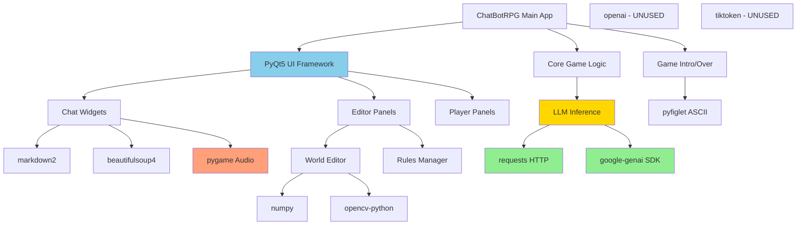

# ChatBotRPG Dependencies Analysis

## Overview

ChatBotRPG uses a **minimal, pragmatic dependency strategy** focused on stability and ease of deployment. The project relies on 11 external libraries carefully chosen for specific purposes, with no unnecessary abstractions or heavyweight frameworks.

**Key Characteristics:**
- Python 3.8+ required
- No virtual environment enforced (user's choice)
- First-run automated dependency installation via START.bat
- Direct API integration (no LangChain/LlamaIndex wrappers)
- Desktop-first architecture (PyQt5, not web-based)

## Dependency Installation Method

**Installation Vector:** Windows Batch Script (`START.bat`)

```batch
pip install PyQt5 pygame markdown2 beautifulsoup4 requests numpy pyfiglet opencv-python openai tiktoken google-genai
```

**Features:**
- Automatic first-run detection via `config.json` flag
- Individual package verification on subsequent launches
- Reinstall only missing packages (not full reinstall)
- No requirements.txt or pyproject.toml (intentional simplicity)

## Complete Dependency List

### 1. PyQt5 (UI Framework)
**Purpose:** Desktop GUI framework for entire application
**Version:** Not pinned (latest from PyPI)
**Import Pattern:**
```python
from PyQt5.QtWidgets import QApplication, QWidget, QVBoxLayout, QTextEdit, ...
from PyQt5.QtCore import QThread, pyqtSignal, Qt, QTimer, QSettings
from PyQt5.QtGui import QFont, QColor, QPixmap, QPainter
```

**Usage Locations:**
- `src/chatBotRPG.py` - Main application window
- `src/core/ui_widgets.py` - Custom chat widgets with markdown rendering
- `src/core/tab_manager.py` - Multi-game tab system
- `src/editor_panel/*.py` - All editor tools (world editor, rules, actors, etc.)
- `src/player_panel/*.py` - Player-facing UI (inventory, map, character sheet)
- `src/scribe/agent_chat.py` - AI assistant panel

**Key Features Used:**
- QThread for async LLM inference (non-blocking UI)
- QTimer for game loop, animations, timed events
- QSettings for persistent window state
- Custom QWidget subclasses for chat messages with typewriter effects
- QPainter for custom rendering (map editor, region borders, visual effects)

**Technical Decision:**
> "Why PyQt5?"
>
> From README.md: "Currently PyQt5, as LLMs themselves are pretty familiar with it and I preferred a standalone experience I could do to my exact vision. One of the design choices I made early on is keeping dependencies and the install process relatively straightforward and I wanted it to run with just Python."

**Alternatives Considered:**
- Web-based UI (browser/Electron) - Rejected for complexity
- Tkinter - Insufficient for complex custom rendering
- Qt for Python (PySide6) - PyQt5 chosen for better LLM familiarity

---

### 2. pygame (Audio/Sound System)
**Purpose:** Audio playback and sound effects
**Version:** Not pinned
**Import Pattern:**
```python
import pygame
```

**Usage Locations:**
- `src/core/music_manager.py` - Centralized music/SFX manager (singleton pattern)
- `src/core/game_intro.py` - Intro music playback
- `src/core/game_music.py` - Dynamic location-based music
- `src/core/ui_widgets.py` - UI sound effects
- `src/editor_panel/rules_manager.py` - Rule action sound triggers
- `src/editor_panel/world_editor/world_editor.py` - Editor UI feedback sounds

**Key Features Used:**
- `pygame.mixer` for audio playback
- Multi-channel support (music + SFX simultaneously)
- Background thread management for audio streaming

**Technical Decision:**
- Pygame chosen for its simplicity and reliability
- No dependencies on system audio libraries
- Works consistently across Windows environments

---

### 3. markdown2 (Markdown Rendering)
**Purpose:** Convert markdown to HTML for chat display
**Version:** Not pinned
**Import Pattern:**
```python
import markdown2
```

**Usage Locations:**
- `src/core/ui_widgets.py` - Convert AI responses to HTML
- `src/scribe/agent_chat.py` - Render scribe agent markdown

**Usage Example:**
```python
content_html_md = markdown2.markdown(
    content_str,
    extras=["fenced-code-blocks", "code-friendly"]
)
soup = BeautifulSoup(content_html_md, 'html.parser')
```

**Technical Decision:**
- Preferred over `markdown` library for "extras" support
- Integrates seamlessly with BeautifulSoup4 for post-processing
- Lightweight alternative to full Markdown parsers

---

### 4. beautifulsoup4 (HTML Parsing)
**Purpose:** Post-process markdown HTML for custom styling
**Version:** Not pinned (bs4)
**Import Pattern:**
```python
from bs4 import BeautifulSoup, NavigableString
```

**Usage Locations:**
- `src/core/ui_widgets.py` - Parse and transform HTML for chat rendering

**Key Operations:**
1. Parse markdown2 output
2. Wrap dialogue in colored quote spans
3. Style code blocks and preformatted text
4. Process intro animations (ASCII art)
5. Handle streaming text token-by-token

**Usage Example:**
```python
soup = BeautifulSoup(content_html_md, 'html.parser')
# Regex-based transformation of dialogue quotes
quote_pattern = re.compile(rf'({non_tag_non_quote_char}*?)([{quote_chars}])(.*?)([{closing_quote_chars}])')
modified_inner_html = quote_pattern.sub(repl_quote_match, original_inner_html)
new_inner_soup = BeautifulSoup(modified_inner_html, 'html.parser')
```

**Technical Decision:**
- Enables custom styled chat bubbles with dialogue highlighting
- Necessary because QTextEdit HTML renderer is limited
- Allows dynamic content transformation without regex hell

---

### 5. requests (HTTP Client)
**Purpose:** LLM API calls (OpenRouter, local endpoints)
**Version:** Not pinned
**Import Pattern:**
```python
import requests
```

**Usage Locations:**
- `src/core/make_inference.py` - Main LLM inference function

**Usage Example:**
```python
base_url = f"{base_url}/chat/completions"
final_data = {
    "model": url_type,
    "temperature": temperature,
    "max_tokens": max_tokens,
    "top_p": 0.95,
    "messages": context
}
headers = {"Content-Type": "application/json"}
if api_key:
    headers["Authorization"] = f"Bearer {api_key}"

response = requests.post(base_url, json=final_data, headers=headers, timeout=180)
```

**Technical Decision:**
- Direct REST API calls (no LangChain/LlamaIndex abstraction)
- Simple, predictable error handling
- Full control over request/response format
- No hidden token counting or retries

---

### 6. numpy (Mathematical Operations)
**Purpose:** Image processing for region detection in map editor
**Version:** Not pinned
**Import Pattern:**
```python
import numpy as np
```

**Usage Locations:**
- `src/editor_panel/world_editor/world_editor_paint.py` - Region border rendering
- `src/editor_panel/world_editor/region_toolbar.py` - Flood fill algorithm

**Usage Example:**
```python
# Flood fill for region border detection
img_array = np.array(img)
h, w = img_array.shape[:2]
mask = np.zeros((h + 2, w + 2), np.uint8)
```

**Technical Decision:**
- Required for efficient pixel-level operations
- Integrates with opencv-python for advanced image processing
- Minimal usage (only in map editor, not core game logic)

---

### 7. pyfiglet (ASCII Art)
**Purpose:** Generate ASCII art for game intro/outro screens
**Version:** Not pinned
**Import Pattern:**
```python
import pyfiglet
```

**Usage Locations:**
- `src/core/game_intro.py` - Render game title on startup
- `src/core/game_over.py` - Render "GAME OVER" screen

**Usage Example:**
```python
ascii_art = pyfiglet.figlet_format(game_title, font='standard')
intro_html = f"<pre id='intro-ascii'>{ascii_art}</pre>"
```

**Technical Decision:**
- Adds retro/cyberpunk aesthetic (per developer's vision)
- Extremely lightweight (no complex dependencies)
- Fits "CRT terminal" UI theme

---

### 8. opencv-python (Image Processing)
**Purpose:** Advanced image operations for map editor
**Version:** Not pinned (cv2)
**Import Pattern:**
```python
import cv2  # Lazy import (only when needed)
```

**Usage Locations:**
- `src/editor_panel/world_editor/world_editor.py` - Image manipulation
- `src/editor_panel/world_editor/region_toolbar.py` - Region flood fill

**Import Strategy:**
```python
# Lazy import to avoid overhead
try:
    import cv2
    # Use cv2 functions
except ImportError:
    # Fallback or error message
```

**Key Operations:**
- Flood fill for region border detection
- Image scaling/resizing for map backgrounds
- Color space conversions

**Technical Decision:**
- Only imported in map editor (not core game loop)
- Lazy import minimizes startup time
- Provides advanced features not available in PIL/Pillow

---

### 9. openai (NOT USED - Dead Dependency)
**Purpose:** INTENDED for OpenAI API, but unused in code
**Version:** Not pinned
**Import Pattern:** NONE (never imported)

**Analysis:**
```bash
# Search results:
$ grep -r "import openai" ChatBotRPG/src/
# NO MATCHES FOUND
```

**Verdict:**
- **DEAD DEPENDENCY** - Listed in START.bat but never used
- Likely added for future OpenAI direct integration
- Currently all API calls go through OpenRouter or Google GenAI
- **Recommendation:** Can be removed from installation unless future plans exist

---

### 10. tiktoken (NOT USED - Dead Dependency)
**Purpose:** INTENDED for OpenAI tokenization, but unused in code
**Version:** Not pinned
**Import Pattern:** NONE (never imported)

**Analysis:**
```bash
# Search results:
$ grep -r "import tiktoken" ChatBotRPG/src/
# NO MATCHES FOUND
```

**Verdict:**
- **DEAD DEPENDENCY** - Listed in START.bat but never used
- Likely intended for token counting/context management
- Currently no explicit token counting in codebase
- Relies on LLM API to handle context truncation
- **Recommendation:** Can be removed unless future token management planned

---

### 11. google-genai (Google AI SDK)
**Purpose:** Direct Google Gemini API integration
**Version:** Not pinned (google.genai)
**Import Pattern:**
```python
try:
    from google import genai
    GOOGLE_GENAI_AVAILABLE = True
except ImportError:
    GOOGLE_GENAI_AVAILABLE = False
```

**Usage Locations:**
- `src/core/make_inference.py` - Alternative to OpenRouter

**Usage Example:**
```python
def _make_google_genai_request(context, model_name, max_tokens, temperature, api_key):
    client = genai.Client(api_key=api_key)

    formatted_messages = []
    for msg in context:
        role = msg.get('role', 'user')
        content = msg.get('content', '')

        if role == 'system':
            formatted_messages.append(genai.types.Content(
                role='user',
                parts=[genai.types.Part(text=f"[SYSTEM] {content}")]
            ))
        # ... more role conversions

    response = client.models.generate_content(
        model=converted_model_name,
        contents=formatted_messages,
        config=config
    )
```

**Technical Decision:**
- Added for native Gemini support (recommended model: Gemini 2.5 Flash Lite)
- Fallback to OpenRouter if google-genai not installed
- Graceful degradation pattern (optional dependency)

**README Recommendation:**
> "My favorite one that sits at the most optimal place regarding functionality/reasoning, and cost per inference, is the Gemini 2.5 Flash Lite Preview."

---

## Dependency Graph



## Technical Decisions Summary

### ✅ What Went RIGHT

1. **No LangChain/LlamaIndex Dependency**
   - Direct API calls provide full control
   - No abstraction leaks or hidden behaviors
   - Easy to debug (simple request/response)
   - No version conflicts with rapidly changing LLM libs

2. **PyQt5 for Desktop UI**
   - LLM-friendly (well-documented for AI assistance)
   - Standalone executable potential (no browser required)
   - Full control over rendering (custom effects, animations)
   - Native OS integration (file dialogs, system tray potential)

3. **Minimal Audio Stack (pygame)**
   - Simple, reliable, cross-platform
   - No FFMPEG or codec dependencies
   - Handles both music and SFX in one library

4. **Markdown + BeautifulSoup Pipeline**
   - Flexible text formatting for AI responses
   - Easy to inject custom styles (dialogue coloring)
   - Separates content from presentation

### ⚠️ What Could Be IMPROVED

1. **Dead Dependencies**
   - `openai` and `tiktoken` installed but unused
   - Adds ~50MB to installation size
   - Confuses future maintainers
   - **Recommendation:** Remove from START.bat if not planned

2. **No Version Pinning**
   - All dependencies use `latest` from PyPI
   - Risk of breaking changes in future updates
   - No `requirements.txt` or `poetry.lock`
   - **Recommendation:** Add version constraints for production

3. **Heavy opencv-python Dependency**
   - ~100MB installation size
   - Only used in map editor (small feature)
   - Could be optional dependency
   - **Recommendation:** Lazy load with clear error message

4. **No Dependency Isolation**
   - Installs to global Python environment
   - No virtual environment by default
   - Risk of conflicts with other projects
   - **Recommendation:** Encourage venv in documentation

## Risk Assessment

| Dependency | Maintenance Status | Security Risk | Breaking Change Risk | Action Required |
|------------|-------------------|---------------|---------------------|------------------|
| PyQt5 | ✅ Active (Qt 5.15) | Low | Medium (Qt 6 migration) | Monitor Qt 6 timeline |
| pygame | ✅ Active | Low | Low | None |
| markdown2 | ⚠️ Slow updates | Low | Low | Consider `mistune` |
| beautifulsoup4 | ✅ Active | Low | Low | None |
| requests | ✅ Active | Medium (CVEs) | Low | Pin version |
| numpy | ✅ Active | Low | Medium (2.x changes) | Pin to 1.x |
| pyfiglet | ⚠️ Infrequent updates | Low | Low | None |
| opencv-python | ✅ Active | Medium | Medium | Consider making optional |
| openai | ❌ UNUSED | N/A | N/A | Remove |
| tiktoken | ❌ UNUSED | N/A | N/A | Remove |
| google-genai | ✅ Active | Low | High (Beta SDK) | Pin version, monitor API changes |

## Dependency Evolution

**Git History Analysis:**
```bash
$ cd ChatBotRPG && git log --all --oneline --grep="dependency" --since="2024-01-01"
# No commits found
```

**Interpretation:**
- Dependencies set early and unchanged
- No major refactorings or library swaps
- Stable architecture (good sign)
- Suggests mature dependency selection

## Recommendations

### Immediate Actions

1. **Remove Dead Dependencies**
   ```batch
   # START.bat - Remove these:
   # openai tiktoken

   # New install line:
   pip install PyQt5 pygame markdown2 beautifulsoup4 requests numpy pyfiglet opencv-python google-genai
   ```

2. **Add Version Constraints**
   Create `requirements.txt`:
   ```
   PyQt5>=5.15.0,<6.0.0
   pygame>=2.0.0
   markdown2>=2.4.0
   beautifulsoup4>=4.9.0
   requests>=2.28.0
   numpy>=1.21.0,<2.0.0
   pyfiglet>=0.8.0
   opencv-python>=4.5.0
   google-genai>=0.3.0
   ```

3. **Document Optional Dependencies**
   In README.md:
   ```markdown
   ## Optional Dependencies

   - **opencv-python** - Only required for map editor region tools
     - Can skip if not using world editor advanced features
   - **google-genai** - Only required for direct Gemini API
     - Can skip if using OpenRouter for all models
   ```

### Future Enhancements

1. **Add Token Counting**
   - If implementing tiktoken, use for context management
   - Alternative: Use LiteLLM for multi-provider token counting

2. **Consider pygame-ce**
   - Community Edition fork with more active development
   - Better performance, more features
   - Drop-in replacement for pygame

3. **Evaluate Qt 6 Migration**
   - PyQt6 or PySide6 for long-term support
   - Qt 5 enters maintenance mode soon
   - Breaking changes in API (significant refactor)

## Code Examples

### Multi-Provider API Abstraction Pattern

```python
# src/core/make_inference.py
def make_inference(context, user_message, character_name, url_type,
                   max_tokens, temperature, seed=None,
                   is_utility_call=False, allow_summarization_retry=True):
    """
    Unified LLM inference supporting multiple providers.

    Providers:
    - OpenRouter (default): REST API via requests
    - Google GenAI: Native SDK via google-genai
    - Local: OpenAI-compatible endpoints via requests

    No LangChain/LlamaIndex - direct integration.
    """
    current_service = get_current_service()
    api_key = get_api_key_for_service()

    # Route to provider-specific implementation
    if current_service == "google":
        return _make_google_genai_request(context, url_type, max_tokens,
                                          temperature, api_key)

    # OpenRouter or local (OpenAI-compatible API)
    base_url = get_base_url_for_service()
    response = requests.post(
        f"{base_url}/chat/completions",
        json={
            "model": url_type,
            "temperature": temperature,
            "max_tokens": max_tokens,
            "top_p": 0.95,
            "messages": context
        },
        headers={"Authorization": f"Bearer {api_key}"},
        timeout=180
    )

    return response.json()["choices"][0]["message"]["content"]
```

### Graceful Dependency Degradation

```python
# src/core/make_inference.py
try:
    from google import genai
    GOOGLE_GENAI_AVAILABLE = True
except ImportError:
    GOOGLE_GENAI_AVAILABLE = False

def _make_google_genai_request(...):
    if not GOOGLE_GENAI_AVAILABLE:
        return "Sorry, API error: google-genai package not installed. " \
               "Please install it with 'pip install google-genai'"
    # ... proceed with request
```

### Lazy OpenCV Loading

```python
# src/editor_panel/world_editor/region_toolbar.py
def flood_fill_region(img, seed_point, fill_color):
    """Import opencv only when needed for this specific feature."""
    try:
        import cv2
        import numpy as np

        img_array = np.array(img)
        # ... flood fill operations

    except ImportError:
        return "Error: opencv-python not installed. " \
               "Required for region border tools."
```

## Upstream References

- **OpenRouter Documentation**: https://openrouter.ai/docs
- **Google GenAI Python SDK**: https://ai.google.dev/gemini-api/docs/python-sdk
- **PyQt5 Documentation**: https://www.riverbankcomputing.com/static/Docs/PyQt5/
- **START.bat Source**: `ChatBotRPG/START.bat:60`

## Related Analysis

- [[01-API-Integration-Complete]] - Deep dive into LLM provider routing
- [[01-Repository-Overview]] - High-level architecture
- [[Multi-Provider-API-Routing]] - Pattern documentation

---

**Analysis Date:** 2026-01-23
**Agent:** dependency-tracker
**Repository:** https://github.com/ChatBotRPG/ChatBotRPG
**Commit:** f85b12c (latest analyzed)
