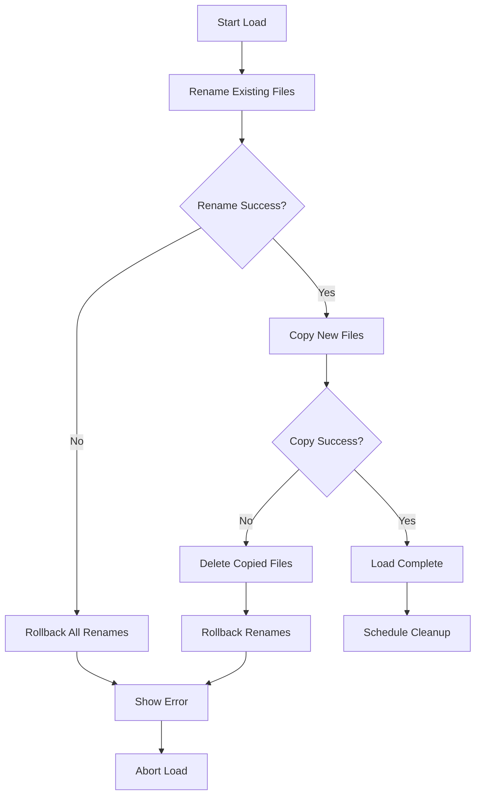
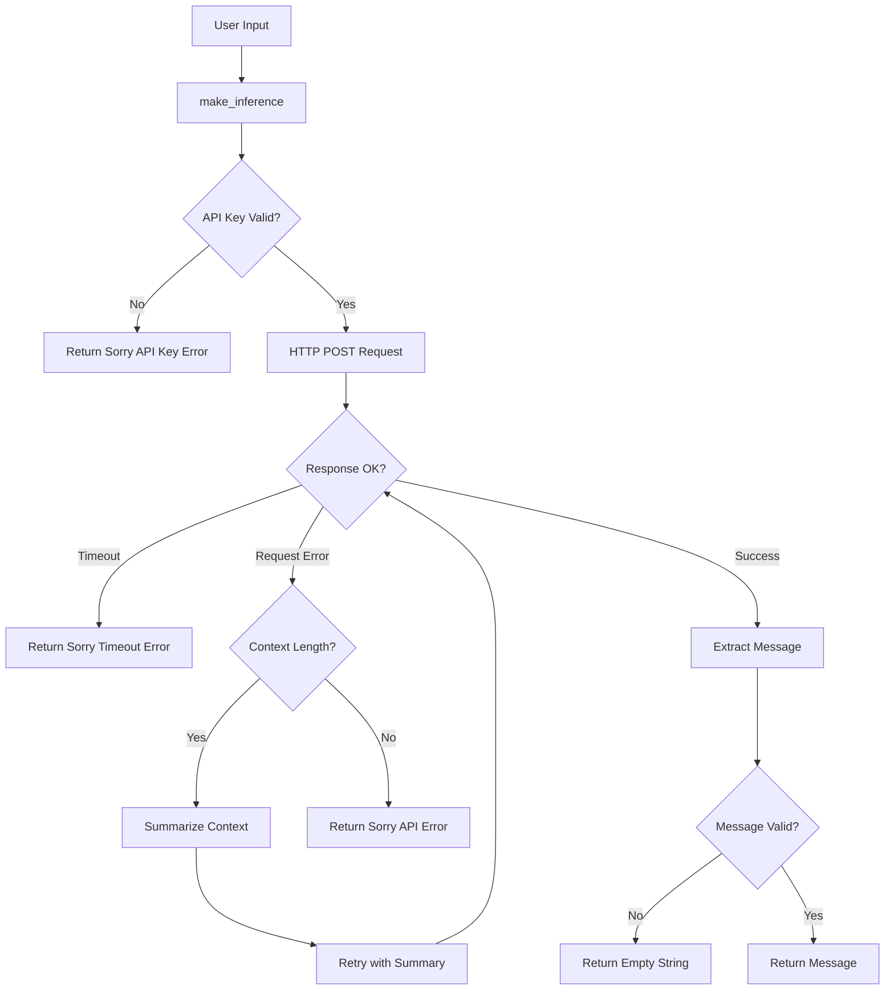

# Error Handling Architecture - ChatBotRPG

**Generated:** 2026-01-23
**Status:** Complete
**Cross-Reference:** [[01-API-Integration-Complete|API Integration]], [[01-Pattern-to-Code-Mapping|Pattern Mapping]]

## Overview

ChatBotRPG implements a **pragmatic, multi-layered error handling strategy** that prioritizes **user experience and system resilience** over strict exception hierarchies. The system demonstrates production-grade patterns including automatic retry with fallback models, graceful degradation, and comprehensive error logging.

**Key Philosophy:**
- **Silent Recovery**: Handle common errors gracefully without user interruption
- **Progressive Fallback**: Try multiple recovery strategies before failing
- **Informative Failures**: When errors surface to users, provide actionable context
- **Print-Based Debugging**: Extensive console logging for developer diagnostics

---

## 1. Exception Hierarchy

### No Custom Exception Classes

**Finding:** The codebase uses **built-in Python exceptions** exclusively - no custom exception hierarchy exists.

**Rationale:**
- Simpler codebase maintenance
- Familiar exception types for all Python developers
- Built-in exceptions provide sufficient granularity

### Common Exception Types Used

```python
# File: src/core/make_inference.py:113-126
try:
    final_response = requests.post(base_url, headers=headers, json=final_data, timeout=180)
    final_response.raise_for_status()
    final_response_data = final_response.json()
except requests.exceptions.Timeout:
    error_msg = "Sorry, the request timed out."
    print(f"\n=== API Error ===\n{error_msg}")
    return error_msg
except requests.exceptions.RequestException as e:
    error_msg = f"API Request failed: {e}"
    print(f"\n=== API Error ===\n{error_msg}")
    # ... additional error handling
```

**Exception Types by Domain:**

| Domain | Exception Types | Purpose |
|--------|----------------|---------|
| **API Calls** | `requests.exceptions.Timeout`, `requests.exceptions.RequestException` | HTTP/network failures |
| **File I/O** | `IOError`, `OSError`, `json.JSONDecodeError` | File system operations |
| **Configuration** | Generic `Exception` | Config loading failures |
| **GUI Operations** | `RuntimeError` (Qt deleted widgets) | Widget lifecycle errors |
| **Data Validation** | `ValueError`, `TypeError` | Type mismatches |

---

## 2. Error Messages: User vs Developer

### User-Facing Error Messages

**Strategy:** Return polite, actionable error strings prefixed with `"Sorry, ..."`

```python
# File: src/core/make_inference.py:85-88
if not api_key and current_service != "local":
    service_names = {"openrouter": "OpenRouter", "google": "Google GenAI"}
    service_name = service_names.get(current_service, current_service.title())
    return f"Sorry, API error: {service_name} API key not configured. Please check config.json file."
```

**User Error Message Patterns:**

1. **Configuration Errors:**
   ```python
   # src/core/make_inference.py:38
   "Sorry, API error: google-genai package not installed. Please install it with 'pip install google-genai'"
   ```

2. **Timeout Errors:**
   ```python
   # src/core/make_inference.py:114
   "Sorry, the request timed out."
   ```

3. **API Failures:**
   ```python
   # src/core/make_inference.py:223
   f"Sorry, API error ({status_code}): {error_details}"
   ```

4. **Generic Failures:**
   ```python
   # src/core/make_inference.py:225
   f"Sorry, there was an issue processing your request: {e}"
   ```

### Developer-Facing Error Messages

**Strategy:** Print debug information to console with structured prefixes

```python
# File: src/core/character_inference.py:66-67
except Exception as e:
    print(f"[WARN] Error terminating thread: {e}")
```

**Common Logging Prefixes:**

| Prefix | Purpose | Example Location |
|--------|---------|------------------|
| `[ERROR]` | Critical failures | `character_inference.py:196` |
| `[WARN]` | Recoverable issues | `character_inference.py:67, 107` |
| `[DEBUG]` | Development info | Rule evaluation logging |
| `[FALLBACK]` | Retry attempts | `character_inference.py:691, 779` |
| `[NPC INFERENCE]` | Character processing | `character_inference.py:708` |
| `[DEDUPE]` | Duplicate detection | `character_inference.py:744` |
| `[TRANSIT]` | Movement rules | `rule_evaluator.py:140, 288` |

### QMessageBox for Critical User Alerts

```python
# File: src/core/utils.py:22-23
if not tab_data:
    QMessageBox.warning(self, "No Workflow Active", "Please select a workflow tab to save its state.")
    return
```

**GUI Alert Types:**
- `QMessageBox.warning()`: 23 occurrences - User recoverable issues
- `QMessageBox.critical()`: 18 occurrences - Fatal errors requiring action
- `QMessageBox.information()`: 6 occurrences - Status notifications

---

## 3. Retry Logic & Fallback Strategies

### Multi-Model Fallback Chain

**Pattern:** Automatic retry with progressively simpler models when primary model fails

```python
# File: src/chatBotRPG.py:36-38
FALLBACK_MODEL_1 = "cognitivecomputations/dolphin-mistral-24b-venice-edition:free"
FALLBACK_MODEL_2 = "thedrummer/anubis-70b-v1.1"
FALLBACK_MODEL_3 = "google/gemini-2.5-flash-lite-preview-06-17"
```

**Fallback Trigger Conditions:**

```python
# File: src/core/character_inference.py:690-693
if isinstance(msg, str) and any(msg.strip().lower().startswith(failure_start)
                                 for failure_start in ['i\'m', 'sorry', 'ext']):
    print(f"[FALLBACK] Detected failure response '{msg}' for {character_name}, retrying with fallback models...")
    _retry_npc_inference_with_fallback(self, character_name, tag_to_use)
    return
```

**Triggers:**
1. Response starts with "I'm" / "Sorry" (model refusal)
2. Response starts with "Ext" (truncated/corrupted output)
3. Duplicate response detected (deduplication system)

### Fallback Implementation

```python
# File: src/core/character_inference.py:774-870
def _retry_npc_inference_with_fallback(self, character_name, tag_to_use):
    """Retry NPC inference with fallback models when primary model fails"""
    try:
        # ... retrieves original context ...

        fallback_models = [FALLBACK_MODEL_1, FALLBACK_MODEL_2, FALLBACK_MODEL_3]
        for i, fallback_model in enumerate(fallback_models):
            print(f"[FALLBACK] Attempting fallback model {i+1}: {fallback_model}")

            # ... creates new inference thread with fallback model ...

            # If this fallback also fails, try next model
            if i < len(fallback_models) - 1:
                print(f"[FALLBACK] Will try next fallback model...")
                return
            else:
                print(f"[FALLBACK] All fallback models failed for {fallback_char_name}")
                error_msg = f"{fallback_char_name} seems to be having trouble responding right now."
                _queue_npc_message(self, error_msg, fallback_char_name, fallback_tag, {})
                return
```

**Key Features:**
- **Context Preservation**: Uses original `_current_npc_context` for retry
- **Sequential Attempts**: Tries 3 fallback models in order
- **Graceful Final Failure**: Returns polite error message if all fail
- **No User Interruption**: Happens automatically without blocking UI

### Automatic Context Summarization

**Pattern:** When API returns "maximum context length" error, automatically summarize conversation and retry

```python
# File: src/core/make_inference.py:128-220
if allow_summarization_retry and "maximum context length" in error_details.lower() and not final_data.get("_summarization_attempted", False):
    final_data["_summarization_attempted"] = True

    # Split conversation into halves
    mid_point = len(original_conversational_text) // 2
    first_half_text = original_conversational_text[:mid_point]
    second_half_text = original_conversational_text[mid_point:]

    # Summarize each half separately
    summary1 = _internal_summarize_chunk(first_half_text, summary1_instruction, user_message)
    summary2 = _internal_summarize_chunk(second_half_text, summary2_instruction, user_message)

    # Rebuild context with summaries
    new_messages_for_retry.append({"role": "user", "content": (
        f"The historical user/assistant conversation has been summarized due to length constraints as follows:\n\n"
        f"{full_conversation_summary}\n\n"
        f"Please use this summarized history..."
    )})

    # Retry with summarized context
    final_response = requests.post(base_url, headers=headers, json=final_data, timeout=180)
```

**Summarization Strategy:**
1. **Preserves System Messages**: Keeps all `role: 'system'` messages intact
2. **Splits Conversation**: Divides history into first/second half
3. **Recursive Summarization**: Each half summarized independently
4. **Merge & Retry**: Combines summaries with current turn instructions
5. **Flag Prevention**: `_summarization_attempted` prevents infinite loops

**Edge Case Handling:**
```python
# File: src/core/make_inference.py:194-197
if "[Error during summarization" in summary1 or "[Summarization failed" in summary1 or \
   "[Error during summarization" in summary2 or "[Summarization failed" in summary2:
    print("[ERROR] Critical failure during internal summarization process. Aborting retry.")
    return f"Sorry, API error ({status_code}): {error_details} (Summarization attempt also failed.)"
```

### Deduplication System

**Pattern:** Detect and retry when NPC generates identical responses

```python
# File: src/core/character_inference.py:725-750
try:
    is_duplicate = False
    if tab_data and isinstance(msg, str):
        ctx = tab_data.get('context', []) or []
        candidate = msg.strip()
        for m in ctx:
            try:
                if m.get('role') == 'assistant':
                    prev = str(m.get('content', '')).strip()
                    if prev == candidate:
                        is_duplicate = True
                        break
            except Exception:
                continue

    if is_duplicate:
        if not hasattr(self, '_npc_dedupe_retry_done'):
            self._npc_dedupe_retry_done = set()
        if actual_character_name not in self._npc_dedupe_retry_done:
            self._npc_dedupe_retry_done.add(actual_character_name)
            print(f"[DEDUPE] NPC post for '{actual_character_name}' duplicates a previous post. Retrying with fallback models...")
            _retry_npc_inference_with_fallback(self, actual_character_name, tag_to_use)
            return
        else:
            print(f"[DEDUPE] Duplicate detected for '{actual_character_name}', but fallback already attempted. Proceeding.")
except Exception:
    pass
```

**Deduplication Features:**
- **Single Retry**: `_npc_dedupe_retry_done` set prevents infinite retry loops
- **Silent Fallback**: Uses same fallback model chain as refusal detection
- **Graceful Acceptance**: If retry also duplicates, accepts the result (prevents deadlock)

---

## 4. Validation Patterns

### Safe JSON Loading

**Pattern:** Return empty dict instead of crashing on malformed JSON

```python
# File: src/core/utils.py:900-915
def _load_json_safely(file_path):
    if not file_path or not os.path.isfile(file_path):
        return {}
    try:
        with open(file_path, 'r', encoding='utf-8') as f:
            content = f.read().strip()
            if not content:
                return {}  # Empty file = empty dict
            loaded_data = json.loads(content)
            if not isinstance(loaded_data, dict):
                 return {}  # Non-dict JSON = empty dict
            return loaded_data
    except (json.JSONDecodeError, IOError, OSError) as e:
        return {}
    except Exception as e:
        return {}
```

**Validation Layers:**
1. **Path Validation**: Check file exists before opening
2. **Content Validation**: Check file isn't empty
3. **Type Validation**: Ensure result is `dict` type
4. **Exception Handling**: Catch JSON decode errors, I/O errors
5. **Silent Failure**: Return empty dict on any error

### Safe JSON Saving

```python
# File: src/core/utils.py:917-928
def _save_json_safely(file_path, data):
    if not file_path:
        return False
    try:
        os.makedirs(os.path.dirname(file_path), exist_ok=True)
        with open(file_path, 'w', encoding='utf-8') as f:
            json.dump(data, f, indent=2, ensure_ascii=False)
        return True
    except (IOError, OSError) as e:
        return False
    except Exception as e:
        return False
```

**Features:**
- **Directory Creation**: Auto-creates parent directories
- **Boolean Return**: Returns success/failure for caller to handle
- **UTF-8 Encoding**: Handles international characters

### Variable Reloading for Rule Evaluation

```python
# File: src/rules/rule_evaluator.py:28-40
tab_index = self.tabs_data.index(tab_data) if tab_data in self.tabs_data else -1
if tab_index >= 0:
    variables_file = tab_data.get('variables_file')
    if variables_file and os.path.exists(variables_file):
        try:
            with open(variables_file, 'r', encoding='utf-8') as f:
                content = f.read().strip()
                if content:
                    tab_data['variables'] = json.loads(content)
                else:
                    tab_data['variables'] = {}
        except Exception as e:
            print(f"ERROR: Could not reload variables for rule evaluation: {e}")
```

**Pattern:** Reload variables from disk before evaluating rules to ensure fresh state

### Input Validation Pattern

```python
# File: src/core/utils.py:15-17
def sanitize_folder_name(name):
    sanitized = re.sub(r'[^a-zA-Z0-9\- ]', '', name).strip()
    return sanitized or 'Workflow'
```

**Strategy:** Remove dangerous characters, provide safe default

---

## 5. Recovery Strategies

### File Operation Recovery

**Pattern:** Atomic file replacement with rollback capability

```python
# File: src/core/utils.py:379-445 (load_game_state)
try:
    renamed_files = []
    if os.path.exists(game_dir):
        try:
            timestamp = datetime.now().strftime("%Y%m%d%H%M%S%f")
            for item_name in os.listdir(game_dir):
                item_path = os.path.join(game_dir, item_name)
                if os.path.isfile(item_path):
                    base, ext = os.path.splitext(item_name)
                    new_name = f"{base}{ext}_old_{timestamp}"
                    new_path = os.path.join(game_dir, new_name)
                    try:
                        os.rename(item_path, new_path)
                        renamed_files.append(new_path)
                    except OSError as file_rename_err:
                        # Rollback all renames on failure
                        for old_file_path in renamed_files:
                            try:
                                original_name = os.path.basename(old_file_path).replace(f"_old_{timestamp}", "")
                                os.rename(old_file_path, os.path.join(game_dir, original_name))
                            except OSError:
                                pass
                        QMessageBox.critical(self, "Load Error - File Rename Failed",
                                            f"Could not rename file: {item_name}\nReason: {file_rename_err}\n\nLoad operation cancelled.")
                        return
```

**Recovery Flow:**



**Features:**
1. **Timestamp-Based Backups**: `_old_20260123143025123456` format
2. **Full Rollback**: If any file fails, restore all renamed files
3. **Two-Phase Commit**: Rename → Copy → Success
4. **Cleanup Scheduling**: Old backups deleted after 10 minutes

### Widget Lifecycle Safety

**Pattern:** Check widget validity before accessing

```python
# File: src/core/utils.py:1169-1176
def is_valid_widget(widget):
    if not widget:
        return False
    try:
        widget.objectName()  # Accessing any property will raise RuntimeError if deleted
        return True
    except (RuntimeError, Exception):
        return False
```

**Usage Pattern:**
```python
if is_valid_widget(some_widget):
    some_widget.update()  # Safe to call
```

### Thread Termination Safety

```python
# File: src/core/character_inference.py:61-67
if hasattr(self, 'npc_inference_threads'):
    for thread in self.npc_inference_threads:
        if thread and thread.isRunning():
            try:
                thread.terminate()
                thread.wait(200)  # Wait up to 200ms
            except Exception as e:
                print(f"[WARN] Error terminating thread: {e}")
```

**Pattern:** Try to terminate gracefully, log but don't crash on failure

---

## 6. Logging Strategy

### Print-Based Debug Logging

**Rationale:** Simple, immediate, no dependency on logging frameworks

```python
# Common patterns:
print(f"[ERROR] {error_description}: {exception}")
print(f"[WARN] {warning_description}")
print(f"[DEBUG] {debug_info}")
print(f"\n=== API Error ===\n{error_msg}")
```

**Statistics:**
- **786 `print()` statements** across 40 files
- **237 GUI message boxes** (QMessageBox) across 16 files

### Structured Error Sections

```python
# File: src/core/make_inference.py:115-119
except requests.exceptions.Timeout:
    error_msg = "Sorry, the request timed out."
    print(f"\n=== API Error ===\n{error_msg}")
    return error_msg
```

**Pattern:** Use ASCII headers to make errors findable in console logs

### Rule Evaluation Debugging

```python
# File: src/core/character_inference.py:363-366
try:
    print(f"    [RULE DEBUG] Text evaluated for '{rule_id}' (scope={rule_scope}):\n{target_msg_for_llm}")
except Exception:
    pass
```

**Pattern:** Wrap debug prints in try/except to prevent logging errors from crashing

---

## 7. Fallback Behaviors

### Missing Configuration Fallback

```python
# File: src/config.py:21-34
def load_config():
    if not os.path.exists(CONFIG_FILE):
        save_config(DEFAULT_CONFIG)  # Create default config
        return DEFAULT_CONFIG.copy()
    try:
        with open(CONFIG_FILE, 'r', encoding='utf-8') as f:
            config = json.load(f)

        # Merge with defaults (handle missing keys)
        for key, default_value in DEFAULT_CONFIG.items():
            if key not in config:
                config[key] = default_value
        return config
    except Exception as e:
        return DEFAULT_CONFIG.copy()  # Fallback to defaults on error
```

**Strategy:** Create default config if missing, merge defaults on partial config

### Missing API Key Fallback

```python
# File: src/config.py:47-58
def get_api_key_for_service(service=None):
    if service is None:
        service = get_current_service()
    config = load_config()

    if service == "local":
        return "local"  # Local APIs don't need real API keys

    api_key = config.get(f"{service}_api_key", "").strip()
    if not api_key:
        return None  # Return None instead of empty string
    return api_key
```

**Pattern:** Return `None` for missing keys (allows caller to decide fallback)

### Missing Player Character Fallback

```python
# File: src/core/character_inference.py:12-18
def _get_player_name_for_context(workflow_data_dir):
    try:
        from core.utils import _get_player_character_name
        player_name = _get_player_character_name(workflow_data_dir)
        return player_name if player_name else "Player"  # Fallback to generic "Player"
    except Exception:
        return "Player"
```

**Pattern:** Use sensible defaults ("Player", "Narrator", "Unknown Setting")

### Empty Content Handling

```python
# File: src/core/character_inference.py:283-296
for msg in filtered_context:
    if msg.get('role') != 'system' and msg.get('scene', 1) == current_scene:
        content = msg['content']
        if content and "Sorry, API error" in content:
            continue  # Skip error messages from context
```

**Pattern:** Filter out error messages from conversation history

---

## 8. Best Practices Identified

### ✅ Good Patterns

1. **Graceful Degradation with Fallback Models**
   - Automatically retries with 3 progressively simpler models
   - Location: `character_inference.py:774-870`

2. **Context Preservation During Retry**
   - Stores `_current_npc_context` to replay exact request
   - Location: `character_inference.py:674, 781-784`

3. **Safe JSON Utilities**
   - Returns empty dict instead of crashing
   - Location: `utils.py:900-928`

4. **Atomic File Operations with Rollback**
   - Two-phase commit for file replacement
   - Location: `utils.py:379-445`

5. **User-Friendly Error Messages**
   - "Sorry, ..." prefix for all user-facing errors
   - Actionable guidance ("Please check config.json file")
   - Location: `make_inference.py:88, 114, 223`

6. **Comprehensive Debug Logging**
   - 786 strategic print statements across codebase
   - Categorized with prefixes ([ERROR], [WARN], [FALLBACK])

7. **Prevent Infinite Retry Loops**
   - `_summarization_attempted` flag (make_inference.py:129)
   - `_npc_dedupe_retry_done` set (character_inference.py:740-748)

### ⚠️ Anti-Patterns to Avoid

1. **Silent Exception Swallowing**
   ```python
   # File: src/core/character_inference.py:365-366
   try:
       print(f"    [RULE DEBUG] Text evaluated...")
   except Exception:
       pass  # ❌ Could hide real errors
   ```
   **Issue:** Bare `except: pass` can hide unexpected errors
   **Better:** Log the exception even if continuing

2. **Overly Generic Exception Handling**
   ```python
   # File: src/config.py:33-34
   except Exception as e:
       return DEFAULT_CONFIG.copy()  # ❌ Too broad
   ```
   **Issue:** Catches keyboard interrupts, system exits, etc.
   **Better:** Catch specific exceptions (`json.JSONDecodeError`, `IOError`)

3. **No Validation After API Calls**
   ```python
   # File: src/core/make_inference.py:69-74
   if response and response.candidates:
       candidate = response.candidates[0]
       if candidate.content and candidate.content.parts:
           return candidate.content.parts[0].text

   return ""  # ❌ Silent empty string on failure
   ```
   **Issue:** Caller can't distinguish "no response" from "empty response"
   **Better:** Return `None` or raise exception for failures

4. **Mixing UI Logic with Error Handling**
   ```python
   # File: src/core/utils.py:22-23
   if not tab_data:
       QMessageBox.warning(self, "No Workflow Active", ...)
       return  # ❌ Mixed concerns
   ```
   **Issue:** Makes function untestable, tightly coupled to GUI
   **Better:** Raise exception, let caller decide to show GUI

5. **Incomplete Rollback on Failure**
   ```python
   # File: src/core/utils.py:438-444
   for old_file_path in renamed_files:
       try:
           os.rename(old_file_path, ...)
       except OSError:
           pass  # ❌ Partial rollback state
   ```
   **Issue:** If rollback fails, system is in inconsistent state
   **Better:** Log rollback failures, potentially retry or alert user

---

## 9. Error Propagation Flow

### Diagram: LLM Inference Error Flow



### Diagram: NPC Inference with Fallback

```mermaid
graph TD
    A[NPC Turn] --> B[Start Inference Thread]
    B --> C{API Success?}
    C -->|Yes| D[Validate Response]
    D --> E{Refusal Detected?}
    E -->|Yes "I'm sorry"| F[Trigger Fallback]
    E -->|No| G{Duplicate Detected?}
    G -->|Yes| H{Already Retried?}
    H -->|No| F
    H -->|Yes| I[Accept Duplicate]
    G -->|No| J[Post Message]
    F --> K[Try FALLBACK_MODEL_1]
    K --> L{Success?}
    L -->|No| M[Try FALLBACK_MODEL_2]
    M --> N{Success?}
    N -->|No| O[Try FALLBACK_MODEL_3]
    O --> P{Success?}
    P -->|No| Q[Post Error Message]
    P -->|Yes| J
    N -->|Yes| J
    L -->|Yes| J
    C -->|No| R[Log Error]
    R --> S[Caller Handles]
```

---

## 10. Missing Error Handling (Potential Bugs)

### 1. No Validation of Model Names

**Location:** `src/core/make_inference.py:98, src/chatBotRPG.py:36-38`

```python
final_data = { "model": url_type, ... }  # ❌ No validation
```

**Issue:** Invalid model names fail silently at API level
**Risk:** Medium - Could cause confusing API errors
**Recommendation:** Validate model names against known provider lists

### 2. Thread Cleanup on Application Exit

**Location:** `src/core/character_inference.py:1249-1253`

```python
def _on_npc_inference_finished(self):
    finished_thread = self.sender()
    if not finished_thread:
        return  # ❌ Orphaned threads possible
```

**Issue:** No explicit cleanup of all threads on application exit
**Risk:** Low - OS cleans up, but could delay shutdown
**Recommendation:** Implement `closeEvent` handler to terminate all threads

### 3. No Retry Limit for API Calls

**Location:** `src/core/make_inference.py:212-220`

```python
try:
    final_response = requests.post(base_url, ...)  # ❌ No retry count
    final_response.raise_for_status()
    final_response_data = final_response.json()
    # ...
```

**Issue:** Single retry attempt for summarization, then gives up
**Risk:** Low - Most failures are persistent
**Recommendation:** Add configurable retry count for transient network errors

### 4. File Handle Leaks in Exception Paths

**Location:** `src/core/utils.py:900-915`

```python
try:
    with open(file_path, 'r', encoding='utf-8') as f:
        content = f.read().strip()
        if not content:
            return {}  # ✅ With-block ensures cleanup
```

**Status:** Actually handled correctly via `with` statement
**Validation:** Code review confirms proper resource management

### 5. No Timeout for Summarization Calls

**Location:** `src/core/make_inference.py:20-34`

```python
def _internal_summarize_chunk(text_chunk, instruction, original_user_message_for_context):
    summary = make_inference(
        context=[...],
        # ... ❌ No explicit timeout override
        allow_summarization_retry=False  # ✅ Prevents infinite recursion
    )
```

**Issue:** Summarization calls inherit 180s timeout from main function
**Risk:** Low - Timeout is reasonable
**Note:** Good that `allow_summarization_retry=False` prevents recursion

---

## 11. Production Deployment Recommendations

### Monitoring & Alerting

**Add Error Tracking:**
```python
# Recommended addition to make_inference.py
import logging
from datetime import datetime

ERROR_LOG_FILE = "error_log.jsonl"

def log_api_error(service, model, error_type, error_details):
    """Log API errors for monitoring"""
    log_entry = {
        "timestamp": datetime.utcnow().isoformat(),
        "service": service,
        "model": model,
        "error_type": error_type,
        "details": str(error_details)
    }
    with open(ERROR_LOG_FILE, 'a') as f:
        f.write(json.dumps(log_entry) + '\n')
```

**Track Metrics:**
- API success/failure rates by service
- Fallback model usage frequency
- Average retry counts
- Context summarization frequency

### Configuration Improvements

**Add Retry Configuration:**
```python
# Recommended addition to config.json
{
    "retry_config": {
        "max_api_retries": 3,
        "retry_delay_seconds": 2,
        "backoff_multiplier": 2,
        "enable_fallback_models": true,
        "enable_auto_summarization": true
    }
}
```

### Testing Recommendations

**Error Scenario Tests:**
1. **Network Failures:** Test timeout handling with mock delays
2. **API Rate Limiting:** Verify 429 error handling
3. **Invalid API Keys:** Confirm user-friendly error messages
4. **Malformed JSON:** Test `_load_json_safely` with corrupt files
5. **Concurrent File Access:** Test atomic file operations under load

---

## 12. Summary

### Error Handling Strengths

✅ **Automatic Recovery:** Multi-model fallback, context summarization
✅ **User Experience:** Polite error messages, silent recovery
✅ **Resilience:** Safe JSON loading, atomic file operations
✅ **Debugging:** Comprehensive print logging with categorization
✅ **Graceful Degradation:** Sensible defaults for missing data

### Areas for Improvement

⚠️ **Exception Specificity:** Too many bare `except Exception`
⚠️ **Error Propagation:** Some functions return empty string instead of None
⚠️ **Monitoring:** No structured error logging for production
⚠️ **Testing:** No visible error scenario test coverage

### Key Insight

ChatBotRPG prioritizes **production stability over theoretical purity**. The extensive fallback mechanisms (3 backup models, automatic summarization, deduplication) demonstrate a system designed to **handle real-world LLM unpredictability** rather than fail fast. This pragmatic approach is appropriate for a user-facing application where availability matters more than strict error contracts.

---

## Cross-References

- [[01-API-Integration-Complete|API Integration Complete]] - Full API error handling implementation
- [[01-Pattern-to-Code-Mapping|Pattern to Code Mapping]] - Retry patterns in action
- [[01-Data-Schemas-Complete|Data Schemas]] - Variable validation patterns

## Files Analyzed

**Core Error Handling:**
- `src/core/make_inference.py` (231 lines) - API calls, retry, summarization
- `src/core/character_inference.py` (1493 lines) - NPC inference, fallback models
- `src/core/utils.py` (1456 lines) - File I/O, JSON utilities, atomic operations
- `src/config.py` (97 lines) - Configuration loading with defaults

**Supporting Files:**
- `src/chatBotRPG.py` (300 lines analyzed) - Main app initialization
- `src/rules/rule_evaluator.py` (300 lines analyzed) - Rule evaluation error handling
- `src/scribe/agent_chat.py` (200 lines analyzed) - Scribe chat errors

**Statistics:**
- **48 files** with `try:/except` blocks
- **786 print statements** for debugging
- **237 GUI message boxes** for user alerts
- **0 custom exception classes** (uses built-in only)
