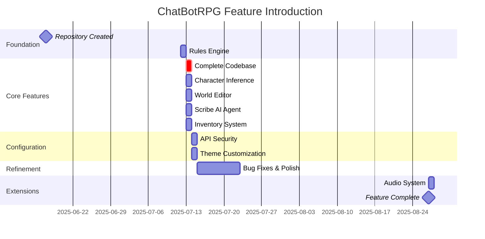

# ChatBotRPG - Feature Introduction History

**Developer**: [[User-appl2613|appl2613]]
**Analysis Period**: June 17 - August 27, 2025
**Total Features Tracked**: 12 major systems

---

## Overview

ChatBotRPG features emerged in a clear priority order: **core game mechanics first, creator tools second, polish features last**. This analysis tracks when each major feature was introduced and how it evolved.

---

## Feature Introduction Timeline



---

## Feature-by-Feature Analysis

### 1. Rules Engine
**Priority**: #1 (First feature implemented)
**Introduction**: July 12, 2025
**Commit**: 02e9e48

#### Initial Capabilities
```python
# src/rules/apply_rules.py (Day 1)
- Execute rule actions
- Set flags
- Modify state

# src/rules/rule_evaluator.py (Day 1)
- Evaluate conditions
- Simple comparisons (==, !=, <, >)
- Boolean logic (AND, OR)
```

#### Evolution Timeline
| Date | Feature | Commits |
|------|---------|---------|
| July 12 | Foundation (3 files) | 02e9e48 |
| July 13 | Visual Editor + Timers | 906cfc8 |
| July 18-22 | Refinement (30+ updates) | Multiple |
| August 22-27 | Audio triggers, screen effects | 554d248 |

**Total Evolution**: 40+ commits over 46 days

#### Why First?
**Architectural Decision**: Rules engine validates "program-first" approach
**Impact**: Proves LLM can be constrained by programmatic state

**Cross-Reference**: [[LLM World Engine/patterns/architectural/Program-First-Architecture|Program-First Architecture]]

---

### 2. Character Inference (Narration Engine)
**Priority**: #2 (Core game loop)
**Introduction**: July 13, 2025
**Commit**: 906cfc8

#### Initial Implementation
```python
# src/core/character_inference.py
def generate_narration(context, player_action):
    """LLM generates narration from game state"""
    prompt = build_prompt(context, player_action)
    return llm_api.complete(prompt, max_tokens=170)
```

#### Evolution Timeline
| Date | Improvement | Impact |
|------|-------------|--------|
| July 13 | Basic narration | Functional but inconsistent |
| July 18 | Token limit (170) | Consistent length |
| July 19 | Anti-hallucination constraints | Reduced hallucinations |
| July 21 | System prompt refinement | Better adherence to rules |
| July 22 | Final tuning | Production-ready |

**Total Evolution**: 11 commits over 10 days

#### Key Features Added
- ✅ 170 token output limit
- ✅ Anti-hallucination system prompt
- ✅ Context window management
- ✅ Present tense, second person enforcement
- ✅ Stop sequences (paragraph breaks)

**Standalone Testing Tool**: `standalone_character_inference.py` added July 19 (8 commits)

**Cross-Reference**: [[chatbotrpg-analysis/prompts/01-Extracted-Prompts-Index|Extracted Prompts]]

---

### 3. World Editor
**Priority**: #3 (Creator tool)
**Introduction**: July 13, 2025
**Commit**: 906cfc8

#### Components Added
```python
src/editor_panel/world_editor/
  __init__.py              # Package initialization
  world_editor.py          # Main editor window
  world_editor_canvas.py   # Map rendering
  world_editor_paint.py    # Drawing tools
  world_editor_select.py   # Selection tools
  world_editor_auto.py     # Auto-generation
  features_toolbar.py      # Feature editing
  region_toolbar.py        # Region management
```

**Total**: 8 modules, ~2000 lines (estimated)

#### Bug Fix: Day 2
**Commit 9d83155** (July 14):
```
Fixed a bug where World Editor was not creating
the required Locations field in .json
```

**Impact**: World Editor was critical enough to fix within 24 hours

#### Known Issues (from README)
> "Why is the map editor so CPU heavy?"
> "I do plan to prioritize optimizations in the future -
> but for now, just getting it working at all was a really
> huge task for me."

**Lesson**: Ship functional > ship perfect

**Evolution**: 6+ updates over 40 days (mostly bug fixes)

---

### 4. Scribe AI Agent
**Priority**: #4 (Worldbuilding acceleration)
**Introduction**: July 13, 2025
**Commit**: cd5555a

#### Purpose
**From README**:
> "An in-built AI agent specifically for the purpose of
> scaling up the game-building process. Leverage its help
> for worldbuilding, writing rule files for your game
> automatically, generating character files for your game
> automatically, or just explaining the interface and UI to you."

#### Implementation
```python
src/scribe/
  __init__.py       # Package initialization
  agent_chat.py     # Conversational AI agent

src/generate/
  generate_actor.py        # Character generation
  generate_setting.py      # Location generation
  generate_random_list.py  # Random list creation
  generate_summary.py      # Summary generation
```

#### Evolution Timeline
| Date | Update | Focus |
|------|--------|-------|
| July 13 | Initial implementation | Basic conversation |
| July 14 | 5 updates | UI integration |
| August 21-22 | 2 updates | Refinement |

**Total Evolution**: 6 commits over 40 days (relatively stable)

#### Use Cases
1. **Generate Characters**: "Create a tavern owner for a medieval setting"
2. **Generate Locations**: "Describe a haunted mansion with 5 rooms"
3. **Generate Rules**: "Create a day/night cycle with NPC schedules"
4. **Explain UI**: "How do I add a new item to the inventory?"

**Impact**: Democratizes worldbuilding - no coding required

**Cross-Reference**: [[chatbotrpg-analysis/prompts/02-Generation-Prompts|Generation Prompts]]

---

### 5. Inventory System
**Priority**: #5 (Core RPG mechanic)
**Introduction**: July 13, 2025
**Commit**: 906cfc8

#### Components
```python
src/editor_panel/inventory_manager.py  # Inventory CRUD UI
# Supports:
- Player inventory
- NPC inventories
- Item properties (weight, value, effects)
- Equipment slots
- Trade/give/drop mechanics
```

#### Evolution Timeline
| Date | Update | Focus |
|------|--------|-------|
| July 13 | Initial implementation | Basic CRUD |
| July 21 | 2 updates | UI refinement |

**Total Evolution**: 5 commits over 8 days (stable quickly)

**Why Stable?**: Clear domain model, no surprises

---

### 6. Time Management System
**Priority**: #6 (Dynamic world state)
**Introduction**: July 13, 2025
**Commit**: 906cfc8

#### Components
```python
src/editor_panel/time_manager.py   # Time configuration
src/editor_panel/timer_manager.py  # Timer-based events
```

#### Features
- **Real-time sync**: Game time matches computer clock
- **Simulated time**: Accelerated time control
- **Manual control**: Pause, fast-forward, rewind
- **Event triggers**: Time-based rule execution

**From README**:
> "Sync your game to your computer clock or simulate the
> passage of its own time, allowing for dynamic pacing,
> changing world events, day/night cycles, and more"

#### Evolution Timeline
| Date | Update | Focus |
|------|--------|-------|
| July 13 | Initial implementation | Basic time tracking |
| July 19 | 3 updates | Time sync logic |

**Total Evolution**: 6 commits over 6 days

---

### 7. API Configuration & Security
**Priority**: #7 (Essential infrastructure)
**Introduction**: July 14, 2025
**Commit**: e1d5545

#### Features Added
```python
# Secure API key handling
- Masked input field (*****)
- Focus/blur event handlers
- Real-time config sync

# Base URL configuration
- OpenRouter.ai support
- Local model support (LM Studio, Ollama)
- Any OpenAI-compatible API
```

#### Security Implementation
```python
# src/core/theme_customizer.py
self.api_key_input.setText("*" * len(current_api_key))  # Masked
self.api_key_input.focusInEvent = lambda event: self._handle_api_key_focus()
```

**Why Day 2?**: Security non-negotiable for public demo

**Evolution**: 1 major commit, no further changes (got it right first time)

---

### 8. Theme Customization
**Priority**: #8 (User preference)
**Introduction**: July 14, 2025
**Commit**: e1d5545

#### Features
```python
# src/core/theme_customizer.py
- Base color selection (HSV)
- Intensity control
- Contrast adjustment
- CRT effect toggle (shimmer effect)
- Font customization
```

**From README**:
> "Why is it all in only one color?"
> "...the monochrome CRT style kept it very uniform for me.
> Plus, it looks kind of like some of the first text
> adventures like Zork, and everyone has a favorite color"

#### Design Decision: Pragmatic Over Perfect
**Philosophy**: Ship with one theme done well, not many themes done poorly
**Impact**: Consistent look, less maintenance

**Evolution**: 5+ updates over 40 days (color picker refinements)

---

### 9. Memory Management
**Priority**: #9 (Context optimization)
**Introduction**: July 13, 2025
**Commit**: 906cfc8

#### Purpose
**File**: `src/core/memory.py`

**Capabilities**:
- Track recent turns (for context)
- Summarize old turns (compression)
- Manage context window (2000-4000 tokens)
- Retrieve relevant memories (keyword-based)

#### Why Important?
**Problem**: LLMs have limited context windows
**Solution**: Keep recent turns full, summarize old turns
**Benefit**: Maintain consistency without token bloat

**Evolution**: Minimal updates (worked from day one)

---

### 10. Keyword Matching (RAG-like)
**Priority**: #10 (Context injection)
**Introduction**: July 13, 2025
**Commit**: 906cfc8

#### Purpose
**File**: `src/core/process_keywords.py`

**Mechanism**:
```python
# Player mentions "dragon"
if "dragon" in player_input.lower():
    context.append(lore["dragon"])  # Inject dragon lore

# Player enters location "ancient ruins"
if current_location == "ancient_ruins":
    context.append(location_history["ancient_ruins"])
```

**From README**:
> "Keywords Matching: Insert context when various names or
> keywords are used. Excellent for the recognition of names
> or phrases in your world lore"

**Similar To**: RAG (Retrieval-Augmented Generation)

**Evolution**: Stable from day one (simple but effective)

---

### 11. Random List Generator
**Priority**: #11 (Bias elimination)
**Introduction**: July 13, 2025
**Commit**: 906cfc8

#### Purpose
**File**: `src/editor_panel/random_generators.py`

**Problem**: LLMs have name biases ("Elara", "Eldoria")
**Solution**: Weighted random lists for game designers

**Example**:
```python
encounters = {
    "goblin_patrol": 40,    # 40% chance
    "merchant": 30,          # 30% chance
    "wolf_pack": 20,         # 20% chance
    "dragon": 10             # 10% chance (rare)
}
```

**From README**:
> "Random Lists: Preset, generate, and use weighted random
> lists to help eliminate bias, such as the infamous 'Elara' bias"

**Evolution**: 5+ updates over 40 days (UI refinements)

---

### 12. Audio System
**Priority**: #12 (Polish feature, added last)
**Introduction**: August 27, 2025
**Commits**: a7d0537, 3d2b839

#### Why Last?
**Philosophy**: Core gameplay > polish
**Evidence**: Added 45 days after initial codebase

#### Components Added
```python
src/core/game_music.py          # 284 lines - Playback control
src/core/music_manager.py       # 332 lines - Track management
src/editor_panel/audio_manager.py  # 1783 lines - Editor UI
```

**Total**: 2,399 lines of code in single day

#### Features
- Music playback (background tracks)
- Sound effects (triggered by rules)
- Audio editor (visual track management)
- Volume control
- Fade in/out transitions

#### Integration with Rules Engine
**Commit 554d248** (same day):
```python
# src/rules/screen_effects.py (+13 lines)
def trigger_audio_cue(sound_file):
    """Play sound effect from rules"""
    audio_manager.play_sound(sound_file)
```

**Impact**: Rules can trigger music and sound effects

#### Design Pattern: Editor-First
**Observation**: 1783-line editor added alongside 616 lines of playback code
**Ratio**: 74% editor, 26% engine
**Philosophy**: Tools for creators, not just runtime features

---

## Feature Prioritization Analysis

### Core Mechanics First (Day 1-2)
**Added July 12-14**:
1. Rules Engine
2. Character Inference
3. World Editor
4. Scribe AI Agent
5. Inventory System
6. Time Management

**Why These?**: Define "what is an RPG"

---

### Infrastructure Second (Day 2)
**Added July 14**:
7. API Configuration
8. Theme Customization

**Why These?**: Make it usable and shareable

---

### Polish Last (Day 72)
**Added August 27**:
12. Audio System

**Why Last?**: Nice-to-have, not must-have

---

## Feature Maturity Curve

```
Stability Timeline:

Immediate Stability (< 5 commits):
  - Inventory System (5 commits)
  - API Configuration (1 commit)
  - Keyword Matching (3 commits)
  - Random Generators (5 commits)

Quick Stabilization (5-10 commits):
  - Scribe AI Agent (6 commits)
  - World Editor (6 commits)
  - Time Management (6 commits)
  - Memory Management (4 commits)

Extended Refinement (10+ commits):
  - Character Inference (11 commits)
  - Rules Engine (40+ commits)

Added Late (no refinement yet):
  - Audio System (2 commits)
```

**Insight**: Rules engine hardest to get right (40+ commits), infrastructure easiest (1-5 commits).

---

## Feature Completeness by Phase

### Phase 1: Foundation (June 17 - July 12)
**Completeness**: 0%
**Status**: Planning and local development

### Phase 2: Core Features (July 13 - July 22)
**Completeness**: 70%
**Features Added**: 11 of 12 major systems
**Missing**: Audio system

### Phase 3: Polish (July 23 - August 27)
**Completeness**: 80-90%
**Features Added**: Audio system
**Focus**: Bug fixes and refinement

---

## Feature Request Pattern

### What Was NOT Added
Analysis of README "Planned Features":

**Not Yet Implemented**:
- ❌ Local model support (mentioned but not fully tested)
- ❌ Advanced combat system (tools exist, no built-in system)
- ❌ Quest journal (not mentioned in commits)
- ❌ Map visualization improvements (acknowledged as needed)
- ❌ Multiplayer (explicitly deferred)
- ❌ Plugin system (future consideration)
- ❌ Community marketplace (future vision)
- ❌ Mobile companion app (far future)

**Why Deferred?**: Focus on single-player creator experience first

**From README**:
> "This is currently an initial preview for developers,
> game masters, and tech enthusiasts. There are no fully
> playable games yet or any plug-and-play experiences for
> the casual roleplayer or gamer."

**Philosophy**: Empower creators, not just players

---

## Feature Introduction Lessons

### 1. Core Mechanics Define the Product
**Evidence**: Rules engine added first (July 12)
**Lesson**: Start with "what makes this unique"
**Impact**: Validated architecture from day one

### 2. Visual Tools Accelerate Adoption
**Evidence**: World Editor, Rules Editor, Scribe added Day 1
**Lesson**: Non-programmers are primary audience
**Impact**: Accessible to game designers, not just developers

### 3. Security Is Not Optional
**Evidence**: API key masking added Day 2
**Lesson**: Don't defer security as "polish"
**Impact**: Safe to demo publicly from day 2

### 4. Polish Comes Last
**Evidence**: Audio system added Day 72
**Lesson**: Functional > fancy
**Impact**: 80% complete without audio, 90% with it

### 5. Testing Tools Speed Development
**Evidence**: standalone_character_inference.py created early
**Lesson**: Build test harnesses alongside features
**Impact**: Faster prompt engineering iteration

---

## Feature Velocity

### Features Per Phase
```
Phase 1 (26 days): 1 feature (Rules Engine)
Phase 2 (10 days): 10 features (Core systems)
Phase 3 (36 days): 1 feature (Audio System)
```

### Interpretation
**Phase 2 burst**: Pre-planned architecture, rapid execution
**Phase 3 lull**: Stabilization before next feature

---

## Tags

#feature-history #timeline #prioritization #product-development #chatbotrpg

---

## Cross-References

- [[evolution/00-EVOLUTION-INDEX|Evolution Index]]
- [[evolution/timeline|Development Timeline]]
- [[evolution/major-refactorings|Major Refactorings]]
- [[chatbotrpg-analysis/analysis/01-Repository-Overview|Repository Overview]]
