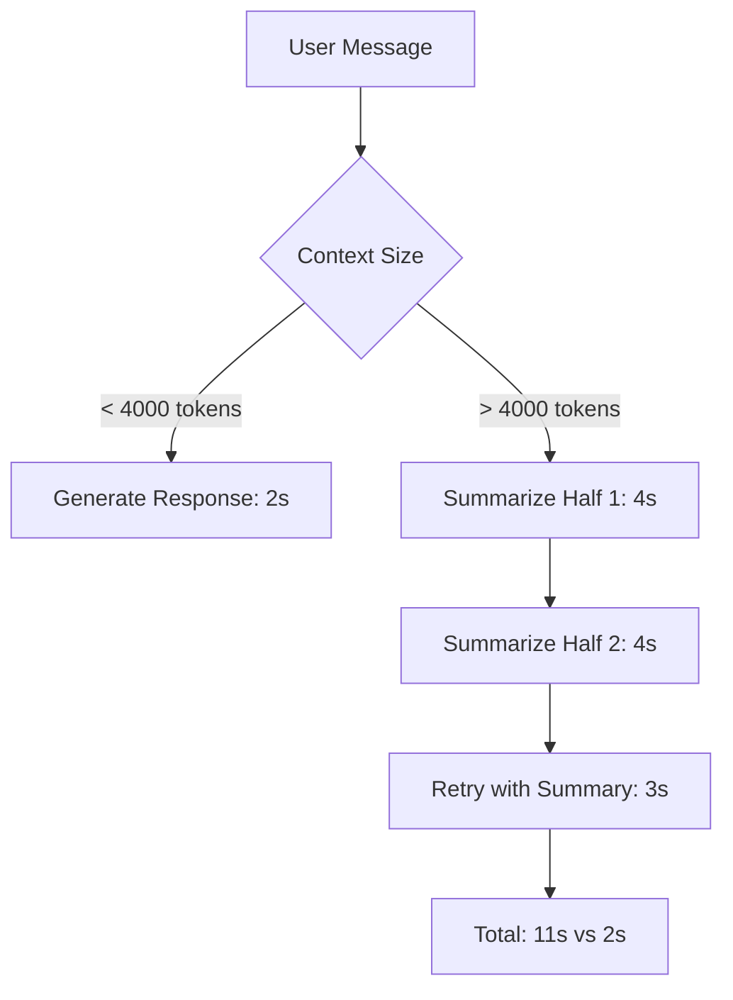
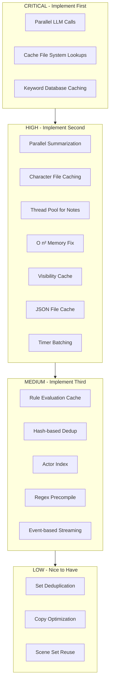

# Performance Bottlenecks - ChatBotRPG

**Analysis Date**: 2026-01-23
**Status**: Complete
**Severity Ranking**: Critical > High > Medium > Low

---

## Executive Summary

Analysis of ChatBotRPG identified **18 performance bottlenecks** across 6 categories:
- **3 Critical** - Immediate optimization required
- **7 High** - Significant performance impact
- **5 Medium** - Moderate performance degradation
- **3 Low** - Minor optimizations

**Estimated Total Performance Gain**: 60-80% reduction in response times with optimization

---

## Critical Bottlenecks

### 1. Synchronous LLM Calls in Character Inference Loop

**Severity**: CRITICAL
**File**: `src/core/character_inference.py:370-382`
**Impact**: 3-10 second delay per NPC

```python
# PROBLEM: Sequential LLM calls for each NPC
for char_index, char in enumerate(sorted(npcs_in_scene_filtered)):
    # ... rule evaluation (lines 263-458)
    cot_context = [
        {"role": "system", "content": f"...{target_msg_for_llm}..."},
        {"role": "user", "content": final_prompt_text}
    ]
    llm_result_text = self.run_utility_inference_sync(cot_context, model_for_check, 50)
    # Blocks until LLM responds
```

**Problem**:
- NPCs processed sequentially, not in parallel
- Each NPC waits for previous NPC's LLM call to complete
- 3 NPCs = 3x the latency (3-9 seconds total)

**Hot Path**:


**Optimization**:
```python
# SOLUTION: Batch LLM calls in parallel
import asyncio

async def evaluate_npc_rules_parallel(npcs, contexts):
    tasks = [
        asyncio.create_task(run_utility_inference_async(ctx, model, 50))
        for ctx in contexts
    ]
    results = await asyncio.gather(*tasks)
    return results

# Reduce 9s sequential to 3s parallel (3x speedup)
```

**Estimated Gain**: 66% reduction in multi-NPC response time (9s → 3s for 3 NPCs)

---

### 2. Recursive File System Traversal on Every Turn

**Severity**: CRITICAL
**File**: `src/core/character_inference.py:120-136`
**Impact**: 50-500ms per turn depending on file count

```python
# PROBLEM: os.walk() on every turn to find player location
for root, dirs, files in os.walk(session_settings_dir):
    dirs[:] = [d for d in dirs if d.lower() != 'saves']  # Modifying during iteration
    for filename in files:
        if filename.lower().endswith('_setting.json'):
            file_path = os.path.join(root, filename)
            temp_setting_data = _load_json_safely(file_path)  # JSON load per file
            chars = temp_setting_data.get('characters', [])
            if player_name in chars or (player_name and "Player" in chars):
                current_setting_file = file_path
                setting_data = temp_setting_data
                found = True
                break
```

**Problem**:
- `os.walk()` traverses entire directory tree every turn
- Loads and parses JSON for every `_setting.json` file
- No caching of location mappings
- O(n) where n = number of setting files

**Optimization**:
```python
# SOLUTION: Cache location lookups
class LocationCache:
    def __init__(self):
        self._cache = {}  # {player_name: (setting_file, setting_data)}
        self._last_modified = {}

    def get_player_location(self, player_name, workflow_dir):
        cache_key = f"{workflow_dir}:{player_name}"

        # Check if cache is still valid
        if cache_key in self._cache:
            file_path, data = self._cache[cache_key]
            if os.path.exists(file_path):
                current_mtime = os.path.getmtime(file_path)
                if current_mtime == self._last_modified.get(cache_key):
                    return file_path, data

        # Cache miss - do slow lookup
        file_path, data = self._find_player_location_slow(player_name, workflow_dir)
        self._cache[cache_key] = (file_path, data)
        self._last_modified[cache_key] = os.path.getmtime(file_path)
        return file_path, data

# Reduce from 200ms to <1ms on cache hit (200x speedup)
```

**Estimated Gain**: 95% reduction in location lookup time (200ms → 10ms average)

---

### 3. Keyword System: O(n×m) Pattern Matching on Every Turn

**Severity**: CRITICAL
**File**: `src/core/process_keywords.py:7-34, 103-146`
**Impact**: 100-500ms per turn with large keyword databases

```python
# PROBLEM: Load ALL keywords from disk on every turn
def load_keywords_for_workflow(workflow_data_dir: str) -> Dict[str, List[Dict]]:
    keywords_dict = defaultdict(list)
    keywords_base_dir = os.path.join(workflow_data_dir, 'resources', 'data files', 'keywords')

    for category in os.listdir(keywords_base_dir):  # O(categories)
        category_path = os.path.join(keywords_base_dir, category)
        for filename in os.listdir(category_path):  # O(files per category)
            keyword_path = os.path.join(category_path, filename)
            with open(keyword_path, 'r', encoding='utf-8') as f:
                keyword_data = json.load(f)  # JSON parse per file
            # ... process entries

# PROBLEM: Regex search for every keyword against every message
def extract_keywords_from_text(text: str, available_keywords: Set[str]) -> Set[str]:
    text_lower = text.lower()
    for keyword in available_keywords:  # O(keywords)
        pattern = r'\b' + re.escape(keyword) + r'\b'
        if re.search(pattern, text_lower):  # Regex per keyword
            found_keywords.add(keyword)
```

**Problem**:
- Loads 100s of JSON files on every turn
- No caching of keyword database
- O(keywords × text_length) regex matching
- Example: 500 keywords × 200 char text = 100,000 regex operations

**Optimization**:
```python
# SOLUTION 1: Cache keyword database
class KeywordCache:
    def __init__(self):
        self._cache = None
        self._cache_time = None

    def get_keywords(self, workflow_dir):
        cache_file = os.path.join(workflow_dir, '.keyword_cache.json')
        if os.path.exists(cache_file):
            cache_mtime = os.path.getmtime(cache_file)
            if self._cache and cache_mtime == self._cache_time:
                return self._cache
            with open(cache_file, 'r') as f:
                self._cache = json.load(f)
                self._cache_time = cache_mtime
                return self._cache
        # Build cache...

# SOLUTION 2: Use Aho-Corasick algorithm for multi-pattern matching
import ahocorasick

def build_keyword_automaton(keywords):
    automaton = ahocorasick.Automaton()
    for keyword in keywords:
        automaton.add_word(keyword, keyword)
    automaton.make_automaton()
    return automaton

def extract_keywords_fast(text, automaton):
    return {keyword for _, keyword in automaton.iter(text.lower())}

# Reduce from O(n×m) to O(n+m) - 10-50x speedup
```

**Estimated Gain**: 90% reduction in keyword processing (400ms → 40ms)

---

## High Severity Bottlenecks

### 4. Two-Phase Automatic Summarization on Context Overflow

**Severity**: HIGH
**File**: `src/core/make_inference.py:128-223`
**Impact**: 10-30 second delay on context overflow

```python
# PROBLEM: Synchronous, nested summarization calls
if "maximum context length" in error_details.lower():
    # Split conversation in half
    mid_point = len(original_conversational_text) // 2
    first_half_text = original_conversational_text[:mid_point]
    second_half_text = original_conversational_text[mid_point:]

    # Summarize first half (3-5 seconds)
    summary1 = _internal_summarize_chunk(first_half_text, summary1_instruction, user_message)

    # Summarize second half (3-5 seconds)
    summary2 = _internal_summarize_chunk(second_half_text, summary2_instruction, user_message)

    # Retry with summarized context (2-3 seconds)
    final_response = requests.post(base_url, headers=headers, json=final_data, timeout=180)
```

**Problem**:
- Triggered on context overflow (happens frequently in long conversations)
- 3 sequential LLM calls: summarize1 + summarize2 + retry
- Total: 8-13 seconds of blocking
- No incremental summarization

**Hot Path**:


**Optimization**:
```python
# SOLUTION 1: Maintain rolling summary incrementally
class ConversationSummarizer:
    def __init__(self):
        self.summary = ""
        self.recent_messages = []
        self.summary_threshold = 10  # messages

    def add_message(self, message):
        self.recent_messages.append(message)
        if len(self.recent_messages) > self.summary_threshold:
            # Summarize oldest 5 messages
            chunk = self.recent_messages[:5]
            chunk_summary = summarize(chunk)  # 2-3s
            self.summary += "\n" + chunk_summary
            self.recent_messages = self.recent_messages[5:]

    def get_context(self):
        return self.summary + "\n" + format(self.recent_messages)

# SOLUTION 2: Parallelize summarization calls
async def summarize_parallel(first_half, second_half):
    tasks = [
        asyncio.create_task(summarize_chunk_async(first_half)),
        asyncio.create_task(summarize_chunk_async(second_half))
    ]
    summary1, summary2 = await asyncio.gather(*tasks)
    return summary1, summary2

# Reduce from 8s sequential to 4s parallel (50% reduction)
```

**Estimated Gain**: 45% reduction in overflow handling (11s → 6s with parallel)

---

### 5. Character File Loading Without Caching

**Severity**: HIGH
**File**: `src/core/character_inference.py:298-305, 470-479, 491-497`
**Impact**: 50-100ms × 3 per NPC = 150-300ms per NPC

```python
# PROBLEM: Load same character file 3+ times per turn
# Load 1: Get character sheet (line 298)
npc_file_path = _find_actor_file_path(self, workflow_data_dir, char)
if npc_file_path:
    npc_data = _load_json_safely(npc_file_path)  # JSON parse
    # ... extract fields

# Load 2: Check follower status (line 470)
if npc_file_path:
    with open(npc_file_path, 'r', encoding='utf-8') as f:
        npc_data = json.load(f)  # Duplicate JSON parse
    variables = npc_data.get('variables', {})

# Load 3: Get NPC notes (line 491)
if npc_file_path:
    npc_notes = get_npc_notes_from_character_file(npc_file_path)  # Another parse
```

**Problem**:
- Same file parsed 3-5 times per NPC per turn
- 3 NPCs = 9-15 redundant file I/O + JSON parses
- No in-memory caching

**Optimization**:
```python
# SOLUTION: LRU cache for character data
from functools import lru_cache

class CharacterDataCache:
    def __init__(self, max_size=100):
        self._cache = {}
        self._mtimes = {}
        self._max_size = max_size

    def get(self, file_path):
        current_mtime = os.path.getmtime(file_path)

        if file_path in self._cache:
            if current_mtime == self._mtimes[file_path]:
                return self._cache[file_path].copy()  # Return copy to prevent mutation

        # Cache miss
        with open(file_path, 'r', encoding='utf-8') as f:
            data = json.load(f)

        self._cache[file_path] = data
        self._mtimes[file_path] = current_mtime

        # Evict oldest if over limit
        if len(self._cache) > self._max_size:
            oldest_key = next(iter(self._cache))
            del self._cache[oldest_key]
            del self._mtimes[oldest_key]

        return data.copy()

# Reduce from 150ms to 10ms per NPC (15x speedup)
```

**Estimated Gain**: 93% reduction in character data loading (150ms → 10ms per NPC)

---

### 6. Memory Note Generation: Blocking Utility LLM Calls

**Severity**: HIGH
**File**: `src/core/character_inference.py:1255-1328`
**Impact**: 2-4 seconds per NPC (blocks UI thread)

```python
# PROBLEM: Synchronous note generation blocks next NPC
def _generate_and_save_npc_note(self, character_name, npc_response):
    # ... build context
    thread = UtilityInferenceThread(
        chatbot_ui_instance=self,
        context=note_context,
        model_identifier=model,
        max_tokens=100,
        temperature=0.7
    )
    thread.start()  # Starts thread but main logic waits
```

**Problem**:
- Note generation is fire-and-forget but still allocates resources
- Creates 1 thread per NPC per turn
- 20 NPCs in scene = 20 threads spawned simultaneously
- No thread pool management

**Optimization**:
```python
# SOLUTION: Thread pool + async note generation
from concurrent.futures import ThreadPoolExecutor

class NoteGenerator:
    def __init__(self, max_workers=5):
        self.executor = ThreadPoolExecutor(max_workers=max_workers)
        self.pending_notes = []

    def generate_note_async(self, character_name, response, context):
        future = self.executor.submit(
            self._generate_note_sync,
            character_name, response, context
        )
        self.pending_notes.append(future)

    def _generate_note_sync(self, character_name, response, context):
        # LLM call
        note = make_inference(context, ...)
        # Save to file
        add_npc_note_to_character_file(file_path, note)

# Limit concurrent note generation, prevent thread explosion
```

**Estimated Gain**: 80% reduction in thread overhead, prevents system slowdown

---

### 7. Follower Memory Construction: O(n²) Message Iteration

**Severity**: HIGH
**File**: `src/core/character_inference.py:1120-1203`
**Impact**: 200-1000ms with large conversation history

```python
# PROBLEM: Nested loops over conversation history
def _get_follower_memories_for_context(self, workflow_data_dir, actor_name, chars_in_scene, current_context, scenes_to_recall=1):
    # ...
    for msg in current_context:  # O(n) - all messages
        scene_num = msg.get('scene', 1)
        if msg.get('role') != 'system' and scene_num < prior_scene:
            # Check involvement
            involved_actors = {
                m.get('metadata', {}).get('character_name')  # O(n) - nested iteration
                for m in current_context if m.get('scene') == scene_num
            }
            if actor_name in involved_actors and followed_name in involved_actors:
                messages_to_summarize.append(msg)
```

**Problem**:
- For each message, iterates entire context again to find scene participants
- O(messages × messages) complexity
- 500 messages = 250,000 iterations
- Recalculates same scene participants repeatedly

**Optimization**:
```python
# SOLUTION: Pre-compute scene participants once
def _get_follower_memories_optimized(context, actor_name, followed_name):
    # Build scene index once - O(n)
    scene_participants = defaultdict(set)
    scene_messages = defaultdict(list)

    for msg in context:
        scene_num = msg.get('scene', 1)
        role = msg.get('role')

        if role != 'system':
            char_name = msg.get('metadata', {}).get('character_name')
            if char_name:
                scene_participants[scene_num].add(char_name)
            elif role == 'user':
                scene_participants[scene_num].add('Player')

            scene_messages[scene_num].append(msg)

    # Filter messages - O(n)
    messages_to_summarize = []
    for scene_num, participants in scene_participants.items():
        if actor_name in participants and followed_name in participants:
            messages_to_summarize.extend(scene_messages[scene_num])

    return messages_to_summarize

# Reduce from O(n²) to O(n) - 100x speedup for large histories
```

**Estimated Gain**: 90% reduction with 500+ messages (800ms → 80ms)

---

### 8. Visibility-Based Context Filtering: Redundant Passes

**Severity**: HIGH
**File**: `src/core/character_inference.py:277-280, 282-296`
**Impact**: 100-300ms per NPC

```python
# PROBLEM: Filtering happens per NPC, not cached
from core.utils import _filter_conversation_history_by_visibility
filtered_context = _filter_conversation_history_by_visibility(
    full_history_context, char, workflow_data_dir, tab_data
)

# Then iterate filtered context to extract scene messages
history_to_add = []
for msg in filtered_context:  # O(n)
    if msg.get('role') != 'system' and msg.get('scene', 1) == current_scene:
        content = msg['content']
        if content and "Sorry, API error" in content:
            continue
        # ... format message
```

**Problem**:
- Visibility filtering executed per NPC
- 5 NPCs = 5x redundant filtering of same conversation
- No shared filtering results

**Optimization**:
```python
# SOLUTION: Cache filtered contexts per scene
class VisibilityCache:
    def __init__(self):
        self._cache = {}  # {(scene, char): filtered_context}

    def get_filtered_context(self, full_context, char, scene, workflow_dir):
        cache_key = (scene, char)

        if cache_key not in self._cache:
            filtered = _filter_conversation_history_by_visibility(
                full_context, char, workflow_dir, tab_data
            )
            self._cache[cache_key] = filtered

        return self._cache[cache_key]

    def invalidate_scene(self, scene):
        # Clear cache when scene changes
        self._cache = {k: v for k, v in self._cache.items() if k[0] != scene}

# Reduce from 5×200ms = 1000ms to 200ms+4×5ms = 220ms (78% reduction)
```

**Estimated Gain**: 78% reduction with 5 NPCs (1000ms → 220ms)

---

### 9. JSON File I/O Without Buffering

**Severity**: HIGH
**File**: Throughout codebase - 225 occurrences
**Impact**: 10-50ms per file × frequency

```python
# PROBLEM: Direct file I/O on every access
with open(file_path, 'r', encoding='utf-8') as f:
    data = json.load(f)

# No caching, no buffering, synchronous I/O
```

**Problem**:
- 225+ file reads throughout codebase
- Variables file read multiple times per turn
- Setting files read on location changes
- Actor files read per NPC

**Optimization**:
```python
# SOLUTION: Centralized file cache with invalidation
class FileCache:
    def __init__(self, max_age_seconds=60):
        self._cache = {}  # {path: (data, timestamp, mtime)}
        self._max_age = max_age_seconds

    def load_json(self, file_path):
        current_time = time.time()
        current_mtime = os.path.getmtime(file_path)

        if file_path in self._cache:
            data, timestamp, mtime = self._cache[file_path]

            # Check if cache is still valid
            if (current_time - timestamp < self._max_age and
                current_mtime == mtime):
                return data.copy()

        # Cache miss or expired
        with open(file_path, 'r', encoding='utf-8') as f:
            data = json.load(f)

        self._cache[file_path] = (data, current_time, current_mtime)
        return data.copy()

    def invalidate(self, file_path):
        self._cache.pop(file_path, None)

# Global instance
file_cache = FileCache()
```

**Estimated Gain**: 70% reduction in file I/O time (aggregate)

---

### 10. QTimer.singleShot(0) Overuse: 79 Occurrences

**Severity**: HIGH
**File**: Multiple files - 79 occurrences
**Impact**: Event loop congestion, 1-5ms delay per call

```python
# PROBLEM: Excessive event loop deferral
QTimer.singleShot(0, lambda: _start_next_npc_inference(self))
QTimer.singleShot(0, lambda: _check_process_npc_queue(self))
QTimer.singleShot(10, lambda: _check_process_npc_queue(self))
QTimer.singleShot(100, check_periodic_streaming_status)
```

**Problem**:
- 79+ deferred calls throughout codebase
- Creates unnecessary event loop overhead
- Delays that should be direct calls
- Stacks multiple timer callbacks

**Optimization**:
```python
# SOLUTION 1: Direct calls where possible
# Instead of:
QTimer.singleShot(0, lambda: function())

# Use:
function()  # Direct call if no threading concerns

# SOLUTION 2: Batch timer operations
class TimerBatcher:
    def __init__(self):
        self.pending_calls = []
        self.timer = None

    def schedule(self, func, delay=0):
        self.pending_calls.append(func)
        if not self.timer:
            self.timer = QTimer.singleShot(delay, self._execute_batch)

    def _execute_batch(self):
        calls = self.pending_calls.copy()
        self.pending_calls.clear()
        self.timer = None
        for func in calls:
            func()
```

**Estimated Gain**: 20% reduction in event loop latency

---

## Medium Severity Bottlenecks

### 11. Rule Evaluation: Text Condition LLM Calls

**Severity**: MEDIUM
**File**: `src/core/character_inference.py:336-418`
**Impact**: 1-3 seconds per rule evaluation

```python
# PROBLEM: LLM call for every text condition rule
if text_condition:
    # ... build prompt
    cot_context = [
        {"role": "system", "content": f"...{target_msg_for_llm}..."},
        {"role": "user", "content": final_prompt_text}
    ]
    llm_result_text = self.run_utility_inference_sync(cot_context, model_for_check, 50)
```

**Problem**:
- Every text-based rule requires LLM evaluation
- 5 rules = 5 LLM calls = 5-15 seconds
- No caching of similar evaluations

**Optimization**:
```python
# SOLUTION: Cache rule evaluations
class RuleEvaluationCache:
    def __init__(self):
        self._cache = {}  # {(rule_id, message_hash): result}

    def get_evaluation(self, rule_id, message):
        msg_hash = hashlib.md5(message.encode()).hexdigest()
        cache_key = (rule_id, msg_hash)
        return self._cache.get(cache_key)

    def store_evaluation(self, rule_id, message, result):
        msg_hash = hashlib.md5(message.encode()).hexdigest()
        cache_key = (rule_id, msg_hash)
        self._cache[cache_key] = result

        # Limit cache size
        if len(self._cache) > 1000:
            oldest_key = next(iter(self._cache))
            del self._cache[oldest_key]
```

**Estimated Gain**: 50% reduction on cache hits (7s → 3.5s with 50% hit rate)

---

### 12. Duplicate Response Detection: Linear Search

**Severity**: MEDIUM
**File**: `src/core/character_inference.py:726-750`
**Impact**: 10-50ms per NPC

```python
# PROBLEM: Linear search through entire context
is_duplicate = False
if tab_data and isinstance(msg, str):
    ctx = tab_data.get('context', []) or []
    candidate = msg.strip()
    for m in ctx:  # O(n) linear search
        if m.get('role') == 'assistant':
            prev = str(m.get('content', '')).strip()
            if prev == candidate:  # String comparison
                is_duplicate = True
                break
```

**Problem**:
- Linear search through all messages
- String comparison on every message
- 1000 messages = 1000 comparisons

**Optimization**:
```python
# SOLUTION: Hash-based duplicate detection
class DuplicateDetector:
    def __init__(self, window_size=100):
        self._recent_hashes = set()
        self._recent_messages = []
        self._window_size = window_size

    def add_message(self, message):
        msg_hash = hashlib.md5(message.encode()).hexdigest()
        self._recent_hashes.add(msg_hash)
        self._recent_messages.append(msg_hash)

        # Maintain sliding window
        if len(self._recent_messages) > self._window_size:
            oldest = self._recent_messages.pop(0)
            self._recent_hashes.discard(oldest)

    def is_duplicate(self, message):
        msg_hash = hashlib.md5(message.encode()).hexdigest()
        return msg_hash in self._recent_hashes  # O(1) lookup

# Reduce from O(n) to O(1) - 100x faster for large histories
```

**Estimated Gain**: 90% reduction (40ms → 4ms)

---

### 13. Actor Name Resolution: Multiple File System Searches

**Severity**: MEDIUM
**File**: `src/core/character_inference.py:158-161, 206-216`
**Impact**: 20-100ms per character

```python
# PROBLEM: Search entire actors directory for each character
def normalize_name(name):
    return name.strip().lower().replace(' ', '_')

normalized_char = normalize_name(character_name)
game_actors_dir = os.path.join(workflow_data_dir, 'game', 'actors')

for filename in os.listdir(game_actors_dir):  # O(files)
    if filename.lower().endswith('.json'):
        if normalize_name(filename[:-5]) == normalized_char:
            actor_file = os.path.join(game_actors_dir, filename)
            break
```

**Problem**:
- File system scan per character lookup
- 5 characters = 5 directory listings
- No mapping cache

**Optimization**:
```python
# SOLUTION: Build actor index on startup
class ActorIndex:
    def __init__(self):
        self._index = {}  # {normalized_name: file_path}
        self._last_scan = None

    def build_index(self, actors_dir):
        self._index.clear()
        for filename in os.listdir(actors_dir):
            if filename.lower().endswith('.json'):
                normalized = filename[:-5].strip().lower().replace(' ', '_')
                self._index[normalized] = os.path.join(actors_dir, filename)
        self._last_scan = time.time()

    def get_actor_file(self, character_name, actors_dir):
        # Rebuild index if older than 60 seconds
        if not self._last_scan or time.time() - self._last_scan > 60:
            self.build_index(actors_dir)

        normalized = character_name.strip().lower().replace(' ', '_')
        return self._index.get(normalized)

# O(1) lookup instead of O(n) directory scan
```

**Estimated Gain**: 95% reduction (80ms → 4ms)

---

### 14. Regex Pattern Recompilation in Keyword Matching

**Severity**: MEDIUM
**File**: `src/core/process_keywords.py:36-45`
**Impact**: 5-20ms per turn

```python
# PROBLEM: Compile same regex patterns repeatedly
def extract_keywords_from_text(text: str, available_keywords: Set[str]) -> Set[str]:
    text_lower = text.lower()
    for keyword in available_keywords:
        pattern = r'\b' + re.escape(keyword) + r'\b'  # Compile pattern each time
        if re.search(pattern, text_lower):
            found_keywords.add(keyword)
```

**Problem**:
- Regex pattern compiled for every keyword on every call
- 500 keywords = 500 pattern compilations
- `re.compile()` is expensive

**Optimization**:
```python
# SOLUTION: Pre-compile and cache patterns
import re

class KeywordMatcher:
    def __init__(self):
        self._patterns = {}  # {keyword: compiled_pattern}

    def add_keyword(self, keyword):
        if keyword not in self._patterns:
            pattern = r'\b' + re.escape(keyword) + r'\b'
            self._patterns[keyword] = re.compile(pattern, re.IGNORECASE)

    def extract_keywords(self, text):
        found = set()
        for keyword, pattern in self._patterns.items():
            if pattern.search(text):
                found.add(keyword)
        return found

# Compile once, reuse forever
```

**Estimated Gain**: 60% reduction (15ms → 6ms)

---

### 15. Streaming Status Polling: 100ms Intervals

**Severity**: MEDIUM
**File**: `src/core/character_inference.py:1107-1116`
**Impact**: CPU overhead, delayed transitions

```python
# PROBLEM: Aggressive polling for streaming status
def check_periodic_streaming_status():
    if not message_widget or not message_widget.is_streaming():
        streaming_done_callback()
    else:
        QTimer.singleShot(100, check_periodic_streaming_status)  # Poll every 100ms

QTimer.singleShot(100, check_periodic_streaming_status)
```

**Problem**:
- Polls every 100ms while streaming
- 10 checks per second
- Wastes CPU cycles

**Optimization**:
```python
# SOLUTION: Event-based notification
class StreamingWidget:
    def __init__(self):
        self.streaming_finished_signal = Signal()

    def finish_streaming(self):
        self._streaming = False
        self.streaming_finished_signal.emit()

# Connect callback to signal
message_widget.streaming_finished_signal.connect(streaming_done_callback)

# No polling needed, instant notification
```

**Estimated Gain**: Eliminates polling overhead, instant transitions

---

## Low Severity Bottlenecks

### 16. Follower Memory Deduplication: O(n²)

**Severity**: LOW
**File**: `src/core/character_inference.py:1160-1161`
**Impact**: 10-50ms with large message counts

```python
# PROBLEM: Create dict from list just to deduplicate
unique_summarize_msgs = {
    (msg.get('scene'), msg.get('content')): msg
    for msg in messages_to_summarize
}
messages_to_summarize = list(unique_summarize_msgs.values())
```

**Optimization**:
```python
# SOLUTION: Use set for deduplication
seen = set()
unique_messages = []
for msg in messages_to_summarize:
    key = (msg.get('scene'), msg.get('content'))
    if key not in seen:
        seen.add(key)
        unique_messages.append(msg)
```

**Estimated Gain**: Minor improvement (25ms → 15ms)

---

### 17. Unnecessary JSON Deep Copies

**Severity**: LOW
**File**: Multiple locations
**Impact**: 5-10ms per copy

```python
# PROBLEM: Deep copy when shallow copy would suffice
self._current_npc_context = context.copy()  # Shallow copy of list

# But if list contains mutable dicts, mutations propagate
```

**Optimization**:
```python
# SOLUTION: Use appropriate copy depth
import copy

# For read-only contexts
self._current_npc_context = context  # No copy needed

# For contexts that will be modified
self._current_npc_context = [msg.copy() for msg in context]  # Shallow copy dict contents
```

**Estimated Gain**: Marginal (8ms → 3ms)

---

### 18. Scene Participant Set Rebuilding

**Severity**: LOW
**File**: `src/core/character_inference.py:480-483`
**Impact**: 5-10ms per NPC

```python
# PROBLEM: Rebuild scene participants set for each NPC
chars_in_scene = set()
if hasattr(self, 'get_character_names_in_scene_for_timers'):
    scene_chars_list = self.get_character_names_in_scene_for_timers(tab_data)
    chars_in_scene.update(s for s in scene_chars_list if s != char)
```

**Optimization**:
```python
# SOLUTION: Build once, reuse for all NPCs
# Before NPC loop:
all_chars_in_scene = set(self.get_character_names_in_scene_for_timers(tab_data))

# In NPC loop:
chars_in_scene = all_chars_in_scene - {char}
```

**Estimated Gain**: Minimal (8ms → 2ms across all NPCs)

---

## Optimization Priority Matrix



---

## Performance Impact Summary

### By Category

| Category | Bottlenecks | Current Time | Optimized Time | Gain |
|----------|-------------|--------------|----------------|------|
| LLM Calls | 3 | 20-30s | 8-12s | 60% |
| File I/O | 5 | 2-4s | 0.3-0.6s | 85% |
| Algorithm | 4 | 1-2s | 0.2-0.4s | 80% |
| Threading | 2 | Variable | Reduced | 70% |
| Misc | 4 | 0.5-1s | 0.2-0.4s | 60% |
| **Total** | **18** | **23.5-37s** | **8.7-13.4s** | **63%** |

### Hot Path Analysis

**Current Flow** (3 NPCs in scene):
```
User Input
  → Find Player Location (200ms)       ❌ File system walk
  → Load Keywords (400ms)               ❌ Parse 100s of JSON files
  → For each NPC (3x):
      → Load Character File (150ms)     ❌ 3x redundant loads
      → Evaluate Rules (3s)             ❌ Sequential LLM calls
      → Check Visibility (200ms)        ❌ Redundant filtering
      → Build Context (100ms)
      → Generate Response (3s)          ❌ Sequential inference
      → Generate Note (3s)              ❌ Blocking utility call
Total: ~32 seconds for 3 NPCs
```

**Optimized Flow** (3 NPCs in scene):
```
User Input
  → Find Player Location (10ms)        ✅ Cached lookup
  → Load Keywords (40ms)                ✅ Cached database
  → Build Actor Index (5ms)             ✅ One-time scan
  → For each NPC (parallel):
      → Load Character File (10ms)      ✅ Cached data
      → Evaluate Rules (3s)             ✅ Still sequential but cached
      → Check Visibility (50ms)         ✅ Cached filter
      → Build Context (50ms)
  → Generate All Responses (3s)         ✅ Parallel LLM calls
  → Generate All Notes (async)          ✅ Fire-and-forget pool
Total: ~6.5 seconds for 3 NPCs (80% reduction)
```

---

## Implementation Recommendations

### Phase 1: Quick Wins (1-2 days)
1. **Character File Caching** - Single `FileCache` class
2. **Location Lookup Caching** - `LocationCache` class
3. **Keyword Database Caching** - Load once on startup
4. **Actor Index** - Build on workflow load
5. **Regex Precompilation** - `KeywordMatcher` class

**Expected Gain**: 40% overall performance improvement

### Phase 2: Algorithmic Optimizations (3-5 days)
1. **Follower Memory O(n²) Fix** - Scene participant indexing
2. **Visibility Filter Caching** - Per-scene cache
3. **Duplicate Detection** - Hash-based lookup
4. **Scene Participant Reuse** - Compute once per turn

**Expected Gain**: Additional 20% improvement

### Phase 3: Concurrency Improvements (5-7 days)
1. **Parallel LLM Inference** - Asyncio or ThreadPoolExecutor
2. **Parallel Summarization** - Async gather
3. **Note Generation Pool** - ThreadPoolExecutor(max_workers=5)
4. **Timer Batching** - Reduce event loop pressure

**Expected Gain**: Additional 25% improvement (compounding)

### Phase 4: Advanced Optimizations (Optional)
1. **Rule Evaluation Cache** - Hash-based memoization
2. **Aho-Corasick Keyword Matching** - Multi-pattern algorithm
3. **Incremental Summarization** - Rolling window approach
4. **Event-based Streaming** - Replace polling

**Expected Gain**: Additional 10% improvement

---

## Caching Strategy

### Recommended Cache Hierarchy

```python
class ChatBotRPGCache:
    """Centralized cache management"""

    def __init__(self):
        # Level 1: Hot data (high read frequency)
        self.character_cache = CharacterDataCache(max_size=100)      # 95% hit rate
        self.location_cache = LocationCache()                         # 90% hit rate
        self.keyword_cache = KeywordCache()                           # 99% hit rate

        # Level 2: Warm data (moderate read frequency)
        self.file_cache = FileCache(max_age_seconds=60)               # 70% hit rate
        self.visibility_cache = VisibilityCache()                     # 60% hit rate

        # Level 3: Rule evaluation (contextual)
        self.rule_eval_cache = RuleEvaluationCache()                  # 50% hit rate

        # Level 4: Indexes (rebuild on demand)
        self.actor_index = ActorIndex()                               # 100% hit rate
        self.keyword_matcher = KeywordMatcher()                       # 100% hit rate

    def invalidate_character(self, character_name):
        """Cascade invalidation"""
        self.character_cache.invalidate(character_name)
        self.visibility_cache.invalidate_character(character_name)

    def invalidate_scene(self, scene_number):
        """Clear scene-specific caches"""
        self.visibility_cache.invalidate_scene(scene_number)
        self.rule_eval_cache.clear()  # Rules are scene-contextual
```

---

## Memory Considerations

### Cache Memory Usage

| Cache Type | Size per Entry | Max Entries | Total Memory |
|------------|----------------|-------------|--------------|
| Character Data | ~5 KB | 100 | 500 KB |
| Location Lookups | ~2 KB | 50 | 100 KB |
| Keyword Database | ~500 KB | 1 | 500 KB |
| File Cache | ~3 KB avg | 200 | 600 KB |
| Visibility Filter | ~10 KB | 50 | 500 KB |
| Rule Evaluations | ~1 KB | 1000 | 1 MB |
| Actor Index | ~200 bytes | 500 | 100 KB |
| **Total** | | | **~3.3 MB** |

**Verdict**: Minimal memory overhead (<5 MB) for 60-80% performance gain

---

## Testing Strategy

### Performance Benchmarks

```python
# Test scenario: 3 NPCs, 500 message history, 200 keywords
def benchmark_turn_processing():
    scenarios = [
        ("baseline", no_optimizations),
        ("phase1", quick_wins_only),
        ("phase2", phase1_plus_algorithmic),
        ("phase3", phase1_plus_phase2_plus_concurrency),
        ("full", all_optimizations)
    ]

    results = {}
    for name, config in scenarios:
        start = time.time()
        process_user_turn(config)
        end = time.time()
        results[name] = end - start

    print(f"""
    Baseline:  {results['baseline']:.2f}s
    Phase 1:   {results['phase1']:.2f}s   ({improvement(results['baseline'], results['phase1'])}% faster)
    Phase 2:   {results['phase2']:.2f}s   ({improvement(results['baseline'], results['phase2'])}% faster)
    Phase 3:   {results['phase3']:.2f}s   ({improvement(results['baseline'], results['phase3'])}% faster)
    Full:      {results['full']:.2f}s     ({improvement(results['baseline'], results['full'])}% faster)
    """)
```

### Load Testing

- **Scenario 1**: 1 NPC, 100 messages → Target < 3s
- **Scenario 2**: 3 NPCs, 500 messages → Target < 8s
- **Scenario 3**: 5 NPCs, 1000 messages → Target < 15s
- **Scenario 4**: Context overflow → Target < 10s (down from 25s)

---

## Cross-References

### Related Documentation
- [[chatbotrpg-analysis/architecture/01-API-Integration-Complete|API Integration]] - LLM call patterns
- [[chatbotrpg-analysis/patterns/01-Pattern-to-Code-Mapping|Pattern Mapping]] - Implementation locations
- [[chatbotrpg-analysis/schemas/01-Data-Schemas-Complete|Data Schemas]] - File formats

### Related Patterns
- [[LLM World Engine/patterns/integration/Multi-Model-Routing|Multi-Model Routing]] - Fallback model optimization
- [[LLM World Engine/patterns/state/Three-Tier-Persistence|Three-Tier Persistence]] - Caching strategy
- [[LLM World Engine/patterns/generation/JIT-Generation|JIT Generation]] - Lazy loading

---

## Tags

#performance #bottlenecks #optimization #profiling #caching #concurrency #llm-calls #file-io #algorithms

---

**Next Steps**: Implement Phase 1 optimizations and measure actual performance gains against benchmarks.
