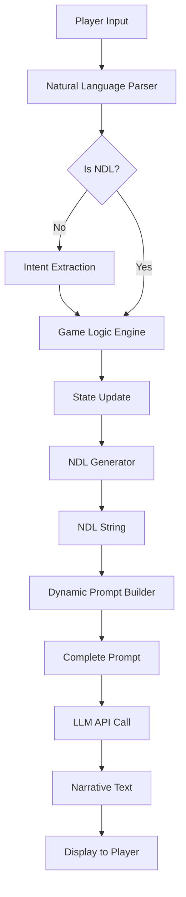

# NDL → LLM Flow

[[00-NDL-INDEX|← Back to Index]]

## Overview

This document describes how NDL (Natural Description Language) flows from game logic through to LLM-generated narrative text.

## Complete Pipeline



## Stage-by-Stage Breakdown

### Stage 1: Player Input

**Input**: Natural language from player

**Examples**:
- "I attack the goblin with my sword"
- "I search the pile of wood for a weapon"
- "I try to persuade the merchant to lower his prices"

**Processing**: Pass to natural language parser

### Stage 2: Natural Language Parsing

**Purpose**: Extract intent, entities, and actions from natural language

**Process**:
```python
def parse_input(input_text):
    # Check if already NDL
    if is_ndl(input_text):
        return {"type": "ndl", "ndl": input_text}

    # Extract components
    intent = extract_intent(input_text)  # "attack", "search", "persuade"
    entity = extract_entity(input_text)  # "player", "you"
    target = extract_target(input_text)  # "goblin", "pile of wood", "merchant"
    method = extract_method(input_text)  # "with sword", "for weapon"

    return {
        "type": "natural",
        "intent": intent,
        "entity": entity,
        "target": target,
        "method": method
    }
```

### Stage 3: Game Logic Execution

**Purpose**: Determine outcomes based on game rules

**Process**:
1. **Validate Action**: Can the entity perform this action?
2. **Check Conditions**: Are prerequisites met?
3. **Roll Dice/Calculate**: Determine success/failure
4. **Update State**: Apply consequences to game world
5. **Generate Results**: Produce outcome data

**Example**:
```python
# Player attacks goblin
result = {
    "action": "attack",
    "actor": "player",
    "target": "goblin",
    "method": "sword",
    "roll": {"type": "hit", "value": 15, "target": 12},
    "success": True,
    "damage": 8,
    "target_hp": {"before": 20, "after": 12}
}
```

### Stage 4: NDL Generation

**Purpose**: Convert game logic results into NDL

**Process**:
```python
def generate_ndl(result):
    ndl_parts = []

    # Main action
    ndl_parts.append(f'do(${result["actor"]}, "{result["action"]}")')

    # Add method/manner
    if result["method"]:
        ndl_parts.append(f'~ "{result["method"]}"')

    # Add target
    if result["target"]:
        ndl_parts.append(f'target(${result["target"]})')

    # Add roll result
    if result["roll"]:
        ndl_parts.append(f'roll("{result["roll"]["type"]}")')

    # Add outcome
    if result["success"]:
        ndl_parts.append(f'result("success")')
    else:
        ndl_parts.append(f'result("failure")')

    # Add damage if applicable
    if result.get("damage"):
        ndl_parts.append(f'damage({result["damage"]})')

    return " -> ".join(ndl_parts)
```

**Output**:
```ndl
do($"player", "attack") ~ "sword" -> target($"goblin") -> roll("hit") -> result("success") -> damage(8)
```

### Stage 5: Dynamic Prompt Building

**Purpose**: Construct complete LLM prompt with NDL and context

**Process**:
```python
def build_prompt(ndl_string, world_state):
    prompt_parts = []

    # System instruction
    prompt_parts.append("You are a narrative game master. Convert the following game events into engaging prose.")
    prompt_parts.append("")

    # Scene context
    prompt_parts.append(f"## Setting")
    prompt_parts.append(f"Location: {world_state.location.name}")
    prompt_parts.append(f"Time: {world_state.time}")
    prompt_parts.append(f"Weather: {world_state.weather}")
    prompt_parts.append("")

    # Character context
    prompt_parts.append(f"## Characters Present")
    for char in world_state.active_characters:
        prompt_parts.append(f"- {char.name}: {char.description}")
        prompt_parts.append(f"  Current state: {char.state}")
    prompt_parts.append("")

    # Previous context (recent history)
    if world_state.recent_events:
        prompt_parts.append(f"## Recent Events")
        for event in world_state.recent_events[-3:]:
            prompt_parts.append(f"- {event}")
        prompt_parts.append("")

    # NDL events to narrate
    prompt_parts.append(f"## Events to Narrate")
    prompt_parts.append(ndl_string)
    prompt_parts.append("")

    # Instructions
    prompt_parts.append(f"## Instructions")
    prompt_parts.append("Narrate these events in vivid, engaging prose. Focus on:")
    prompt_parts.append("- Sensory details (sight, sound, feeling)")
    prompt_parts.append("- Character emotions and reactions")
    prompt_parts.append("- Cause and effect")
    prompt_parts.append("- Maintain consistency with the scene")
    prompt_parts.append("")
    prompt_parts.append("Write 2-4 sentences.")

    return "\n".join(prompt_parts)
```

**Output Example**:
```
You are a narrative game master. Convert the following game events into engaging prose.

## Setting
Location: Dark Forest Clearing
Time: Dusk
Weather: Light rain

## Characters Present
- Player: A skilled warrior wielding a longsword
  Current state: Alert, weapon drawn
- Goblin: A small, hostile creature
  Current state: Wounded, aggressive

## Recent Events
- Player entered the clearing
- Goblin noticed the player
- Goblin drew rusty dagger

## Events to Narrate
do($"player", "attack") ~ "sword" -> target($"goblin") -> roll("hit") -> result("success") -> damage(8)

## Instructions
Narrate these events in vivid, engaging prose. Focus on:
- Sensory details (sight, sound, feeling)
- Character emotions and reactions
- Cause and effect
- Maintain consistency with the scene

Write 2-4 sentences.
```

### Stage 6: LLM API Call

**Purpose**: Send prompt to LLM and receive narrative

**Process**:
```python
def call_llm(prompt, config):
    response = llm_api.generate(
        prompt=prompt,
        model=config.model,  # e.g., "llama-3-8b"
        temperature=config.temperature,  # e.g., 0.7
        max_tokens=config.max_tokens,  # e.g., 150
        top_p=config.top_p,  # e.g., 0.9
    )
    return response.text
```

**Models Tested**:
- Gemma 8B/9B
- Llama 3 8B/9B

From veritasr [04:21]:
> "And this is all on 8B / 9B LLMs. Nothing that really breaks the bank hardware wise."

### Stage 7: Narrative Text Output

**Output Example**:
```
You swing your sword in a powerful arc, the blade catching the rain as it slices through the air. The goblin tries to dodge, but it's too slow. Your longsword bites deep into its shoulder, and it shrieks in pain as dark blood flows from the wound. The creature staggers backward, clutching the injury.
```

### Stage 8: Display to Player

**Final Output**: Present formatted narrative to player in game UI

## Key Design Principles

### 1. Separation of Concerns

From veritasr [04:09]:
> "All the rest of the stuff on the backend is just complex logic to make decisions and enforce the rules on the game world. NDL is the piece that glues the two systems together.. Converting from natural text into something the backend can parse, and converting data from the backend into something readable by humans."

**Responsibilities**:
- **Game Logic**: Decisions, rules, state management
- **NDL**: Event description, structured data
- **LLM**: Prose generation, style, flavor

### 2. Deterministic Before Narrative

From veritasr [04:14]:
> "The process itself isn't actually too different from how diffusion works or the old bart stuff. You provide the LLM with input and a task, then have it fill in the blanks based on what it knows."

**Order of Operations**:
1. Game logic makes ALL decisions
2. NDL describes the decided outcomes
3. LLM narrates the descriptions

This eliminates hallucinations about game state.

### 3. LLM as Autocomplete

From veritasr [04:15]:
> "once you offload the decision making to a system that's actually capable of making sane decisions the hallucinations functionally disappear."

The LLM is not a decision-maker, it's a text generator:
- **Input**: Structured events (NDL)
- **Output**: Natural language prose
- **No Decisions**: Success/failure, damage, consequences

## Dynamic Prompt Generation

From veritasr [10:30]:
> "configured the class to do dynamic prompt generation, meaning that it sort of builds my prompt up on the fly based on the actions taken."

### Context-Aware Prompts

The prompt builder adjusts based on:
- **Scene type**: Combat, dialogue, exploration
- **Character states**: Injured, afraid, confident
- **Recent history**: Previous actions and outcomes
- **World state**: Time, weather, location

### Example Variations

**Combat Scene**:
```
Focus on action and intensity. Describe:
- The clash of weapons
- Physical movements and positioning
- Sounds and impacts
- Immediate reactions
```

**Social Scene**:
```
Focus on emotion and interaction. Describe:
- Facial expressions and body language
- Tone of voice
- Subtext and intentions
- Social dynamics
```

**Exploration Scene**:
```
Focus on environment and discovery. Describe:
- Sensory details of the space
- What catches attention
- Atmosphere and mood
- Gradual revelation
```

## Bidirectional Flow

NDL supports both directions:

### Natural Language → NDL (Parsing)

```
"I attack the goblin" → do($"player", "attack") -> target($"goblin")
```

From veritasr [11:12]:
> "got conversion from input to NDL working."

### NDL → Natural Language (Generation)

```
do($"player", "attack") → "You attack the goblin fiercely."
```

## Scene Transitions

From veritasr [07:36]:
> "Transitions either occur due to a change in time, place, or both."

**Transition Types**:
```python
transition_types = {
    'time': "Time has passed",
    'place': "Location has changed",
    'both': "Time and location have changed"
}
```

**Parser Output**:
```python
{
    'end_scene': True,
    'transition_scene_type': 'both'
}
```

The prompt builder adjusts narrative style for transitions.

## Error Handling

### Invalid NDL

If NDL parsing fails:
1. Log error
2. Fall back to natural language description
3. Notify developer (not player)

### LLM Failure

If LLM call fails:
1. Retry with exponential backoff
2. Fall back to template-based description
3. Never block gameplay

### Hallucination Detection

If LLM output contradicts game state:
1. Validate against known facts
2. Regenerate with more constraints
3. Use template as last resort

## Performance Considerations

### Caching

- **Prompt Templates**: Reuse common structures
- **NDL Patterns**: Cache frequent action chains
- **LLM Responses**: Cache identical NDL strings

### Batching

For multiple simultaneous events:
```ndl
do($"player", "attack") -> damage(8) ->
do($"goblin", "counterattack") -> result("miss") ->
do($"player", "dodge") ~ "quickly"
```

Single LLM call handles entire sequence.

### Streaming

For long narratives, stream LLM output token-by-token to reduce perceived latency.

## Related Documentation

- [[game-state-to-ndl|Game State → NDL]]
- [[parsing-implementation|Parsing Implementation]]
- [[prompt-building|Dynamic Prompt Building]]
- [[02-grammar|NDL Grammar]]

---

#ndl #integration #llm #architecture #flow
