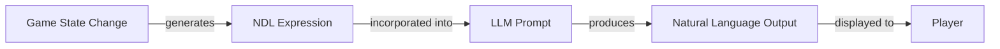

# NDL Semantics

#ndl #specification #semantics

[[00-NDL-INDEX|← Back to Index]]

## Overview

This document defines the **meaning** and **execution model** of NDL. While the grammar defines what is syntactically valid, semantics defines what valid NDL expressions actually mean and how they should be interpreted.

## Fundamental Principle

> **NDL describes outcomes that have already been determined by game logic.**

NDL is not an imperative programming language - it's a **descriptive language** that tells the LLM what to narrate, not what to execute.

## Execution Model

### Flow Architecture



### Key Insight
NDL acts as a **bridge**, not a runtime:
- Game engine makes decisions
- Game engine generates NDL
- NDL describes what happened
- LLM converts NDL to prose

## Statement Semantics

### Action Statement: `do(verb)`

**Meaning**: Instructs the LLM to narrate that a specific action occurred.

```ndl
do(walk)
```

**Interpretation**:
- The entity walked (past tense)
- How, why, and other details determined by modifiers
- LLM chooses natural phrasing

**Example Output**:
- "The character walks forward."
- "She strolls casually."
- "He moves ahead."

### Wait Statement: `wait(duration)`

**Meaning**: Indicates a temporal pause or gap in the narrative.

```ndl
wait(1s)
```

**Interpretation**:
- Time passes
- No action occurs during this period
- Creates dramatic timing

**Example Output**:
- "After a moment..."
- "There is a brief pause."
- "A tense second passes."

## Modifier Semantics

### Manner Modifier: `~ manner`

**Meaning**: Specifies **how** the action was performed.

```ndl
do(walk) ~ slowly
```

**Interpretation**:
- The action happened
- It was performed in the specified manner
- LLM must incorporate this into narration

**Example Output**:
- "The character walks slowly."
- "She moves at a leisurely pace."
- "He trudges forward."

### Property: `name="value"`

**Meaning**: Provides contextual information about the action.

```ndl
do(speak) text="Hello there"
```

**Interpretation**:
- The action includes this attribute
- Must be reflected in output
- Exact handling depends on property type

**Common Properties**:
- `text="..."` - Literal content to include
- `intention="..."` - Purpose behind action
- `target="..."` - Object of action
- `emotion="..."` - Emotional state

## Sequence Semantics

### Sequence Operator: `->`

**Meaning**: Temporal ordering of events.

```ndl
action1 -> action2 -> action3
```

**Interpretation**:
- Events occur in order (left to right)
- Each completes before next begins
- Temporal gaps can exist between actions

**Example**:
```ndl
do(draw_sword) -> do(attack) -> do(sheathe_sword)
```

**Output**:
"The warrior draws his sword, swings it in a mighty arc, then sheathes it once more."

### Sequencing Properties

1. **Ordering**: Strictly left-to-right
2. **Completion**: Each action finishes before next starts
3. **Continuity**: Implicit temporal connection
4. **Atomicity**: Each action is a complete unit

## Composition Semantics

### Multiple Modifiers

```ndl
do(speak) ~ nervously text="I didn't mean to" emotion="fear"
```

**Interpretation**:
- Action: speak
- Manner: nervously
- Content: "I didn't mean to"
- Context: fearful emotional state

All modifiers constrain the LLM's narration simultaneously.

### Complex Sequences

```ndl
do(attack) ~ fiercely intention="intimidate" ->
  wait(1s) ->
  do(speak) ~ menacingly text="Stay down"
```

**Interpretation**:
1. Character attacks with fierce manner, intending to intimidate
2. Brief pause for dramatic effect
3. Character speaks menacingly with specific text

**Example Output**:
"With fierce determination, the warrior swings their blade in a clearly intimidating display. After a tense moment, they speak menacingly: 'Stay down.'"

## Type Semantics

### Action Names
- **Domain**: Game-specific verbs
- **Interpretation**: Physical or abstract actions
- **Examples**: `walk`, `attack`, `speak`, `observe`, `think`

### Manner Values
- **Domain**: Adverbs or adverbial phrases
- **Interpretation**: Qualities of action execution
- **Examples**: `slowly`, `carefully`, `with_determination`, `nervously`

### String Values
- **Domain**: Arbitrary text
- **Interpretation**: Literal content for LLM to incorporate
- **Usage**: Dialogue, descriptions, names

### Duration Values
- **Domain**: Time measurements
- **Interpretation**: Narrative pause length
- **Precision**: Guidance, not exact timing

## Constraint Semantics

NDL provides **constraints** to the LLM:

### Hard Constraints
Must appear in output:
- Specific text (`text="..."`)
- Action occurrence (`do(...)`)
- Sequence order (`->`)

### Soft Constraints
Should influence output:
- Manner (`~ slowly`)
- Intention (`intention="intimidate"`)
- Emotion (`emotion="fear"`)

### LLM Freedom
LLM chooses:
- Exact phrasing
- Sentence structure
- Additional descriptive details
- Stylistic elements

## Temporal Semantics

### Tense
NDL describes past events (from LLM perspective):
- Events already occurred
- LLM narrates in past or present tense
- Consistent with narrative style

### Duration
```ndl
wait(1s)
```
- Not literal 1-second pause in reading
- Represents in-world time passage
- LLM conveys duration narratively

### Simultaneity
No explicit parallelism in base NDL:
```ndl
# Sequential (supported)
do(draw_sword) -> do(attack)

# Simultaneous (not in base spec)
do(speak) & do(gesture)  # NOT standard NDL
```

## Determinism vs. Creativity

### Deterministic Elements
Fixed by NDL:
- Which actions occurred
- Order of actions
- Specific text to include
- Key modifiers (manner, intention)

### Creative Elements
LLM decides:
- Prose style and vocabulary
- Descriptive embellishments
- Transitions between actions
- Atmospheric details

**Example**:
```ndl
do(enter) location="tavern" ~ cautiously
```

**Deterministic**: Entered tavern, did so cautiously
**Creative**: "The figure pushed open the heavy wooden door and stepped carefully into the dimly lit tavern, eyes scanning for threats."

## Error Semantics

### Invalid NDL
If NDL is malformed:
- Parser should catch syntax errors
- Game logic error, not runtime error
- Should never reach LLM

### Semantic Violations
If NDL is contradictory:
```ndl
# Potentially problematic
do(speak) text="hello" text="goodbye"
```

**Resolution**:
- Implementation-defined
- Last value wins (recommended)
- Or error during NDL generation

## Scope and Context

### Implicit Context
NDL assumes context from:
- Previous narrative
- Game state
- Character information
- Scene setting

### Explicit Context
Provided via properties:
```ndl
do(attack) target="goblin" weapon="sword" damage=15
```

### Context Layering
System prompt provides:
- World information
- Character details
- Narrative style

NDL provides:
- Current action details
- Immediate context
- Specific constraints

## Design Rationale

### Why Descriptive Not Imperative?
- Eliminates LLM decision-making
- Prevents hallucinations
- Clear separation of concerns

### Why Constrain LLM?
- Ensures accuracy
- Maintains consistency
- Preserves game logic

### Why Allow Creativity?
- Natural language output
- Engaging narratives
- Varied expression

## Interpretation Guidelines

### For Implementers
1. Generate NDL from determined game state
2. Include all necessary context
3. Be specific but not over-constraining
4. Trust LLM for prose quality

### For LLM Prompt Design
1. Explain NDL format in system prompt
2. Show examples of NDL → output
3. Emphasize respecting constraints
4. Encourage natural language

### For Parsers
1. Validate syntax strictly
2. Preserve all information
3. Structure for easy prompt inclusion
4. Report errors clearly

## Related

- [[01-lexical-elements]] - Tokens and operators
- [[02-grammar]] - Syntactic structure
- [[ndl-to-llm-flow]] - How NDL becomes prompts
- [[game-state-to-ndl]] - Generating NDL

---

*Synthesized from Discord discussions by [[User-veritasr]] and community members.*
