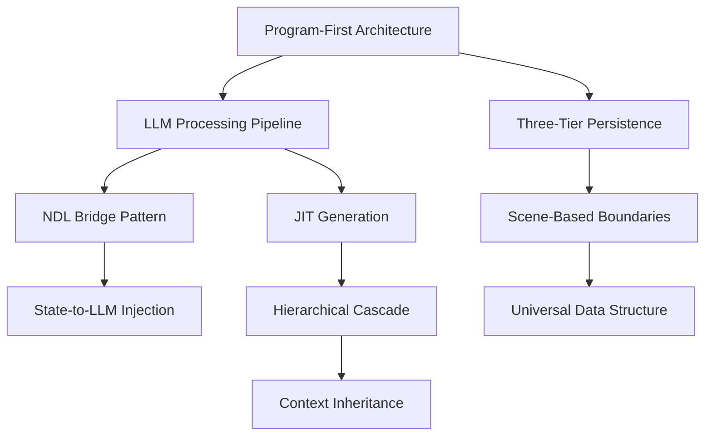

# Pattern Library Index

This directory contains extracted architectural patterns, implementation examples, and design templates from the LLM World Engine Discord discussions.

## Pattern Categories

### Architectural Patterns
High-level system structure and design decisions for LLM-powered game engines.

- [[architectural/program-first-architecture|Program-First Architecture]] ✅ - Backend makes decisions, LLM narrates
- [[architectural/llm-processing-pipeline|LLM Processing Pipeline]] ✅ - Pre/Gen/Post processing phases
- [[architectural/separation-of-concerns|Separation of Concerns]] ✅ - Logic/Narrative/Data layer split
- [[architectural/event-driven-design|Event-Driven Design]] ✅ - Trigger-based game events

### Integration Patterns
How components communicate and interact.

- [[integration/ndl-bridge|NDL Bridge Pattern]] ✅ - Converting game events to natural language
- [[integration/state-to-llm-injection|State-to-LLM Injection]] ✅ - Feeding game state into prompts
- [[integration/api-abstraction-layer|API Abstraction Layer]] ✅ - JSON APIs for LLM-state interaction
- [[integration/multi-model-routing|Multi-Model Routing]] ✅ - Different models for different tasks

### State Patterns
How game state is managed and persisted.

- [[state/three-tier-persistence|Three-Tier Persistence]] ✅ - World/Playthrough/Session state
- [[state/scene-based-boundaries|Scene-Based State Boundaries]] ✅ - Scenes as save/load points
- [[state/conditional-persistence|Conditional Persistence]] ✅ - When to save vs discard
- [[state/universal-data-structure|Universal Data Structure]] - Single entity schema for all types (placeholder)

### Generation Patterns
How content is procedurally created.

- [[generation/jit-generation|Just-In-Time Generation]] ✅ - Generate content on-demand
- [[generation/hierarchical-cascade|Hierarchical Cascade]] ✅ - Top-down vs bottom-up world generation
- [[generation/template-meta-generation|Template Meta-Generation]] ✅ - Using LLMs to create templates
- [[generation/context-inheritance|Context Inheritance]] - Child elements inherit parent properties (placeholder)

### Control Patterns
How LLM behavior is constrained and directed.

- [[control/constraint-based-prompting|Constraint-Based Prompting]] ✅ - Tell LLM what it can't do
- [[control/chain-of-thought|Chain of Thought]] ✅ - Force reasoning before output with function keywords
- [[control/temperature-switching|Dynamic Temperature Switching]] ✅ - Adjust creativity per task
- [[control/few-shot-formatting|Few-Shot Formatting]] ✅ - Guide output structure with examples

## Usage

Each pattern file contains:
- **Context**: When to use this pattern
- **Forces**: Trade-offs and competing concerns
- **Solution**: Structure and implementation
- **Consequences**: Benefits and liabilities
- **Source**: Original discussions and contributors

## Pattern Relationships

## Key Insights

1. **LLMs are terrible at decision-making** - Keep logic programmatic
2. **State and story are interleaved** in LLM games (unlike traditional games)
3. **Templates solve the content problem** - Structured generation beats free-form
4. **Small models work fine** when decisions are pre-made (8B-9B sufficient)
5. **Scenes are natural boundaries** for state management
6. **Visual programming is achievable** with proper UI patterns

## Related Documentation

- [[01-Architecture-and-Design|Architecture Analysis]]
- [[05-State-Management|State Management Analysis]]
- [[08-NDL-Natural-Description-Language|NDL Documentation]]

## Tags

#pattern #architecture #game-engine #llm #design-patterns
