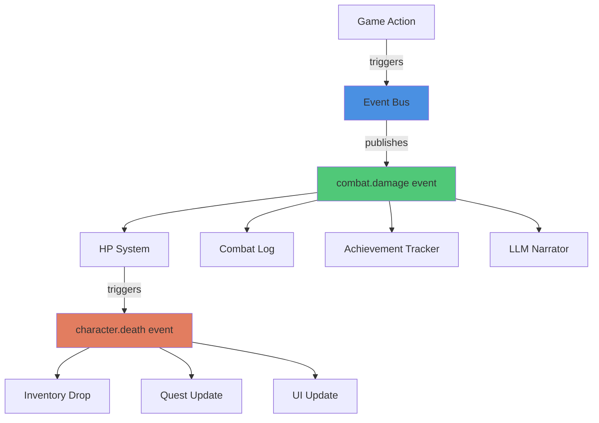

# Pattern: Event-Driven Design

#pattern #architectural #events #reactive

## Context

Traditional game loops poll for state changes. In LLM-powered games, interesting moments happen unpredictably (combat, discovery, NPC reactions). Event-driven architecture lets components react to game events without tight coupling.

**Use this pattern when:**
- Building systems with many independent components
- Need to trigger multiple effects from single action (combat damage → HP change → death check → loot drop)
- Want extensible game mechanics without modifying core code
- Integrating LLM narration asynchronously

## Forces

- **Coupling vs Extensibility**: Direct calls couple components; events decouple them
- **Performance vs Flexibility**: Event overhead vs clean architecture
- **Debugging**: Event chains harder to trace than direct calls
- **Order Dependencies**: Some events must fire in specific order

## Solution

### Structure



### Core Components

#### 1. Event Definition

```python
from dataclasses import dataclass
from typing import Any, Dict
from datetime import datetime

@dataclass
class GameEvent:
    """Base event type"""
    event_type: str
    timestamp: datetime
    source: str
    data: Dict[str, Any]

# Specific event types
@dataclass
class CombatDamageEvent(GameEvent):
    attacker_id: str
    target_id: str
    damage: int
    weapon_id: str
    was_critical: bool

@dataclass
class CharacterDeathEvent(GameEvent):
    character_id: str
    killer_id: str
    location: str

@dataclass
class ItemPickupEvent(GameEvent):
    character_id: str
    item_id: str
    location: str

@dataclass
class DialogueStartEvent(GameEvent):
    player_id: str
    npc_id: str
    topic: str
```

#### 2. Event Bus

```python
from typing import Callable, List, Dict
from collections import defaultdict

class EventBus:
    """Central event dispatcher"""

    def __init__(self):
        # Map event types to handler lists
        self._handlers: Dict[str, List[Callable]] = defaultdict(list)
        # Priority handlers fire first
        self._priority_handlers: Dict[str, List[Callable]] = defaultdict(list)

    def subscribe(self, event_type: str, handler: Callable, priority: bool = False):
        """Register handler for event type"""
        if priority:
            self._priority_handlers[event_type].append(handler)
        else:
            self._handlers[event_type].append(handler)

    def publish(self, event: GameEvent):
        """Dispatch event to all handlers"""
        event_type = event.event_type

        # Fire priority handlers first (e.g., state updates)
        for handler in self._priority_handlers[event_type]:
            handler(event)

        # Then fire normal handlers (e.g., narration, logging)
        for handler in self._handlers[event_type]:
            handler(event)

    def publish_async(self, event: GameEvent):
        """Non-blocking event dispatch"""
        import asyncio
        asyncio.create_task(self._async_dispatch(event))

    async def _async_dispatch(self, event: GameEvent):
        """Async handler execution"""
        event_type = event.event_type
        tasks = []

        for handler in self._handlers[event_type]:
            if asyncio.iscoroutinefunction(handler):
                tasks.append(handler(event))
            else:
                tasks.append(asyncio.to_thread(handler, event))

        await asyncio.gather(*tasks)


# Global event bus
event_bus = EventBus()
```

#### 3. Event Publishers (Systems)

```python
class CombatSystem:
    """Publishes combat events"""

    def __init__(self, event_bus: EventBus):
        self.event_bus = event_bus

    def resolve_attack(self, attacker_id: str, target_id: str, weapon_id: str):
        """Execute attack and publish events"""
        # Calculate damage
        damage = self._calculate_damage(attacker_id, weapon_id)
        is_crit = self._check_critical()

        # Publish damage event
        event = CombatDamageEvent(
            event_type="combat.damage",
            timestamp=datetime.now(),
            source="combat_system",
            data={},
            attacker_id=attacker_id,
            target_id=target_id,
            damage=damage,
            weapon_id=weapon_id,
            was_critical=is_crit
        )
        self.event_bus.publish(event)

        # Event handlers will update HP, check death, etc.


class InventorySystem:
    """Publishes inventory events"""

    def __init__(self, event_bus: EventBus):
        self.event_bus = event_bus

    def pickup_item(self, character_id: str, item_id: str, location: str):
        """Pick up item and publish event"""
        # Update inventory
        self._add_to_inventory(character_id, item_id)

        # Publish event
        event = ItemPickupEvent(
            event_type="inventory.pickup",
            timestamp=datetime.now(),
            source="inventory_system",
            data={},
            character_id=character_id,
            item_id=item_id,
            location=location
        )
        self.event_bus.publish(event)
```

#### 4. Event Subscribers (Handlers)

```python
class HPSystem:
    """Subscribes to damage events"""

    def __init__(self, event_bus: EventBus):
        self.event_bus = event_bus
        # Subscribe with priority (state must update first)
        event_bus.subscribe("combat.damage", self.on_damage, priority=True)

    def on_damage(self, event: CombatDamageEvent):
        """Handle damage event"""
        target_id = event.target_id
        damage = event.damage

        # Update HP
        new_hp = self._reduce_hp(target_id, damage)

        # Check for death
        if new_hp <= 0:
            death_event = CharacterDeathEvent(
                event_type="character.death",
                timestamp=datetime.now(),
                source="hp_system",
                data={},
                character_id=target_id,
                killer_id=event.attacker_id,
                location=self._get_location(target_id)
            )
            self.event_bus.publish(death_event)


class CombatLogger:
    """Subscribes to combat events for logging"""

    def __init__(self, event_bus: EventBus):
        event_bus.subscribe("combat.damage", self.log_damage)
        event_bus.subscribe("character.death", self.log_death)

    def log_damage(self, event: CombatDamageEvent):
        """Log damage to file"""
        print(f"LOG: {event.attacker_id} dealt {event.damage} damage to {event.target_id}")

    def log_death(self, event: CharacterDeathEvent):
        """Log death to file"""
        print(f"LOG: {event.character_id} was killed by {event.killer_id}")


class LLMNarrationSystem:
    """Subscribes to events for async narration"""

    def __init__(self, event_bus: EventBus, llm_client):
        self.llm = llm_client
        # Non-priority - narration happens after state updates
        event_bus.subscribe("combat.damage", self.narrate_combat)
        event_bus.subscribe("character.death", self.narrate_death)

    async def narrate_combat(self, event: CombatDamageEvent):
        """Generate narrative for combat"""
        prompt = f"""Describe: {event.attacker_id} attacks {event.target_id} with {event.weapon_id}, dealing {event.damage} damage."""
        narrative = await self.llm.complete_async(prompt)
        # Send to UI
        ui.display_narrative(narrative)

    async def narrate_death(self, event: CharacterDeathEvent):
        """Generate narrative for death"""
        prompt = f"""Describe the death of {event.character_id} at the hands of {event.killer_id}."""
        narrative = await self.llm.complete_async(prompt)
        ui.display_narrative(narrative)


class QuestSystem:
    """Subscribes to game events for quest triggers"""

    def __init__(self, event_bus: EventBus):
        event_bus.subscribe("character.death", self.check_quest_objectives)
        event_bus.subscribe("inventory.pickup", self.check_quest_objectives)

    def check_quest_objectives(self, event: GameEvent):
        """Check if event completes quest"""
        if event.event_type == "character.death":
            self._check_kill_quests(event.character_id)
        elif event.event_type == "inventory.pickup":
            self._check_collection_quests(event.item_id)
```

### Complete Example

```python
# Initialize systems
event_bus = EventBus()

combat_system = CombatSystem(event_bus)
hp_system = HPSystem(event_bus)
logger = CombatLogger(event_bus)
narrator = LLMNarrationSystem(event_bus, llm_client)
quest_system = QuestSystem(event_bus)

# Execute action
combat_system.resolve_attack(
    attacker_id="player",
    target_id="goblin_1",
    weapon_id="iron_sword"
)

# Event chain fires automatically:
# 1. combat.damage event published
# 2. HPSystem reduces goblin HP (priority)
# 3. HPSystem publishes character.death (goblin died)
# 4. CombatLogger logs damage
# 5. QuestSystem checks if this was quest target
# 6. LLMNarrationSystem generates description (async)
# 7. character.death triggers:
#    - Inventory drop
#    - Quest completion check
#    - Death narration
```

## Consequences

### Benefits

1. **Loose Coupling**: Systems don't know about each other
2. **Extensibility**: Add new handlers without modifying existing code
3. **Async Processing**: LLM narration doesn't block game logic
4. **Clear Causality**: Events show what triggered what
5. **Easy Testing**: Mock event bus for unit tests

### Liabilities

1. **Debugging Difficulty**: Event chains hard to trace
2. **Performance Overhead**: Event dispatch adds cost
3. **Order Complexity**: Managing handler priority tricky
4. **Hidden Dependencies**: Event subscriptions not obvious

### Related Patterns

- [[architectural/program-first-architecture|Program-First Architecture]] - Events contain deterministic outcomes
- [[integration/ndl-bridge|NDL Bridge Pattern]] - Events formatted as NDL
- [[state/scene-based-boundaries|Scene-Based Boundaries]] - Events scoped to scenes

## Source

**Original Discussions:**
- Architecture thread discussions on reactive systems
- Contributors: [[User-vali98]], [[User-irovos]]

**Key Insight:**
- LLM narration naturally fits event-driven model (async, non-blocking)

**Referenced in:**
- [[01-Architecture-and-Design|Architecture and Design Thread]]

## Tags

#events #reactive #architecture #async #decoupling
