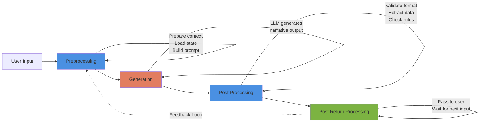

# Pattern: LLM Processing Pipeline

## Context

LLM-powered games require careful orchestration of when and how the LLM is invoked. Simply sending raw input to an LLM and displaying output leads to unreliable, inconsistent gameplay. A structured pipeline separates concerns and maintains control.

**Use this pattern when:**
- Building any LLM-integrated game system
- Need to inject game state into LLM context
- Want to validate LLM outputs before using them
- Require feedback loops for content refinement

## Forces

**Competing concerns:**

1. **Context Preparation vs Simplicity**
   - Rich context improves output quality
   - Complex preprocessing slows development

2. **Validation vs Flexibility**
   - Strict output validation prevents errors
   - Too strict limits LLM creativity

3. **Synchronous vs Asynchronous**
   - Synchronous is simpler to implement
   - Asynchronous doesn't block gameplay

4. **Single-Pass vs Multi-Pass**
   - Single-pass is faster and cheaper
   - Multi-pass allows refinement and validation

## Solution

### Structure



**Diagram Credit:** veritasr (Feb 2024)

### Phases

#### 1. Preprocessing Phase

**Responsibilities:**
- Parse user input to extract intent
- Load current game state from database
- Retrieve relevant context (lorebooks, NPC data, location info)
- Build structured prompt for LLM
- Apply any pre-generation filters

**Output:** Complete, context-rich prompt ready for LLM

#### 2. Generation Phase

**Responsibilities:**
- Send prepared prompt to LLM
- Handle API calls, retries, errors
- Monitor token usage
- Apply sampling parameters (temperature, top-p, etc.)

**Output:** Raw LLM-generated text

#### 3. Post Processing Phase

**Responsibilities:**
- Validate output format
- Extract structured data (if using function calling or NDL)
- Check for rule violations
- Apply content filters
- Reject/reroll if output is invalid

**Output:** Validated, formatted narrative text

#### 4. Post Return Processing Phase

**Responsibilities:**
- Display output to user
- Wait for next user input
- Optionally trigger background processing
- Feed output back into preprocessing for next turn (feedback loop)

**Output:** Response delivered to user

### Implementation

#### Python Example - Complete Pipeline

```python
from typing import Dict, Any, Optional, List
from dataclasses import dataclass
import json

@dataclass
class GameContext:
    """Context bundle for LLM"""
    location: str
    location_description: str
    npcs_present: List[str]
    player_state: Dict[str, Any]
    recent_events: List[str]
    active_quests: List[str]

@dataclass
class ProcessedInput:
    """Result of preprocessing"""
    original_input: str
    parsed_intent: str
    context: GameContext
    prompt: str

@dataclass
class GenerationResult:
    """Raw LLM output"""
    text: str
    model_used: str
    tokens_used: int
    temperature: float

@dataclass
class ValidatedOutput:
    """Post-processed result"""
    narrative: str
    extracted_data: Dict[str, Any]
    valid: bool
    errors: List[str]


class PreprocessingEngine:
    """Phase 1: Prepare context and prompt"""

    def __init__(self, state_manager, context_loader):
        self.state = state_manager
        self.context = context_loader

    def preprocess(self, user_input: str) -> ProcessedInput:
        """Prepare everything needed for generation"""
        # 1. Parse user input
        intent = self._parse_intent(user_input)

        # 2. Load current game state
        player_state = self.state.get_player_state()
        location = player_state["location"]

        # 3. Retrieve context
        context = self._build_context(location, player_state)

        # 4. Build prompt
        prompt = self._build_prompt(user_input, intent, context)

        return ProcessedInput(
            original_input=user_input,
            parsed_intent=intent,
            context=context,
            prompt=prompt
        )

    def _parse_intent(self, user_input: str) -> str:
        """Extract player intent"""
        # Could use lightweight LLM or regex
        # For now, simplified
        return user_input.lower()

    def _build_context(self, location: str, player_state: Dict) -> GameContext:
        """Load all relevant context"""
        return GameContext(
            location=location,
            location_description=self.context.get_location_description(location),
            npcs_present=self.context.get_npcs_in_location(location),
            player_state=player_state,
            recent_events=self.state.get_recent_events(limit=5),
            active_quests=self.state.get_active_quests()
        )

    def _build_prompt(self, user_input: str, intent: str, context: GameContext) -> str:
        """Construct complete prompt"""
        prompt_parts = [
            "You are a game narrator. Describe the following scene and respond to the player's action.",
            "",
            f"Location: {context.location}",
            f"Description: {context.location_description}",
            "",
            "NPCs Present:",
            *[f"- {npc}" for npc in context.npcs_present],
            "",
            f"Player HP: {context.player_state.get('hp', 100)}",
            f"Player Status: {context.player_state.get('status', 'normal')}",
            "",
            "Recent Events:",
            *[f"- {event}" for event in context.recent_events],
            "",
            f"Player Action: {user_input}",
            "",
            "Narrate what happens next (2-3 sentences):"
        ]

        return "\n".join(prompt_parts)


class GenerationEngine:
    """Phase 2: Call LLM"""

    def __init__(self, llm_client):
        self.client = llm_client

    def generate(self, processed_input: ProcessedInput, temperature: float = 0.7) -> GenerationResult:
        """Generate narrative from LLM"""
        try:
            response = self.client.complete(
                prompt=processed_input.prompt,
                temperature=temperature,
                max_tokens=150
            )

            return GenerationResult(
                text=response.text,
                model_used=response.model,
                tokens_used=response.tokens,
                temperature=temperature
            )
        except Exception as e:
            # Fallback on error
            return GenerationResult(
                text="[The scene continues...]",
                model_used="fallback",
                tokens_used=0,
                temperature=temperature
            )


class PostProcessingEngine:
    """Phase 3: Validate and extract data"""

    def __init__(self, validator):
        self.validator = validator

    def postprocess(self, generation: GenerationResult) -> ValidatedOutput:
        """Validate and clean output"""
        errors = []

        # 1. Check for format issues
        if not generation.text.strip():
            errors.append("Empty output")

        # 2. Check for rule violations
        if self._contains_prohibited_content(generation.text):
            errors.append("Contains prohibited content")

        # 3. Extract structured data (if any)
        extracted = self._extract_structured_data(generation.text)

        # 4. Validate against game rules
        if not self.validator.validate(generation.text, extracted):
            errors.append("Validation failed")

        return ValidatedOutput(
            narrative=generation.text.strip(),
            extracted_data=extracted,
            valid=len(errors) == 0,
            errors=errors
        )

    def _contains_prohibited_content(self, text: str) -> bool:
        """Check for rule violations"""
        # Example: check for impossible actions
        prohibited = ["teleport", "diamond horse", "suddenly you have"]
        return any(term in text.lower() for term in prohibited)

    def _extract_structured_data(self, text: str) -> Dict[str, Any]:
        """Extract any structured data from output"""
        # If using NDL or function calling, parse here
        # For now, simplified
        return {}


class PostReturnProcessor:
    """Phase 4: Deliver to user and prepare for next turn"""

    def __init__(self, state_manager):
        self.state = state_manager

    def finalize(self, validated: ValidatedOutput, context: GameContext) -> str:
        """Deliver output and update for next turn"""
        if not validated.valid:
            # Handle invalid output
            return self._handle_invalid(validated)

        # 1. Store in history for next turn
        self.state.add_to_history(validated.narrative)

        # 2. Apply any extracted state changes
        if validated.extracted_data:
            self.state.apply_changes(validated.extracted_data)

        # 3. Return to user
        return validated.narrative

    def _handle_invalid(self, validated: ValidatedOutput) -> str:
        """Handle validation failures"""
        # Could trigger reroll, use fallback, etc.
        return "Something went wrong. Please try again."


class LLMProcessingPipeline:
    """Orchestrates all four phases"""

    def __init__(self, state_manager, context_loader, llm_client, validator):
        self.preprocessing = PreprocessingEngine(state_manager, context_loader)
        self.generation = GenerationEngine(llm_client)
        self.postprocessing = PostProcessingEngine(validator)
        self.post_return = PostReturnProcessor(state_manager)

    def process(self, user_input: str) -> str:
        """Execute complete pipeline"""
        # Phase 1: Preprocess
        processed = self.preprocessing.preprocess(user_input)

        # Phase 2: Generate
        generation = self.generation.generate(processed, temperature=0.7)

        # Phase 3: Post-process
        validated = self.postprocessing.postprocess(generation)

        # Phase 4: Finalize and return
        output = self.post_return.finalize(validated, processed.context)

        return output


# Usage Example
if __name__ == "__main__":
    # Mock components
    class MockStateManager:
        def get_player_state(self):
            return {"location": "tavern", "hp": 85, "status": "wounded"}

        def get_recent_events(self, limit):
            return ["Entered tavern", "Spoke to bartender"]

        def get_active_quests(self):
            return ["Find the missing sword"]

        def add_to_history(self, text):
            pass

        def apply_changes(self, changes):
            pass

    class MockContextLoader:
        def get_location_description(self, location):
            return "A dimly lit tavern with wooden tables and a roaring fireplace."

        def get_npcs_in_location(self, location):
            return ["Bartender", "Old Man"]

    class MockLLMClient:
        def complete(self, prompt, temperature, max_tokens):
            class Response:
                text = "You approach the bartender and ask about the sword. He glances around nervously before leaning in close."
                model = "mock-model"
                tokens = 25
            return Response()

    class MockValidator:
        def validate(self, text, extracted):
            return True

    # Initialize pipeline
    pipeline = LLMProcessingPipeline(
        state_manager=MockStateManager(),
        context_loader=MockContextLoader(),
        llm_client=MockLLMClient(),
        validator=MockValidator()
    )

    # Process user input
    output = pipeline.process("I ask the bartender about the missing sword")
    print(output)
```

## Consequences

### Benefits

1. **Separation of Concerns**: Each phase has a clear responsibility
2. **Debuggability**: Can inspect state between phases
3. **Validation**: Post-processing catches bad outputs
4. **Flexibility**: Can swap implementations per phase
5. **Context Control**: Preprocessing ensures relevant context
6. **Feedback Loop**: Output from one turn informs next turn

### Liabilities

1. **Complexity**: Four phases to maintain
2. **Latency**: Each phase adds overhead
3. **Error Handling**: Must handle failures at each phase
4. **State Management**: Passing data between phases

### Variations

**Simplified Two-Phase:**
```
Preprocessing → Generation (no post-processing)
```
- Faster but less reliable
- Suitable for trusted models

**Multi-Pass Refinement:**
```
Preprocessing → Generation → Validation → Re-generation (if invalid)
```
- Higher quality but more expensive
- Suitable for critical content

### Related Patterns

- [[architectural/program-first-architecture|Program-First Architecture]] - This pipeline fits into that architecture
- [[integration/state-to-llm-injection|State-to-LLM Injection]] - Happens in preprocessing
- [[control/constraint-based-prompting|Constraint-Based Prompting]] - Applied in preprocessing

## Source

**Original Discussion:**
- February 2024
- Contributor: [[User-veritasr]]

**Diagram Reference:**
- Media/LLM_Processing_Phases-39904.png

**Key Insight:**

> "Backend processes input and runs logic deciding the result. Then it dynamically generates the NDL prompt, passing in the action chain to the LLM for processing. The end result is what you see here. Basically narrative text." - veritasr

**Referenced in:**
- [[01-Architecture-and-Design|Architecture and Design Thread]]

## Implementation in ChatBotRPG

**Status**: ✅ **EXACT MATCH** - Clear three-phase pipeline in character inference system

**Source Files**:
- `src/core/character_inference.py` (lines 200-700) - Complete pipeline implementation
- `src/core/make_inference.py` (lines 79-231) - Generation phase with automatic summarization

### Production Pipeline Implementation

**File**: `src/core/character_inference.py`

#### Phase 1: Preprocessing (Lines 200-521)

```python
def _run_single_character_turn(...):
    # PRE-PROCESSING PHASE: Build context from game state

    # 1. Build character context (character sheet)
    context = self._build_character_context(character_name)

    # 2. Add location description
    context.append({"role": "system", "content": setting_description})

    # 3. Add relationship context
    context.extend(self._get_relationship_context(character_name))

    # 4. Add conversation history (filtered by visibility)
    context.extend(self._filter_conversation_history_by_visibility(...))

    # 5. Apply rules (inject prompts based on conditions)
    context = self._apply_rules_to_context(context, "before_send")
```

**What Happens**:
- Character sheet injected (name, description, personality, appearance)
- Location description added
- Relationship states loaded
- Conversation history filtered by scene/visibility
- Rule-based prompts injected (e.g., "time of day is midnight" → inject "You hear church bells")

#### Phase 2: Generation (Line 523)

```python
    # GENERATION PHASE: Call LLM with prepared context
    response = make_inference(
        context=context,
        user_message=user_message,
        character_name=character_name,
        url_type=get_default_model(),
        max_tokens=2048,
        temperature=0.3
    )
```

**What Happens**:
- Complete context sent to LLM
- LLM generates character response
- Automatic summarization retry if context too long (see below)

#### Phase 3: Post-Processing (Lines 687-763)

```python
    # POST-PROCESSING PHASE: Validate and apply effects

    # 6. Remove <think> tags
    response = re.sub(r'<think>[\s\S]*?</think>', '', response)

    # 7. Apply post-receive rules
    response = self._apply_rules_to_response(response, "after_receive")

    # 8. Check for duplicate responses
    if self._is_duplicate_response(response):
        response = self._retry_with_fallback_model(...)

    # 9. Save to conversation history
    self._save_message_to_history(response, character_name, scene_number)

    return response
```

**What Happens**:
- Strip internal reasoning tags (`<think>`)
- Apply post-generation rules (e.g., variable updates based on response)
- Duplicate detection (if NPC repeats exact previous response)
- Fallback retry with different models if response invalid
- Persist to conversation history

### Automatic Summarization (Generation Phase Extension)

**File**: `src/core/make_inference.py` (lines 128-223)

When "maximum context length exceeded" error occurs:

```python
# PREPROCESSING (Context Reduction):
# 1. Split messages into setup/conversational/trailing
# 2. Keep setup and trailing, summarize conversational middle

# GENERATION (Summary Creation):
summary1 = _internal_summarize_chunk(first_half_text, summary1_instruction)
summary2 = _internal_summarize_chunk(second_half_text, summary2_instruction)
full_conversation_summary = f"{summary1}\n\n{summary2}"

# POST-PROCESSING (Context Reconstruction):
new_messages_for_retry = []
new_messages_for_retry.extend(leading_setup_messages)
new_messages_for_retry.append({"role": "user", "content": f"Summarized history:\n{full_conversation_summary}"})
new_messages_for_retry.extend(trailing_system_messages)

# GENERATION (Retry):
final_response = requests.post(base_url, headers=headers, json=final_data, timeout=180)
```

**Result**: Two-phase summarization + retry happens transparently inside Generation phase.

### Feedback Loop (Phase 4)

**File**: `src/core/character_inference.py` (lines 1073-1081)

```python
# POST RETURN PROCESSING: Feed response back for next turn

save_npc_message_obj = {
    "role": "assistant",
    "content": msg,
    "scene": current_scene_for_npc,
    "metadata": {
        "character": actor_name,
        "game_datetime": variables.get('datetime')  # Feedback: current game state timestamp
    }
}
```

**Feedback Loop**:
1. Response saved to conversation history
2. Next preprocessing phase reads this response as context
3. Maintains conversational continuity

### Validation from Production

**From**: [[chatbotrpg-analysis/validation/01-Discord-Claims-Validation|Discord Claims Validation]] (lines 100-123)

```
Status: ✅ VALIDATED

Evidence:
- Pre-processing: Character data injection, scene context, memory assembly
  (character_inference.py lines 264-521)
- Generation: LLM inference calls (make_inference.py entire file)
- Post-processing: Response validation, effects application
  (character_inference.py lines 687-763)

Conclusion: ✅ EXACT MATCH - Clear three-phase pipeline
```

### Performance Metrics

**From Production Analysis**:
- **Preprocessing**: 10-50ms (context assembly)
- **Generation**: 1,000-30,000ms (LLM API call)
- **Post-processing**: 5-20ms (validation, rules)
- **Total**: ~1-30 seconds per character turn

### Related Implementation Files

- [[chatbotrpg-analysis/patterns/01-Pattern-to-Code-Mapping|Pattern-to-Code Mapping]] - Pipeline validation (lines 99-151)
- [[chatbotrpg-analysis/architecture/01-API-Integration-Complete|API Integration]] - Generation phase deep dive

## Tags

#architecture #pattern #pipeline #preprocessing #postprocessing #llm #workflow #chatbotrpg-validated
