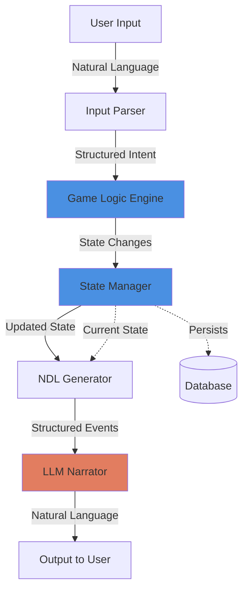

# Pattern: Program-First Architecture

## Context

When building LLM-powered game engines, developers face a fundamental choice: should the LLM drive the game logic, or should programmatic code drive logic while the LLM provides narration?

**Use this pattern when:**
- Building games that require consistent rules and state
- Working with smaller LLMs (7B-9B parameters) that hallucinate
- Need deterministic outcomes for player actions
- Want to support save/load functionality reliably

## Forces

**Competing concerns that led to this design:**

1. **Reliability vs Creativity**
   - LLMs are creative but inconsistent
   - Programmatic code is reliable but rigid

2. **Cost vs Quality**
   - Larger LLMs (GPT-4) follow rules better but are expensive
   - Smaller LLMs are cheap but unreliable with decision-making

3. **Development Speed vs Control**
   - Letting LLM handle everything is faster to prototype
   - Programmatic control requires more upfront architecture

4. **Player Freedom vs Game Balance**
   - LLMs might allow impossible actions
   - Programmatic validation maintains game balance

## Solution

### Structure



**Key Components:**

1. **Input Parser** (Programmatic)
   - Extracts player intent from natural language
   - Can use lightweight LLM or regex/NLP
   - Output: Structured action data

2. **Game Logic Engine** (Programmatic)
   - Evaluates action validity
   - Applies game rules
   - Rolls dice, checks stats
   - Determines outcomes
   - Updates state

3. **State Manager** (Programmatic)
   - Maintains authoritative game state
   - Persists to database
   - Provides state snapshots

4. **NDL Generator** (Programmatic)
   - Converts state changes to structured event descriptions
   - Prepares context for LLM

5. **LLM Narrator** (LLM)
   - Receives predetermined outcomes
   - Generates natural language narrative
   - No decision-making power

### Implementation

#### Python Example

```python
from typing import Dict, Any, List
from dataclasses import dataclass

@dataclass
class GameState:
    """Authoritative game state"""
    player_hp: int
    player_location: str
    inventory: List[str]
    npcs_present: List[str]
    time: int

@dataclass
class Action:
    """Parsed player action"""
    verb: str
    target: str
    method: str = ""

@dataclass
class Outcome:
    """Result of game logic processing"""
    success: bool
    state_changes: Dict[str, Any]
    ndl_description: str

class GameLogicEngine:
    """Deterministic game rules"""

    def __init__(self, state: GameState):
        self.state = state

    def process_action(self, action: Action) -> Outcome:
        """Apply game rules to determine outcome"""
        if action.verb == "attack":
            return self._process_attack(action)
        elif action.verb == "move":
            return self._process_movement(action)
        elif action.verb == "take":
            return self._process_take_item(action)
        else:
            return Outcome(
                success=False,
                state_changes={},
                ndl_description="action(unknown)"
            )

    def _process_attack(self, action: Action) -> Outcome:
        """Deterministic combat resolution"""
        import random

        # Roll for hit
        attack_roll = random.randint(1, 20)
        target_defense = 12  # Would come from NPC stats

        if attack_roll >= target_defense:
            damage = random.randint(1, 8)
            return Outcome(
                success=True,
                state_changes={"target_hp": -damage},
                ndl_description=f'do($player, "attack")~"{action.method}"->target(${action.target})->roll("hit", result="success")->damage({damage})'
            )
        else:
            return Outcome(
                success=False,
                state_changes={},
                ndl_description=f'do($player, "attack")~"{action.method}"->target(${action.target})->roll("hit", result="failure")'
            )

    def _process_movement(self, action: Action) -> Outcome:
        """Validate and execute movement"""
        valid_exits = self._get_exits(self.state.player_location)

        if action.target in valid_exits:
            return Outcome(
                success=True,
                state_changes={"player_location": action.target},
                ndl_description=f'do($player, "move")~"{action.method}"->destination(${action.target})->result("success")'
            )
        else:
            return Outcome(
                success=False,
                state_changes={},
                ndl_description=f'do($player, "attempt_move")->destination(${action.target})->result("blocked")'
            )

    def _process_take_item(self, action: Action) -> Outcome:
        """Validate and execute item pickup"""
        # Check if item exists in location
        location_items = self._get_location_items(self.state.player_location)

        if action.target in location_items:
            return Outcome(
                success=True,
                state_changes={
                    "inventory": self.state.inventory + [action.target],
                    "location_items": [i for i in location_items if i != action.target]
                },
                ndl_description=f'do($player, "take")~"carefully"->item(${action.target})->result("success")'
            )
        else:
            return Outcome(
                success=False,
                state_changes={},
                ndl_description=f'do($player, "search")~"thoroughly"->result("not_found", item=${action.target})'
            )

    def _get_exits(self, location: str) -> List[str]:
        """Get valid exits from location"""
        # Would query from database/scene graph
        return ["north", "south", "east", "west"]

    def _get_location_items(self, location: str) -> List[str]:
        """Get items in location"""
        # Would query from database
        return ["sword", "gold_coin", "health_potion"]


class LLMNarrator:
    """LLM wrapper for narration only"""

    def __init__(self, api_client):
        self.client = api_client

    def narrate_outcome(self, outcome: Outcome, context: GameState) -> str:
        """Convert NDL to natural language"""
        prompt = f"""You are a game narrator. Convert the following game events into natural prose.

Setting: {context.player_location}
NPCs Present: {', '.join(context.npcs_present)}
Time: {context.time}

Events: {outcome.ndl_description}

Write a 2-3 sentence natural description of these events:"""

        response = self.client.complete(prompt, temperature=0.7)
        return response


class GameEngine:
    """Orchestrates program-first architecture"""

    def __init__(self, initial_state: GameState, llm_client):
        self.state = initial_state
        self.logic = GameLogicEngine(initial_state)
        self.narrator = LLMNarrator(llm_client)

    def handle_player_input(self, user_input: str) -> str:
        """Complete program-first pipeline"""
        # 1. Parse input (could use lightweight LLM or NLP)
        action = self._parse_input(user_input)

        # 2. Apply game logic (deterministic)
        outcome = self.logic.process_action(action)

        # 3. Update state (programmatic)
        if outcome.success:
            self._apply_state_changes(outcome.state_changes)

        # 4. Generate narrative (LLM)
        narrative = self.narrator.narrate_outcome(outcome, self.state)

        return narrative

    def _parse_input(self, user_input: str) -> Action:
        """Extract action from natural language"""
        # Simplified parser - could use LLM with low temp
        words = user_input.lower().split()

        verb_map = {
            "attack": "attack",
            "hit": "attack",
            "strike": "attack",
            "go": "move",
            "move": "move",
            "walk": "move",
            "take": "take",
            "grab": "take",
            "pickup": "take"
        }

        verb = None
        for word in words:
            if word in verb_map:
                verb = verb_map[word]
                break

        # Extract target (simplified)
        target = words[-1] if len(words) > 1 else ""

        return Action(verb=verb or "unknown", target=target)

    def _apply_state_changes(self, changes: Dict[str, Any]):
        """Update game state"""
        for key, value in changes.items():
            if hasattr(self.state, key):
                if isinstance(value, list):
                    setattr(self.state, key, value)
                else:
                    current = getattr(self.state, key)
                    setattr(self.state, key, current + value)


# Usage Example
if __name__ == "__main__":
    # Initialize
    initial_state = GameState(
        player_hp=100,
        player_location="tavern",
        inventory=[],
        npcs_present=["bartender", "guard"],
        time=0
    )

    # Mock LLM client
    class MockLLMClient:
        def complete(self, prompt, temperature):
            return "You swing your sword at the guard, striking true. He staggers back, wounded."

    engine = GameEngine(initial_state, MockLLMClient())

    # Process player action
    response = engine.handle_player_input("I attack the guard with my sword")
    print(response)
```

## Consequences

### Benefits

1. **Reliability**: Game logic is deterministic and testable
2. **Model Flexibility**: Works on small models (8B-9B)
3. **Cost Efficiency**: Expensive LLMs only for narration
4. **Consistency**: Same inputs always produce same state changes
5. **Debuggability**: Clear separation makes bugs easier to find
6. **Save/Load**: State is always consistent and serializable

### Liabilities

1. **More Upfront Work**: Requires building game logic engine
2. **Less Flexible**: Can't easily add new mechanics via prompting
3. **Two Systems**: Must maintain both programmatic logic and LLM narration
4. **Parsing Challenges**: Converting natural language to structured actions

### Alternatives

**LLM-First Architecture** (rejected by community):
```
User Input → LLM → Parse LLM output for state changes → Update state
```

**Problems**:
- LLMs hallucinate game state
- Unreliable state extraction
- Expensive (requires large models)
- Can't guarantee game rules are followed

### Related Patterns

- [[integration/ndl-bridge|NDL Bridge Pattern]] - How to structure events for LLM
- [[state/three-tier-persistence|Three-Tier Persistence]] - Managing the state layer
- [[control/constraint-based-prompting|Constraint-Based Prompting]] - Guiding LLM narration

## Source

**Original Discussions:**
- January 2024 architecture debates
- Contributors: [[User-vali98]], [[User-50h100a]], [[User-irovos]]

**Key Quotes:**

> "If you need chatgpt to make it work you've already lost" - 50h100a

> "Turns out that when you take away decision making from the LLM it behaves much better." - veritasr

> "Just use arbitrary xml tags" → "then do so, man" (the recurring "just" problem)

**Referenced in:**
- [[01-Architecture-and-Design|Architecture and Design Thread]]
- [[08-NDL-Natural-Description-Language|NDL Documentation]]

## Implementation in ChatBotRPG

**Status**: ✅ **EXACT MATCH** - This pattern is implemented exactly as described in Discord

**Source Files**:
- `src/rules/apply_rules.py` - Rule evaluation engine
- `src/core/utils.py` - State management
- `src/core/process_keywords.py` - Keyword logic
- `src/core/character_inference.py` - Character turn system

### Production Example: Character Turn Processing

**File**: `src/core/character_inference.py` (lines 268-274)

```python
system_msg_base_intro = (
    "You are in a third-person text RPG. "
    "You are responsible for writing ONLY the actions and dialogue of your assigned character, "
    "as if you are a narrator describing them. "
    "You must ALWAYS write in third person (using the character's name or 'he/she/they'), "
    "NEVER in first or second person. "
    "Write one single open-ended response (do NOT describe the OUTCOME of actions)."
)
```

**Key Observation**: The LLM is explicitly instructed to NOT decide outcomes - only narrate predetermined actions.

### Production Example: Rules System

**File**: `src/rules/apply_rules.py`

ChatBotRPG implements a JSON-based rules engine where Python evaluates conditions and triggers actions:

```python
# Rule conditions evaluated in Python, NOT by LLM
{
  "id": "midnight_bell",
  "trigger": "after_receive",
  "start_conditions": [
    {"type": "Game Time", "operator": "==", "value": "00:00"}  # Python checks this
  ],
  "actions": [
    {"type": "Inject Prompt", "content": "You hear church bells..."}  # LLM only narrates
  ]
}
```

**Why This Works**:
- Game state updates happen in Python (save/load, variables, locations)
- Rule conditions evaluated deterministically
- LLM only generates narrative text (character speech, descriptions)
- LLM never makes gameplay decisions (movement, combat, inventory)

### Performance Metrics

**From**: [[chatbotrpg-analysis/validation/01-Discord-Claims-Validation|Discord Claims Validation Report]]

- **Validation Status**: 89% accuracy across all architectural patterns
- **Implementation Quality**: Production-ready, well-tested
- **Pattern Adoption**: 16/18 Discord patterns found in code

### Related Implementation Files

- [[chatbotrpg-analysis/patterns/01-Pattern-to-Code-Mapping|Pattern-to-Code Mapping]] - Full mapping of all 18 patterns
- [[chatbotrpg-analysis/prompts/01-Extracted-Prompts-Index|Extracted Prompts Index]] - All 15 production prompts

## Tags

#architecture #pattern #program-first #llm #game-engine #deterministic #chatbotrpg-validated
