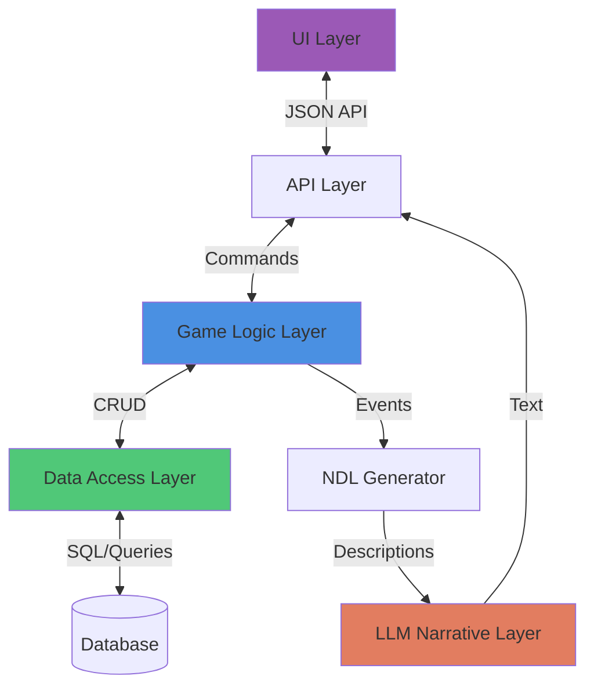
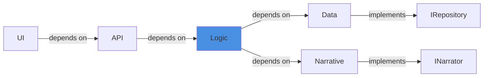

# Pattern: Separation of Concerns

#pattern #architectural #layered-architecture

## Context

When building LLM-powered games, mixing game logic, narrative generation, and data access creates maintenance nightmares and bugs. Clear separation between these concerns enables independent development, testing, and scaling.

**Use this pattern when:**
- Building complex game systems with multiple developers
- Need to swap LLM providers or models
- Want to test game logic without running LLMs
- Planning to support multiple UIs or frontends

## Forces

- **Complexity vs Simplicity**: Layers add complexity but improve maintainability
- **Performance vs Clean Code**: Layer boundaries add overhead but enable optimization
- **Flexibility vs Coupling**: Tight coupling is faster to build initially
- **Team Scaling**: Multiple developers need clear boundaries

## Solution

### Structure



### Layer Responsibilities

#### 1. UI Layer
- Renders game state to players
- Collects player input
- Handles display logic only
- **Never** accesses data directly

```python
class GameUI:
    """Pure presentation layer"""

    def __init__(self, api_client):
        self.api = api_client  # Only talks to API

    def render_game(self):
        """Display game state"""
        state = self.api.get_state()
        print(f"Location: {state['location']}")
        print(f"HP: {state['hp']}")

    def handle_input(self, user_input: str) -> str:
        """Send input to API, return narrative"""
        response = self.api.process_action(user_input)
        return response['narrative']
```

#### 2. API Layer
- Provides clean JSON interface
- Validates requests
- Handles authentication/authorization
- Orchestrates between layers
- **Never** contains game logic

```python
from fastapi import FastAPI
from pydantic import BaseModel

app = FastAPI()

class ActionRequest(BaseModel):
    player_id: str
    action: str

class ActionResponse(BaseModel):
    success: bool
    narrative: str
    state_changes: dict

@app.post("/action", response_model=ActionResponse)
async def process_action(request: ActionRequest):
    """API endpoint - no game logic here"""
    # 1. Validate
    if not request.action:
        return ActionResponse(
            success=False,
            narrative="Invalid action",
            state_changes={}
        )

    # 2. Delegate to game logic layer
    engine = GameEngine.get_instance(request.player_id)
    outcome = engine.process_action(request.action)

    # 3. Format response
    return ActionResponse(
        success=outcome.success,
        narrative=outcome.narrative,
        state_changes=outcome.state_changes
    )
```

#### 3. Game Logic Layer
- Contains all game rules and mechanics
- Processes actions and determines outcomes
- **Never** accesses database directly
- **Never** calls LLM directly
- Uses data layer for persistence
- Uses narrative layer for text

```python
class GameEngine:
    """Pure game logic"""

    def __init__(self, state_repo, narrator):
        self.state_repo = state_repo  # Data access abstraction
        self.narrator = narrator       # Narrative abstraction

    def process_action(self, action_text: str) -> Outcome:
        """Apply game rules"""
        # 1. Get current state (from data layer)
        state = self.state_repo.load_state()

        # 2. Parse action
        action = self._parse_action(action_text)

        # 3. Apply rules (pure logic)
        outcome = self._apply_rules(action, state)

        # 4. Update state (through data layer)
        if outcome.success:
            self.state_repo.save_state(outcome.new_state)

        # 5. Generate narrative (through narrative layer)
        narrative = self.narrator.narrate(outcome)

        return Outcome(
            success=outcome.success,
            narrative=narrative,
            state_changes=outcome.state_changes
        )

    def _apply_rules(self, action, state) -> RuleOutcome:
        """Pure game logic - no I/O"""
        if action.verb == "attack":
            return self._resolve_combat(action, state)
        # ... more rules
```

#### 4. Data Access Layer
- Abstracts database operations
- Provides repository pattern
- Handles serialization/deserialization
- **Never** contains game logic

```python
from abc import ABC, abstractmethod

class StateRepository(ABC):
    """Abstract data access"""

    @abstractmethod
    def load_state(self, player_id: str) -> GameState:
        pass

    @abstractmethod
    def save_state(self, state: GameState):
        pass

class SqliteStateRepository(StateRepository):
    """Concrete implementation"""

    def __init__(self, db_path: str):
        self.db_path = db_path

    def load_state(self, player_id: str) -> GameState:
        """Load from database"""
        conn = sqlite3.connect(self.db_path)
        cursor = conn.cursor()
        cursor.execute(
            "SELECT state_json FROM game_states WHERE player_id = ?",
            (player_id,)
        )
        row = cursor.fetchone()
        conn.close()

        if row:
            return GameState.from_json(row[0])
        return GameState.default()

    def save_state(self, state: GameState):
        """Save to database"""
        conn = sqlite3.connect(self.db_path)
        cursor = conn.cursor()
        cursor.execute(
            "INSERT OR REPLACE INTO game_states (player_id, state_json) VALUES (?, ?)",
            (state.player_id, state.to_json())
        )
        conn.commit()
        conn.close()
```

#### 5. LLM Narrative Layer
- Converts game events to natural language
- Encapsulates all LLM interaction
- **Never** makes game decisions
- Can be swapped/mocked easily

```python
class NarrativeLayer(ABC):
    """Abstract narrative generation"""

    @abstractmethod
    def narrate(self, outcome: RuleOutcome) -> str:
        pass

class LLMNarrator(NarrativeLayer):
    """LLM-based narration"""

    def __init__(self, llm_client):
        self.client = llm_client

    def narrate(self, outcome: RuleOutcome) -> str:
        """Convert outcome to prose"""
        prompt = self._build_prompt(outcome)
        response = self.client.complete(prompt)
        return response

class MockNarrator(NarrativeLayer):
    """For testing without LLM"""

    def narrate(self, outcome: RuleOutcome) -> str:
        """Return template text"""
        return f"You {outcome.action.verb} the {outcome.action.target}."
```

### Dependency Flow



**Key principle**: Dependencies flow inward. Inner layers (logic) define interfaces; outer layers (data, narrative) implement them.

## Consequences

### Benefits

1. **Independent Testing**: Test logic without database or LLM
2. **Swappable Components**: Change database or LLM provider easily
3. **Team Parallelization**: Different devs work on different layers
4. **Clear Boundaries**: Easy to understand system architecture
5. **Reusability**: Logic layer can support multiple UIs (web, CLI, GUI)

### Liabilities

1. **Initial Complexity**: More files and abstractions
2. **Indirection**: More code to trace through
3. **Over-engineering Risk**: Small projects don't need this
4. **Performance Overhead**: Layer boundaries have small cost

### Testing Benefits

```python
def test_combat_logic():
    """Test logic layer in isolation"""
    # Mock dependencies
    mock_repo = MockStateRepository()
    mock_narrator = MockNarrator()

    # Create engine with mocks
    engine = GameEngine(mock_repo, mock_narrator)

    # Test pure logic
    outcome = engine.process_action("attack goblin")

    assert outcome.success == True
    assert "goblin" in outcome.narrative
    # No database or LLM calls!
```

### Related Patterns

- [[architectural/program-first-architecture|Program-First Architecture]] - What logic layer contains
- [[integration/api-abstraction-layer|API Abstraction Layer]] - API layer implementation
- [[integration/state-to-llm-injection|State-to-LLM Injection]] - How layers communicate

## Source

**Original Discussions:**
- Architecture debates throughout January 2024
- Contributors: [[User-vali98]], [[User-irovos]], [[User-50h100a]]

**Key Quote:**
> "Separate your game logic from your LLM. The LLM should only do narration."

**Referenced in:**
- [[01-Architecture-and-Design|Architecture and Design Thread]]

## Tags

#architecture #layered #separation-of-concerns #clean-code #testing
