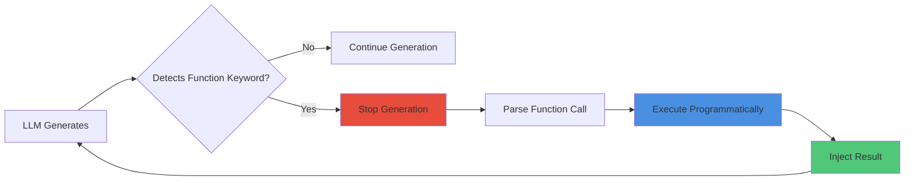

# Pattern: Chain of Thought with Function Keywords

#pattern #control #prompting #function-calling #reasoning

## Context

LLMs generate narrative and attempt state changes simultaneously, leading to inconsistent or invalid outputs. Chain of Thought (CoT) with Function Keywords forces the LLM to emit structured "function calls" during generation, allowing programmatic interception and validation before continuing.

**Use this pattern when:**
- Need to intercept LLM generation for dice rolls, stat checks, or rule validation
- Want explicit reasoning before narrative output
- Require structured state changes embedded in narrative
- Need to stop generation mid-stream to inject computed results

## Forces

**Competing concerns:**

1. **Inline vs Separate**: Embed functions in narrative vs separate reasoning block
2. **Natural vs Structured**: Natural language vs rigid syntax
3. **Interruptible vs Complete**: Stop generation for computation vs post-process complete output
4. **Model Support**: Not all models handle streaming/stop tokens well

## Solution

### Structure



### Function Keyword Syntax

```python
# Format: FunctionName(arg1, arg2, ...)

# Examples:
"FunctionRoll(Willpower, 15)"  # Stat check vs DC
"FunctionCombat(Attack, Goblin)"  # Combat resolution
"FunctionMove(North, Tavern)"  # Validated movement
"FunctionCheck(Lockpick, Hard)"  # Skill check
```

### Implementation

```python
import re
from typing import Dict, Any, Tuple, Optional
from dataclasses import dataclass

@dataclass
class FunctionCall:
    """Parsed function keyword"""
    name: str
    args: list
    position: int  # Where in text it appeared

class ChainOfThoughtEngine:
    """Handles CoT with function keyword interception"""

    def __init__(self, llm_client, game_engine):
        self.llm = llm_client
        self.engine = game_engine
        self.function_pattern = re.compile(r'Function(\w+)\(([^)]+)\)')

    def generate_with_cot(self, prompt: str, max_iterations: int = 5) -> str:
        """
        Generate text, intercepting function keywords.
        May require multiple LLM calls if functions are encountered.
        """
        full_output = ""
        current_prompt = prompt
        iterations = 0

        while iterations < max_iterations:
            # Generate until stop token or function keyword
            response = self._generate_until_function(current_prompt)

            # Add to output
            full_output += response["text"]

            # Check if function was detected
            if not response["function_detected"]:
                # Generation complete
                break

            # Parse function call
            func_call = response["function_call"]

            # Execute function programmatically
            result = self._execute_function(func_call)

            # Inject result and continue generation
            full_output += f" [{result}] "
            current_prompt = self._build_continuation_prompt(
                prompt,
                full_output,
                func_call,
                result
            )

            iterations += 1

        return full_output

    def _generate_until_function(self, prompt: str) -> Dict[str, Any]:
        """
        Generate text, stop if function keyword encountered.
        Returns: dict with 'text', 'function_detected', 'function_call'
        """
        # For streaming models, use stop tokens
        stop_tokens = ["Function"]

        response = self.llm.complete(
            prompt=prompt,
            stop=stop_tokens,
            max_tokens=200,
            temperature=0.7
        )

        text = response.text

        # Check if generation was stopped by function keyword
        if response.stop_reason == "stop_token":
            # Function keyword detected, parse it
            # Need to complete the function call
            func_completion = self.llm.complete(
                prompt=prompt + text + "Function",
                max_tokens=50,
                temperature=0.1  # Low temp for function syntax
            )

            func_text = "Function" + func_completion.text.split('\n')[0]
            match = self.function_pattern.search(func_text)

            if match:
                func_name = match.group(1)
                args_str = match.group(2)
                args = [arg.strip() for arg in args_str.split(',')]

                return {
                    "text": text,
                    "function_detected": True,
                    "function_call": FunctionCall(
                        name=func_name,
                        args=args,
                        position=len(text)
                    )
                }

        # No function detected, generation complete
        return {
            "text": text,
            "function_detected": False,
            "function_call": None
        }

    def _execute_function(self, func_call: FunctionCall) -> str:
        """Execute function programmatically, return result string"""
        func_name = func_call.name.lower()

        if func_name == "roll":
            # FunctionRoll(Stat, DC)
            stat_name = func_call.args[0]
            dc = int(func_call.args[1])
            return self._do_roll(stat_name, dc)

        elif func_name == "combat":
            # FunctionCombat(Action, Target)
            action = func_call.args[0]
            target = func_call.args[1]
            return self._do_combat(action, target)

        elif func_name == "move":
            # FunctionMove(Direction, Location)
            direction = func_call.args[0]
            location = func_call.args[1]
            return self._do_move(direction, location)

        elif func_name == "check":
            # FunctionCheck(Skill, Difficulty)
            skill = func_call.args[0]
            difficulty = func_call.args[1]
            return self._do_skill_check(skill, difficulty)

        else:
            return "[Unknown function]"

    def _do_roll(self, stat_name: str, dc: int) -> str:
        """Perform stat check"""
        player_stat = self.engine.get_player_stat(stat_name)
        roll = self.engine.roll_dice(1, 20)  # d20
        total = player_stat + roll

        if total >= dc:
            return f"Success! (Rolled {roll} + {player_stat} = {total} vs DC {dc})"
        else:
            return f"Failure. (Rolled {roll} + {player_stat} = {total} vs DC {dc})"

    def _do_combat(self, action: str, target: str) -> str:
        """Resolve combat action"""
        result = self.engine.resolve_combat(action, target)
        return f"{result['narrative']} ({result['damage']} damage)"

    def _do_move(self, direction: str, location: str) -> str:
        """Validate and perform movement"""
        if self.engine.can_move(direction, location):
            self.engine.move_player(location)
            return f"Moved to {location}"
        else:
            return f"Cannot move {direction} - no path to {location}"

    def _do_skill_check(self, skill: str, difficulty: str) -> str:
        """Perform skill check"""
        result = self.engine.skill_check(skill, difficulty)
        return "Success!" if result else "Failure."

    def _build_continuation_prompt(self, original_prompt: str,
                                   generated_so_far: str,
                                   func_call: FunctionCall,
                                   result: str) -> str:
        """Build prompt to continue generation after function execution"""
        return f"""{original_prompt}

Generated so far:
{generated_so_far}

Function executed: Function{func_call.name}({', '.join(func_call.args)})
Result: {result}

Continue the narrative from here:"""


# Alternative: Post-Processing CoT (no streaming)
class PostProcessCoT:
    """Extract and execute functions from complete output"""

    def __init__(self, llm_client, game_engine):
        self.llm = llm_client
        self.engine = game_engine
        self.function_pattern = re.compile(r'Function(\w+)\(([^)]+)\)')

    def generate_with_post_cot(self, prompt: str) -> str:
        """
        Generate complete output, then extract and execute functions.
        Requires regeneration if functions found.
        """
        # Add instruction to use function keywords
        augmented_prompt = f"""{prompt}

When you need to perform game mechanics (rolls, combat, checks), use function keywords:
- FunctionRoll(Stat, DC) for stat checks
- FunctionCombat(Action, Target) for combat
- FunctionCheck(Skill, Difficulty) for skill checks

Example: "You try to pick the lock. FunctionCheck(Lockpick, Hard) The lock clicks open."
"""

        # Generate
        response = self.llm.complete(augmented_prompt, temperature=0.7)
        text = response.text

        # Find all function calls
        function_matches = list(self.function_pattern.finditer(text))

        if not function_matches:
            # No functions, return as-is
            return text

        # Execute functions and replace in text
        result_text = text
        offset = 0

        for match in function_matches:
            func_name = match.group(1)
            args_str = match.group(2)
            args = [arg.strip() for arg in args_str.split(',')]

            func_call = FunctionCall(
                name=func_name,
                args=args,
                position=match.start()
            )

            # Execute
            result = self._execute_function(func_call)

            # Replace in text
            func_text = match.group(0)
            replacement = f"{func_text} [{result}]"

            start = match.start() + offset
            end = match.end() + offset

            result_text = result_text[:start] + replacement + result_text[end:]
            offset += len(replacement) - len(func_text)

        return result_text

    def _execute_function(self, func_call: FunctionCall) -> str:
        """Same as ChainOfThoughtEngine"""
        # ... (implementation same as above)
        pass


# Usage Example
if __name__ == "__main__":
    # Mock components
    class MockLLM:
        def complete(self, prompt, temperature, stop=None, max_tokens=None):
            class Response:
                # Simulate function keyword in output
                text = "You attempt to intimidate the guard. Function"
                stop_reason = "stop_token"
            return Response()

    class MockGameEngine:
        def get_player_stat(self, stat):
            return {"Willpower": 12, "Strength": 14}.get(stat, 10)

        def roll_dice(self, count, sides):
            return 15  # Mock roll

    # Initialize
    cot = ChainOfThoughtEngine(MockLLM(), MockGameEngine())

    # Generate with function interception
    prompt = """You are narrating a game. The player tries to intimidate a guard.

Player stats:
- Willpower: 12
- Charisma: 10

Narrate the attempt. Use FunctionRoll(Willpower, 15) to check success."""

    output = cot.generate_with_cot(prompt)
    print(output)


# CoT Reasoning Block (Alternative Pattern)
class ReasoningBlockCoT:
    """Force LLM to show reasoning before narrative"""

    def generate_with_reasoning(self, prompt: str) -> Dict[str, str]:
        """
        Require LLM to output reasoning block before narrative.
        Format:
        <reasoning>
        [Internal reasoning here]
        </reasoning>

        <narrative>
        [Player-facing narrative]
        </narrative>
        """
        augmented_prompt = f"""{prompt}

IMPORTANT: Structure your response as:
<reasoning>
Explain what should happen based on game rules and state.
List any dice rolls, stat checks, or mechanics needed.
</reasoning>

<narrative>
The actual narrative description for the player (2-3 sentences).
</narrative>"""

        response = self.llm.complete(augmented_prompt, temperature=0.7)
        text = response.text

        # Parse reasoning and narrative
        reasoning_match = re.search(r'<reasoning>(.*?)</reasoning>', text, re.DOTALL)
        narrative_match = re.search(r'<narrative>(.*?)</narrative>', text, re.DOTALL)

        reasoning = reasoning_match.group(1).strip() if reasoning_match else ""
        narrative = narrative_match.group(1).strip() if narrative_match else text

        return {
            "reasoning": reasoning,
            "narrative": narrative
        }
```

## Consequences

### Benefits

1. **Explicit Reasoning**: Can see LLM's decision-making process
2. **Programmatic Validation**: Functions execute with game rules, not LLM creativity
3. **Debuggable**: Can trace function calls and results
4. **Flexible**: Can add new function types easily
5. **Hybrid Control**: LLM narrates, program enforces rules

### Liabilities

1. **Model Support**: Requires streaming or good stop token handling
2. **Latency**: Multiple LLM calls for each function
3. **Prompt Engineering**: LLM must learn function syntax
4. **Complexity**: More complex than pure generation
5. **Parsing Errors**: Malformed function calls need handling

## Related Patterns

- [[control/constraint-based-prompting|Constraint-Based Prompting]] - Tell LLM to use functions
- [[control/few-shot-formatting|Few-Shot Formatting]] - Show function examples
- [[architectural/program-first-architecture|Program-First Architecture]] - Where functions execute
- [[integration/ndl-bridge|NDL Bridge]] - Alternative structured approach

## Source

**Original Discussions:**
- January 2024: Function keyword concept
- Contributors: [[User-50h100a]], [[User-irovos]], [[User-underscore_x]]

**Key Quotes:**

> "this could be mitigated using few-shot prompting with function-like keywords the LLM could emit using CoT" - 50h100a

> "FunctionRoll(Willpower, Ram Girl Lyre) would have to stop generation, perform the roll, inject the result, and continue generation" - 50h100a

> "there's no reason why we cant perform the same CoT-style analysis on the player's input as well, but it would simply be doing the same thing as the we do for the LLM, just with a different 'player' targeted" - 50h100a

> "I prefer to think of it as a CoT block, much more valuable" - underscore_x

> "CoT with external state tracking, essentially" - 50h100a

**Referenced in:**
- [[01-Architecture-and-Design|Architecture and Design Thread]]

## Implementation Notes

### Modern Function Calling

Modern LLMs (GPT-4, Claude) support native function calling:

```python
# Using OpenAI function calling
functions = [
    {
        "name": "perform_skill_check",
        "description": "Perform a skill check against a difficulty",
        "parameters": {
            "type": "object",
            "properties": {
                "skill": {"type": "string"},
                "difficulty": {"type": "string", "enum": ["easy", "medium", "hard"]}
            }
        }
    }
]

response = openai.ChatCompletion.create(
    model="gpt-4",
    messages=[{"role": "user", "content": prompt}],
    functions=functions,
    function_call="auto"
)

if response.choices[0].message.get("function_call"):
    func_call = response.choices[0].message["function_call"]
    # Execute programmatically
```

This is cleaner than custom keyword parsing but less portable across models.

## Implementation in ChatBotRPG

**Status**: ✅ **VALIDATED** - CoT used for rule condition evaluation

**Source Files**:
- `src/core/character_inference.py` (lines 376-378) - CoT context construction
- `src/rules/rule_evaluator.py` - Rule evaluation with CoT

### Production Example: Rule Evaluation with CoT

**File**: `src/core/character_inference.py` (lines 376-378)

```python
cot_context = [
    {"role": "system", "content": f"Analyze text, respond ONLY with chosen tag ([TAG]).\nText:\n---\n{target_msg_for_llm}\n---"},
    {"role": "user", "content": final_prompt_text}
]
```

**Usage**: ChatBotRPG uses CoT model for rule condition evaluation with chain-of-thought prompts:

- **Max Tokens**: 50 (short output for tag selection)
- **Model**: Dedicated CoT model from config (`get_default_cot_model()`)
- **Temperature**: Variable (per rule configuration)
- **Purpose**: Analyze conversation text and select matching rule tags

### How It Works in Production

1. **Rule Condition**: User defines text-matching rules with tags
   ```json
   {
     "condition_type": "LLM Text Evaluation",
     "prompt": "Is the character expressing anger or frustration? Choose [ANGRY] or [CALM]",
     "scope": "user_message"
   }
   ```

2. **CoT Analysis**: System sends conversation text to CoT model
   - Low temperature (0.1) for deterministic reasoning
   - Explicit instruction to respond ONLY with tag
   - Separate model optimized for reasoning tasks

3. **Result**: Model returns tag (e.g., `[ANGRY]`), Python evaluates rule condition

### Differences from Discord Discussions

**Discord Pattern**: Function keywords like `FunctionRoll(Willpower, 15)` for mid-generation interception

**ChatBotRPG Implementation**: CoT for **rule evaluation only**, not mid-generation function calls

**Why**: ChatBotRPG uses [[architectural/program-first-architecture|Program-First Architecture]] where Python handles all game logic. CoT is only needed for natural language analysis (determining if rule conditions match conversation text).

### Related CoT Usage

**Intent Analysis** (`src/scribe/agent_chat.py` lines 146-201):
```python
system_content = (
    "You are a helpful assistant that analyzes user messages to determine their intent. "
    "Your task is to analyze the ENTIRE conversation and determine what context is needed..."
)
```

- **Temperature**: 0.1 (very deterministic)
- **Output**: JSON with intent classification
- **Purpose**: Route user queries to appropriate context (game context, rules, characters, search)

### Performance Metrics

**From**: [[chatbotrpg-analysis/validation/01-Discord-Claims-Validation|Discord Claims Validation]]

- **Validation Status**: ✅ Exact match for CoT rule evaluation
- **Max Tokens**: 50 (compared to 2048 for main generation)
- **Temperature**: 0.1 (compared to 0.3-0.7 for narration)

### Related Implementation Files

- [[chatbotrpg-analysis/patterns/01-Pattern-to-Code-Mapping|Pattern-to-Code Mapping]] - CoT pattern validation (lines 858-903)
- [[chatbotrpg-analysis/prompts/01-Extracted-Prompts-Index|Extracted Prompts]] - Rule evaluation prompt (lines 584-601)

## Tags

#pattern #control #cot #reasoning #function-calling #interception #chatbotrpg-validated
