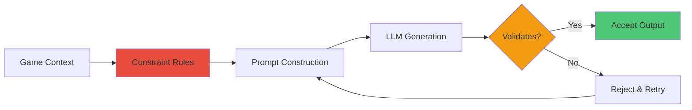

# Pattern: Constraint-Based Prompting

#pattern #control #prompting #llm-guidance

## Context

LLMs, when given creative freedom, will hallucinate game-breaking elements: impossible items, teleportation, sudden wealth, contradictory facts. Constraint-Based Prompting uses explicit rules and boundaries in prompts to guide LLM output toward valid game states.

**Use this pattern when:**
- LLM generates content that breaks game rules
- Need consistent output format
- Want to prevent specific behaviors
- Require validation without post-processing rejection

## Forces

**Competing concerns:**

1. **Creativity vs Control**
   - Strict constraints: predictable but boring
   - Loose constraints: creative but chaotic

2. **Negative vs Positive Guidance**
   - Tell what NOT to do: explicit boundaries
   - Tell what TO do: positive framing

3. **Prompt Length vs Clarity**
   - Long detailed constraints: clear but token-heavy
   - Short constraints: token-efficient but ambiguous

4. **Hard Rules vs Soft Guidelines**
   - Hard rules: must follow, brittle if violated
   - Soft guidelines: flexible, less reliable

## Solution

### Structure



### Constraint Types

#### 1. Boundary Constraints (What NOT to do)

```python
BOUNDARY_CONSTRAINTS = """
PROHIBITED ACTIONS:
- Do NOT teleport characters
- Do NOT create diamond horses or impossible items
- Do NOT grant infinite money or resources
- Do NOT kill NPCs without combat resolution
- Do NOT change established location details
- Do NOT introduce new magic systems

If the player attempts any of these, describe why it fails within game rules.
"""
```

#### 2. Format Constraints (Output structure)

```python
FORMAT_CONSTRAINTS = """
OUTPUT FORMAT:
1. Narrative description (2-3 sentences)
2. State changes (JSON format):
   {
     "hp_change": 0,
     "location_change": null,
     "item_gained": null,
     "quest_update": null
   }

Do NOT deviate from this structure.
"""
```

#### 3. Consistency Constraints (Use existing state)

```python
CONSISTENCY_CONSTRAINTS = """
CONSISTENCY RULES:
- Reference ONLY items, NPCs, and locations from the provided game state
- Do NOT invent new facts about established characters
- Maintain stated travel times between locations
- Respect established NPC personalities
- Keep technology level consistent with setting

If information is not in game state, indicate it's unknown rather than inventing.
"""
```

#### 4. Tone/Style Constraints (Narrative voice)

```python
TONE_CONSTRAINTS = """
NARRATIVE STYLE:
- Write in second person present tense
- Keep descriptions concise (2-3 sentences max)
- Maintain serious fantasy tone (no modern slang)
- Avoid flowery purple prose
- Show action, minimize introspection

AVOID:
- "You suddenly realize..."
- "Miraculously..."
- "For some reason..."
- Meta-commentary
"""
```

### Implementation

#### Complete Constraint System

```python
from typing import Dict, List, Any
from dataclasses import dataclass
import json

@dataclass
class ConstraintSet:
    """Bundle of constraints for LLM"""
    boundaries: List[str]
    format_rules: List[str]
    consistency_rules: List[str]
    tone_guidelines: List[str]
    examples: List[Dict[str, str]]  # Few-shot examples

class ConstraintBuilder:
    """Builds constraint-aware prompts"""

    def __init__(self, base_constraints: ConstraintSet):
        self.base = base_constraints

    def build_prompt(self, game_state: Dict, user_input: str,
                    additional_constraints: List[str] = None) -> str:
        """
        Construct prompt with embedded constraints.
        Constraints appear BEFORE the actual task.
        """
        sections = []

        # 1. System role
        sections.append("You are a game narrator. Follow all rules exactly.")
        sections.append("")

        # 2. Boundary constraints (what NOT to do)
        sections.append("=== PROHIBITED ACTIONS ===")
        for boundary in self.base.boundaries:
            sections.append(f"- {boundary}")
        sections.append("")

        # 3. Format constraints
        sections.append("=== REQUIRED OUTPUT FORMAT ===")
        for rule in self.base.format_rules:
            sections.append(rule)
        sections.append("")

        # 4. Consistency constraints
        sections.append("=== CONSISTENCY RULES ===")
        for rule in self.base.consistency_rules:
            sections.append(f"- {rule}")
        sections.append("")

        # 5. Additional context-specific constraints
        if additional_constraints:
            sections.append("=== ADDITIONAL RULES ===")
            for constraint in additional_constraints:
                sections.append(f"- {constraint}")
            sections.append("")

        # 6. Tone guidelines
        sections.append("=== NARRATIVE STYLE ===")
        for guideline in self.base.tone_guidelines:
            sections.append(f"- {guideline}")
        sections.append("")

        # 7. Few-shot examples
        if self.base.examples:
            sections.append("=== EXAMPLES ===")
            for example in self.base.examples:
                sections.append(f"Input: {example['input']}")
                sections.append(f"Output: {example['output']}")
                sections.append("")

        # 8. Current game state
        sections.append("=== CURRENT GAME STATE ===")
        sections.append(self._format_game_state(game_state))
        sections.append("")

        # 9. User input and task
        sections.append("=== PLAYER ACTION ===")
        sections.append(user_input)
        sections.append("")
        sections.append("Narrate the result following ALL rules above:")

        return "\n".join(sections)

    def _format_game_state(self, state: Dict) -> str:
        """Format state for context"""
        lines = []
        lines.append(f"Location: {state.get('location', 'Unknown')}")
        lines.append(f"HP: {state.get('hp', 100)}/{state.get('max_hp', 100)}")
        lines.append(f"Inventory: {', '.join(state.get('inventory', []))}")

        npcs = state.get('npcs_present', [])
        if npcs:
            lines.append(f"NPCs here: {', '.join(npcs)}")

        return "\n".join(lines)


class ConstraintValidator:
    """Validate LLM output against constraints"""

    def __init__(self, constraints: ConstraintSet):
        self.constraints = constraints

    def validate(self, output: str, expected_format: str = "json") -> tuple[bool, List[str]]:
        """
        Check if output violates constraints.
        Returns (is_valid, list_of_violations)
        """
        violations = []

        # Check format
        if expected_format == "json":
            if not self._is_valid_json(output):
                violations.append("Output is not valid JSON")

        # Check prohibited terms
        prohibited_terms = [
            "diamond horse",
            "teleport",
            "suddenly you have",
            "infinite",
            "miraculously",
            "for some reason"
        ]

        output_lower = output.lower()
        for term in prohibited_terms:
            if term in output_lower:
                violations.append(f"Contains prohibited term: '{term}'")

        # Check length constraints
        sentences = output.split('.')
        if len(sentences) > 5:
            violations.append("Output too long (>5 sentences)")

        return len(violations) == 0, violations

    def _is_valid_json(self, text: str) -> bool:
        """Check if text contains valid JSON"""
        try:
            json.loads(text)
            return True
        except json.JSONDecodeError:
            return False


# Predefined constraint sets
FANTASY_RPG_CONSTRAINTS = ConstraintSet(
    boundaries=[
        "Do NOT teleport characters instantly",
        "Do NOT create impossible/legendary items without quest completion",
        "Do NOT grant unlimited resources",
        "Do NOT kill important NPCs without proper combat",
        "Do NOT change time of day arbitrarily",
        "Do NOT introduce world-breaking magic"
    ],
    format_rules=[
        "Output must be 2-3 sentences of narrative",
        "Followed by JSON state changes",
        "JSON keys: hp_change, location_change, items_gained, quest_updates"
    ],
    consistency_rules=[
        "Only reference items/NPCs/locations from provided game state",
        "Maintain established NPC personalities",
        "Respect travel time between locations",
        "Keep technology level consistent"
    ],
    tone_guidelines=[
        "Write in second person present tense",
        "Serious fantasy tone",
        "Concise, action-focused",
        "No modern slang",
        "No meta-commentary"
    ],
    examples=[
        {
            "input": "I attack the goblin",
            "output": "You swing your sword at the goblin. It parries with its rusty blade, then counterattacks. You take 5 damage.\n{\"hp_change\": -5}"
        },
        {
            "input": "I try to teleport to the castle",
            "output": "You concentrate, trying to will yourself to the castle, but nothing happens. Teleportation magic doesn't exist in this world.\n{}"
        }
    ]
)

CYBERPUNK_CONSTRAINTS = ConstraintSet(
    boundaries=[
        "Do NOT hack systems without proper tools/skills",
        "Do NOT instantly become rich",
        "Do NOT gain cyberware without installation procedure",
        "Do NOT access restricted areas without consequences"
    ],
    format_rules=[
        "Narrative: 2-3 sentences, gritty cyberpunk tone",
        "JSON state changes required"
    ],
    consistency_rules=[
        "Respect established tech level",
        "Corps always have surveillance",
        "Cyberware requires maintenance",
        "Street cred matters"
    ],
    tone_guidelines=[
        "Noir/gritty tone",
        "Tech-heavy descriptions",
        "Cynical worldview",
        "Fast-paced"
    ],
    examples=[]
)


# Usage example
if __name__ == "__main__":
    # Initialize
    constraints = FANTASY_RPG_CONSTRAINTS
    builder = ConstraintBuilder(constraints)
    validator = ConstraintValidator(constraints)

    # Build prompt
    game_state = {
        "location": "Dark Forest",
        "hp": 75,
        "max_hp": 100,
        "inventory": ["sword", "health potion"],
        "npcs_present": ["wounded knight"]
    }

    user_input = "I drink the health potion"

    prompt = builder.build_prompt(game_state, user_input)

    print("=== CONSTRUCTED PROMPT ===")
    print(prompt)
    print("\n")

    # Simulate LLM response
    llm_output = '''You uncork the health potion and drink the glowing red liquid. Warmth spreads through your body as your wounds close.
{"hp_change": 25, "items_used": ["health potion"]}'''

    # Validate
    is_valid, violations = validator.validate(llm_output)

    print("=== VALIDATION ===")
    print(f"Valid: {is_valid}")
    if violations:
        print("Violations:")
        for v in violations:
            print(f"  - {v}")


# Advanced: Context-specific constraints
class DynamicConstraintBuilder(ConstraintBuilder):
    """Add constraints based on game context"""

    def build_prompt(self, game_state: Dict, user_input: str,
                    additional_constraints: List[str] = None) -> str:
        """Build prompt with dynamic constraints"""

        # Add context-specific constraints
        context_constraints = self._get_context_constraints(game_state)

        all_constraints = (additional_constraints or []) + context_constraints

        return super().build_prompt(game_state, user_input, all_constraints)

    def _get_context_constraints(self, game_state: Dict) -> List[str]:
        """Generate constraints based on current state"""
        constraints = []

        # Location-based constraints
        location = game_state.get("location", "")
        if "dungeon" in location.lower():
            constraints.append("Dungeon is dark - describe limited visibility")
            constraints.append("Echoes and sounds are prominent")

        if "city" in location.lower():
            constraints.append("Crowds and noise present")
            constraints.append("Guards may intervene in violence")

        # HP-based constraints
        hp = game_state.get("hp", 100)
        max_hp = game_state.get("max_hp", 100)
        if hp < max_hp * 0.3:
            constraints.append("Character is wounded - describe pain/difficulty")

        # Inventory-based constraints
        inventory = game_state.get("inventory", [])
        if not inventory:
            constraints.append("Character has no items - cannot use nonexistent items")

        # Time-based constraints
        time = game_state.get("time_of_day", "")
        if time == "night":
            constraints.append("It's dark - visibility limited, danger increased")

        return constraints
```

## Consequences

### Benefits

1. **Reduced Hallucinations**: Explicit boundaries prevent common violations
2. **Consistent Output**: Format constraints ensure parseable results
3. **Faster Validation**: Less post-processing rejection
4. **Clear Expectations**: LLM knows exactly what's required
5. **Debuggable**: Can trace violations to specific constraints

### Liabilities

1. **Token Cost**: Constraints add to prompt length
2. **Brittleness**: Over-constraining stifles creativity
3. **Maintenance**: Constraints need updating as game evolves
4. **Not Foolproof**: LLMs may still violate constraints
5. **False Negatives**: Overly strict validation may reject valid outputs

### Effectiveness by Model

| Model Type | Constraint Adherence | Notes |
|------------|---------------------|-------|
| GPT-4 | High | Follows complex constraints reliably |
| Claude | High | Excellent format adherence |
| GPT-3.5 | Medium | Needs simpler, explicit constraints |
| Local 13B | Low-Medium | Requires few-shot examples |
| Local 7B | Low | Struggles with complex constraints |

## Related Patterns

- [[control/few-shot-formatting|Few-Shot Formatting]] - Examples reinforce constraints
- [[control/chain-of-thought|Chain of Thought]] - Reasoning before output
- [[architectural/llm-processing-pipeline|LLM Processing Pipeline]] - Where constraints fit
- [[control/temperature-switching|Dynamic Temperature Switching]] - Adjust creativity within constraints

## Source

**Original Discussions:**
- January 2024: Core architectural debates
- Contributors: [[User-50h100a]], [[User-vali98]], [[User-irovos]], [[User-veritasr]]

**Key Quotes:**

> "Constraint the LLM, not the player. Users are more predictable than AI." - Community consensus

> "with proper constraints even a 13b can fill out a prefix statblock reasonably well" - 50h100a

> "The problem with this, and the reason that I'm offloading details right now, is that LLMs sorta suck at the whole creative bit without a bunch of prompting. It's better to hand it a bunch of constraints to work in, otherwise you end up with some very generalistic stuff" - veritasr

> "if you allow inquiries beyond the pre-generation, you get into requiring the interpolation within constraints" - 50h100a

> "consistency with the past informing your constraints in the future" - 50h100a

**Referenced in:**
- [[01-Architecture-and-Design|Architecture and Design Thread]]

## Implementation Notes

### Constraint Priority

When constraints conflict, use this priority:

1. **Hard boundaries** (game-breaking violations)
2. **Format requirements** (must be parseable)
3. **Consistency rules** (use existing state)
4. **Tone guidelines** (nice-to-have)

### Testing Constraints

```python
def test_constraints():
    """Test constraint effectiveness"""
    test_cases = [
        {
            "input": "I teleport to the castle",
            "should_reject": True,
            "reason": "Prohibited action"
        },
        {
            "input": "I walk to the castle",
            "should_reject": False,
            "reason": "Valid action"
        },
        {
            "input": "I create a diamond horse",
            "should_reject": True,
            "reason": "Impossible item"
        }
    ]

    for case in test_cases:
        output = llm_generate(case["input"])
        is_valid, violations = validator.validate(output)

        expected = not case["should_reject"]
        assert is_valid == expected, f"Failed: {case['input']}"
```

### Constraint Evolution

Start loose, tighten based on observed violations:

```python
# Version 1: Basic
"Do not break game rules"

# Version 2: Specific (after seeing violations)
"Do not: teleport, create impossible items, grant infinite resources"

# Version 3: Explicit (after more violations)
"PROHIBITED: Teleportation (no instant travel), Impossible items (no diamond horses, infinite bags), Unlimited resources (no sudden wealth)"
```

## Implementation in ChatBotRPG

**Status**: ✅ **EXACT MATCH** - Extensive constraint usage across all generation prompts

**Source Files**: All prompt files in `src/generate/` directory

### Production Example: Character Generation Constraints

**File**: `src/generate/generate_actor.py` (lines 83-88)

```python
prompt = f"""{instruction_prefix}Given the following information about a character named {character_name},
write a single cohesive paragraph describing their background, role, and character essence.
Focus on who they are, what they do, and their place in the world.

CONSTRAINTS:
- Write in natural narrative style
- NO bullet points, lists, or fragmented sentences
- Keep it to ONE well-developed paragraph that flows naturally

Current Character Sheet:
{context}

Description:"""
```

### Production Example: Equipment Constraints

**File**: `src/generate/generate_actor.py` (lines 115-220)

```python
prompt = (
    f"{instruction_prefix}You are an expert wardrobe designer. "
    "Given the following character information, generate a JSON object representing the character's worn equipment. "
    "\n\n"
    "CONSTRAINTS:"
    "\n"
    "- The equipment should match the character's theme, type, and station"
    "- Respect the genre (e.g., medieval, modern, sci-fi)"
    "- The 'left_hand' and 'right_hand' slots are specifically for WORN items like gloves, rings, bracelets, etc."
    "- Do NOT put held items (weapons, shields, tools) here"
    "- If multiple items are worn in a slot, separate them with commas"
    "- Be very thorough, but if a slot is empty, use an empty string \"\""
    "- Do NOT include hairstyles"
    "- Provide minimal visual description"
    "- Ensure all listed keys are present"
    "\n\n"
    "The JSON object MUST contain exactly these keys: "
    f'{", ".join(EQUIPMENT_JSON_KEYS)}.'
    "\n\n"
    "Equipment JSON:"
)
```

**Why So Many Constraints**: Without them, LLM would:
1. Put weapons in hand slots (not worn items)
2. Include hairstyles in equipment
3. Generate narrative text instead of JSON
4. Miss required slots
5. Ignore genre (knight in t-shirt)

### Negative Constraints Pattern

ChatBotRPG uses "Do NOT..." format extensively:

**Personality Generation** (`generate_actor.py` lines 112-118):
```python
"Focus on psychological and behavioral characteristics only. "
"Do not write sentences or explanations - just traits separated by commas. "
"Aim for 15-25 traits that capture the full personality spectrum."
```

**Appearance Generation** (`generate_actor.py` lines 143-149):
```python
"Focus ONLY on physical traits - do not include clothing, accessories, or equipment. "
"Do not write sentences or explanations - just physical descriptors separated by commas. "
"Aim for 15-25 traits that capture the complete physical appearance."
```

### Format Enforcement Constraints

**All generation prompts include explicit format constraints:**

- **Name**: "Output just this name without any formatting or extra text"
- **Description**: "Single cohesive paragraph... no bullet points"
- **Personality**: "Comma-separated list... No sentences"
- **Appearance**: "Comma-separated list... No sentences"
- **Equipment**: "JSON object with exact keys... No explanations"

### Narration Constraints

**File**: `src/core/character_inference.py` (lines 268-274)

```python
system_msg_base_intro = (
    "You are in a third-person text RPG. "
    "You are responsible for writing ONLY the actions and dialogue of your assigned character. "
    "You must ALWAYS write in third person (using the character's name or 'he/she/they'), "
    "NEVER in first or second person. "
    "Write one single open-ended response (do NOT describe the OUTCOME of actions)."
)
```

**Key Constraint**: LLM must NOT decide outcomes (program-first architecture enforcement).

### Why Constraints Work

**From Production Analysis**:

Without constraints:
- Equipment prompts generated narrative: "The knight wears shining armor..." ❌
- Name prompts added explanations: "A good name would be Thorgar because..." ❌
- Personality mixed traits and descriptions: "Brave warrior who fought in many battles" ❌

With constraints:
- Equipment: Valid JSON with 16 slots ✅
- Name: Just "Thorgar" ✅
- Personality: "brave, stern, loyal, battle-hardened, protective" ✅

### Constraint Evolution Example

**File**: `src/generate/generate_actor.py` (name generation)

**Version 1** (hypothetical, not in code):
```python
"Generate a character name"
```

**Current Version** (lines 62-64):
```python
"Create a name for a character based on the information below. "
"Output just the name without any formatting or extra text."
```

**Added Constraints**:
- "Output just the name" → Prevents explanations
- "Without any formatting" → Prevents markdown/quotes
- "Extra text" → Prevents additions

### Validation

**From**: [[chatbotrpg-analysis/patterns/01-Pattern-to-Code-Mapping|Pattern-to-Code Mapping]] (lines 800-855)

```
Status: ✅ EXACT MATCH

Evidence (All prompt files in generate/):
- Character generation constraints
- Equipment generation constraints
- Narration constraints
- All prompts use negative constraints ("Do NOT...")

Pattern: All prompts use constraints to prevent common LLM errors
```

### Related Implementation Files

- [[chatbotrpg-analysis/prompts/01-Extracted-Prompts-Index|Extracted Prompts]] - All 15 prompts with full constraint text
- [[chatbotrpg-analysis/validation/01-Discord-Claims-Validation|Discord Claims Validation]] - Constraint validation

## Tags

#pattern #control #prompting #constraints #validation #llm-guidance #chatbotrpg-validated
