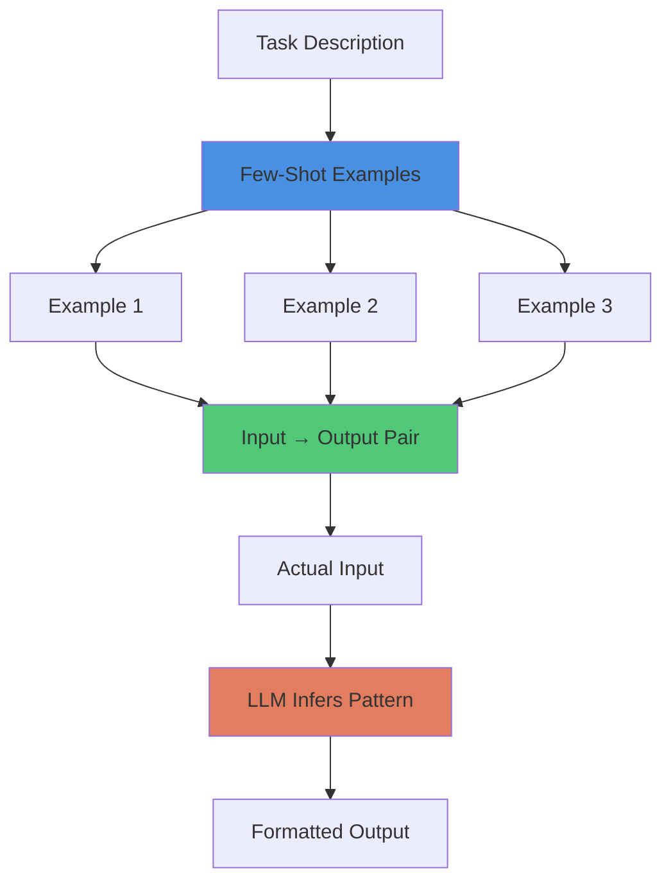

# Pattern: Few-Shot Formatting

#pattern #control #prompt #few-shot #formatting

## Context

LLMs are excellent at mimicking patterns but require examples to understand desired output format. Without examples, LLMs produce inconsistent, overly verbose, or incorrectly structured output. Few-shot prompting provides 1-5 examples demonstrating the exact format you want, dramatically improving output consistency.

**Use this pattern when:**
- Need structured output (JSON, NDL, custom format)
- LLM produces verbose or rambling responses
- Teaching LLM a new notation or syntax
- Ensuring consistent formatting across generations
- Smaller models struggle with instructions alone

## Forces

- **Consistency vs Creativity**: Examples constrain but also limit variation
- **Context Window Cost**: Each example consumes tokens
- **Example Quality**: Poor examples teach bad habits
- **Model Capability**: Better models need fewer examples (GPT-4 one-shot, smaller models need 3-5)
- **Format Complexity**: Complex formats need more examples

## Solution

### Structure



### Core Strategies

#### 1. Few-Shot Formatting (3-5 Examples)

```python
from typing import List, Dict, Any
from dataclasses import dataclass

@dataclass
class FewShotExample:
    """Single input-output example pair"""
    input: str
    output: str
    explanation: str = ""  # Optional note about why

class FewShotFormatter:
    """
    Few-shot prompt builder for consistent formatting.

    Teaches LLM desired output format through examples.
    """

    def __init__(self, task_description: str):
        self.task_description = task_description
        self.examples: List[FewShotExample] = []

    def add_example(
        self,
        input_text: str,
        output_text: str,
        explanation: str = ""
    ):
        """Add training example"""
        self.examples.append(FewShotExample(
            input=input_text,
            output=output_text,
            explanation=explanation
        ))

    def build_prompt(self, actual_input: str) -> str:
        """
        Construct few-shot prompt.

        Format:
        [Task Description]

        Example 1:
        Input: ...
        Output: ...

        Example 2:
        Input: ...
        Output: ...

        Now convert:
        Input: [actual input]
        Output:
        """
        prompt = f"{self.task_description}\n\n"

        # Add examples
        for i, example in enumerate(self.examples, 1):
            prompt += f"Example {i}:\n"
            prompt += f"Input: {example.input}\n"
            prompt += f"Output: {example.output}\n"

            if example.explanation:
                prompt += f"(Note: {example.explanation})\n"

            prompt += "\n"

        # Add actual task
        prompt += "Now convert:\n"
        prompt += f"Input: {actual_input}\n"
        prompt += "Output:"

        return prompt


# Example 1: Teaching NDL Format
ndl_formatter = FewShotFormatter(
    task_description="Convert player actions into NDL (Natural Description Language) format."
)

ndl_formatter.add_example(
    input="I draw my sword",
    output="action(draw) ~ item($sword) by(character($player))",
    explanation="Simple action with item and actor"
)

ndl_formatter.add_example(
    input="She whispers nervously to the guard",
    output="action(speak) ~ manner($whisper) emotion($nervous) target(character($guard)) by(character($npc_mara))",
    explanation="Communication with manner, emotion, target"
)

ndl_formatter.add_example(
    input="The goblin attacks with a rusty dagger",
    output="action(attack) ~ weapon($rusty_dagger) target(character($player)) by(character($goblin_1))",
    explanation="Combat action with weapon"
)

prompt = ndl_formatter.build_prompt("I sneak past the sleeping dragon")
print(prompt)
```

#### 2. One-Shot Formatting (Single Example)

```python
class OneShotFormatter:
    """
    One-shot prompt for capable models (GPT-4, Claude).

    More efficient for large models that learn quickly.
    """

    @staticmethod
    def build_prompt(
        task: str,
        example_input: str,
        example_output: str,
        actual_input: str
    ) -> str:
        """Build one-shot prompt"""
        return f"""{task}

Example:
Input: {example_input}
Output: {example_output}

Now convert:
Input: {actual_input}
Output:"""


# Example: JSON Extraction
prompt = OneShotFormatter.build_prompt(
    task="Extract character information as JSON",
    example_input="A tall elf warrior named Elara, skilled in archery",
    example_output='{"name": "Elara", "race": "elf", "class": "warrior", "skills": ["archery"]}',
    actual_input="A dwarf blacksmith called Thorin who crafts magical weapons"
)
```

#### 3. Zero-Shot with Formatting Template

```python
class TemplateFormatter:
    """
    Zero-shot but with explicit template structure.

    Use when examples aren't needed but format must be precise.
    """

    @staticmethod
    def build_prompt(task: str, template: str, input_data: str) -> str:
        """Build template-guided prompt"""
        return f"""{task}

Use this exact format:
{template}

Now generate:
Input: {input_data}
Output:"""


# Example: Character Stat Block
prompt = TemplateFormatter.build_prompt(
    task="Generate character stats",
    template="""Name: [character name]
Class: [character class]
Level: [number]
HP: [current]/[max]
Inventory: [comma-separated items]""",
    input_data="Create a level 5 rogue named Shadow"
)
```

#### 4. Completion-Style Few-Shot

```python
class CompletionFormatter:
    """
    Few-shot using completion rather than input/output pairs.

    Useful when format should feel like natural continuation.
    """

    @staticmethod
    def build_prompt(examples: List[str], prefix: str) -> str:
        """
        Build completion-style prompt.

        LLM sees pattern and continues it naturally.
        """
        prompt = ""

        # Add completed examples
        for example in examples:
            prompt += example + "\n\n"

        # Add incomplete item for LLM to finish
        prompt += prefix

        return prompt


# Example: Character Descriptions
examples = [
    "Character: Bob the Blacksmith\nAppearance: A burly man with soot-stained hands and a warm smile.\nPersonality: Friendly but protective of his craft.\nNotable: Makes the finest weapons in town.",

    "Character: Mara the Merchant\nAppearance: A shrewd woman with calculating eyes and fine silk robes.\nPersonality: Greedy but fair in her dealings.\nNotable: Controls most trade in the eastern district.",
]

prompt = CompletionFormatter.build_prompt(
    examples=examples,
    prefix="Character: Elara the Ranger\n"
)
```

### Real-World Application Examples

#### Example 1: Action Parsing

```python
class ActionParser:
    """Parse natural language into game actions using few-shot"""

    def __init__(self, llm_client):
        self.llm = llm_client
        self.formatter = FewShotFormatter(
            "Parse player action into structured command"
        )

        # Add training examples
        self.formatter.add_example(
            input="attack the goblin with my sword",
            output='{"action": "attack", "target": "goblin", "weapon": "sword"}'
        )

        self.formatter.add_example(
            input="pick up the health potion",
            output='{"action": "pickup", "target": "health_potion"}'
        )

        self.formatter.add_example(
            input="talk to the merchant about prices",
            output='{"action": "dialogue", "target": "merchant", "topic": "prices"}'
        )

    def parse(self, player_input: str) -> Dict[str, Any]:
        """Parse player input into action dict"""
        prompt = self.formatter.build_prompt(player_input)

        response = self.llm.complete(prompt, temperature=0.3)

        # Parse JSON response
        import json
        return json.loads(response)


# Usage
parser = ActionParser(llm_client)
action = parser.parse("sneak past the sleeping guard")
# Returns: {"action": "sneak", "target": "guard", "modifier": "sleeping"}
```

#### Example 2: Dialogue Formatting

```python
class DialogueFormatter:
    """Format NPC dialogue with consistent style"""

    def __init__(self, llm_client):
        self.llm = llm_client

    def generate_dialogue(
        self,
        npc_name: str,
        npc_personality: str,
        situation: str
    ) -> str:
        """Generate dialogue in consistent format"""

        # Few-shot with personality examples
        prompt = f"""Generate NPC dialogue in this format:

Example 1:
NPC: Gruff Guard
Personality: Suspicious, duty-bound
Situation: Player tries to enter castle
Dialogue: *crosses arms* "State your business. No one enters without proper authorization." *eyes you suspiciously*

Example 2:
NPC: Cheerful Merchant
Personality: Friendly, greedy
Situation: Player browses wares
Dialogue: *rubs hands eagerly* "Ah, welcome friend! Looking for anything special today? I have the finest goods in all the land!" *gestures to displayed items*

Example 3:
NPC: Wise Elder
Personality: Cryptic, patient
Situation: Player asks for advice
Dialogue: *strokes beard thoughtfully* "The path you seek is not found by asking... but by listening." *pauses meaningfully*

Now generate:
NPC: {npc_name}
Personality: {npc_personality}
Situation: {situation}
Dialogue:"""

        return self.llm.complete(prompt, temperature=0.8)
```

#### Example 3: NDL Generation

```python
class NDLGenerator:
    """
    Generate Natural Description Language using few-shot.

    Teaches LLM the NDL syntax through examples.
    """

    def __init__(self, llm_client):
        self.llm = llm_client
        self.formatter = FewShotFormatter(
            "Convert game events into NDL format"
        )

        # Add NDL examples
        self.formatter.add_example(
            input="Player attacks goblin with sword, hits for 15 damage",
            output="action(attack) ~ weapon($sword) damage(15) target(character($goblin)) result($hit) by(character($player))"
        )

        self.formatter.add_example(
            input="NPC Mara speaks nervously about the missing artifact",
            output="action(speak) ~ emotion($nervous) topic($missing_artifact) by(character($mara))"
        )

        self.formatter.add_example(
            input="Player successfully picks lock on treasure chest",
            output="action(pick_lock) ~ target($treasure_chest) skill($lockpicking) result($success) by(character($player))"
        )

    def event_to_ndl(self, event_description: str) -> str:
        """Convert event description to NDL"""
        prompt = self.formatter.build_prompt(event_description)
        return self.llm.complete(prompt, temperature=0.2)
```

## Consequences

### Benefits

1. **Consistency**: Output follows demonstrated pattern reliably
2. **Format Adherence**: Structured formats (JSON, NDL) work correctly
3. **Model Flexibility**: Works across model sizes (even 7B models)
4. **Quick Training**: Faster than fine-tuning, easier than prompting alone
5. **Explicit**: Shows exactly what you want, not descriptions

### Liabilities

1. **Token Cost**: Examples consume context window
2. **Rigidity**: May reduce creative variation
3. **Example Dependence**: Poor examples → poor output
4. **Maintenance**: Format changes require updating all examples
5. **Edge Cases**: Examples may not cover all scenarios

### Best Practices

**Example Quality:**
- Use diverse, representative examples
- Cover edge cases (special characters, empty fields)
- Show both simple and complex cases
- Keep examples realistic

**Number of Examples:**
- GPT-4/Claude: 1-2 examples (one-shot)
- Medium models (13B-33B): 2-3 examples
- Small models (7B-9B): 3-5 examples
- If 5 doesn't work, format may be too complex

**Prompt Structure:**
- Clear task description
- Consistent example format
- Explicit "Now convert:" transition
- End with output prefix for completion

### When NOT to Use

- Format is trivial (simple sentences)
- Model already knows format (JSON is standard)
- Need maximum creativity (examples constrain)
- Context window too small for examples

### Related Patterns

- [[control/constraint-based-prompting|Constraint-Based Prompting]] - Tell LLM what NOT to do
- [[control/chain-of-thought|Chain of Thought]] - Make LLM think step-by-step
- [[integration/ndl-bridge|NDL Bridge Pattern]] - NDL requires few-shot to teach syntax
- [[control/temperature-switching|Dynamic Temperature]] - Lower temp for format, higher for creativity

## Source

**Original Discussions:**
- 50h100a's early experimentation with examples (January 2024)
- monkeyrithms noting GPT-4 one-shot capability
- veritasr's NDL teaching using few-shot

**Contributors:**
- [[User-50h100a]] - "note that this requires few-shot or at least one-shot unless you are clever with formatting"
- [[User-monkeyrithms]] - "gpt-4 was very good, its the only model that can kinda-sorta one-shot a good RP with all the rules just added to the context"
- [[User-underscore_x]] - "You just tell the llm to start every response with x,y, and z. It'll 'think' for itself."
- [[User-veritasr]] - Used few-shot extensively for NDL training across multiple models

**Key Insights:**

> "Few-shot or at least one-shot unless you are clever with formatting" - 50h100a

This recognizes that format learning requires examples unless you exploit LLM completion behavior (like ending with "Health:" to trigger fill-in-the-blank).

> "gpt-4 was very good, its the only model that can kinda-sorta one-shot" - monkeyrithms

Larger, more capable models need fewer examples. Smaller models require more hand-holding.

**Referenced in:**
- [[02-Prompt-Engineering|Prompt Engineering Thread]]

## Implementation Checklist

- [ ] Identify output format requirements
- [ ] Create 3-5 diverse, high-quality examples
- [ ] Test with target model (adjust example count as needed)
- [ ] Include edge cases in examples
- [ ] Monitor output consistency
- [ ] Update examples if format evolves
- [ ] Consider token budget (examples add cost)
- [ ] Document example rationale for future maintainers

## Advanced Techniques

### Dynamic Example Selection

```python
class AdaptiveFewShotFormatter:
    """Select most relevant examples based on input"""

    def __init__(self, all_examples: List[FewShotExample]):
        self.examples = all_examples

    def select_examples(
        self,
        actual_input: str,
        n: int = 3
    ) -> List[FewShotExample]:
        """Select most relevant examples using similarity"""
        # Could use embedding similarity, keyword matching, etc.
        # For now, simple implementation
        return self.examples[:n]

    def build_prompt(self, actual_input: str) -> str:
        """Build prompt with selected examples"""
        relevant = self.select_examples(actual_input)

        prompt = "Convert to structured format:\n\n"
        for i, ex in enumerate(relevant, 1):
            prompt += f"Example {i}:\n"
            prompt += f"Input: {ex.input}\n"
            prompt += f"Output: {ex.output}\n\n"

        prompt += f"Now convert:\nInput: {actual_input}\nOutput:"
        return prompt
```

### Chain-of-Thought Few-Shot

```python
# Combine few-shot with reasoning
cot_examples = [
    """Input: "attack the goblin"
Reasoning: This is a combat action targeting an enemy. Need to specify action type, target, and actor.
Output: {"action": "attack", "target": "goblin", "actor": "player"}""",

    """Input: "carefully pick the lock"
Reasoning: This is a skill check with a manner modifier. Include action, target, modifier, and skill type.
Output: {"action": "use_skill", "skill": "lockpicking", "target": "lock", "modifier": "carefully"}"""
]

# LLM now explains its reasoning before formatting
```

## Tags

#few-shot #prompt #formatting #examples #pattern-learning #consistency
