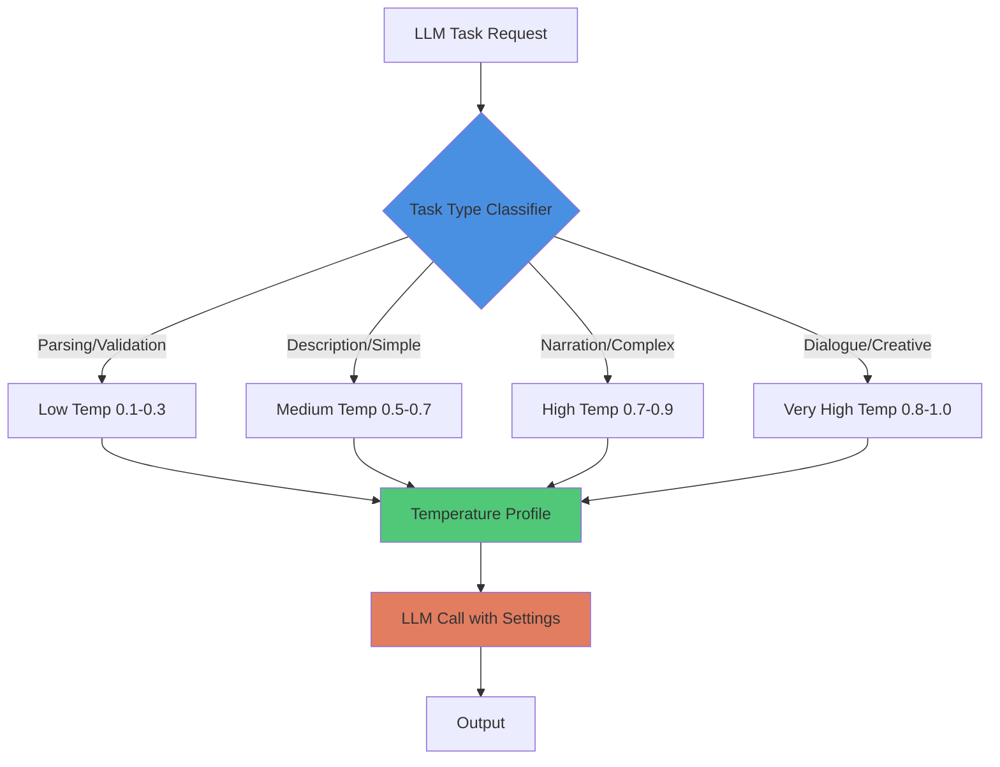

# Pattern: Dynamic Temperature Switching

#pattern #control #temperature #sampling #optimization

## Context

LLM temperature controls randomness: low temperature (0.1-0.3) produces deterministic, consistent output; high temperature (0.7-1.0) produces creative, varied output. Using a single temperature for all tasks is suboptimal. Parsing and validation need accuracy (low temp), while dialogue and narration need variety (high temp). Dynamic switching adjusts temperature per task type.

**Use this pattern when:**
- Single application performs multiple LLM tasks
- Need accuracy for some tasks, creativity for others
- Output consistency varies too much (or too little)
- Want to optimize cost/quality per task type
- Using smaller models that benefit from temperature tuning

## Forces

- **Accuracy vs Creativity**: Deterministic output boring, creative output unreliable
- **Consistency vs Variety**: Players notice repetitive text
- **Task Complexity**: Complex tasks need lower temp, simple tasks can go higher
- **Model Size**: Smaller models more sensitive to temperature changes
- **Implementation**: Extra complexity managing multiple temperature profiles

## Solution

### Structure



### Core Components

#### 1. Temperature Profile System

```python
from dataclasses import dataclass
from typing import Dict, Any
from enum import Enum

class TaskType(Enum):
    """Categories of LLM tasks"""
    # Structured tasks (need accuracy)
    ACTION_PARSING = "action_parsing"
    DATA_EXTRACTION = "data_extraction"
    VALIDATION = "validation"
    JSON_GENERATION = "json_generation"

    # Descriptive tasks (moderate creativity)
    ITEM_DESCRIPTION = "item_description"
    ROOM_DESCRIPTION = "room_description"
    SIMPLE_NARRATION = "simple_narration"

    # Creative tasks (high creativity)
    COMBAT_NARRATION = "combat_narration"
    STORY_NARRATION = "story_narration"
    DIALOGUE = "dialogue"

    # Generative tasks (maximum creativity)
    CHARACTER_GENERATION = "character_generation"
    QUEST_GENERATION = "quest_generation"
    WORLD_GENERATION = "world_generation"


@dataclass
class TemperatureProfile:
    """
    Temperature and sampling settings for a task type.

    Different tasks need different randomness levels.
    """
    temperature: float
    top_p: float = 0.9
    top_k: int = 40
    repetition_penalty: float = 1.1
    frequency_penalty: float = 0.0
    presence_penalty: float = 0.0

    # Optional: min/max tokens for this task
    min_tokens: int = 10
    max_tokens: int = 512


class TemperatureManager:
    """
    Manages temperature profiles for different task types.

    Automatically selects appropriate settings per task.
    """

    def __init__(self):
        # Default profiles for each task category
        self.profiles: Dict[TaskType, TemperatureProfile] = {
            # Structured/Accurate tasks
            TaskType.ACTION_PARSING: TemperatureProfile(
                temperature=0.2,
                top_p=0.85,
                repetition_penalty=1.1,
                max_tokens=256
            ),
            TaskType.DATA_EXTRACTION: TemperatureProfile(
                temperature=0.1,
                top_p=0.8,
                repetition_penalty=1.05,
                max_tokens=512
            ),
            TaskType.VALIDATION: TemperatureProfile(
                temperature=0.1,
                top_p=0.8,
                repetition_penalty=1.0,
                max_tokens=128
            ),
            TaskType.JSON_GENERATION: TemperatureProfile(
                temperature=0.3,
                top_p=0.9,
                repetition_penalty=1.1,
                max_tokens=1024
            ),

            # Descriptive tasks
            TaskType.ITEM_DESCRIPTION: TemperatureProfile(
                temperature=0.6,
                top_p=0.9,
                repetition_penalty=1.2,
                max_tokens=256
            ),
            TaskType.ROOM_DESCRIPTION: TemperatureProfile(
                temperature=0.6,
                top_p=0.9,
                repetition_penalty=1.2,
                max_tokens=512
            ),
            TaskType.SIMPLE_NARRATION: TemperatureProfile(
                temperature=0.7,
                top_p=0.9,
                repetition_penalty=1.15,
                max_tokens=512
            ),

            # Creative tasks
            TaskType.COMBAT_NARRATION: TemperatureProfile(
                temperature=0.8,
                top_p=0.95,
                repetition_penalty=1.2,
                max_tokens=512
            ),
            TaskType.STORY_NARRATION: TemperatureProfile(
                temperature=0.8,
                top_p=0.95,
                repetition_penalty=1.25,
                max_tokens=1024
            ),
            TaskType.DIALOGUE: TemperatureProfile(
                temperature=0.9,
                top_p=0.95,
                repetition_penalty=1.3,
                max_tokens=512
            ),

            # Generative tasks
            TaskType.CHARACTER_GENERATION: TemperatureProfile(
                temperature=0.9,
                top_p=0.95,
                repetition_penalty=1.2,
                max_tokens=1024
            ),
            TaskType.QUEST_GENERATION: TemperatureProfile(
                temperature=0.85,
                top_p=0.95,
                repetition_penalty=1.2,
                max_tokens=2048
            ),
            TaskType.WORLD_GENERATION: TemperatureProfile(
                temperature=0.9,
                top_p=0.95,
                repetition_penalty=1.15,
                max_tokens=2048
            ),
        }

    def get_profile(self, task_type: TaskType) -> TemperatureProfile:
        """Get temperature profile for task"""
        return self.profiles.get(task_type, TemperatureProfile(temperature=0.7))

    def set_profile(self, task_type: TaskType, profile: TemperatureProfile):
        """Override default profile"""
        self.profiles[task_type] = profile

    def as_dict(self, task_type: TaskType) -> Dict[str, Any]:
        """Get profile as dict for API calls"""
        profile = self.get_profile(task_type)

        return {
            'temperature': profile.temperature,
            'top_p': profile.top_p,
            'repetition_penalty': profile.repetition_penalty,
            'max_tokens': profile.max_tokens
        }
```

#### 2. Smart LLM Client

```python
from typing import Optional

class TemperatureAwareLLMClient:
    """
    LLM client that automatically adjusts temperature per task.

    Abstracts temperature management from caller.
    """

    def __init__(self, llm_client, temperature_manager: TemperatureManager):
        self.llm = llm_client
        self.temp_manager = temperature_manager

    def complete(
        self,
        prompt: str,
        task_type: TaskType,
        override_temp: Optional[float] = None
    ) -> str:
        """
        Generate completion with appropriate temperature.

        Task type automatically determines sampling settings.
        """
        if override_temp is not None:
            # Manual override
            settings = {'temperature': override_temp, 'max_tokens': 512}
        else:
            # Use profile
            settings = self.temp_manager.as_dict(task_type)

        return self.llm.generate(prompt, **settings)

    def parse_action(self, player_input: str) -> Dict[str, Any]:
        """Parse player action (low temperature)"""
        prompt = f"Parse this action into JSON: {player_input}"

        response = self.complete(
            prompt,
            task_type=TaskType.ACTION_PARSING
        )

        import json
        return json.loads(response)

    def narrate_combat(self, ndl_event: str) -> str:
        """Narrate combat (high temperature)"""
        prompt = f"Describe this combat event dramatically:\n{ndl_event}"

        return self.complete(
            prompt,
            task_type=TaskType.COMBAT_NARRATION
        )

    def generate_dialogue(
        self,
        npc_name: str,
        context: str
    ) -> str:
        """Generate NPC dialogue (very high temperature)"""
        prompt = f"Generate dialogue for {npc_name}:\n{context}"

        return self.complete(
            prompt,
            task_type=TaskType.DIALOGUE
        )

    def describe_room(self, room_data: Dict[str, Any]) -> str:
        """Describe room (medium temperature)"""
        prompt = f"Describe this room:\n{room_data}"

        return self.complete(
            prompt,
            task_type=TaskType.ROOM_DESCRIPTION
        )
```

#### 3. Contextual Temperature Adjustment

```python
class AdaptiveTemperatureManager(TemperatureManager):
    """
    Adjust temperature based on context, not just task type.

    Example: Lower temp for critical story moments, higher for filler.
    """

    def get_profile_contextual(
        self,
        task_type: TaskType,
        context: Dict[str, Any]
    ) -> TemperatureProfile:
        """Get profile adjusted for context"""
        base_profile = self.get_profile(task_type)

        # Clone profile
        profile = TemperatureProfile(
            temperature=base_profile.temperature,
            top_p=base_profile.top_p,
            repetition_penalty=base_profile.repetition_penalty,
            max_tokens=base_profile.max_tokens
        )

        # Adjust based on context
        if context.get('is_critical_moment'):
            # Lower temp for important moments (more controlled)
            profile.temperature = max(0.1, profile.temperature - 0.2)

        if context.get('player_bored'):
            # Raise temp to add variety
            profile.temperature = min(1.0, profile.temperature + 0.1)

        if context.get('combat_active'):
            # Slightly higher temp for dynamic combat
            profile.temperature = min(0.9, profile.temperature + 0.1)

        if context.get('npc_personality') == 'stoic':
            # Lower temp for consistent personality
            profile.temperature = max(0.5, profile.temperature - 0.1)

        return profile
```

#### 4. Complete Example

```python
if __name__ == "__main__":
    # Setup
    from mock_llm_client import MockLLMClient  # Your actual LLM client

    llm = MockLLMClient()
    temp_manager = TemperatureManager()
    client = TemperatureAwareLLMClient(llm, temp_manager)

    print("=== Low Temperature: Action Parsing ===")
    # Needs accuracy, deterministic output
    action = client.parse_action("I attack the goblin with my sword")
    print(f"Parsed: {action}")
    print(f"Temperature used: 0.2\n")

    print("=== Medium Temperature: Room Description ===")
    # Balanced creativity
    room = client.describe_room({
        'name': 'Tavern',
        'features': ['fireplace', 'bar', 'tables']
    })
    print(f"Description: {room}")
    print(f"Temperature used: 0.6\n")

    print("=== High Temperature: Combat Narration ===")
    # Creative, varied output
    narration = client.narrate_combat(
        "action(attack) ~ weapon($sword) damage(15) result($hit) by(character($player))"
    )
    print(f"Narration: {narration}")
    print(f"Temperature used: 0.8\n")

    print("=== Very High Temperature: Dialogue ===")
    # Maximum creativity
    dialogue = client.generate_dialogue(
        npc_name="Mysterious Stranger",
        context="Player asks about rumors"
    )
    print(f"Dialogue: {dialogue}")
    print(f"Temperature used: 0.9\n")

    # Contextual adjustment
    adaptive_manager = AdaptiveTemperatureManager()
    adaptive_client = TemperatureAwareLLMClient(llm, adaptive_manager)

    print("=== Contextual Temperature: Critical Story Moment ===")
    profile = adaptive_manager.get_profile_contextual(
        TaskType.STORY_NARRATION,
        context={'is_critical_moment': True}
    )
    print(f"Base temperature: 0.8")
    print(f"Adjusted temperature: {profile.temperature} (lowered for control)")
```

## Consequences

### Benefits

1. **Task-Appropriate Output**: Each task gets optimal settings
2. **Quality Improvement**: Better accuracy for parsing, better variety for creativity
3. **Cost Efficiency**: Lower temp = fewer retries for structured tasks
4. **Consistency**: Deterministic output when needed
5. **Variety**: Creative output when desired

### Liabilities

1. **Configuration Complexity**: Must tune profiles per task
2. **Model Sensitivity**: Optimal temps vary by model
3. **Testing Overhead**: Each profile needs validation
4. **Context Handling**: Dynamic adjustment adds logic complexity
5. **Edge Cases**: Some tasks don't fit neat categories

### Temperature Guidelines

**By Task Type:**

| Task | Temperature | Rationale |
|------|-------------|-----------|
| JSON/XML output | 0.1-0.3 | Must be valid format |
| Action parsing | 0.2-0.3 | Need accuracy, little creativity |
| Validation | 0.1-0.2 | Deterministic yes/no |
| Simple description | 0.5-0.7 | Some variety, mostly consistent |
| Combat narration | 0.7-0.9 | Dynamic, exciting variations |
| NPC dialogue | 0.8-1.0 | Personality needs variation |
| World generation | 0.8-0.9 | Creative but not random |

**By Model Size:**

| Model Size | Temp Range | Notes |
|------------|------------|-------|
| 7B-9B | 0.1-0.8 | Lower range, sensitive to temp |
| 13B-20B | 0.1-0.9 | Standard range |
| 33B-70B | 0.1-1.0 | Can handle full range |
| GPT-4/Claude | 0.0-1.0 | Very stable across range |

### Common Pitfalls

**Temperature Too High:**
- JSON output breaks
- Action parsing fails
- Inconsistent formatting
- Hallucinations increase

**Temperature Too Low:**
- Repetitive text
- Boring narration
- Predictable dialogue
- Lacks creativity

**Not Switching:**
- One temp for all tasks suboptimal
- Either accuracy or creativity suffers

### Related Patterns

- [[integration/multi-model-routing|Multi-Model Routing]] - Different models for different tasks
- [[control/few-shot-formatting|Few-Shot Formatting]] - Format examples + low temp = consistent structure
- [[control/constraint-based-prompting|Constraint-Based Prompting]] - Constraints + high temp = creative within bounds
- [[integration/ndl-bridge|NDL Bridge]] - NDL generation uses low temp for structure

## Source

**Original Discussions:**
- Temperature settings discussions throughout 2024
- Community consensus on temp ranges per task

**Contributors:**
- [[User-monkeyrithms]] - Experimented with temperature for different narrative styles
- [[User-veritasr]] - Tuned temperatures for NDL processing
- [[User-50h100a]] - Shared insights on temp for parsing vs generation

**Key Insights:**

From community consensus:
- **Structured Output**: 0.1-0.3 temp
- **Creative Narration**: 0.6-0.9 temp
- **Dialogue**: 0.7-1.0 temp

**Referenced in:**
- [[02-Prompt-Engineering|Prompt Engineering Thread]]

## Implementation Checklist

- [ ] Define task type enum
- [ ] Create temperature profiles for each task
- [ ] Test profiles with target model
- [ ] Implement profile manager
- [ ] Wrap LLM client with temperature awareness
- [ ] Add contextual adjustment (optional)
- [ ] Monitor output quality per profile
- [ ] Tune profiles based on results
- [ ] Document optimal settings per model
- [ ] Consider A/B testing different temps

## Advanced Techniques

### Dynamic Temperature Ramping

```python
class RampingTemperature:
    """Gradually increase temperature during generation"""

    def generate_with_ramp(
        self,
        prompt: str,
        start_temp: float = 0.5,
        end_temp: float = 0.9,
        tokens: int = 512
    ) -> str:
        """
        Start conservative, get creative as generation continues.

        Useful for: Starting coherent, ending varied.
        """
        # Most APIs don't support this directly
        # Would need to generate in chunks with increasing temp
        pass
```

### Ensemble Temperature

```python
class EnsembleTemperature:
    """Generate multiple outputs at different temps, pick best"""

    def generate_ensemble(
        self,
        prompt: str,
        temps: List[float] = [0.3, 0.7, 1.0]
    ) -> str:
        """
        Generate at multiple temperatures, select best.

        Expensive but high quality.
        """
        outputs = []
        for temp in temps:
            outputs.append(self.llm.generate(prompt, temperature=temp))

        # Score outputs (coherence, creativity, etc.)
        best = self.score_and_select(outputs)
        return best
```

## Implementation in ChatBotRPG

**Status**: ✅ **EXACT MATCH** - Task-specific temperature switching across all subsystems

**Source Files**: Multiple files use different temperatures for different tasks

### Production Temperature Table

| Task | Temperature | File | Line | Rationale |
|------|-------------|------|------|-----------|
| Intent analysis | 0.1 | `scribe/agent_chat.py` | ~300 | Very deterministic classification |
| Rule evaluation | 0.1 | `rules/rule_evaluator.py` | ~50 | Structured tag selection |
| Summarization | 0.3 | `core/make_inference.py` | 26 | Factual accuracy |
| Character responses | 0.3 | `core/character_inference.py` | ~800 | Balanced creativity/consistency |
| Default narration | 0.3 | `config.json` | 7 | General purpose |
| Narration (Scribe) | 0.7 | `scribe/agent_chat.py` | ~500 | Creative narrative generation |
| Character generation | 0.7 | `generate/generate_actor.py` | ~100 | Varied, creative characters |
| NPC notes | 0.7 | `core/character_inference.py` | ~1286 | Natural first-person memory |

### Production Code Examples

**Intent Analysis** (Low Temperature = Deterministic):
```python
# File: src/scribe/agent_chat.py (line 258)
intent = make_inference(
    context=[{"role": "user", "content": intent_prompt}],
    temperature=0.1,  # Very deterministic for classification
    max_tokens=256
)
```

**Character Generation** (High Temperature = Creative):
```python
# File: src/generate/generate_actor.py (line 180)
description = make_inference(
    context=[{"role": "user", "content": desc_prompt}],
    temperature=0.7,  # More varied/creative output
    max_tokens=2048
)
```

### Task-Specific Rationale

**0.1 Temperature** (Intent, Rules):
- Must be deterministic for game logic
- JSON output requires consistency
- Tag selection must be predictable
- Intent classification affects context routing

**0.3 Temperature** (Responses, Summary):
- Balanced between creativity and reliability
- Character responses need consistency per NPC
- Summaries must be factual but readable

**0.7 Temperature** (Generation, Narration):
- Character variety (avoid "all characters sound same")
- Narrative creativity (avoid repetitive descriptions)
- Memory notes need natural voice

### Default Configuration

**File**: `config.json` (line 7)

```json
{
  "default_temperature": 0.3  // Safe middle ground for most tasks
}
```

**Observation**: Default is conservative (0.3) - explicit override required for creative tasks.

### Per-Rule Temperature Override

**Discovered Feature** (not in Discord):

Rules can specify custom temperatures:

```python
# File: src/core/character_inference.py (line 380)
rule_temp = rule.get('temperature', default_temperature)
```

**Use Case**: Critical story moments use higher temp for dramatic variation, routine events use lower temp for consistency.

### Validation

**From**: [[chatbotrpg-analysis/validation/01-Discord-Claims-Validation|Discord Claims Validation]] (lines 398-407)

```
Status: ✅ VALIDATED

Evidence:
- Intent analysis: 0.1 (very deterministic)
- Summarization: 0.3 (factual)
- Generation: 0.7 (more varied)
- Default: 0.3 (balanced)

Conclusion: ✅ EXACT MATCH - Task-specific temperatures
```

### Pattern-to-Code Mapping

**From**: [[chatbotrpg-analysis/patterns/01-Pattern-to-Code-Mapping|Pattern-to-Code Mapping]] (lines 906-954)

Complete mapping of all temperature usage across codebase validates Discord discussions are production-accurate.

## Tags

#temperature #sampling #control #optimization #task-specific #llm-settings #chatbotrpg-validated
