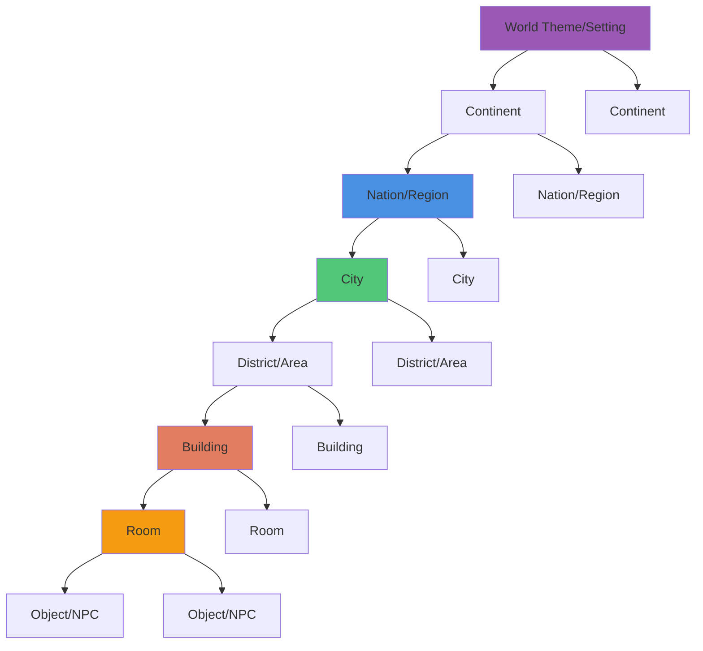

# Pattern: Hierarchical Cascade Generation

#pattern #generation #procedural #world-building

## Context

When generating large-scale worlds, the order of generation matters. Hierarchical Cascade defines how to structure generation from macro (world) to micro (objects) while maintaining consistency and theme coherence.

**Use this pattern when:**
- Building large procedurally generated worlds
- Need thematic consistency across scales
- Context inheritance is important (city style affects buildings)
- Story-driven worlds with overarching themes

## Forces

**Competing concerns:**

1. **Top-Down vs Bottom-Up**
   - Top-down: coherent themes, more upfront work, rigid structure
   - Bottom-up: flexible, JIT-friendly, risk of inconsistency

2. **Predetermined vs Emergent**
   - Predetermined hierarchy: predictable, structured
   - Emergent connections: flexible, organic, potentially chaotic

3. **Generation Cost vs Flexibility**
   - Full cascade upfront: expensive but complete context
   - Partial cascade: cheaper but must backfill context later

4. **Theme Control vs Variety**
   - Strict inheritance: consistent but repetitive
   - Loose inheritance: varied but potentially incoherent

## Solution

### Structure



### Generation Approaches

#### 1. Pure Top-Down Cascade

Generate everything from world → objects before gameplay starts.

```python
class TopDownGenerator:
    """Full world generation before gameplay"""

    def __init__(self, llm_client):
        self.llm = llm_client

    def generate_world(self, theme: str) -> World:
        """Generate complete world hierarchy"""
        # 1. Generate world/setting
        world = self._generate_world_theme(theme)

        # 2. Generate continents
        world.continents = [
            self._generate_continent(world, i)
            for i in range(world.continent_count)
        ]

        # 3. Generate nations (per continent)
        for continent in world.continents:
            continent.nations = [
                self._generate_nation(world, continent, i)
                for i in range(continent.nation_count)
            ]

        # 4. Generate cities (per nation)
        for continent in world.continents:
            for nation in continent.nations:
                nation.cities = [
                    self._generate_city(world, continent, nation, i)
                    for i in range(nation.city_count)
                ]

        # 5. Generate buildings (per city)
        for continent in world.continents:
            for nation in continent.nations:
                for city in nation.cities:
                    city.buildings = [
                        self._generate_building(world, nation, city, i)
                        for i in range(city.building_count)
                    ]

        # ... and so on
        return world

    def _generate_world_theme(self, theme: str) -> World:
        """Generate world-level context"""
        prompt = f"""Create a {theme} fantasy world:
- World name
- Overall theme/setting (medieval, steampunk, etc)
- Major geographical features
- General technology level
- Magic system (if any)
- Number of continents: 2-4

Format as JSON."""

        response = self.llm.complete(prompt, temperature=0.9)
        data = json.loads(response)

        return World(
            name=data["name"],
            theme=data["theme"],
            geography=data["geography"],
            tech_level=data["tech_level"],
            magic_system=data.get("magic_system"),
            continent_count=data["continent_count"]
        )

    def _generate_continent(self, world: World, index: int) -> Continent:
        """Generate continent within world context"""
        prompt = f"""Create continent {index + 1} for {world.name}:

World Theme: {world.theme}
Geography: {world.geography}
Tech Level: {world.tech_level}

Create a continent:
- Name
- Climate/terrain
- Dominant culture type
- Number of nations: 2-5

Must fit world theme. Format as JSON."""

        response = self.llm.complete(prompt, temperature=0.8)
        data = json.loads(response)

        return Continent(
            name=data["name"],
            parent_world=world.name,
            climate=data["climate"],
            terrain=data["terrain"],
            culture_type=data["culture_type"],
            nation_count=data["nation_count"]
        )

    def _generate_nation(self, world: World, continent: Continent,
                        index: int) -> Nation:
        """Generate nation within continent context"""
        prompt = f"""Create nation {index + 1} in {continent.name}:

World: {world.name} ({world.theme})
Continent: {continent.name}
Climate: {continent.climate}
Culture: {continent.culture_type}

Create a nation:
- Name
- Government type
- Primary industry
- Relationship with neighbors
- Number of major cities: 1-3

Must fit continent culture. Format as JSON."""

        response = self.llm.complete(prompt, temperature=0.7)
        data = json.loads(response)

        return Nation(
            name=data["name"],
            parent_continent=continent.name,
            government=data["government"],
            industry=data["industry"],
            relations=data["relations"],
            city_count=data["city_count"]
        )

    # ... similar methods for cities, buildings, rooms
```

**Pros:**
- Complete context for every level
- Thematically coherent
- No generation latency during gameplay
- Can preview entire world

**Cons:**
- Expensive upfront (many LLM calls)
- Long startup time
- Generates content that may never be seen
- Inflexible (hard to add new areas later)

#### 2. Pure Bottom-Up Generation

Generate only what's immediately needed, build context retroactively.

```python
class BottomUpGenerator:
    """Generate current location, infer parent context as needed"""

    def __init__(self, llm_client, cache):
        self.llm = llm_client
        self.cache = cache

    def generate_current_location(self, player_pos: str = None) -> Location:
        """Generate where player is right now"""
        if player_pos and self.cache.exists(player_pos):
            return self.cache.get(player_pos)

        # Generate immediate location
        location = self._generate_room()

        # Infer parent building (retroactive)
        location.parent = self._infer_building(location)

        # Infer parent city (retroactive)
        location.parent.parent = self._infer_city(location.parent)

        # Cache all
        self.cache.save_all([location, location.parent, location.parent.parent])

        return location

    def _generate_room(self) -> Room:
        """Generate current room with minimal context"""
        prompt = """Generate a room in a fantasy game:
- Room type (bedroom/shop/dungeon/etc)
- Brief description
- 2-3 NPCs or objects present
- Exits/connections

Format as JSON."""

        response = self.llm.complete(prompt, temperature=0.9)
        data = json.loads(response)

        return Room(
            id=f"room_{random_id()}",
            type=data["room_type"],
            description=data["description"],
            contents=data["contents"],
            exits=data["exits"]
        )

    def _infer_building(self, room: Room) -> Building:
        """Retroactively generate building that contains room"""
        prompt = f"""This room exists: {room.description}
Room type: {room.type}

What building contains this room?
- Building name
- Building type
- City it's in
- Brief description

Format as JSON."""

        response = self.llm.complete(prompt, temperature=0.7)
        data = json.loads(response)

        return Building(
            id=f"building_{random_id()}",
            name=data["name"],
            type=data["type"],
            city=data["city"],
            description=data["description"],
            rooms=[room.id]
        )

    def _infer_city(self, building: Building) -> City:
        """Retroactively generate city that contains building"""
        prompt = f"""This building exists: {building.name} ({building.type})
In city: {building.city}

Describe this city:
- City name (use "{building.city}" if appropriate)
- Size/population
- Government
- Notable features

Format as JSON."""

        response = self.llm.complete(prompt, temperature=0.6)
        data = json.loads(response)

        return City(
            id=f"city_{random_id()}",
            name=data["name"],
            size=data["size"],
            government=data["government"],
            features=data["features"],
            buildings=[building.id]
        )
```

**Pros:**
- Instant startup
- Flexible, can go anywhere
- Only generates needed content
- Easy to add new areas

**Cons:**
- Risk of inconsistency
- No overarching theme control
- Can't preview world
- May generate conflicting details

#### 3. Hybrid Cascade (Recommended)

Generate high-level theme top-down, details bottom-up on-demand.

```python
from dataclasses import dataclass
from typing import Dict, List, Optional
import json

@dataclass
class ThemeContext:
    """High-level world context"""
    world_name: str
    setting: str  # "medieval fantasy", "cyberpunk", etc
    tech_level: str
    magic_system: str
    dominant_cultures: List[str]
    major_locations: List[Dict]  # Stubs only

@dataclass
class Location:
    """Generated location with context inheritance"""
    id: str
    name: str
    type: str
    description: str
    parent_id: Optional[str]
    theme_tags: List[str]  # Inherited from parents
    generated_at: str  # "startup" or "runtime"

class HybridGenerator:
    """
    Top-down theme generation, bottom-up detail generation.
    Best of both worlds.
    """

    def __init__(self, llm_client, cache):
        self.llm = llm_client
        self.cache = cache
        self.theme_context = None

    def initialize_world(self, theme: str) -> ThemeContext:
        """
        Generate high-level world context (cheap, fast).
        Called once at startup.
        """
        prompt = f"""Create high-level context for a {theme} game world:

Generate:
1. World name
2. Setting description (2-3 sentences)
3. Technology level
4. Magic system (if any)
5. 3-5 dominant culture types
6. 5-10 major location stubs (name + type only, no details)

This provides context for future generation. Format as JSON."""

        response = self.llm.complete(prompt, temperature=0.9, max_tokens=500)
        data = json.loads(response)

        self.theme_context = ThemeContext(
            world_name=data["world_name"],
            setting=data["setting"],
            tech_level=data["tech_level"],
            magic_system=data.get("magic_system", "none"),
            dominant_cultures=data["cultures"],
            major_locations=data["major_locations"]
        )

        self.cache.save("theme_context", self.theme_context)
        return self.theme_context

    def generate_location(self, location_id: str,
                         parent_id: Optional[str] = None) -> Location:
        """
        Generate location detail on-demand (bottom-up).
        Inherits theme from context.
        """
        # Check cache
        if self.cache.exists(location_id):
            return self.cache.get(location_id)

        # Load theme context if not loaded
        if not self.theme_context:
            self.theme_context = self.cache.get("theme_context")

        # Get parent for context inheritance
        parent_tags = []
        parent_context = ""
        if parent_id:
            parent = self.cache.get(parent_id)
            parent_tags = parent.theme_tags
            parent_context = f"Parent: {parent.name} ({parent.type})\n"

        # Build prompt with inherited context
        prompt = f"""{parent_context}World: {self.theme_context.world_name}
Setting: {self.theme_context.setting}
Tech Level: {self.theme_context.tech_level}
Culture: {', '.join(self.theme_context.dominant_cultures)}
Theme Tags: {', '.join(parent_tags) if parent_tags else 'none'}

Generate a location for this world:
- Name
- Type
- Description (2-3 sentences)
- 2-3 theme tags (inherited from world/parent)
- Notable features

MUST fit world setting and parent context. Format as JSON."""

        response = self.llm.complete(prompt, temperature=0.8)
        data = json.loads(response)

        # Inherit tags from parent + add new tags
        theme_tags = list(set(parent_tags + data["theme_tags"]))

        location = Location(
            id=location_id,
            name=data["name"],
            type=data["type"],
            description=data["description"],
            parent_id=parent_id,
            theme_tags=theme_tags,
            generated_at="runtime"
        )

        self.cache.save(location_id, location)
        return location

    def get_starter_location(self) -> Location:
        """Get starting location from theme context"""
        if not self.theme_context:
            raise ValueError("World not initialized")

        # Use first major location as starter
        starter_stub = self.theme_context.major_locations[0]

        return self.generate_location(
            location_id=f"location_{starter_stub['name'].lower()}",
            parent_id=None
        )

    def expand_location(self, parent_location: Location,
                       child_count: int = 3) -> List[Location]:
        """Generate child locations (rooms, sub-areas)"""
        children = []

        for i in range(child_count):
            child_id = f"{parent_location.id}_child_{i}"
            child = self.generate_location(child_id, parent_location.id)
            children.append(child)

        return children
```

**Pros:**
- Fast startup (only generate theme)
- Thematically coherent (theme provides context)
- Flexible (details generated on-demand)
- Scalable (can expand indefinitely)

**Cons:**
- Still need to manage context inheritance
- Medium complexity
- Can't fully preview world

### Implementation Example

```python
# Usage example
if __name__ == "__main__":
    # Mock components
    class MockLLM:
        def complete(self, prompt, temperature, max_tokens=None):
            # Simulate world theme generation
            return json.dumps({
                "world_name": "Aethermoor",
                "setting": "A steampunk fantasy world where magic and machinery coexist",
                "tech_level": "Industrial revolution with magical enhancements",
                "magic_system": "Runic channeling through brass conduits",
                "cultures": ["Gear Dwarves", "Sky Elves", "Steam Gnomes"],
                "major_locations": [
                    {"name": "Cogwheel City", "type": "capital"},
                    {"name": "Ironforge Mountains", "type": "mining region"},
                    {"name": "Cloudspire", "type": "floating city"}
                ]
            })

    class SimpleCache:
        def __init__(self):
            self.data = {}

        def exists(self, key):
            return key in self.data

        def get(self, key):
            return self.data.get(key)

        def save(self, key, value):
            self.data[key] = value

    # Initialize
    cache = SimpleCache()
    generator = HybridGenerator(MockLLM(), cache)

    # Step 1: Generate world theme (startup, cheap)
    theme = generator.initialize_world("steampunk fantasy")
    print(f"World: {theme.world_name}")
    print(f"Setting: {theme.setting}")

    # Step 2: Get starting location (JIT)
    start = generator.get_starter_location()
    print(f"\nStarting location: {start.name}")

    # Step 3: Expand as player explores (JIT)
    children = generator.expand_location(start, child_count=3)
    print(f"\nGenerated {len(children)} child locations")
```

## Consequences

### Benefits

1. **Thematic Coherence**: Parent context ensures consistency
2. **Scalability**: Can expand world infinitely
3. **Context Rich**: Child elements inherit parent attributes
4. **Narrative Control**: Top-level theme guides all generation
5. **Memory Efficient**: Only active branch in memory

### Liabilities

1. **Context Propagation**: Must track and pass parent context
2. **Backfilling Cost**: Bottom-up requires retroactive parent generation
3. **Rigid Top Levels**: High-level decisions constrain future options
4. **Complexity**: More complex than flat generation

## Related Patterns

- [[generation/jit-generation|Just-In-Time Generation]] - When to trigger cascade
- [[generation/context-inheritance|Context Inheritance]] - How to pass context down
- [[generation/template-meta-generation|Template Meta-Generation]] - Alternative to LLM cascade
- [[state/scene-based-state|Scene-Based State]] - Where to store generated hierarchy

## Source

**Original Discussions:**
- January-February 2024: Top-down vs bottom-up debates
- Contributors: [[User-50h100a]], [[User-veritasr]], [[User-monkeyrithms]]

**Key Quotes:**

> "hierarchical generation is probably the way to go: setting, geography, municipality, locality, room, object" - 50h100a

> "Do I go bottom up or top down? like current room -> building-> city. Or is it top down, world -> continent -> nation -> province -> city -> building -> room" - veritasr

> "it depends on the kind of game it is. If it's procedurally generated like this, bottom-up is better. If it's open-world with story, top-down is better" - monkeyrithms

> "There is some benefit to having an initial top-down generation scheme to populate your 'theme manager' with instructions for its bottom-up generation scheme. So there is also the hybrid approach" - monkeyrithms

> "I do a mixture. I have some high level stuff (nations, etc.) just to give a little depth, but most of what I do is bottom up. The top down is just to add enough to the setting to work with." - veritasr

> "the problem with procgen is that it must be generated top-down, but can only be explored bottom-up" - 50h100a

> "allow yourself to generate stubs, so you can go top-down without filling the entire tree" - 50h100a

**Referenced in:**
- [[01-Architecture-and-Design|Architecture and Design Thread]]
- [[05-State-Management|State Management Thread]]

## Implementation in ChatBotRPG

**Status**: ✅ **EXACT MATCH** - Character generation follows exact top-down cascade

**Source Files**:
- `src/generate/generate_actor.py` (lines 23-27) - Generation order constant
- `src/generate/generate_actor.py` (lines 50-200) - Cascading generation logic

### Production Example: Character Generation Cascade

**File**: `src/generate/generate_actor.py` (lines 23-27)

```python
GENERATION_ORDER: typing.Final[list[str]] = [
    "name", "description", "personality", "appearance", "goals", "story", "equipment"
]
```

**Implementation**: Each field is generated in strict order, with previous fields injected as context:

```
Name (top-level identity)
  ↓ context: {name}
Description (who they are, what they do)
  ↓ context: {name, description}
Personality (behavioral traits)
  ↓ context: {name, description, personality}
Appearance (physical traits)
  ↓ context: {name, description, personality, appearance}
Goals (motivations)
  ↓ context: {name, description, personality, appearance, goals}
Story (background)
  ↓ context: {name, description, personality, appearance, goals, story}
Equipment (16-slot layered system)
  ↓ context: {all above fields}
```

### Production Code: Context Accumulation

**File**: `src/generate/generate_actor.py` (lines 86-92)

```python
prompt = f"""{instruction_prefix}{name_prompt_instruction}

Current Character Sheet:
{context}

New Name:"""
```

Each generation step receives ALL previously generated fields as context, ensuring consistency.

### Production Example: Equipment Cascade

**File**: `src/generate/generate_actor.py` (lines 115-165)

The equipment generation is the final step in the cascade and receives the most context:

```python
prompt = (
    f"{instruction_prefix}You are an expert wardrobe designer. "
    f"Given the following character information for {character_name}, "
    "generate a JSON object representing the character's worn equipment. "
    "The equipment should match the character's theme, type, and station. "
    "Respect the genre (e.g., medieval, modern, sci-fi)."
    "\n\n"
    "Current Character Sheet:\n"
    f"{context}"  # Includes name, description, personality, appearance, goals, story
    "\n\n"
    "The JSON object MUST contain exactly these keys: "
    f'{", ".join(EQUIPMENT_JSON_KEYS)}.'  # 16 slots: head, neck, shoulders, hands, etc.
)
```

**Result**: Equipment is always thematically consistent with character (e.g., knight gets armor, mage gets robes).

### Validation from Production

**From**: [[chatbotrpg-analysis/validation/01-Discord-Claims-Validation|Discord Claims Validation]] (lines 199-217)

```
Status: ✅ VALIDATED

Evidence:
- File: src/generate/generate_actor.py
  - Lines 23-27: GENERATION_ORDER constant
    ["name", "description", "personality", "appearance", "goals", "story", "equipment"]
  - Lines 52-60: Enforces generation order
  - Lines 56-58: Name forced to first position

Conclusion: ✅ EXACT MATCH - Exact order as documented
```

### Why Top-Down Works for Characters

**From Production Analysis**:

1. **Name constrains description**: "Thorgar" → warrior/dwarf, not elf mage
2. **Description constrains personality**: "Grizzled veteran" → stern/practical traits
3. **Personality constrains appearance**: "Jovial, friendly" → warm expression, approachable
4. **Appearance constrains equipment**: "Tall, muscular" → plate armor fits, not robes

**Token Efficiency**:
- Name: 256 tokens
- Description/Personality/Appearance: 256 tokens each
- Equipment: 512 tokens (most complex, needs full context)

### Genre-Aware Cascade

ChatBotRPG's equipment generator demonstrates genre awareness in the cascade:

```python
"Respect the genre (e.g., medieval, modern, sci-fi)."

Examples (adapt to character & genre):
  head: (Modern: baseball cap, sunglasses | Medieval: leather hood, metal helm | Empty: "")
  left_hand/right_hand (WORN): (Modern: watch, gloves, rings | Medieval: leather gloves, signet ring, bracers | Empty: "")
```

**Result**: Top-level genre context propagates through entire cascade.

### Related Implementation Files

- [[chatbotrpg-analysis/patterns/01-Pattern-to-Code-Mapping|Pattern-to-Code Mapping]] - Hierarchical cascade validation (lines 669-721)
- [[chatbotrpg-analysis/prompts/01-Extracted-Prompts-Index|Extracted Prompts]] - All character generation prompts (lines 47-244)

## Tags

#pattern #generation #hierarchical #world-building #procedural #context-inheritance #chatbotrpg-validated
