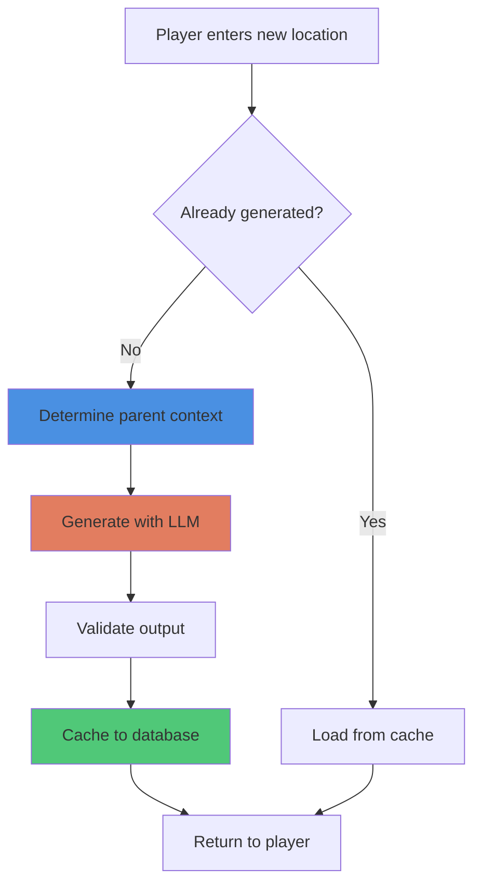

# Pattern: Just-In-Time Generation (JITG)

#pattern #generation #procedural #performance

## Context

Generating an entire game world upfront is expensive (time, tokens, memory) and wasteful—most content will never be encountered. Just-In-Time Generation defers content creation until the moment it's needed, then caches the result for consistency.

**Use this pattern when:**
- Building procedurally generated worlds
- Token budgets are limited
- Players explore non-linearly
- World scale is large or unbounded
- Generation latency is acceptable (1-5 seconds)

## Forces

**Competing concerns:**

1. **Upfront Cost vs Runtime Latency**
   - Full pre-generation: expensive upfront, instant access
   - JIT: cheap startup, generates on-demand (adds latency)

2. **Consistency vs Flexibility**
   - Pre-generated content is fixed and consistent
   - JIT risks inconsistency if not cached properly

3. **Detail Level vs Performance**
   - Deep generation (full NPC backstories) is slow
   - Shallow generation (name only) is fast but limited

4. **Context Requirements**
   - JIT needs parent context to generate children
   - Must backpropagate up hierarchy to establish context

## Solution

### Structure



### Generation Strategies

#### 1. Stub-Based JIT

Generate minimal "stubs" upfront, fill details on-demand:

```python
# Initial stub (instant)
location = {
    "id": "tavern_001",
    "type": "tavern",
    "parent": "city_stonevale",
    "name": None,  # Generate when needed
    "description": None,  # Generate when needed
    "npcs": [],  # Generate when needed
}

# Full generation (when player enters)
def hydrate_location(stub):
    if not stub["name"]:
        stub["name"] = generate_name(stub["type"], stub["parent"])
    if not stub["description"]:
        stub["description"] = generate_description(stub)
    if not stub["npcs"]:
        stub["npcs"] = generate_npcs(stub, count=random.randint(2, 5))
    return stub
```

#### 2. Hierarchical Backpropagation

When generating a location, ensure parent context exists:

```python
def generate_location(location_id):
    """Generate location and ensure parent context exists"""
    location = db.get(location_id)

    # Backpropagate up the tree
    parent_chain = []
    current = location
    while current["parent"]:
        parent = db.get(current["parent"])
        if not parent["generated"]:
            parent_chain.append(parent)
        current = parent

    # Generate from top-down
    for parent in reversed(parent_chain):
        generate_and_cache(parent)

    # Finally generate target
    return generate_and_cache(location)
```

#### 3. Lazy NPC Generation

NPCs don't need full details until player interacts:

```python
class NPC:
    def __init__(self, npc_id, location):
        self.id = npc_id
        self.location = location
        self.name = None  # Generated on first mention
        self.personality = None  # Generated on first conversation
        self.inventory = None  # Generated on first trade
        self.backstory = None  # Generated on deeper interaction

    def get_name(self):
        """Lazy name generation"""
        if not self.name:
            self.name = llm_generate_name(self.location, self.id)
            db.save_npc(self)
        return self.name

    def get_personality(self):
        """Lazy personality generation"""
        if not self.personality:
            self.personality = llm_generate_personality(
                name=self.name,
                location=self.location
            )
            db.save_npc(self)
        return self.personality
```

### Implementation

#### Complete JITG System

```python
from typing import Dict, Any, Optional, List
from dataclasses import dataclass, field
import hashlib
import json

@dataclass
class GeneratedEntity:
    """Cached generated content"""
    id: str
    type: str
    parent_id: Optional[str]
    data: Dict[str, Any]
    generated: bool = False
    children: List[str] = field(default_factory=list)

class JITGenerator:
    """Just-In-Time content generation with caching"""

    def __init__(self, llm_client, cache_db):
        self.llm = llm_client
        self.cache = cache_db

    def get_or_generate(self, entity_id: str, entity_type: str,
                       parent_id: Optional[str] = None) -> GeneratedEntity:
        """
        Get entity from cache or generate if needed.
        Ensures parent context exists before generation.
        """
        # Check cache first
        cached = self.cache.get(entity_id)
        if cached and cached.generated:
            return cached

        # Ensure parent context exists
        parent_context = None
        if parent_id:
            parent_context = self.get_or_generate(
                parent_id,
                self._infer_parent_type(entity_type),
                None
            )

        # Generate new entity
        entity = self._generate(entity_id, entity_type, parent_context)

        # Cache result
        self.cache.save(entity)

        return entity

    def _generate(self, entity_id: str, entity_type: str,
                  parent: Optional[GeneratedEntity]) -> GeneratedEntity:
        """Generate entity with LLM"""
        prompt = self._build_generation_prompt(entity_type, parent)

        response = self.llm.complete(
            prompt=prompt,
            temperature=0.8,
            max_tokens=300
        )

        data = self._parse_generation(response, entity_type)

        entity = GeneratedEntity(
            id=entity_id,
            type=entity_type,
            parent_id=parent.id if parent else None,
            data=data,
            generated=True
        )

        # Link to parent
        if parent:
            parent.children.append(entity_id)
            self.cache.save(parent)

        return entity

    def _build_generation_prompt(self, entity_type: str,
                                 parent: Optional[GeneratedEntity]) -> str:
        """Build context-aware generation prompt"""
        if entity_type == "location":
            return self._build_location_prompt(parent)
        elif entity_type == "npc":
            return self._build_npc_prompt(parent)
        elif entity_type == "item":
            return self._build_item_prompt(parent)
        else:
            raise ValueError(f"Unknown entity type: {entity_type}")

    def _build_location_prompt(self, parent: Optional[GeneratedEntity]) -> str:
        """Generate location within parent context"""
        if not parent:
            # Root location
            return """Generate a fantasy location:
- Name
- Type (city/tavern/dungeon/wilderness)
- Brief description (2-3 sentences)
- Atmosphere/mood

Format as JSON."""

        # Child location
        parent_data = parent.data
        return f"""Generate a location within {parent_data['name']}:

Parent Location: {parent_data['name']}
Parent Type: {parent.type}
Parent Description: {parent_data['description']}

Create a new location that fits this context:
- Name
- Type
- Description (2-3 sentences)
- How it connects to parent

Format as JSON."""

    def _build_npc_prompt(self, parent: Optional[GeneratedEntity]) -> str:
        """Generate NPC for location"""
        if not parent:
            raise ValueError("NPCs require parent location")

        location_data = parent.data
        return f"""Generate an NPC for {location_data['name']}:

Location: {location_data['name']} ({parent.type})
Atmosphere: {location_data.get('atmosphere', 'neutral')}

Create an NPC:
- Name
- Role/occupation
- Brief personality (1-2 traits)
- Reason they're here

Format as JSON."""

    def _build_item_prompt(self, parent: Optional[GeneratedEntity]) -> str:
        """Generate item for location/NPC"""
        context = parent.data if parent else {}
        return f"""Generate an item:

Context: {context.get('name', 'unknown location')}

Create an item:
- Name
- Type (weapon/armor/consumable/misc)
- Description
- Special properties (if any)

Format as JSON."""

    def _parse_generation(self, response: str, entity_type: str) -> Dict[str, Any]:
        """Parse LLM output into structured data"""
        try:
            # Try JSON parsing first
            return json.loads(response)
        except json.JSONDecodeError:
            # Fallback: extract with regex or use defaults
            return {
                "name": "Generated " + entity_type,
                "description": response[:200],
                "raw_output": response
            }

    def _infer_parent_type(self, child_type: str) -> str:
        """Infer parent type from child type"""
        hierarchy = {
            "room": "building",
            "building": "city",
            "city": "region",
            "region": "world",
            "npc": "location",
            "item": "location"
        }
        return hierarchy.get(child_type, "location")

    def generate_neighbors(self, entity_id: str, count: int = 3) -> List[GeneratedEntity]:
        """Generate neighboring entities (siblings)"""
        entity = self.cache.get(entity_id)
        if not entity:
            raise ValueError(f"Entity {entity_id} not found")

        neighbors = []
        for i in range(count):
            neighbor_id = f"{entity.parent_id}_sibling_{i}"
            if not self.cache.exists(neighbor_id):
                neighbor = self.get_or_generate(
                    neighbor_id,
                    entity.type,
                    entity.parent_id
                )
                neighbors.append(neighbor)

        return neighbors


# Cache implementation
class GenerationCache:
    """Simple cache for generated entities"""

    def __init__(self, db_path: str):
        self.db_path = db_path
        self._cache = {}

    def get(self, entity_id: str) -> Optional[GeneratedEntity]:
        """Get from memory cache or load from DB"""
        if entity_id in self._cache:
            return self._cache[entity_id]

        # Load from DB
        entity = self._load_from_db(entity_id)
        if entity:
            self._cache[entity_id] = entity
        return entity

    def save(self, entity: GeneratedEntity):
        """Save to memory and DB"""
        self._cache[entity.id] = entity
        self._save_to_db(entity)

    def exists(self, entity_id: str) -> bool:
        """Check if entity exists"""
        return entity_id in self._cache or self._exists_in_db(entity_id)

    def _load_from_db(self, entity_id: str) -> Optional[GeneratedEntity]:
        """Load from database"""
        # Implementation depends on DB choice
        # For simplicity, using JSON files
        import os
        path = f"{self.db_path}/{entity_id}.json"
        if os.path.exists(path):
            with open(path, 'r') as f:
                data = json.load(f)
                return GeneratedEntity(**data)
        return None

    def _save_to_db(self, entity: GeneratedEntity):
        """Save to database"""
        import os
        os.makedirs(self.db_path, exist_ok=True)
        path = f"{self.db_path}/{entity.id}.json"
        with open(path, 'w') as f:
            json.dump({
                "id": entity.id,
                "type": entity.type,
                "parent_id": entity.parent_id,
                "data": entity.data,
                "generated": entity.generated,
                "children": entity.children
            }, f, indent=2)

    def _exists_in_db(self, entity_id: str) -> bool:
        """Check if exists in DB"""
        import os
        return os.path.exists(f"{self.db_path}/{entity_id}.json")


# Usage Example
if __name__ == "__main__":
    # Mock LLM client
    class MockLLM:
        def complete(self, prompt, temperature, max_tokens):
            # Simulate LLM generation
            return '''
            {
                "name": "The Rusty Flagon",
                "type": "tavern",
                "description": "A dimly lit tavern with worn wooden tables and a crackling fireplace.",
                "atmosphere": "cozy but suspicious"
            }
            '''

    # Initialize
    cache = GenerationCache("./generated_cache")
    generator = JITGenerator(MockLLM(), cache)

    # Generate city (parent)
    city = generator.get_or_generate("city_001", "city", None)
    print(f"Generated city: {city.data.get('name', 'Unknown')}")

    # Generate tavern in city (JIT)
    tavern = generator.get_or_generate("tavern_001", "location", "city_001")
    print(f"Generated tavern: {tavern.data.get('name', 'Unknown')}")

    # Generate NPC in tavern (JIT)
    npc = generator.get_or_generate("npc_001", "npc", "tavern_001")
    print(f"Generated NPC: {npc.data.get('name', 'Unknown')}")

    # Second request for tavern (cached, no LLM call)
    tavern_cached = generator.get_or_generate("tavern_001", "location", "city_001")
    print(f"Cached tavern: {tavern_cached.data.get('name', 'Unknown')}")
```

## Consequences

### Benefits

1. **Reduced Startup Time**: Game starts immediately, no waiting for world generation
2. **Token Efficiency**: Only pay for content actually encountered
3. **Scalability**: World can be arbitrarily large
4. **Memory Efficiency**: Only active content loaded in memory
5. **Flexibility**: Can adjust generation quality based on player progression

### Liabilities

1. **Generation Latency**: Players wait 1-5 seconds when entering new areas
2. **Context Requirements**: Must maintain parent hierarchy for coherent generation
3. **Consistency Risk**: Without caching, same entity could generate differently
4. **Complexity**: More complex than full pre-generation
5. **Cache Management**: Need to handle cache invalidation and updates

### Performance Characteristics

**Upfront cost:**
- Full generation: O(n) where n = all possible locations
- JIT: O(1) - instant startup

**Runtime cost:**
- Full generation: O(1) - instant access
- JIT: O(g + c) where g = generation time, c = cache lookup

**Memory:**
- Full generation: O(n) - entire world in memory
- JIT: O(a) where a = active/visited locations

### Optimization Strategies

1. **Predictive Generation**: Generate likely next locations during idle time
2. **Layered Detail**: Generate basic details immediately, enrich later
3. **Batch Generation**: Generate multiple related entities in one LLM call
4. **Streaming Generation**: Start displaying partial results while generating
5. **Background Workers**: Offload generation to background threads/processes

## Related Patterns

- [[generation/hierarchical-cascade|Hierarchical Cascade]] - Determines generation order
- [[state/scene-based-state|Scene-Based State]] - Triggers for JIT generation
- [[architectural/program-first-architecture|Program-First Architecture]] - Where JIT fits
- [[generation/template-meta-generation|Template Meta-Generation]] - Alternative approach

## Source

**Original Discussions:**
- January 2024: Initial JIT concept
- February 2024: veritasr's implementation in ReallmCraft
- Contributors: [[User-veritasr]], [[User-50h100a]], [[User-ycros]], [[User-monkeyrithms]]

**Key Quotes:**

> "probably need some sort of JIT generation." - veritasr

> "JIT gen everywhere possible... crowds are full of nameless people until the player stops and asks one what their name is" - 50h100a

> "if you take a procgen approach, you can JIT the details without a bunch of effort. Like rimworld for example" - veritasr

> "in the case of the tavern example above, the children represent important / rooms of note. Sort of working in a JITG (Just In Time Generation) mindset, where things don't need to exist for the most part until they're needed. But once they're needed they need to be generated with fixed values, so rules can be applied to them." - veritasr

> "basically limitless potential until it exists as a fact. Once it becomes a fact, though it needs to be set in stone." - veritasr

**Referenced in:**
- [[01-Architecture-and-Design|Architecture and Design Thread]]

## Implementation Notes

### When to Generate

**Immediate generation:**
- Player enters new location
- Player asks about specific NPC
- Quest requires specific item/location
- Combat encounter needs enemy stats

**Deferred generation:**
- Distant locations (not adjacent)
- Background NPCs (until player interacts)
- Item details (until player examines)
- Full backstories (until player investigates)

### Cache Invalidation

```python
class CachePolicy:
    """Determine what can be regenerated"""

    @staticmethod
    def can_regenerate(entity: GeneratedEntity) -> bool:
        """Determine if entity can be regenerated"""
        # Never regenerate if player has interacted
        if entity.data.get("player_visited"):
            return False

        # Can regenerate if only referenced, not visited
        if entity.data.get("mentioned_only"):
            return True

        # Time-based: regenerate if not visited in 24h game time
        if entity.data.get("last_visit_time"):
            hours_since = get_game_hours_since(entity.data["last_visit_time"])
            return hours_since > 24

        return False
```

### Error Handling

```python
def safe_generate(generator, entity_id, entity_type, parent_id, max_retries=3):
    """Generate with fallback"""
    for attempt in range(max_retries):
        try:
            return generator.get_or_generate(entity_id, entity_type, parent_id)
        except Exception as e:
            if attempt == max_retries - 1:
                # Use template fallback
                return create_template_entity(entity_type)
            time.sleep(1)  # Brief delay before retry
```

## Tags

#pattern #generation #jit #procedural #performance #caching #lazy-loading
