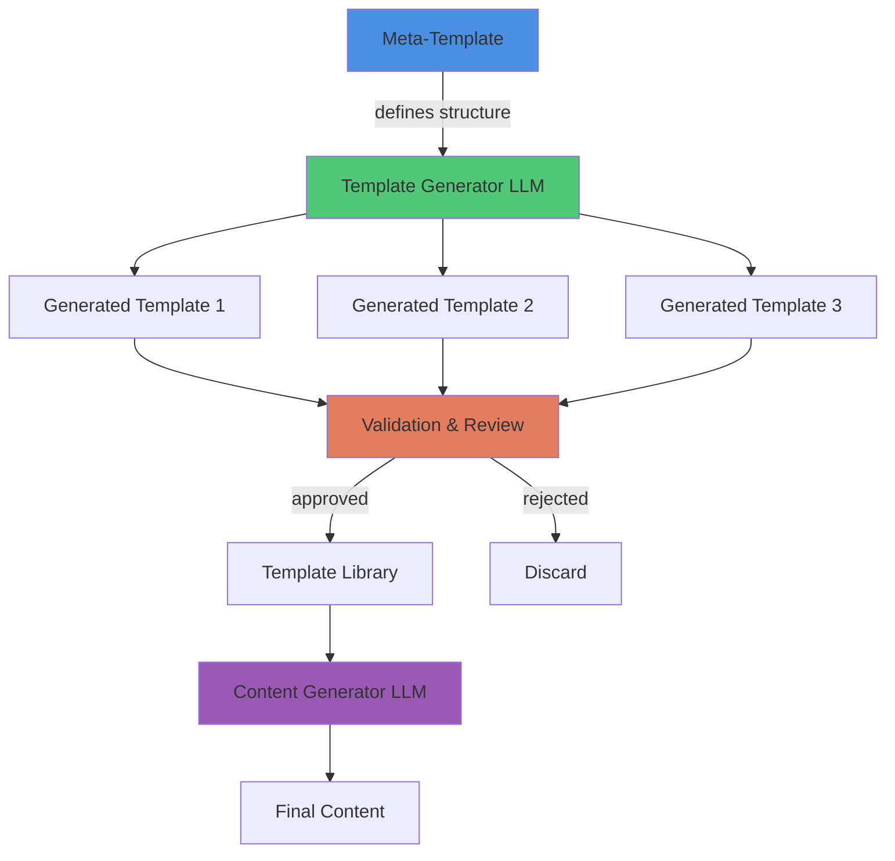

# Pattern: Template Meta-Generation

#pattern #generation #templates #meta #bootstrapping

## Context

Creating templates for every possible entity type (NPCs, locations, items, quests) is tedious manual work. Templates need variety to prevent repetitive content, but hand-writing hundreds of templates isn't scalable. Solution: Use LLMs to generate the templates that will guide future LLM generation. This "meta-generation" creates variety while maintaining structure.

**Use this pattern when:**
- Need many similar but varied templates
- Manually creating templates is too time-consuming
- Want systematic variety in generated content
- Building content generation pipelines
- Need to bootstrap a template library quickly

## Forces

- **Variety vs Consistency**: Need diverse templates but consistent structure
- **Quality Control**: Generated templates may have errors
- **Bootstrapping Paradox**: Need templates to generate templates
- **Curation Cost**: Still need to review generated templates
- **Schema Evolution**: Templates must stay aligned with data structures

## Solution

### Structure



### Conceptual Layers

**Layer 1: Meta-Template (Hand-Written)**
- Defines template structure
- Specifies required fields
- Provides examples of variety

**Layer 2: Generated Templates (LLM-Created)**
- Multiple variations following structure
- Fills in specific themes/archetypes
- Creates diverse options

**Layer 3: Final Content (Template-Guided)**
- Uses generated templates
- Produces actual game entities
- Benefits from structured variety

### Core Components

#### 1. Meta-Template Definition

```python
from dataclasses import dataclass
from typing import List, Dict, Any, Optional
from enum import Enum

class FieldType(Enum):
    """Types of template fields"""
    STATIC_VALUE = "static"          # Hardcoded value
    RANDOM_CHOICE = "choice"         # Pick from options
    LLM_GENERATED = "llm"            # Generate with LLM
    NUMERIC_RANGE = "range"          # Random number
    INHERITED = "inherited"          # From parent context

@dataclass
class FieldDefinition:
    """Definition of a template field"""
    name: str
    field_type: FieldType
    description: str
    required: bool = True

    # For RANDOM_CHOICE
    options: Optional[List[str]] = None

    # For NUMERIC_RANGE
    min_value: Optional[int] = None
    max_value: Optional[int] = None

    # For LLM_GENERATED
    prompt_template: Optional[str] = None

    # For INHERITED
    parent_field: Optional[str] = None


class MetaTemplate:
    """
    Meta-template: defines structure for generating templates.

    This is the "template for templates" - hand-written once,
    generates many specific templates.
    """

    def __init__(
        self,
        name: str,
        entity_type: str,  # character, location, item, quest
        description: str
    ):
        self.name = name
        self.entity_type = entity_type
        self.description = description
        self.fields: List[FieldDefinition] = []

    def add_field(self, field: FieldDefinition):
        """Add field definition"""
        self.fields.append(field)

    def to_prompt(self) -> str:
        """
        Convert meta-template to prompt for LLM.

        This prompt asks LLM to generate specific templates.
        """
        prompt = f"""You are a template designer for a game engine.

Generate 5 diverse {self.entity_type} templates with the following structure:

{self.description}

Required fields:
"""

        for field in self.fields:
            prompt += f"\n- {field.name}: {field.description}"

            if field.field_type == FieldType.RANDOM_CHOICE:
                prompt += f" (choose from: {', '.join(field.options)})"
            elif field.field_type == FieldType.NUMERIC_RANGE:
                prompt += f" (range: {field.min_value}-{field.max_value})"
            elif field.field_type == FieldType.LLM_GENERATED:
                prompt += f" (generated via: {field.prompt_template})"

        prompt += """

For each template, provide:
1. Template name
2. Theme/archetype
3. Values for each field

Output format (JSON array):
[
  {
    "template_name": "...",
    "theme": "...",
    "fields": {...}
  }
]
"""

        return prompt


# Example: Character Template Meta-Template
character_meta = MetaTemplate(
    name="RPG Character Templates",
    entity_type="character",
    description="NPC archetypes for fantasy RPG"
)

character_meta.add_field(FieldDefinition(
    name="archetype",
    field_type=FieldType.STATIC_VALUE,
    description="Character archetype/role (e.g., 'Guard', 'Merchant', 'Wizard')"
))

character_meta.add_field(FieldDefinition(
    name="personality_traits",
    field_type=FieldType.RANDOM_CHOICE,
    description="Dominant personality traits",
    options=["friendly", "gruff", "mysterious", "cheerful", "suspicious", "wise"]
))

character_meta.add_field(FieldDefinition(
    name="greeting_style",
    field_type=FieldType.LLM_GENERATED,
    description="How this character greets strangers",
    prompt_template="Generate a greeting for a {archetype} who is {personality_traits}"
))

character_meta.add_field(FieldDefinition(
    name="base_stats",
    field_type=FieldType.NUMERIC_RANGE,
    description="Stat values",
    min_value=3,
    max_value=18
))
```

#### 2. Template Generator

```python
import json
from typing import List

class TemplateGenerator:
    """
    Generates specific templates from meta-templates.

    Uses LLM to create variety from structure.
    """

    def __init__(self, llm_client):
        self.llm = llm_client

    def generate_templates(
        self,
        meta_template: MetaTemplate,
        count: int = 5,
        temperature: float = 0.9
    ) -> List[Dict[str, Any]]:
        """
        Generate multiple templates from meta-template.

        High temperature for variety.
        """
        prompt = meta_template.to_prompt()

        # Request count templates
        prompt = prompt.replace(
            "Generate 5",
            f"Generate {count}"
        )

        response = self.llm.complete(
            prompt,
            temperature=temperature,
            max_tokens=2048
        )

        # Parse JSON response
        try:
            templates = json.loads(response)
            return templates
        except json.JSONDecodeError:
            # Fallback: try to extract JSON from response
            return self._extract_json(response)

    def _extract_json(self, text: str) -> List[Dict[str, Any]]:
        """Extract JSON from potentially messy LLM output"""
        import re

        # Find JSON array
        match = re.search(r'\[.*\]', text, re.DOTALL)
        if match:
            try:
                return json.loads(match.group(0))
            except:
                pass

        return []


# Usage example
generator = TemplateGenerator(llm_client)

# Generate 10 character templates
templates = generator.generate_templates(
    character_meta,
    count=10,
    temperature=0.9
)

print(f"Generated {len(templates)} character templates")
for template in templates:
    print(f"- {template['template_name']}: {template['theme']}")
```

#### 3. Template Library Management

```python
from pathlib import Path

class TemplateLibrary:
    """
    Manages collection of generated templates.

    Handles storage, retrieval, validation, and curation.
    """

    def __init__(self, library_path: Path):
        self.library_path = library_path
        self.library_path.mkdir(exist_ok=True, parents=True)

        self.templates: Dict[str, List[Dict[str, Any]]] = {}
        self.load_library()

    def load_library(self):
        """Load all templates from disk"""
        for entity_dir in self.library_path.iterdir():
            if entity_dir.is_dir():
                entity_type = entity_dir.name
                self.templates[entity_type] = []

                for template_file in entity_dir.glob("*.json"):
                    with open(template_file, 'r') as f:
                        template = json.load(f)
                        self.templates[entity_type].append(template)

    def save_template(
        self,
        entity_type: str,
        template: Dict[str, Any],
        reviewed: bool = False
    ):
        """Save generated template to library"""
        entity_dir = self.library_path / entity_type
        entity_dir.mkdir(exist_ok=True)

        # Generate filename
        template_name = template.get('template_name', 'unnamed')
        filename = template_name.lower().replace(' ', '_') + '.json'

        # Add metadata
        template['_reviewed'] = reviewed
        template['_generated_date'] = datetime.now().isoformat()

        # Save
        with open(entity_dir / filename, 'w') as f:
            json.dump(template, f, indent=2)

        # Update cache
        if entity_type not in self.templates:
            self.templates[entity_type] = []
        self.templates[entity_type].append(template)

    def get_templates(
        self,
        entity_type: str,
        reviewed_only: bool = False
    ) -> List[Dict[str, Any]]:
        """Get templates of a type"""
        templates = self.templates.get(entity_type, [])

        if reviewed_only:
            templates = [t for t in templates if t.get('_reviewed', False)]

        return templates

    def get_random_template(self, entity_type: str) -> Optional[Dict[str, Any]]:
        """Get random template for entity type"""
        templates = self.get_templates(entity_type, reviewed_only=True)

        if not templates:
            # Fall back to unreviewed
            templates = self.get_templates(entity_type, reviewed_only=False)

        if templates:
            import random
            return random.choice(templates)

        return None

    def generate_and_store(
        self,
        meta_template: MetaTemplate,
        generator: TemplateGenerator,
        count: int = 10
    ):
        """
        Generate templates and add to library.

        Convenience method for bootstrapping library.
        """
        print(f"Generating {count} {meta_template.entity_type} templates...")

        templates = generator.generate_templates(meta_template, count)

        for template in templates:
            self.save_template(
                meta_template.entity_type,
                template,
                reviewed=False  # Needs review
            )

        print(f"Generated {len(templates)} templates (awaiting review)")
```

#### 4. Content Generation Using Templates

```python
class ContentGenerator:
    """
    Generate final content using template library.

    This is Layer 3: using generated templates to create game entities.
    """

    def __init__(
        self,
        llm_client,
        template_library: TemplateLibrary
    ):
        self.llm = llm_client
        self.library = template_library

    def generate_entity(
        self,
        entity_type: str,
        context: Dict[str, Any] = None,
        template_name: Optional[str] = None
    ) -> Dict[str, Any]:
        """
        Generate entity using template from library.

        If template_name not specified, picks random template.
        """
        # Get template
        if template_name:
            templates = self.library.get_templates(entity_type)
            template = next(
                (t for t in templates if t['template_name'] == template_name),
                None
            )
        else:
            template = self.library.get_random_template(entity_type)

        if not template:
            raise ValueError(f"No template found for {entity_type}")

        # Build prompt from template
        prompt = self._build_prompt_from_template(template, context)

        # Generate
        response = self.llm.complete(prompt, temperature=0.8)

        # Parse and return
        return self._parse_entity(response, template)

    def _build_prompt_from_template(
        self,
        template: Dict[str, Any],
        context: Optional[Dict[str, Any]]
    ) -> str:
        """Build generation prompt from template"""
        prompt = f"Generate a {template.get('theme', 'character')} with these attributes:\n\n"

        for field, value in template.get('fields', {}).items():
            prompt += f"- {field}: {value}\n"

        if context:
            prompt += "\nAdditional context:\n"
            for key, val in context.items():
                prompt += f"- {key}: {val}\n"

        prompt += "\nOutput as JSON with all fields filled in."

        return prompt

    def _parse_entity(
        self,
        response: str,
        template: Dict[str, Any]
    ) -> Dict[str, Any]:
        """Parse generated entity"""
        try:
            return json.loads(response)
        except:
            # Fallback parsing
            return {"raw": response, "template": template['template_name']}


# Complete workflow
if __name__ == "__main__":
    # Setup
    library = TemplateLibrary(Path("./template_library"))
    generator = TemplateGenerator(llm_client)

    # Step 1: Generate templates from meta-template
    library.generate_and_store(
        character_meta,
        generator,
        count=20
    )

    # Step 2: Review and mark good templates
    # (In real system, this would be UI-driven)
    templates = library.get_templates("character")
    for template in templates[:5]:  # Approve first 5
        template['_reviewed'] = True
        library.save_template("character", template, reviewed=True)

    # Step 3: Use templates to generate actual content
    content_gen = ContentGenerator(llm_client, library)

    npc = content_gen.generate_entity(
        "character",
        context={"location": "tavern", "mood": "busy"}
    )

    print(f"Generated NPC: {npc}")
```

## Consequences

### Benefits

1. **Scalability**: Generate hundreds of templates quickly
2. **Variety**: Each template is unique while following structure
3. **Consistency**: All templates conform to schema
4. **Bootstrapping**: Kickstart content pipelines fast
5. **Curation**: Review and improve generated templates over time

### Liabilities

1. **Quality Control**: Generated templates need review
2. **Two-Step Generation**: More complexity than direct generation
3. **Meta-Template Design**: Requires careful upfront design
4. **Storage Overhead**: Templates must be stored
5. **Template Drift**: Templates may become outdated

### When To Use

**Use Template Meta-Generation When:**
- Need 10+ templates of same category
- Templates follow consistent structure
- Variety is important
- Manual creation too slow

**Skip Template Meta-Generation When:**
- Only need 1-3 templates (hand-write them)
- Templates are very simple
- Structure varies significantly
- Quality requirements are extremely high

### Real-World Examples

**veritasr's Implementation:**
- Generated templates for: characters, locations, items, quests
- Created "meta-prompts" that produced template variations
- Example output: "Desperation-driven cults" as society unit type
- Used for bootstrapping entire content generation system

### Related Patterns

- [[generation/hierarchical-cascade|Hierarchical Cascade]] - Templates inherit from parent templates
- [[generation/jit-generation|JIT Generation]] - Templates used for on-demand content
- [[generation/context-inheritance|Context Inheritance]] - Child templates inherit context
- [[control/constraint-based-prompting|Constraint-Based Prompting]] - Templates act as constraints

## Source

**Original Discussions:**
- veritasr's meta-prompt system (Mid-Late 2024)
- Template generation workflow development
- Quality control discussions

**Contributors:**
- [[User-veritasr]] - Primary implementer of meta-generation system

**Key Quotes:**

> "Ok. More immediate todo list: 1. Generate new templates from the metaprompts. 2. Fix generation, probably gonna need to break this into a separate class. 3. Start back on world generation." - veritasr

> "Some of these generators are just freaking awesome.. The fact that one of the options for a unit of society is 'Desperation-driven cults' makes me chuckle." - veritasr

This illustrates both the workflow and the surprising variety produced by meta-generation.

**Design Principle:**

> "Use LLMs to generate the templates that will guide future LLM generation. Creates variety while maintaining structure."

**Referenced in:**
- [[04-World-Generation|World Generation Thread]]

## Implementation Checklist

- [ ] Define entity types that need templates
- [ ] Create meta-template for each entity type
- [ ] Implement template generator with LLM
- [ ] Build template library storage system
- [ ] Add review/curation workflow
- [ ] Generate initial template set
- [ ] Review and approve quality templates
- [ ] Integrate templates into content generation
- [ ] Monitor template usage and quality
- [ ] Periodically regenerate to refresh variety

## Advanced Techniques

### Iterative Refinement

```python
class IterativeTemplateGenerator:
    """Refine templates through multiple generations"""

    def refine_template(
        self,
        template: Dict[str, Any],
        feedback: str
    ) -> Dict[str, Any]:
        """
        Improve template based on feedback.

        Example feedback:
        - "Make this more detailed"
        - "Too generic, add unique elements"
        - "Inconsistent with game lore"
        """
        prompt = f"""Improve this template based on feedback:

Template:
{json.dumps(template, indent=2)}

Feedback:
{feedback}

Output improved template as JSON.
"""

        response = self.llm.complete(prompt)
        return json.loads(response)
```

### Cross-Template Consistency

```python
class ConsistencyChecker:
    """Ensure generated templates don't conflict"""

    def check_consistency(
        self,
        template: Dict[str, Any],
        existing_templates: List[Dict[str, Any]]
    ) -> tuple[bool, str]:
        """
        Check if new template is consistent with existing ones.

        Returns (is_consistent, reason)
        """
        # Check for duplicates
        for existing in existing_templates:
            similarity = self._calculate_similarity(template, existing)
            if similarity > 0.9:
                return False, "Too similar to existing template"

        return True, "Consistent"
```

## Tags

#meta-generation #templates #bootstrapping #content #generation #scalability
