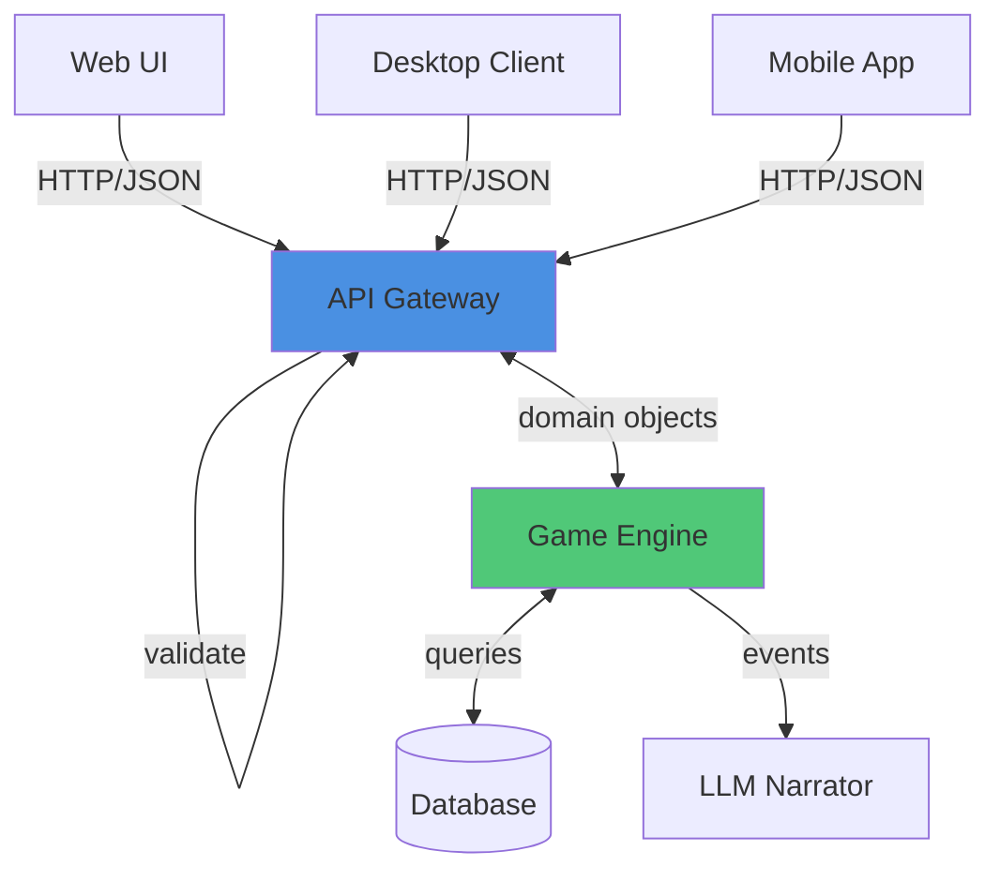

# Pattern: API Abstraction Layer

#pattern #integration #api #interface-design

## Context

Direct coupling between UI, game logic, and LLM systems creates brittle, hard-to-test code. An API abstraction layer provides a clean JSON interface between components, enabling independent development and testing.

**Use this pattern when:**
- Building multi-tier applications (frontend/backend split)
- Multiple clients need game access (web, mobile, desktop)
- Want to test components independently
- Planning to support modding or third-party integrations

## Forces

- **Coupling vs Flexibility**: Direct calls are simple; APIs add overhead
- **Versioning**: APIs need backward compatibility
- **Security**: Must validate/authorize all requests
- **Performance**: API calls slower than direct function calls

## Solution

### Structure



### API Design

#### 1. RESTful Endpoints

```python
from fastapi import FastAPI, HTTPException, Depends
from pydantic import BaseModel, Field
from typing import List, Optional, Dict, Any
from enum import Enum

app = FastAPI(title="LLM Game Engine API", version="1.0.0")

# Request/Response Models
class ActionRequest(BaseModel):
    """Player action request"""
    player_id: str = Field(..., description="Player unique ID")
    action: str = Field(..., description="Natural language action")
    context: Optional[Dict[str, Any]] = Field(default={}, description="Additional context")

class ActionResponse(BaseModel):
    """Action processing result"""
    success: bool
    narrative: str
    state_changes: Dict[str, Any]
    events: List[str]
    errors: List[str] = []

class StateResponse(BaseModel):
    """Current game state"""
    player: Dict[str, Any]
    location: Dict[str, Any]
    characters: List[Dict[str, Any]]
    inventory: List[Dict[str, Any]]
    time: str
    weather: str

class GenerateRequest(BaseModel):
    """Content generation request"""
    type: str = Field(..., description="Entity type: character, location, item")
    template: Optional[str] = None
    constraints: Dict[str, Any] = {}

class GenerateResponse(BaseModel):
    """Generated content"""
    entity_id: str
    data: Dict[str, Any]
    narrative_description: str


# Endpoints
@app.post("/action", response_model=ActionResponse)
async def process_action(request: ActionRequest):
    """
    Process player action and return narrative

    The game engine processes the action deterministically,
    then generates appropriate narrative via LLM.
    """
    try:
        # Get game engine instance
        engine = GameEngineFactory.get_engine(request.player_id)

        # Process action
        outcome = engine.handle_action(request.action, request.context)

        return ActionResponse(
            success=outcome.success,
            narrative=outcome.narrative,
            state_changes=outcome.changes,
            events=outcome.events
        )
    except ValueError as e:
        raise HTTPException(status_code=400, detail=str(e))
    except Exception as e:
        raise HTTPException(status_code=500, detail="Internal error")


@app.get("/state/{player_id}", response_model=StateResponse)
async def get_state(player_id: str):
    """
    Get current game state for player

    Returns full state snapshot for UI rendering.
    """
    try:
        engine = GameEngineFactory.get_engine(player_id)
        state = engine.get_state()

        return StateResponse(
            player=state.player.to_dict(),
            location=state.location.to_dict(),
            characters=[c.to_dict() for c in state.characters],
            inventory=[i.to_dict() for i in state.inventory],
            time=state.time_of_day,
            weather=state.weather
        )
    except KeyError:
        raise HTTPException(status_code=404, detail="Player not found")


@app.post("/generate", response_model=GenerateResponse)
async def generate_content(request: GenerateRequest):
    """
    Generate new game content (character, location, item)

    Uses LLM with templates to create consistent content.
    """
    try:
        generator = ContentGenerator()

        entity = generator.generate(
            entity_type=request.type,
            template=request.template,
            constraints=request.constraints
        )

        return GenerateResponse(
            entity_id=entity.id,
            data=entity.to_dict(),
            narrative_description=entity.description
        )
    except ValueError as e:
        raise HTTPException(status_code=400, detail=str(e))


@app.post("/save/{player_id}")
async def save_game(player_id: str):
    """Save current game state"""
    try:
        engine = GameEngineFactory.get_engine(player_id)
        save_id = engine.save_state()
        return {"save_id": save_id, "timestamp": datetime.now()}
    except Exception as e:
        raise HTTPException(status_code=500, detail="Save failed")


@app.post("/load/{player_id}/{save_id}")
async def load_game(player_id: str, save_id: str):
    """Load saved game state"""
    try:
        engine = GameEngineFactory.get_engine(player_id)
        engine.load_state(save_id)
        return {"success": True}
    except FileNotFoundError:
        raise HTTPException(status_code=404, detail="Save not found")
```

#### 2. WebSocket for Real-time Updates

```python
from fastapi import WebSocket, WebSocketDisconnect
from typing import Dict, Set

class ConnectionManager:
    """Manages WebSocket connections"""

    def __init__(self):
        self.active_connections: Dict[str, Set[WebSocket]] = {}

    async def connect(self, player_id: str, websocket: WebSocket):
        """Register new connection"""
        await websocket.accept()
        if player_id not in self.active_connections:
            self.active_connections[player_id] = set()
        self.active_connections[player_id].add(websocket)

    def disconnect(self, player_id: str, websocket: WebSocket):
        """Remove connection"""
        if player_id in self.active_connections:
            self.active_connections[player_id].discard(websocket)

    async def broadcast_to_player(self, player_id: str, message: dict):
        """Send message to all player's connections"""
        if player_id in self.active_connections:
            for connection in self.active_connections[player_id]:
                await connection.send_json(message)


manager = ConnectionManager()

@app.websocket("/ws/{player_id}")
async def websocket_endpoint(websocket: WebSocket, player_id: str):
    """
    WebSocket connection for real-time updates

    Sends narrative chunks as they're generated (streaming)
    and broadcasts game events in real-time.
    """
    await manager.connect(player_id, websocket)

    try:
        while True:
            # Receive messages from client
            data = await websocket.receive_json()

            # Process action with streaming narrative
            if data.get('type') == 'action':
                engine = GameEngineFactory.get_engine(player_id)

                # Process action
                outcome = engine.handle_action(data['action'])

                # Stream narrative in chunks
                async for chunk in engine.narrator.stream_narrative(outcome):
                    await websocket.send_json({
                        'type': 'narrative_chunk',
                        'text': chunk
                    })

                # Send final state update
                await websocket.send_json({
                    'type': 'state_update',
                    'changes': outcome.changes
                })

    except WebSocketDisconnect:
        manager.disconnect(player_id, websocket)
```

#### 3. Backend Service Layer

```python
class GameEngineFactory:
    """Factory for game engine instances"""

    _engines: Dict[str, 'GameEngine'] = {}

    @classmethod
    def get_engine(cls, player_id: str) -> 'GameEngine':
        """Get or create engine instance"""
        if player_id not in cls._engines:
            cls._engines[player_id] = cls._create_engine(player_id)
        return cls._engines[player_id]

    @classmethod
    def _create_engine(cls, player_id: str) -> 'GameEngine':
        """Initialize new engine"""
        # Load player state
        state_repo = StateRepository()
        state = state_repo.load_player_state(player_id)

        # Initialize systems
        narrator = LLMNarrator(llm_client)

        return GameEngine(
            player_id=player_id,
            initial_state=state,
            narrator=narrator,
            state_repo=state_repo
        )


class GameEngine:
    """Game engine backend service"""

    def __init__(
        self,
        player_id: str,
        initial_state: GameState,
        narrator: LLMNarrator,
        state_repo: StateRepository
    ):
        self.player_id = player_id
        self.state = initial_state
        self.narrator = narrator
        self.state_repo = state_repo
        self.event_bus = EventBus()

    def handle_action(
        self,
        action_text: str,
        context: Dict[str, Any] = None
    ) -> ActionOutcome:
        """Process player action"""
        # Parse action
        action = ActionParser.parse(action_text)

        # Apply game logic
        outcome = self.logic.process(action, self.state)

        # Update state
        if outcome.success:
            self.state.apply_changes(outcome.changes)
            self.state_repo.save_state(self.state)

        # Generate narrative
        narrative = self.narrator.narrate(outcome, self.state)

        # Publish events
        for event in outcome.events:
            self.event_bus.publish(event)

        return ActionOutcome(
            success=outcome.success,
            narrative=narrative,
            changes=outcome.changes,
            events=[e.to_ndl() for e in outcome.events]
        )

    def get_state(self) -> GameState:
        """Get current state snapshot"""
        return self.state.snapshot()

    def save_state(self) -> str:
        """Save game state"""
        return self.state_repo.create_save(self.state)

    def load_state(self, save_id: str):
        """Load saved state"""
        self.state = self.state_repo.load_save(save_id)
```

#### 4. Client SDK

```python
import requests
from typing import Optional

class GameClient:
    """Python client SDK for game API"""

    def __init__(self, base_url: str, player_id: str):
        self.base_url = base_url
        self.player_id = player_id
        self.session = requests.Session()

    def perform_action(self, action: str) -> ActionResponse:
        """Send action to server"""
        response = self.session.post(
            f"{self.base_url}/action",
            json={
                "player_id": self.player_id,
                "action": action
            }
        )
        response.raise_for_status()
        return ActionResponse(**response.json())

    def get_state(self) -> StateResponse:
        """Fetch current state"""
        response = self.session.get(
            f"{self.base_url}/state/{self.player_id}"
        )
        response.raise_for_status()
        return StateResponse(**response.json())

    def generate_content(
        self,
        entity_type: str,
        template: Optional[str] = None
    ) -> GenerateResponse:
        """Generate new content"""
        response = self.session.post(
            f"{self.base_url}/generate",
            json={
                "type": entity_type,
                "template": template,
                "constraints": {}
            }
        )
        response.raise_for_status()
        return GenerateResponse(**response.json())

    def save(self):
        """Save game"""
        response = self.session.post(
            f"{self.base_url}/save/{self.player_id}"
        )
        response.raise_for_status()
        return response.json()


# Usage
client = GameClient("http://localhost:8000", player_id="player_123")

# Perform action
result = client.perform_action("attack the goblin")
print(result.narrative)

# Get state
state = client.get_state()
print(f"HP: {state.player['hp']}")

# Generate NPC
npc = client.generate_content("character", template="guard")
print(npc.narrative_description)
```

## Consequences

### Benefits

1. **Decoupling**: UI and game logic independent
2. **Multiple Clients**: Same API serves web, mobile, desktop
3. **Testability**: API layer easily tested with mock clients
4. **Scalability**: Can scale backend independently
5. **Documentation**: OpenAPI/Swagger auto-generated

### Liabilities

1. **Latency**: Network calls slower than function calls
2. **Complexity**: More moving parts to manage
3. **Serialization Overhead**: JSON conversion cost
4. **Error Handling**: Network failures must be handled

### Related Patterns

- [[architectural/separation-of-concerns|Separation of Concerns]] - APIs enforce layer boundaries
- [[integration/state-to-llm-injection|State-to-LLM Injection]] - API provides state for LLM
- [[architectural/event-driven-design|Event-Driven Design]] - WebSocket broadcasts events

## Source

**Original Discussions:**
- API design discussions throughout Discord
- Contributors: [[User-vali98]], [[User-irovos]]

**Referenced in:**
- [[01-Architecture-and-Design|Architecture Thread]]

## Tags

#api #rest #websocket #architecture #client-server
