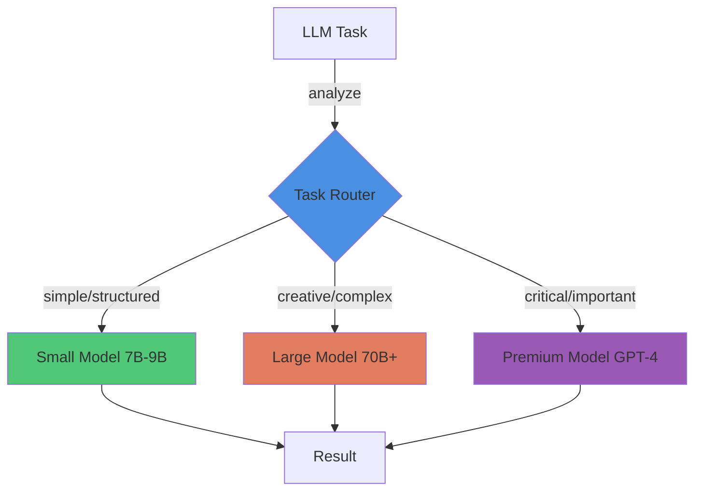

# Pattern: Multi-Model Routing

#pattern #integration #llm #optimization

## Context

Different LLM tasks have different requirements. Using a large expensive model for everything wastes money; using a small cheap model for everything produces poor results. Multi-model routing sends tasks to appropriate models based on complexity.

**Use this pattern when:**
- Running many LLM calls (cost is significant)
- Tasks have varying complexity (simple vs creative)
- Need to optimize cost/quality tradeoff
- Supporting multiple LLM providers

## Forces

- **Cost vs Quality**: Large models better but expensive
- **Latency**: Smaller models respond faster
- **Consistency**: Different models have different styles
- **Complexity**: Routing logic adds overhead

## Solution

### Structure



### Routing Strategies

#### 1. Task-Based Routing

```python
from enum import Enum
from typing import Protocol, Dict, Any
from abc import abstractmethod

class TaskComplexity(Enum):
    """Task complexity levels"""
    SIMPLE = "simple"           # Structured, template-based
    MODERATE = "moderate"       # Standard narration
    COMPLEX = "complex"         # Creative, open-ended
    CRITICAL = "critical"       # Must be perfect

class TaskType(Enum):
    """Types of LLM tasks"""
    NARRATION = "narration"            # Describe game events
    GENERATION = "generation"          # Create new content
    PARSING = "parsing"                # Extract structure from text
    DIALOGUE = "dialogue"              # NPC conversation
    DESCRIPTION = "description"        # Describe entity
    DECISION = "decision"              # Rare: LLM makes choice

class LLMModel(Protocol):
    """LLM interface"""
    @abstractmethod
    def complete(self, prompt: str, temperature: float = 0.7) -> str:
        pass

    @property
    @abstractmethod
    def name(self) -> str:
        pass

    @property
    @abstractmethod
    def cost_per_1k_tokens(self) -> float:
        pass


class ModelRouter:
    """Routes tasks to appropriate models"""

    def __init__(self):
        # Model registry
        self.models: Dict[str, LLMModel] = {
            'small': SmallModel(),      # 7B-9B local
            'medium': MediumModel(),    # 13B-33B local
            'large': LargeModel(),      # 70B local or API
            'premium': PremiumModel()   # GPT-4, Claude
        }

        # Routing rules
        self.routing_table = {
            (TaskType.PARSING, TaskComplexity.SIMPLE): 'small',
            (TaskType.PARSING, TaskComplexity.MODERATE): 'small',

            (TaskType.DESCRIPTION, TaskComplexity.SIMPLE): 'small',
            (TaskType.DESCRIPTION, TaskComplexity.MODERATE): 'medium',
            (TaskType.DESCRIPTION, TaskComplexity.COMPLEX): 'large',

            (TaskType.NARRATION, TaskComplexity.SIMPLE): 'small',
            (TaskType.NARRATION, TaskComplexity.MODERATE): 'medium',
            (TaskType.NARRATION, TaskComplexity.COMPLEX): 'large',

            (TaskType.DIALOGUE, TaskComplexity.SIMPLE): 'medium',
            (TaskType.DIALOGUE, TaskComplexity.MODERATE): 'medium',
            (TaskType.DIALOGUE, TaskComplexity.COMPLEX): 'large',

            (TaskType.GENERATION, TaskComplexity.MODERATE): 'medium',
            (TaskType.GENERATION, TaskComplexity.COMPLEX): 'large',
            (TaskType.GENERATION, TaskComplexity.CRITICAL): 'premium',

            (TaskType.DECISION, TaskComplexity.CRITICAL): 'premium',
        }

    def route(
        self,
        task_type: TaskType,
        complexity: TaskComplexity,
        prompt: str,
        temperature: float = 0.7
    ) -> str:
        """Route task to appropriate model"""
        # Get model for task
        model_key = self.routing_table.get(
            (task_type, complexity),
            'medium'  # default
        )

        model = self.models[model_key]

        print(f"Routing {task_type.value} ({complexity.value}) to {model.name}")

        # Execute
        return model.complete(prompt, temperature)

    def route_auto(
        self,
        task_type: TaskType,
        prompt: str,
        temperature: float = 0.7
    ) -> str:
        """Auto-detect complexity and route"""
        complexity = self._detect_complexity(prompt, task_type)
        return self.route(task_type, complexity, prompt, temperature)

    def _detect_complexity(
        self,
        prompt: str,
        task_type: TaskType
    ) -> TaskComplexity:
        """Heuristic complexity detection"""
        prompt_lower = prompt.lower()

        # Simple indicators
        if 'json' in prompt_lower or 'extract' in prompt_lower:
            return TaskComplexity.SIMPLE

        # Complex indicators
        complex_words = ['creative', 'unique', 'original', 'detailed']
        if any(word in prompt_lower for word in complex_words):
            return TaskComplexity.COMPLEX

        # Length-based
        if len(prompt) > 2000:
            return TaskComplexity.COMPLEX
        elif len(prompt) < 500:
            return TaskComplexity.SIMPLE

        return TaskComplexity.MODERATE
```

#### 2. Specialized Model Clients

```python
class NarrativeGenerator:
    """High-level narrative generation with routing"""

    def __init__(self, router: ModelRouter):
        self.router = router

    def narrate_combat(
        self,
        ndl_event: str,
        context: Dict[str, Any]
    ) -> str:
        """Narrate combat (medium complexity)"""
        prompt = self._build_combat_prompt(ndl_event, context)

        return self.router.route(
            task_type=TaskType.NARRATION,
            complexity=TaskComplexity.MODERATE,
            prompt=prompt,
            temperature=0.7
        )

    def narrate_critical_moment(
        self,
        ndl_event: str,
        context: Dict[str, Any]
    ) -> str:
        """Narrate important story moment (high quality)"""
        prompt = self._build_critical_prompt(ndl_event, context)

        return self.router.route(
            task_type=TaskType.NARRATION,
            complexity=TaskComplexity.COMPLEX,
            prompt=prompt,
            temperature=0.8
        )

    def describe_room(self, location_data: Dict[str, Any]) -> str:
        """Simple room description (low complexity)"""
        prompt = f"""Describe this location in 2 sentences:
Name: {location_data['name']}
Type: {location_data['type']}
Features: {', '.join(location_data['features'])}
"""

        return self.router.route(
            task_type=TaskType.DESCRIPTION,
            complexity=TaskComplexity.SIMPLE,
            prompt=prompt,
            temperature=0.6
        )


class ContentGenerator:
    """Content generation with routing"""

    def __init__(self, router: ModelRouter):
        self.router = router

    def generate_npc(
        self,
        template: str,
        constraints: Dict[str, Any]
    ) -> Dict[str, Any]:
        """Generate NPC (complex task)"""
        prompt = self._build_npc_prompt(template, constraints)

        response = self.router.route(
            task_type=TaskType.GENERATION,
            complexity=TaskComplexity.COMPLEX,
            prompt=prompt,
            temperature=0.9
        )

        return self._parse_npc_json(response)

    def generate_quest(
        self,
        theme: str,
        difficulty: str
    ) -> Dict[str, Any]:
        """Generate quest (critical quality)"""
        prompt = self._build_quest_prompt(theme, difficulty)

        response = self.router.route(
            task_type=TaskType.GENERATION,
            complexity=TaskComplexity.CRITICAL,
            prompt=prompt,
            temperature=0.8
        )

        return self._parse_quest_json(response)

    def generate_item_name(self, item_type: str) -> str:
        """Generate simple item name (simple task)"""
        prompt = f"Generate a fantasy name for a {item_type}. Just the name, nothing else."

        return self.router.route(
            task_type=TaskType.GENERATION,
            complexity=TaskComplexity.SIMPLE,
            prompt=prompt,
            temperature=0.9
        )
```

#### 3. Model Implementations

```python
class SmallModel(LLMModel):
    """7B-9B local model"""

    def __init__(self):
        # Local inference via llama.cpp, GGUF, etc.
        self.client = LocalLLMClient(model_path="models/mistral-7b.gguf")

    def complete(self, prompt: str, temperature: float = 0.7) -> str:
        return self.client.generate(
            prompt,
            temperature=temperature,
            max_tokens=512
        )

    @property
    def name(self) -> str:
        return "Mistral-7B (local)"

    @property
    def cost_per_1k_tokens(self) -> float:
        return 0.0  # Local, free


class MediumModel(LLMModel):
    """13B-33B local model"""

    def __init__(self):
        self.client = LocalLLMClient(model_path="models/mixtral-8x7b.gguf")

    def complete(self, prompt: str, temperature: float = 0.7) -> str:
        return self.client.generate(
            prompt,
            temperature=temperature,
            max_tokens=1024
        )

    @property
    def name(self) -> str:
        return "Mixtral-8x7B (local)"

    @property
    def cost_per_1k_tokens(self) -> float:
        return 0.0


class LargeModel(LLMModel):
    """70B model via API"""

    def __init__(self):
        self.client = APIClient(endpoint="https://api.provider.com", model="llama-70b")

    def complete(self, prompt: str, temperature: float = 0.7) -> str:
        return self.client.generate(
            prompt,
            temperature=temperature,
            max_tokens=2048
        )

    @property
    def name(self) -> str:
        return "Llama-70B (API)"

    @property
    def cost_per_1k_tokens(self) -> float:
        return 0.0008  # $0.80 per 1M tokens


class PremiumModel(LLMModel):
    """GPT-4 or Claude for critical tasks"""

    def __init__(self):
        self.client = OpenAIClient(model="gpt-4")

    def complete(self, prompt: str, temperature: float = 0.7) -> str:
        return self.client.generate(
            prompt,
            temperature=temperature,
            max_tokens=4096
        )

    @property
    def name(self) -> str:
        return "GPT-4"

    @property
    def cost_per_1k_tokens(self) -> float:
        return 0.03  # $30 per 1M tokens
```

#### 4. Cost Tracking

```python
class CostTracker:
    """Track LLM costs across models"""

    def __init__(self):
        self.usage: Dict[str, int] = {}  # model -> token count
        self.calls: Dict[str, int] = {}  # model -> call count

    def log_call(self, model: LLMModel, tokens_used: int):
        """Log model usage"""
        model_name = model.name

        self.usage[model_name] = self.usage.get(model_name, 0) + tokens_used
        self.calls[model_name] = self.calls.get(model_name, 0) + 1

    def get_total_cost(self, models: Dict[str, LLMModel]) -> float:
        """Calculate total cost"""
        total = 0.0
        for model_name, tokens in self.usage.items():
            # Find model object
            model = next((m for m in models.values() if m.name == model_name), None)
            if model:
                cost = (tokens / 1000) * model.cost_per_1k_tokens
                total += cost

        return total

    def print_report(self, models: Dict[str, LLMModel]):
        """Print usage report"""
        print("=== LLM Usage Report ===")
        for model_name, tokens in self.usage.items():
            calls = self.calls[model_name]
            model = next((m for m in models.values() if m.name == model_name), None)

            if model:
                cost = (tokens / 1000) * model.cost_per_1k_tokens
                print(f"{model_name}:")
                print(f"  Calls: {calls}")
                print(f"  Tokens: {tokens:,}")
                print(f"  Cost: ${cost:.4f}")

        total = self.get_total_cost(models)
        print(f"\nTotal Cost: ${total:.4f}")
```

## Consequences

### Benefits

1. **Cost Optimization**: Use expensive models only when needed
2. **Performance**: Small models faster for simple tasks
3. **Quality**: Complex tasks get appropriate model
4. **Flexibility**: Easy to swap models or add new ones

### Liabilities

1. **Routing Complexity**: Need to classify task complexity
2. **Inconsistency**: Different models have different styles
3. **Overhead**: Router adds decision cost
4. **Testing**: Must test all model combinations

### Example Savings

**Scenario**: 1000 LLM calls per day

**Single Model Approach (GPT-4 for everything):**
- Average 500 tokens/call
- Cost: 1000 × 500 × $0.03/1k = $15/day = $450/month

**Multi-Model Approach:**
- 600 simple calls → Small model (local) = $0
- 300 moderate calls → Medium model (local) = $0
- 90 complex calls → Large model API = 90 × 500 × $0.0008/1k = $0.036/day
- 10 critical calls → GPT-4 = 10 × 500 × $0.03/1k = $0.15/day

**Total: $0.186/day = $5.58/month (98.8% savings)**

### Related Patterns

- [[integration/state-to-llm-injection|State-to-LLM Injection]] - Context affects model choice
- [[control/temperature-switching|Dynamic Temperature Switching]] - Temperature per task type
- [[architectural/program-first-architecture|Program-First Architecture]] - LLM only for narration

## Source

**Original Discussions:**
- Model selection discussions throughout Discord
- Contributors: [[User-vali98]], [[User-50h100a]]

**Key Insight:**
> "You don't need GPT-4 for everything. 7B-9B models work fine when you've already made the decisions."

**Referenced in:**
- [[01-Architecture-and-Design|Architecture Thread]]

## Implementation in ChatBotRPG

**Status**: ✅ **EXACT MATCH** - Three-model routing system implemented exactly as described

**Source Files**:
- `src/config.py` (lines 14-16) - Model configuration
- `src/core/make_inference.py` (line 24) - Model selection
- `src/rules/rule_evaluator.py` - CoT model usage

### Production Model Configuration

**File**: `src/config.py` (lines 14-16)

```python
DEFAULT_CONFIG = {
    "default_model": "google/gemini-2.5-flash-lite-preview-06-17",      # Main generation
    "default_cot_model": "google/gemini-2.5-flash-lite-preview-06-17",  # Chain-of-thought
    "default_utility_model": "google/gemini-2.5-flash-lite-preview-06-17"  # Utility tasks
}
```

### Actual Routing Table

| Task | Model Type | Temperature | Max Tokens | File |
|------|------------|-------------|------------|------|
| Character responses | Main | 0.3 | 2048 | `character_inference.py` |
| Narration | Main | 0.7 | 2048 | `scribe/agent_chat.py` |
| Rule evaluation | CoT | 0.1 | 512 | `rules/rule_evaluator.py` |
| Summarization | Utility | 0.3 | 1536 | `make_inference.py:26` |
| Intent analysis | Utility | 0.1 | 256 | `scribe/agent_chat.py:258` |
| Character generation | Utility | 0.7 | 256-512 | `generate/generate_actor.py:180` |

### Production Code Example: CoT Model Usage

**File**: `src/rules/rule_evaluator.py`

```python
evaluation = make_inference(
    context=cot_context,
    url_type=get_default_cot_model(),  # Uses CoT model (not main model)
    temperature=0.1  # Lower temp for structured output
)
```

**File**: `src/core/make_inference.py` (line 24)

```python
summary = make_inference(
    context=[{"role": "user", "content": summary_prompt}],
    url_type=get_default_utility_model(),  # Uses utility model for summarization
    max_tokens=1536,
    is_utility_call=True
)
```

### Multi-Provider Support

ChatBotRPG supports 3 providers via unified interface:

1. **OpenRouter.ai** - Primary (aggregator for 100+ models)
2. **Google GenAI** - Direct Google API with SDK
3. **Local** - Local inference (LM Studio, llama.cpp, etc.)

**Switching**: User-configurable in `config.json` (`current_service` field)

**Source**: [[chatbotrpg-analysis/architecture/01-API-Integration-Complete|API Integration Documentation]]

### Performance Impact

**From Production Analysis**:
- Different models optimize for different cognitive loads
- CoT model uses low temperature (0.1) for deterministic reasoning
- Main model uses medium temperature (0.3) for balanced responses
- Utility model varies temperature by task (0.1-0.7)

### Related Implementation Files

- [[chatbotrpg-analysis/architecture/01-API-Integration-Complete|API Integration Complete]] - Full API routing documentation
- [[chatbotrpg-analysis/patterns/01-Pattern-to-Code-Mapping|Pattern-to-Code Mapping]] - Multi-model routing validation (lines 386-443)

## Tags

#llm #optimization #cost #routing #multi-model #chatbotrpg-validated
