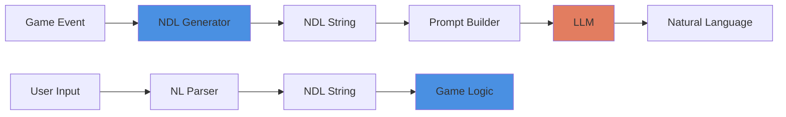

# Pattern: NDL Bridge (Natural Description Language)

#pattern #integration #ndl #markup #narration

## Context

When programmatic game engines need to communicate events to LLMs for narration, sending raw state changes produces poor results. LLMs need structured event descriptions that tell them exactly what to narrate. NDL (Natural Description Language) bridges programmatic game events and natural language narration.

**Use this pattern when:**
- Building program-first game engines
- Need high-quality narration without LLM decision-making
- Working with smaller models (8B-9B parameters)
- Want bidirectional translation (natural language ↔ structured events)

## Forces

**Competing Concerns:**
- **Narration Quality**: LLMs need context to write well
- **Control**: Can't let LLM decide game outcomes
- **Simplicity**: Don't want complex prompt engineering for every event
- **Model Size**: Want to use affordable small models
- **Consistency**: Same game events should produce similar narration styles

## Solution

### Structure



### NDL Syntax

**Core Operators:**
- `do($entity, "action")` - What is happening
- `~"method"` - How it's being done
- `->` - Sequence operator (then)
- `intention="reason"` - Why it's happening
- `target($entity)` - Target of action
- `result("outcome")` - Outcome of action

**Example NDL:**
```ndl
do($"player", "attack")~"sword"->target($"goblin")->roll("hit")->result("success")->damage(8)
```

**Narrates as:**
> "You swing your sword in a wide arc, catching the goblin off-guard. Your blade bites deep into its side, dealing a grievous wound."

### Implementation

```python
from dataclasses import dataclass
from typing import Dict, Any, List

@dataclass
class NDLAction:
    """Represents a single NDL action"""
    verb: str  # do, wait, move, etc.
    entity: str  # $player, $goblin, etc.
    description: str
    modifiers: List[str] = None  # How it's done
    intention: str = ""  # Why it's done
    target: str = ""
    result: Dict[str, Any] = None

    def to_ndl(self) -> str:
        """Convert to NDL string"""
        parts = [f'do(${self.entity}, "{self.description}")']

        if self.modifiers:
            for mod in self.modifiers:
                parts.append(f'~"{mod}"')

        if self.target:
            parts.append(f'->target(${self.target})')

        if self.intention:
            parts.append(f'intention="{self.intention}"')

        if self.result:
            for key, value in self.result.items():
                parts.append(f'->{key}("{value}")')

        return ''.join(parts)

class NDLGenerator:
    """Converts game events to NDL"""

    def generate_combat_action(self, action: str, actor: str, target: str,
                                 hit: bool, damage: int = 0) -> str:
        """Generate NDL for combat"""
        if hit:
            return (f'do(${actor}, "attack")~"weapon"->target(${target})'
                    f'->roll("hit", result="success")->damage({damage})')
        else:
            return (f'do(${actor}, "attack")~"weapon"->target(${target})'
                    f'->roll("hit", result="failure")')

    def generate_movement(self, actor: str, destination: str,
                          method: str = "walking") -> str:
        """Generate NDL for movement"""
        return (f'do(${actor}, "move")~"{method}"'
                f'->destination(${destination})->result("arrive")')

    def generate_dialogue(self, speaker: str, listener: str,
                           topic: str, intention: str) -> str:
        """Generate NDL for social interaction"""
        return (f'do(${speaker}, "speak")~"words"->target(${listener})'
                f'->topic("{topic}")->intention="{intention}"')

    def generate_search(self, actor: str, location: str,
                         found: str = None) -> str:
        """Generate NDL for searching"""
        if found:
            return (f'do(${actor}, "search")~"carefully"->'
                    f'location(${location})->result("find", item=${found})')
        else:
            return (f'do(${actor}, "search")~"thoroughly"->'
                    f'location(${location})->result("nothing")')

class NDLParser:
    """Parses NDL or natural language into structured actions"""

    def parse_ndl(self, ndl_string: str) -> Dict[str, Any]:
        """Parse NDL string into structured data"""
        result = {
            'is_ndl': self._is_ndl(ndl_string),
            'actions': [],
            'end_scene': False,
            'transition_type': None
        }

        if not result['is_ndl']:
            return result

        # Extract actions (simplified parser)
        actions = ndl_string.split('do(')
        for action_str in actions[1:]:  # Skip empty first split
            action = self._parse_action(action_str)
            result['actions'].append(action)

        # Check for scene transitions
        if 'end_scene' in ndl_string or 'transition' in ndl_string:
            result['end_scene'] = True

        return result

    def _is_ndl(self, text: str) -> bool:
        """Check if text contains NDL syntax"""
        ndl_markers = ['do($', '->', 'wait(', '~', 'intention=', 'target($']
        return any(marker in text for marker in ndl_markers)

    def _parse_action(self, action_str: str) -> Dict[str, Any]:
        """Parse a single NDL action"""
        # Simplified parser
        return {
            'type': 'action',
            'raw': action_str
        }

class NDLNarrator:
    """Converts NDL to natural language using LLM"""

    def __init__(self, llm_client):
        self.llm = llm_client

    def narrate(self, ndl: str, context: Dict[str, Any]) -> str:
        """Convert NDL to prose"""
        prompt = self._build_prompt(ndl, context)
        return self.llm.complete(prompt, temperature=0.7)

    def _build_prompt(self, ndl: str, context: Dict[str, Any]) -> str:
        """Build narration prompt from NDL"""
        prompt_parts = [
            "You are a game narrator. Convert structured events into natural prose.",
            "",
            f"Setting: {context.get('location', 'Unknown')}",
            f"Time: {context.get('time', 'Unknown')}",
            f"Characters: {', '.join(context.get('characters', []))}",
            "",
            "Events to narrate:",
            ndl,
            "",
            "Write a natural 2-3 sentence description:",
        ]

        return "\n".join(prompt_parts)

# Usage Example
if __name__ == "__main__":
    # Generate NDL from game event
    generator = NDLGenerator()

    # Combat event
    combat_ndl = generator.generate_combat_action(
        action="attack",
        actor="player",
        target="goblin",
        hit=True,
        damage=8
    )
    print("Combat NDL:", combat_ndl)
    # Output: do($player, "attack")~"weapon"->target($goblin)->roll("hit", result="success")->damage(8)

    # Movement event
    movement_ndl = generator.generate_movement(
        actor="player",
        destination="forest",
        method="running"
    )
    print("Movement NDL:", movement_ndl)

    # Parse NDL
    parser = NDLParser()
    parsed = parser.parse_ndl(combat_ndl)
    print("Parsed:", parsed)
```

## Consequences

### Benefits

1. **High-Quality Narration**: LLM focuses only on prose generation
2. **Small Model Support**: Works on 8B-9B parameter models
3. **Bidirectional**: Parses natural language and generates it
4. **Deterministic Events**: Game logic controls what happens
5. **Hallucination Elimination**: LLM can't invent game state
6. **Composable**: NDL actions chain naturally
7. **Extensible**: Add new action types easily

### Liabilities

1. **Learning Curve**: Developers must learn NDL syntax
2. **Maintenance**: NDL vocabulary grows over time
3. **Complexity**: Additional layer between events and narration
4. **Parser Complexity**: Bidirectional parsing is non-trivial

### Related Patterns

- [[architectural/program-first-architecture|Program-First Architecture]] - NDL implements this
- [[architectural/llm-processing-pipeline|LLM Processing Pipeline]] - NDL fits in generation phase
- [[generation/dynamic-prompt-building|Dynamic Prompt Building]] - NDL enables this

## Source

**Original Discussion**: June-July 2024

**Contributors**: [[User-veritasr]] (creator and primary implementer)

**Key Quotes:**

> "NDL is the piece that glues the two systems together.. Converting from natural text into something the backend can parse, and converting data from the backend into something readable by humans." - veritasr

> "once you offload the decision making to a system that's actually capable of making sane decisions the hallucinations functionally disappear." - veritasr

> "NDL represents the pieces as: what (action()), how (~ (basically with / by)), why(intention='')" - veritasr

**TTRPG Connection**: NDL mirrors tabletop RPG GM narration: what/how/why structure

## See Also

- [[08-NDL-Natural-Description-Language|Full NDL Documentation]]
- [[User-veritasr]] - NDL creator
- ReallmCraft - Primary implementation

## Tags

#pattern #ndl #integration #narration #dsl #markup-language
