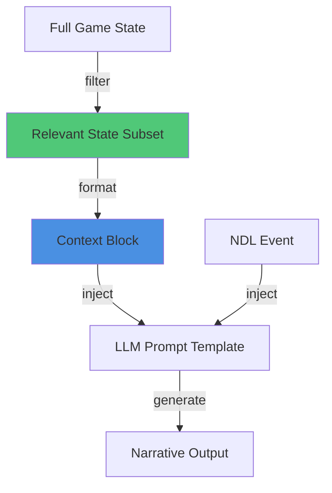

# Pattern: State-to-LLM Injection

#pattern #integration #prompt #context-management

## Context

LLMs need game context to generate relevant narratives, but dumping entire state into prompts wastes tokens and confuses the model. Strategic state injection provides just enough context for coherent narration.

**Use this pattern when:**
- LLM narratives lack important context
- Context window limits are a concern
- Need consistent character/location descriptions
- Building location-aware narration

## Forces

- **Completeness vs Brevity**: More context = better narration but higher cost
- **Relevance**: Not all state is relevant to current action
- **Consistency**: LLM must remember established facts
- **Performance**: Token cost grows with context size

## Solution

### Structure



### Injection Strategies

#### 1. Layered Context Injection

```python
from typing import Dict, Any, List
from dataclasses import dataclass

@dataclass
class GameContext:
    """Structured context for LLM"""
    location: Dict[str, Any]
    characters: List[Dict[str, Any]]
    recent_events: List[str]
    player_state: Dict[str, Any]
    time_and_weather: Dict[str, Any]

class ContextBuilder:
    """Builds relevant context for LLM prompts"""

    def __init__(self, game_state):
        self.state = game_state

    def build_context(self, focus_entity: str = None) -> GameContext:
        """Extract relevant context from full state"""
        return GameContext(
            location=self._get_location_context(),
            characters=self._get_character_context(focus_entity),
            recent_events=self._get_recent_events(limit=3),
            player_state=self._get_player_context(),
            time_and_weather=self._get_environmental_context()
        )

    def _get_location_context(self) -> Dict[str, Any]:
        """Current location details"""
        loc = self.state.current_location
        return {
            'name': loc.name,
            'description': loc.short_description,
            'ambiance': loc.ambiance,
            'exits': list(loc.exits.keys()),
            'items_present': [item.name for item in loc.items]
        }

    def _get_character_context(self, focus: str = None) -> List[Dict[str, Any]]:
        """Nearby characters (prioritize focus)"""
        chars = []
        loc = self.state.current_location

        for char in loc.characters:
            char_data = {
                'name': char.name,
                'status': char.status,  # alive, wounded, dead
                'is_hostile': char.is_hostile,
            }

            # Add extra detail for focus character
            if char.id == focus:
                char_data.update({
                    'hp': f"{char.hp}/{char.max_hp}",
                    'description': char.description,
                    'current_action': char.current_action
                })

            chars.append(char_data)

        return chars

    def _get_recent_events(self, limit: int = 3) -> List[str]:
        """Last N events in NDL format"""
        return self.state.event_history[-limit:]

    def _get_player_context(self) -> Dict[str, Any]:
        """Player state"""
        player = self.state.player
        return {
            'hp': f"{player.hp}/{player.max_hp}",
            'status_effects': player.status_effects,
            'equipped_weapon': player.equipped_weapon.name if player.equipped_weapon else 'unarmed',
            'inventory_count': len(player.inventory)
        }

    def _get_environmental_context(self) -> Dict[str, Any]:
        """Time and weather"""
        return {
            'time_of_day': self.state.time_of_day,
            'weather': self.state.weather,
            'lighting': self.state.lighting_level
        }


class ContextFormatter:
    """Formats context for LLM prompts"""

    @staticmethod
    def format_context(context: GameContext) -> str:
        """Convert context to prompt text"""
        sections = []

        # Location
        sections.append(f"Location: {context.location['name']}")
        sections.append(f"Ambiance: {context.location['ambiance']}")
        sections.append(f"Exits: {', '.join(context.location['exits'])}")

        # Environment
        sections.append(f"Time: {context.time_and_weather['time_of_day']}")
        sections.append(f"Weather: {context.time_and_weather['weather']}")
        sections.append(f"Lighting: {context.time_and_weather['lighting']}")

        # Characters
        if context.characters:
            char_list = ', '.join(c['name'] for c in context.characters)
            sections.append(f"Present: {char_list}")

        # Player status
        sections.append(f"Your HP: {context.player_state['hp']}")
        sections.append(f"Weapon: {context.player_state['equipped_weapon']}")

        # Recent events
        if context.recent_events:
            sections.append("\nRecent events:")
            for i, event in enumerate(context.recent_events, 1):
                sections.append(f"  {i}. {event}")

        return '\n'.join(sections)
```

#### 2. Prompt Template with Injection

```python
class NarrativePromptBuilder:
    """Builds complete prompts with injected context"""

    def __init__(self, context_builder: ContextBuilder):
        self.context_builder = context_builder

    def build_action_prompt(
        self,
        ndl_event: str,
        focus_entity: str = None
    ) -> str:
        """Build prompt for narrating an action"""
        context = self.context_builder.build_context(focus_entity)
        context_text = ContextFormatter.format_context(context)

        prompt = f"""You are a game narrator. Generate a vivid, engaging narrative for the following event.

## Current Scene
{context_text}

## Event
{ndl_event}

## Instructions
- Write 2-3 sentences in second person ("you")
- Be descriptive but concise
- Match the tone to the environment (ominous in dark places, cheerful in taverns)
- Incorporate sensory details (sounds, smells, textures)

Narrative:"""

        return prompt

    def build_description_prompt(
        self,
        entity_id: str,
        entity_type: str  # "character", "item", "location"
    ) -> str:
        """Build prompt for describing an entity"""
        context = self.context_builder.build_context()
        context_text = ContextFormatter.format_context(context)

        entity = self._get_entity(entity_id, entity_type)

        prompt = f"""Generate a description for a {entity_type}.

## Current Scene
{context_text}

## {entity_type.title()} Details
Name: {entity.name}
Type: {entity.type}
"""

        # Add type-specific details
        if entity_type == "character":
            prompt += f"""Status: {entity.status}
Hostility: {"hostile" if entity.is_hostile else "friendly"}
"""
        elif entity_type == "item":
            prompt += f"""Quality: {entity.quality}
Value: {entity.value} gold
"""

        prompt += """
## Instructions
- Write 2-3 sentences
- Be consistent with established scene atmosphere
- Include visual details

Description:"""

        return prompt

    def _get_entity(self, entity_id: str, entity_type: str):
        """Retrieve entity from game state"""
        # Would query from game state
        pass
```

#### 3. Smart Context Window Management

```python
class ContextWindowManager:
    """Manages token budget for context"""

    def __init__(self, max_tokens: int = 2000):
        self.max_tokens = max_tokens

    def build_constrained_context(
        self,
        full_context: GameContext,
        event_ndl: str,
        priority_entities: List[str] = None
    ) -> str:
        """Build context that fits in token budget"""

        # Always include (core context)
        essential = self._format_essential_context(full_context)
        essential_tokens = self._estimate_tokens(essential)

        # Calculate remaining budget
        event_tokens = self._estimate_tokens(event_ndl)
        remaining_tokens = self.max_tokens - essential_tokens - event_tokens

        # Add optional context in priority order
        optional_sections = []

        # Priority 1: Focus entity details
        if priority_entities:
            entity_context = self._format_entity_details(
                full_context,
                priority_entities
            )
            optional_sections.append(('entities', entity_context))

        # Priority 2: Recent events
        events_context = self._format_recent_events(full_context.recent_events)
        optional_sections.append(('events', events_context))

        # Priority 3: Ambient details
        ambient_context = self._format_ambient_details(full_context.location)
        optional_sections.append(('ambient', ambient_context))

        # Add sections until budget exhausted
        final_context = essential
        for section_name, section_text in optional_sections:
            section_tokens = self._estimate_tokens(section_text)
            if remaining_tokens >= section_tokens:
                final_context += '\n' + section_text
                remaining_tokens -= section_tokens
            else:
                break  # Budget exhausted

        return final_context

    def _estimate_tokens(self, text: str) -> int:
        """Rough token estimate"""
        # Simple heuristic: ~4 chars per token
        return len(text) // 4

    def _format_essential_context(self, context: GameContext) -> str:
        """Core context that must always be included"""
        return f"""Location: {context.location['name']}
Time: {context.time_and_weather['time_of_day']}
Your HP: {context.player_state['hp']}"""

    def _format_entity_details(
        self,
        context: GameContext,
        entity_ids: List[str]
    ) -> str:
        """Detailed info about focus entities"""
        details = []
        for char in context.characters:
            if char['name'] in entity_ids:
                details.append(f"{char['name']}: {char.get('description', 'present')}")
        return '\n'.join(details)

    def _format_recent_events(self, events: List[str]) -> str:
        """Recent event history"""
        if not events:
            return ""
        return "Recent:\n" + '\n'.join(f"- {e}" for e in events)

    def _format_ambient_details(self, location: Dict[str, Any]) -> str:
        """Atmospheric details"""
        return f"Ambiance: {location.get('ambiance', 'quiet')}"
```

### Complete Usage Example

```python
# Initialize systems
game_state = GameState()
context_builder = ContextBuilder(game_state)
prompt_builder = NarrativePromptBuilder(context_builder)
window_manager = ContextWindowManager(max_tokens=1500)

# Player attacks goblin
ndl_event = 'do($player, "attack")~"with iron_sword"->target($goblin_1)->damage(15)'

# Build prompt with injected context
prompt = prompt_builder.build_action_prompt(
    ndl_event=ndl_event,
    focus_entity="goblin_1"  # Prioritize goblin details
)

# Or with token budget management
context = context_builder.build_context(focus_entity="goblin_1")
constrained_context = window_manager.build_constrained_context(
    full_context=context,
    event_ndl=ndl_event,
    priority_entities=["goblin_1"]
)

# Generate narrative
narrative = llm.complete(prompt)
```

## Consequences

### Benefits

1. **Token Efficiency**: Only relevant context included
2. **Coherent Narratives**: LLM has necessary information
3. **Consistent Descriptions**: Established facts maintained
4. **Cost Control**: Smaller prompts = lower costs

### Liabilities

1. **Context Selection**: Hard to know what's "relevant"
2. **State Bloat**: Must track what's important
3. **Missing Details**: May omit important context
4. **Complexity**: Context management code can get complex

### Related Patterns

- [[integration/ndl-bridge|NDL Bridge]] - Event format for injection
- [[architectural/program-first-architecture|Program-First Architecture]] - State is source of truth
- [[control/constraint-based-prompting|Constraint-Based Prompting]] - How to structure prompts

## Source

**Original Discussions:**
- Context management discussions throughout Discord
- Contributors: [[User-vali98]], [[User-irovos]]

**Referenced in:**
- [[01-Architecture-and-Design|Architecture Thread]]
- [[08-NDL-Natural-Description-Language|NDL Documentation]]

## Tags

#prompt #context #llm #state-management #token-optimization
