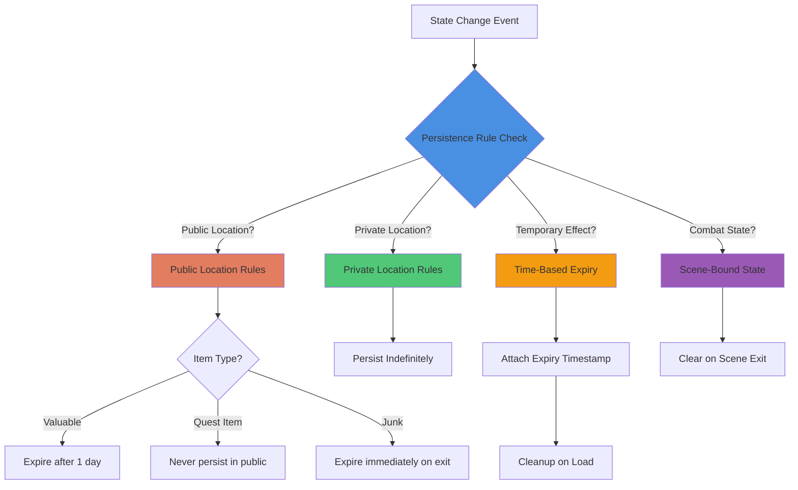

# Pattern: Conditional Persistence

#pattern #state #persistence #rules #context-aware

## Context

Not all state changes should persist permanently. Dropping money in a tavern should disappear (someone will take it), but dropping items in your home should persist. Combat buffs are temporary, but reputation changes are permanent. Death states need special handling. The game needs rules for what persists, for how long, and under what conditions.

**Use this pattern when:**
- Different types of state have different lifetimes
- Location context affects persistence (public vs private)
- Temporary effects need automatic cleanup
- Player actions have different permanence levels
- Need to prevent nonsensical persistent state (e.g., corpses forever)

## Forces

- **Realism vs Simplicity**: Realistic persistence rules are complex
- **Performance**: Cleaning up temporary state requires processing
- **Player Expectations**: Players expect dropped items to persist... sometimes
- **Storage Costs**: Persisting everything bloats save files
- **Gameplay Balance**: Temporary buffs shouldn't be saveable

## Solution

### Structure



### Core Components

#### 1. Persistence Rule System

```python
from dataclasses import dataclass
from typing import Optional, Any, Dict
from datetime import datetime, timedelta
from enum import Enum

class PersistenceType(Enum):
    """How long state persists"""
    PERMANENT = "permanent"          # Survives forever
    TIME_LIMITED = "time_limited"    # Expires after duration
    SCENE_BOUND = "scene_bound"      # Cleared on scene exit
    SESSION_ONLY = "session_only"    # Lost on logout
    CONDITIONAL = "conditional"      # Depends on context

class LocationType(Enum):
    """Location categories affecting persistence"""
    PRIVATE_HOME = "private_home"        # Player's house
    PRIVATE_ROOM = "private_room"        # Rented room, chest
    SEMI_PUBLIC = "semi_public"          # Guild hall, shop
    PUBLIC = "public"                    # Street, tavern, dungeon
    COMBAT_ZONE = "combat_zone"          # Battle arena

class ItemCategory(Enum):
    """Item types with different persistence rules"""
    QUEST = "quest"              # Never lose, never drop in public
    VALUABLE = "valuable"        # Gold, gems - disappear in public
    EQUIPMENT = "equipment"      # Weapons, armor - persist briefly
    CONSUMABLE = "consumable"    # Potions, food
    JUNK = "junk"                # Garbage items

@dataclass
class PersistenceRule:
    """
    Rule for determining if state persists.

    Rules are evaluated to decide if a state change should be saved,
    for how long, and under what conditions.
    """
    rule_type: PersistenceType
    location_type: Optional[LocationType] = None
    item_category: Optional[ItemCategory] = None
    duration: Optional[timedelta] = None
    condition: Optional[str] = None  # Custom condition expression

    def should_persist(
        self,
        location: LocationType,
        item_cat: Optional[ItemCategory] = None,
        context: Optional[Dict[str, Any]] = None
    ) -> bool:
        """Check if state should persist given context"""

        # Permanent always persists
        if self.rule_type == PersistenceType.PERMANENT:
            return True

        # Session only never persists
        if self.rule_type == PersistenceType.SESSION_ONLY:
            return False

        # Scene-bound never persists beyond scene
        if self.rule_type == PersistenceType.SCENE_BOUND:
            return False

        # Time-limited persists with expiry
        if self.rule_type == PersistenceType.TIME_LIMITED:
            return True  # Will be cleaned up later based on duration

        # Conditional logic
        if self.rule_type == PersistenceType.CONDITIONAL:
            # Quest items never persist in public
            if item_cat == ItemCategory.QUEST and location == LocationType.PUBLIC:
                return False

            # Valuables don't persist in public
            if item_cat == ItemCategory.VALUABLE and location == LocationType.PUBLIC:
                return False

            # Everything persists in private locations
            if location in [LocationType.PRIVATE_HOME, LocationType.PRIVATE_ROOM]:
                return True

            # Default: persist temporarily
            return True

        return True


class PersistenceRuleEngine:
    """
    Evaluates persistence rules for state changes.

    Determines what state should be saved, discarded, or expired.
    """

    def __init__(self):
        # Default rule set
        self.rules: Dict[str, PersistenceRule] = {
            # Location-based rules
            'item_in_private_home': PersistenceRule(
                rule_type=PersistenceType.PERMANENT,
                location_type=LocationType.PRIVATE_HOME
            ),
            'item_in_public': PersistenceRule(
                rule_type=PersistenceType.CONDITIONAL,
                location_type=LocationType.PUBLIC
            ),

            # Item-specific rules
            'dropped_quest_item': PersistenceRule(
                rule_type=PersistenceType.CONDITIONAL,
                item_category=ItemCategory.QUEST
            ),
            'dropped_valuable': PersistenceRule(
                rule_type=PersistenceType.TIME_LIMITED,
                item_category=ItemCategory.VALUABLE,
                duration=timedelta(hours=24)  # 1 game day
            ),

            # Effect rules
            'combat_buff': PersistenceRule(
                rule_type=PersistenceType.SCENE_BOUND
            ),
            'poison_effect': PersistenceRule(
                rule_type=PersistenceType.TIME_LIMITED,
                duration=timedelta(minutes=10)
            ),

            # State rules
            'reputation': PersistenceRule(
                rule_type=PersistenceType.PERMANENT
            ),
            'temporary_dialogue_flag': PersistenceRule(
                rule_type=PersistenceType.SESSION_ONLY
            )
        }

    def get_rule(
        self,
        state_type: str,
        location: LocationType,
        item_cat: Optional[ItemCategory] = None
    ) -> PersistenceRule:
        """Get applicable rule for state change"""

        # Check specific rules first
        if state_type in self.rules:
            return self.rules[state_type]

        # Fall back to location-based rules
        if location == LocationType.PRIVATE_HOME:
            return self.rules['item_in_private_home']
        elif location == LocationType.PUBLIC:
            return self.rules['item_in_public']

        # Default: permanent
        return PersistenceRule(rule_type=PersistenceType.PERMANENT)

    def should_persist(
        self,
        state_type: str,
        location: LocationType,
        item_cat: Optional[ItemCategory] = None,
        context: Optional[Dict[str, Any]] = None
    ) -> tuple[bool, Optional[datetime]]:
        """
        Check if state should persist and when it expires.

        Returns (should_persist, expiry_time)
        """
        rule = self.get_rule(state_type, location, item_cat)

        should_save = rule.should_persist(location, item_cat, context)

        # Calculate expiry if time-limited
        expiry = None
        if should_save and rule.duration:
            expiry = datetime.now() + rule.duration

        return should_save, expiry
```

#### 2. State Entry with Expiry

```python
@dataclass
class StatefulEntry:
    """
    State entry with persistence metadata.

    Each piece of state tracks when it was created and when it expires.
    """
    entry_id: str
    entry_type: str  # item, effect, flag, etc.
    data: Dict[str, Any]

    created_at: datetime
    expires_at: Optional[datetime] = None
    persistence_type: PersistenceType = PersistenceType.PERMANENT

    def is_expired(self) -> bool:
        """Check if entry has expired"""
        if not self.expires_at:
            return False
        return datetime.now() > self.expires_at

    def to_dict(self) -> Dict[str, Any]:
        """Serialize for storage"""
        return {
            'entry_id': self.entry_id,
            'entry_type': self.entry_type,
            'data': self.data,
            'created_at': self.created_at.isoformat(),
            'expires_at': self.expires_at.isoformat() if self.expires_at else None,
            'persistence_type': self.persistence_type.value
        }

    @classmethod
    def from_dict(cls, data: Dict[str, Any]) -> 'StatefulEntry':
        """Deserialize from storage"""
        expires_at = None
        if data.get('expires_at'):
            expires_at = datetime.fromisoformat(data['expires_at'])

        return cls(
            entry_id=data['entry_id'],
            entry_type=data['entry_type'],
            data=data['data'],
            created_at=datetime.fromisoformat(data['created_at']),
            expires_at=expires_at,
            persistence_type=PersistenceType(data['persistence_type'])
        )


class StateStorage:
    """State storage with conditional persistence"""

    def __init__(self, rule_engine: PersistenceRuleEngine):
        self.rule_engine = rule_engine
        self.entries: Dict[str, StatefulEntry] = {}

    def add_state(
        self,
        entry_id: str,
        entry_type: str,
        data: Dict[str, Any],
        location: LocationType,
        item_cat: Optional[ItemCategory] = None
    ) -> bool:
        """
        Add state entry if it should persist.

        Returns True if state was saved, False if discarded.
        """
        # Check if should persist
        should_save, expiry = self.rule_engine.should_persist(
            entry_type,
            location,
            item_cat
        )

        if not should_save:
            print(f"State {entry_id} not persisted (location: {location.value})")
            return False

        # Determine persistence type
        rule = self.rule_engine.get_rule(entry_type, location, item_cat)

        # Create entry
        entry = StatefulEntry(
            entry_id=entry_id,
            entry_type=entry_type,
            data=data,
            created_at=datetime.now(),
            expires_at=expiry,
            persistence_type=rule.rule_type
        )

        self.entries[entry_id] = entry

        if expiry:
            print(f"State {entry_id} persisted until {expiry}")
        else:
            print(f"State {entry_id} persisted permanently")

        return True

    def cleanup_expired(self) -> int:
        """Remove expired entries"""
        expired = [
            entry_id for entry_id, entry in self.entries.items()
            if entry.is_expired()
        ]

        for entry_id in expired:
            del self.entries[entry_id]
            print(f"Cleaned up expired state: {entry_id}")

        return len(expired)

    def clear_scene_bound(self) -> int:
        """Clear scene-bound state on scene exit"""
        scene_bound = [
            entry_id for entry_id, entry in self.entries.items()
            if entry.persistence_type == PersistenceType.SCENE_BOUND
        ]

        for entry_id in scene_bound:
            del self.entries[entry_id]
            print(f"Cleared scene-bound state: {entry_id}")

        return len(scene_bound)

    def clear_session_only(self) -> int:
        """Clear session-only state on logout"""
        session_only = [
            entry_id for entry_id, entry in self.entries.items()
            if entry.persistence_type == PersistenceType.SESSION_ONLY
        ]

        for entry_id in session_only:
            del self.entries[entry_id]
            print(f"Cleared session-only state: {entry_id}")

        return len(session_only)
```

#### 3. Integration with Scene System

```python
class SceneWithConditionalPersistence:
    """
    Scene that respects conditional persistence rules.

    Integrates persistence rules into scene state management.
    """

    def __init__(
        self,
        scene_id: str,
        location_type: LocationType,
        rule_engine: PersistenceRuleEngine
    ):
        self.scene_id = scene_id
        self.location_type = location_type
        self.rule_engine = rule_engine
        self.state_storage = StateStorage(rule_engine)

    def drop_item(
        self,
        item_id: str,
        item_category: ItemCategory,
        item_data: Dict[str, Any]
    ) -> str:
        """Drop item with conditional persistence"""

        persisted = self.state_storage.add_state(
            entry_id=f"item_{item_id}",
            entry_type="dropped_item",
            data=item_data,
            location=self.location_type,
            item_cat=item_category
        )

        if not persisted:
            if item_category == ItemCategory.QUEST:
                return f"You cannot drop quest items here!"
            elif self.location_type == LocationType.PUBLIC:
                return f"You drop the {item_data['name']}, but it will likely be gone soon in this public place."

        if self.location_type == LocationType.PRIVATE_HOME:
            return f"You drop the {item_data['name']}. It will be here when you return."
        else:
            return f"You drop the {item_data['name']}."

    def apply_buff(
        self,
        buff_id: str,
        buff_data: Dict[str, Any],
        duration_minutes: Optional[int] = None
    ) -> str:
        """Apply temporary buff"""

        # Buffs are scene-bound unless specified
        persisted = self.state_storage.add_state(
            entry_id=f"buff_{buff_id}",
            entry_type="combat_buff",
            data=buff_data,
            location=self.location_type
        )

        return f"Buff applied: {buff_data['name']}"

    def on_scene_exit(self):
        """Clean up on scene exit"""
        # Clear scene-bound state
        cleared = self.state_storage.clear_scene_bound()
        print(f"Cleared {cleared} scene-bound state entries")

        # Clean up expired state
        expired = self.state_storage.cleanup_expired()
        print(f"Cleaned up {expired} expired entries")

        # Return persistent state for saving
        return {
            entry_id: entry.to_dict()
            for entry_id, entry in self.state_storage.entries.items()
            if entry.persistence_type in [
                PersistenceType.PERMANENT,
                PersistenceType.TIME_LIMITED,
                PersistenceType.CONDITIONAL
            ]
        }
```

#### 4. Complete Example

```python
if __name__ == "__main__":
    # Setup
    rule_engine = PersistenceRuleEngine()

    # Create scenes
    home = SceneWithConditionalPersistence(
        "player_home",
        LocationType.PRIVATE_HOME,
        rule_engine
    )

    tavern = SceneWithConditionalPersistence(
        "rusty_flagon",
        LocationType.PUBLIC,
        rule_engine
    )

    print("=== Testing in Private Home ===")
    # Drop items in home (should persist)
    print(home.drop_item(
        "sword_001",
        ItemCategory.EQUIPMENT,
        {"name": "Iron Sword", "damage": 10}
    ))

    print(home.drop_item(
        "gold_001",
        ItemCategory.VALUABLE,
        {"name": "Gold Coins", "amount": 100}
    ))

    print("\n=== Testing in Public Tavern ===")
    # Drop items in tavern (different rules)
    print(tavern.drop_item(
        "gold_002",
        ItemCategory.VALUABLE,
        {"name": "Gold Coins", "amount": 50}
    ))

    print(tavern.drop_item(
        "quest_amulet",
        ItemCategory.QUEST,
        {"name": "Ancient Amulet", "quest_id": "main_001"}
    ))

    # Apply temporary buff
    print(tavern.apply_buff(
        "strength_001",
        {"name": "Strength Boost", "stat": "strength", "bonus": 5}
    ))

    print("\n=== Scene Exit Cleanup ===")
    # Exit tavern (clears scene-bound, keeps time-limited)
    saved_state = tavern.on_scene_exit()
    print(f"Saved {len(saved_state)} entries from tavern")

    # Exit home (everything persists)
    saved_state = home.on_scene_exit()
    print(f"Saved {len(saved_state)} entries from home")
```

## Consequences

### Benefits

1. **Realistic Behavior**: Matches player expectations (valuables disappear in public)
2. **Storage Optimization**: Doesn't persist temporary state unnecessarily
3. **Gameplay Balance**: Prevents exploits (saving mid-buff, item duplication)
4. **Automatic Cleanup**: Expired state removed without manual intervention
5. **Context Awareness**: Persistence adapts to location and situation

### Liabilities

1. **Rule Complexity**: Many rules hard to maintain and debug
2. **Player Confusion**: Non-obvious rules frustrate players ("where did my item go?")
3. **Implementation Cost**: Requires metadata and cleanup logic
4. **Performance**: Expiry checks on every load/save
5. **Edge Cases**: Corner cases where rules conflict

### Design Guidelines

**Clear Communication:**
- Warn players when dropping items in public places
- Show buff timers for time-limited effects
- Tutorial explains persistence rules

**Sensible Defaults:**
- When in doubt, persist (better than data loss)
- Private locations persist everything
- Quest items never lost
- Session state clearly labeled

**Performance:**
- Batch cleanup operations
- Index entries by expiry time
- Only check expired on scene load, not every frame

### Related Patterns

- [[state/scene-based-boundaries|Scene-Based Boundaries]] - Scene exit triggers cleanup
- [[state/three-tier-persistence|Three-Tier Persistence]] - Different tiers have different rules
- [[architectural/event-driven-design|Event-Driven Design]] - Expiry events trigger cleanup
- [[generation/jit-generation|JIT Generation]] - Expired content regenerated on revisit

## Source

**Original Discussions:**
- monkeyrithms describing dropped items in tavern vs home (February 2024)
- Equipment persistence across scenes discussion
- Public vs private location flags

**Contributors:**
- [[User-monkeyrithms]] - Designed persistence rules for equipment system
- [[User-50h100a]] - Discussed temporary vs permanent state

**Key Quotes:**

> "if you drop your money in a tavern that's gonna be gone the next day. But if it's your home, or a chest, you want it persistent. Flag for public locations might be important as it determines whether certain actions will change your reputation or trigger the guards" - monkeyrithms

> "If you give the coat to another NPC and they put it on, they will now write that they are wearing the coat and this new appearance will persist across scenes" - monkeyrithms

**Referenced in:**
- [[05-State-Management|State Management Thread]]

## Implementation Checklist

- [ ] Define persistence types (permanent, time-limited, scene-bound, etc.)
- [ ] Create rule engine with location and item category support
- [ ] Add expiry timestamps to stateful entries
- [ ] Implement cleanup on scene exit, logout, and periodic
- [ ] Warn players when state won't persist
- [ ] Test edge cases (quest items in public, buffs during logout)
- [ ] Document persistence rules for players
- [ ] Profile cleanup performance

## Tags

#persistence #rules #conditional #state #cleanup #expiry
