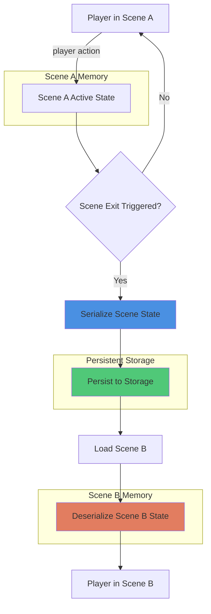

# Pattern: Scene-Based State Boundaries

#pattern #state #persistence #scenes #boundaries

## Context

Game worlds need to persist state, but saving after every action is expensive and saving once at game end loses too much progress. Traditional RPGs use "cells" (Skyrim) or "rooms" (MUDs) as natural boundaries. LLM games need similar boundaries to manage when state transitions from volatile to permanent.

**Use this pattern when:**
- Building large game worlds with multiple locations
- Need efficient save points without manual player saves
- Want to prevent data loss while minimizing disk I/O
- Transitioning between distinct gameplay contexts
- Managing NPC state across different areas

## Forces

- **Performance vs Safety**: Saving after every action is expensive; never saving risks data loss
- **Player Expectations**: RPG players expect locations to "remember" them
- **State Complexity**: Scenes contain NPCs, items, environmental state, and events
- **Memory Constraints**: Can't keep entire world in RAM simultaneously
- **Narrative Coherence**: Scene changes are natural story transitions

## Solution

### Structure



### Core Components

#### 1. Scene Definition

```python
from dataclasses import dataclass, field
from typing import Dict, List, Optional, Set, Any
from datetime import datetime
from enum import Enum

class PersistenceLevel(Enum):
    """How long scene state persists"""
    PERMANENT = "permanent"      # State survives forever (player's home)
    TEMPORARY = "temporary"      # State resets after time period (public places)
    RESPAWNING = "respawning"    # State resets on revisit (dungeon)
    VOLATILE = "volatile"        # State discarded on exit (battle arena)

@dataclass
class Scene:
    """
    Scene represents a bounded gameplay space.

    Scenes are the fundamental unit of state persistence. When a player
    enters a scene, its state is loaded. When they exit, state is saved.
    """
    scene_id: str
    name: str
    description: str
    scene_type: str  # tavern, dungeon, wilderness, home, etc.

    # State data
    npcs_present: List[str] = field(default_factory=list)  # NPC IDs
    items_in_scene: List[str] = field(default_factory=list)  # Item IDs
    environmental_state: Dict[str, Any] = field(default_factory=dict)  # time, weather, etc.

    # Dynamic keywords (grow during play)
    keywords: Set[str] = field(default_factory=set)  # Trigger words for LLM

    # Connections to other scenes
    connections: Dict[str, str] = field(default_factory=dict)  # direction -> scene_id

    # Persistence configuration
    persistence_level: PersistenceLevel = PersistenceLevel.TEMPORARY
    is_public: bool = True  # Public places don't persist dropped items

    # Metadata
    last_visited: Optional[datetime] = None
    visit_count: int = 0

    # Event log (what happened here)
    event_summaries: List[str] = field(default_factory=list)

    def to_dict(self) -> Dict[str, Any]:
        """Serialize scene for persistence"""
        return {
            'scene_id': self.scene_id,
            'name': self.name,
            'description': self.description,
            'scene_type': self.scene_type,
            'npcs_present': self.npcs_present,
            'items_in_scene': self.items_in_scene,
            'environmental_state': self.environmental_state,
            'keywords': list(self.keywords),
            'connections': self.connections,
            'persistence_level': self.persistence_level.value,
            'is_public': self.is_public,
            'last_visited': self.last_visited.isoformat() if self.last_visited else None,
            'visit_count': self.visit_count,
            'event_summaries': self.event_summaries
        }

    @classmethod
    def from_dict(cls, data: Dict[str, Any]) -> 'Scene':
        """Deserialize scene from storage"""
        last_visited = None
        if data.get('last_visited'):
            last_visited = datetime.fromisoformat(data['last_visited'])

        return cls(
            scene_id=data['scene_id'],
            name=data['name'],
            description=data['description'],
            scene_type=data['scene_type'],
            npcs_present=data.get('npcs_present', []),
            items_in_scene=data.get('items_in_scene', []),
            environmental_state=data.get('environmental_state', {}),
            keywords=set(data.get('keywords', [])),
            connections=data.get('connections', {}),
            persistence_level=PersistenceLevel(data.get('persistence_level', 'temporary')),
            is_public=data.get('is_public', True),
            last_visited=last_visited,
            visit_count=data.get('visit_count', 0),
            event_summaries=data.get('event_summaries', [])
        )
```

#### 2. Scene Manager

```python
import json
from pathlib import Path
from typing import Optional

class SceneManager:
    """
    Manages scene lifecycle: loading, activation, persistence.

    Implements the "scene as state boundary" pattern where entering
    and exiting scenes triggers persistence operations.
    """

    def __init__(self, world_path: Path):
        self.world_path = world_path
        self.scenes_dir = world_path / "scenes"
        self.scenes_dir.mkdir(exist_ok=True)

        self.current_scene: Optional[Scene] = None
        self.scene_cache: Dict[str, Scene] = {}

    def enter_scene(
        self,
        scene_id: str,
        player_id: str,
        save_previous: bool = True
    ) -> Scene:
        """
        Enter a new scene, persisting the previous one.

        This is the core of the pattern: scene transitions are save points.
        """
        # Save current scene if exiting one
        if save_previous and self.current_scene:
            self.exit_scene(player_id)

        # Load new scene
        scene = self.load_scene(scene_id)

        # Update metadata
        scene.last_visited = datetime.now()
        scene.visit_count += 1

        # Set as current
        self.current_scene = scene

        print(f"Entered scene: {scene.name} (visits: {scene.visit_count})")

        return scene

    def exit_scene(self, player_id: str) -> None:
        """
        Exit current scene and persist its state.

        Different persistence rules apply based on scene type.
        """
        if not self.current_scene:
            return

        scene = self.current_scene

        print(f"Exiting scene: {scene.name}")

        # Apply persistence rules
        if scene.persistence_level == PersistenceLevel.VOLATILE:
            # Don't save volatile scenes
            print(f"  → Volatile scene, state discarded")
            return

        elif scene.persistence_level == PersistenceLevel.RESPAWNING:
            # Reset state for next visit
            print(f"  → Respawning scene, state will reset")
            # Still save metadata like visit count
            self.save_scene(scene, metadata_only=True)
            return

        elif scene.persistence_level == PersistenceLevel.TEMPORARY:
            # Save state, but may reset after time period
            if scene.is_public:
                # Clear dropped items in public places
                scene.items_in_scene = []
                print(f"  → Public scene, cleared dropped items")

        # Save full state
        self.save_scene(scene)
        print(f"  → Scene state persisted")

    def load_scene(self, scene_id: str) -> Scene:
        """Load scene from storage or cache"""
        # Check cache
        if scene_id in self.scene_cache:
            return self.scene_cache[scene_id]

        # Load from disk
        scene_file = self.scenes_dir / f"{scene_id}.json"

        if scene_file.exists():
            with open(scene_file, 'r') as f:
                data = json.load(f)
            scene = Scene.from_dict(data)
        else:
            # Scene doesn't exist, needs to be generated
            raise ValueError(f"Scene {scene_id} not found")

        # Cache it
        self.scene_cache[scene_id] = scene
        return scene

    def save_scene(self, scene: Scene, metadata_only: bool = False) -> None:
        """Persist scene to storage"""
        scene_file = self.scenes_dir / f"{scene.scene_id}.json"

        data = scene.to_dict()

        if metadata_only:
            # Only save metadata, preserve existing state
            if scene_file.exists():
                with open(scene_file, 'r') as f:
                    existing = json.load(f)
                # Update only metadata fields
                existing['last_visited'] = data['last_visited']
                existing['visit_count'] = data['visit_count']
                data = existing

        with open(scene_file, 'w') as f:
            json.dump(data, f, indent=2)

        # Update cache
        self.scene_cache[scene.scene_id] = scene

    def add_scene_event(self, event_summary: str) -> None:
        """Record what happened in current scene"""
        if self.current_scene:
            self.current_scene.event_summaries.append(event_summary)

    def add_dynamic_keyword(self, keyword: str) -> None:
        """
        Add keyword during gameplay (monkeyrithms pattern).

        If LLM mentions a new feature ("gas station"), add it as a
        keyword so the scene responds to it on future mentions.
        """
        if self.current_scene:
            self.current_scene.keywords.add(keyword.lower())
            print(f"Added keyword '{keyword}' to {self.current_scene.name}")
```

#### 3. Scene State Integration

```python
class GameSession:
    """Game session using scene-based state boundaries"""

    def __init__(self, world_path: Path, player_id: str):
        self.world_path = world_path
        self.player_id = player_id
        self.scene_manager = SceneManager(world_path)

    def travel_to(self, direction: str) -> str:
        """
        Travel in a direction, triggering scene transition.

        Scene exit saves current state, scene enter loads new state.
        """
        current_scene = self.scene_manager.current_scene

        if not current_scene:
            return "You are not in any scene."

        # Check if direction is valid
        if direction not in current_scene.connections:
            return f"You cannot go {direction} from here."

        # Get target scene
        target_scene_id = current_scene.connections[direction]

        # Transition (this triggers save/load)
        new_scene = self.scene_manager.enter_scene(
            target_scene_id,
            self.player_id,
            save_previous=True
        )

        return f"You travel {direction} to {new_scene.name}."

    def drop_item(self, item_id: str) -> str:
        """Drop item in current scene"""
        scene = self.scene_manager.current_scene

        if not scene:
            return "You are not in any scene."

        # Add item to scene
        scene.items_in_scene.append(item_id)

        # Check persistence
        if scene.is_public:
            return f"You drop the item. It may not be here when you return to this public place."
        else:
            return f"You drop the item. It will be here when you return."

    def rest(self) -> str:
        """
        Rest (save game trigger).

        Traditional pattern: resting/sleeping = save point.
        """
        # Force save current scene
        if self.scene_manager.current_scene:
            self.scene_manager.exit_scene(self.player_id)
            # Re-enter same scene
            scene_id = self.scene_manager.current_scene.scene_id
            self.scene_manager.enter_scene(scene_id, self.player_id, save_previous=False)

        return "You rest and the game is saved."
```

#### 4. Complete Example

```python
if __name__ == "__main__":
    from pathlib import Path

    # Create test world
    world_path = Path("./test_world")
    world_path.mkdir(exist_ok=True)
    scenes_dir = world_path / "scenes"
    scenes_dir.mkdir(exist_ok=True)

    # Create two scenes
    tavern = Scene(
        scene_id="tavern_001",
        name="The Rusty Flagon Tavern",
        description="A cozy tavern with a roaring fireplace.",
        scene_type="tavern",
        persistence_level=PersistenceLevel.TEMPORARY,
        is_public=True,
        connections={"east": "street_001"}
    )

    street = Scene(
        scene_id="street_001",
        name="Main Street",
        description="A busy cobblestone street.",
        scene_type="street",
        persistence_level=PersistenceLevel.TEMPORARY,
        is_public=True,
        connections={"west": "tavern_001"}
    )

    # Save initial scenes
    for scene in [tavern, street]:
        with open(scenes_dir / f"{scene.scene_id}.json", 'w') as f:
            json.dump(scene.to_dict(), f, indent=2)

    # Start game session
    session = GameSession(world_path, player_id="player_001")

    # Enter tavern
    print("\n=== Entering Tavern ===")
    session.scene_manager.enter_scene("tavern_001", "player_001", save_previous=False)

    # Add NPC to scene
    session.scene_manager.current_scene.npcs_present.append("bartender_npc")

    # Add dynamic keyword during play
    session.scene_manager.add_dynamic_keyword("fireplace")

    # Drop item
    print("\n=== Dropping Item ===")
    print(session.drop_item("gold_coin"))

    # Travel to street (saves tavern, loads street)
    print("\n=== Traveling East ===")
    print(session.travel_to("east"))

    # Travel back (saves street, loads tavern with previous state)
    print("\n=== Traveling West ===")
    print(session.travel_to("west"))

    # Check if our keyword and NPC persisted
    current = session.scene_manager.current_scene
    print(f"\nTavern state after returning:")
    print(f"  NPCs: {current.npcs_present}")
    print(f"  Items: {current.items_in_scene}")
    print(f"  Keywords: {current.keywords}")
    print(f"  Visits: {current.visit_count}")
```

## Consequences

### Benefits

1. **Natural Save Points**: Scene transitions feel natural, not arbitrary
2. **Memory Efficiency**: Only current scene in RAM, rest on disk
3. **Data Safety**: Regular automatic saves without player action
4. **Familiar Pattern**: RPG players understand "cells" from Skyrim, Fallout
5. **Flexible Persistence**: Different scenes can have different rules
6. **Narrative Coherence**: Scene changes align with story transitions

### Liabilities

1. **Save Granularity**: Can't save mid-scene without exiting
2. **Exit Overhead**: Must serialize entire scene on every transition
3. **Accidental Loss**: Player might not realize traveling = save
4. **Large Scenes**: Open-world scenes may contain too much state
5. **Cross-Scene State**: Objects spanning multiple scenes are complex

### Design Trade-offs

**When to Use Scene Boundaries:**
- Discrete locations (rooms, buildings, towns)
- Clear entry/exit points
- State changes are local to scene
- Scene size is manageable

**When to Use Alternative Patterns:**
- Open-world games without clear boundaries
- Real-time multiplayer (need immediate persistence)
- Tiny state that can save every action
- Huge state that needs incremental saves

### Related Patterns

- [[state/three-tier-persistence|Three-Tier Persistence]] - Scenes are part of playthrough state
- [[state/conditional-persistence|Conditional Persistence]] - Public vs private scene rules
- [[generation/jit-generation|JIT Generation]] - Generate scenes on-demand when entered
- [[architectural/event-driven-design|Event-Driven Design]] - Scene entry/exit events

## Source

**Original Discussions:**
- monkeyrithms' detailed description of scene system (February 2024)
- Scene as cells comparison to Skyrim/Fallout
- Public vs private persistence rules for items

**Contributors:**
- [[User-monkeyrithms]] - Implemented scene-based system with dynamic keywords
- [[User-50h100a]] - Provided sleep-as-savegame insight
- [[User-veritasr]] - Scene state vs story state discussion

**Key Quotes:**

> "I can 'reset' the scene, and all measures of 'progress' will reset with it... or, I can change the scene, so I can walk out the door and it links to the next scene. It saves summaries of the chat log in the tavern for all the NPCs involved, and 'locks in' any game-state changes accrued during that scene" - monkeyrithms

> "that's essentially how im doing it but with folders instead of an array, and how Fallout or Skyrim manage their big amount of content, a lot of the material is segmented into what belongs in what 'cell' or 'scene' or location" - monkeyrithms

> "Sleep-as-savegame is traditional. and understood, generally" - 50h100a

**Referenced in:**
- [[05-State-Management|State Management Thread]]

## Implementation Notes

### Optimizations

1. **Lazy Saving**: Only save scenes that changed
2. **Compression**: Compress scene JSON for large scenes
3. **Caching**: Keep recently visited scenes in memory
4. **Diff-Based**: Only persist state deltas, not full state
5. **Background Saves**: Asynchronously persist while loading next scene

### Edge Cases

1. **Player Logs Out Mid-Scene**: Need session timeout save
2. **Scene Crash**: Need temporary autosaves within long scenes
3. **Travel Spam**: Rate-limit scene transitions to prevent save thrashing
4. **Circular Connections**: Ensure scene graph doesn't create infinite loops

### Testing Strategy

```python
def test_scene_persistence():
    """Verify scene state persists across transitions"""
    manager = SceneManager(Path("./test_world"))

    # Enter scene
    scene = manager.enter_scene("test_scene", "player_1", save_previous=False)

    # Modify state
    scene.npcs_present.append("npc_1")
    scene.keywords.add("test_keyword")

    # Exit (saves)
    manager.exit_scene("player_1")

    # Clear cache
    manager.scene_cache.clear()
    manager.current_scene = None

    # Re-enter (loads from disk)
    scene = manager.enter_scene("test_scene", "player_1", save_previous=False)

    # Verify state persisted
    assert "npc_1" in scene.npcs_present
    assert "test_keyword" in scene.keywords
    assert scene.visit_count == 2
```

## Tags

#scenes #persistence #state #boundaries #rpg #save-system
