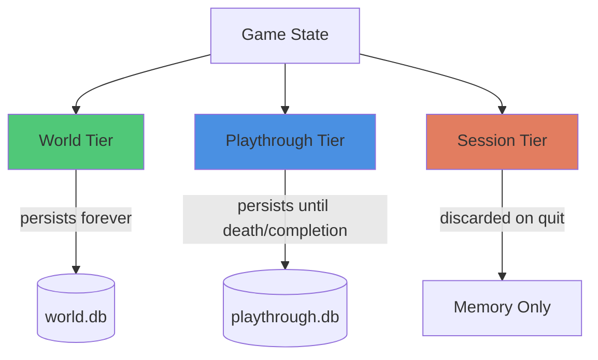

# Pattern: Three-Tier Persistence

#pattern #state #persistence #save-system

## Context

Games need different levels of state persistence. Some data (world maps) should persist forever, some (playthrough progress) should persist across sessions, and some (combat state) should reset on reload. Three-tier persistence separates these concerns.

**Use this pattern when:**
- Building games with procedural worlds
- Need different save/load behaviors for different data
- Want to support world reuse across playthroughs
- Planning roguelike or permadeath mechanics

## Forces

- **Permanence vs Flexibility**: What should persist vs reset?
- **Save File Size**: More persistence = larger saves
- **Player Expectations**: Players expect certain things to persist
- **Development Complexity**: More tiers = more complexity

## Solution

### Structure



### Tier Definitions

#### Tier 1: World (Permanent)

**What persists:**
- World geography (locations, connections)
- Generated NPCs and their base data
- Quests and story structure
- Lore and world history
- Templates and content schemas

**Lifetime:** Forever (or until world reset)

**Use case:** World can be reused across multiple playthroughs

```python
from dataclasses import dataclass
from typing import List, Dict
import json

@dataclass
class WorldState:
    """Permanent world data"""
    world_id: str
    world_name: str
    seed: int
    created_at: str

    # Geography
    locations: Dict[str, 'Location']
    location_connections: Dict[str, List[str]]

    # Base NPCs (not their current state)
    npc_templates: Dict[str, 'NPCTemplate']

    # Quest definitions
    quest_templates: Dict[str, 'QuestTemplate']

    # World lore
    lore_entries: List['LoreEntry']

    def save_to_disk(self, path: str):
        """Persist world state"""
        data = {
            'world_id': self.world_id,
            'world_name': self.world_name,
            'seed': self.seed,
            'created_at': self.created_at,
            'locations': {k: v.to_dict() for k, v in self.locations.items()},
            'location_connections': self.location_connections,
            'npc_templates': {k: v.to_dict() for k, v in self.npc_templates.items()},
            'quest_templates': {k: v.to_dict() for k, v in self.quest_templates.items()},
            'lore_entries': [e.to_dict() for e in self.lore_entries]
        }

        with open(path, 'w') as f:
            json.dump(data, f, indent=2)

    @classmethod
    def load_from_disk(cls, path: str) -> 'WorldState':
        """Load world state"""
        with open(path, 'r') as f:
            data = json.load(f)

        return cls(
            world_id=data['world_id'],
            world_name=data['world_name'],
            seed=data['seed'],
            created_at=data['created_at'],
            locations={k: Location.from_dict(v) for k, v in data['locations'].items()},
            location_connections=data['location_connections'],
            npc_templates={k: NPCTemplate.from_dict(v) for k, v in data['npc_templates'].items()},
            quest_templates={k: QuestTemplate.from_dict(v) for k, v in data['quest_templates'].items()},
            lore_entries=[LoreEntry.from_dict(e) for e in data['lore_entries']]
        )
```

#### Tier 2: Playthrough (Session Persistent)

**What persists:**
- Player character state (HP, inventory, stats)
- NPC relationship states
- Quest progress
- World changes (killed NPCs, opened doors)
- Discovered locations
- Story progression flags

**Lifetime:** Until character death, game completion, or explicit reset

**Use case:** Standard save/load during a playthrough

```python
@dataclass
class PlaythroughState:
    """Playthrough-specific data"""
    playthrough_id: str
    world_id: str  # References world tier
    character_name: str
    started_at: str

    # Player state
    player_hp: int
    player_max_hp: int
    player_stats: Dict[str, int]
    player_inventory: List[str]
    player_location: str

    # NPC states (current, not templates)
    npc_states: Dict[str, 'NPCState']  # id -> state

    # Quest progress
    active_quests: List[str]
    completed_quests: List[str]
    failed_quests: List[str]

    # World modifications
    dead_npcs: List[str]
    opened_doors: List[str]
    taken_items: List[str]

    # Discovery
    discovered_locations: List[str]
    discovered_lore: List[str]

    # Story flags
    story_flags: Dict[str, bool]

    def save_to_disk(self, path: str):
        """Save playthrough state"""
        data = {
            'playthrough_id': self.playthrough_id,
            'world_id': self.world_id,
            'character_name': self.character_name,
            'started_at': self.started_at,
            'player_hp': self.player_hp,
            'player_max_hp': self.player_max_hp,
            'player_stats': self.player_stats,
            'player_inventory': self.player_inventory,
            'player_location': self.player_location,
            'npc_states': {k: v.to_dict() for k, v in self.npc_states.items()},
            'active_quests': self.active_quests,
            'completed_quests': self.completed_quests,
            'failed_quests': self.failed_quests,
            'dead_npcs': self.dead_npcs,
            'opened_doors': self.opened_doors,
            'taken_items': self.taken_items,
            'discovered_locations': self.discovered_locations,
            'discovered_lore': self.discovered_lore,
            'story_flags': self.story_flags
        }

        with open(path, 'w') as f:
            json.dump(data, f, indent=2)

    @classmethod
    def load_from_disk(cls, path: str) -> 'PlaythroughState':
        """Load playthrough state"""
        with open(path, 'r') as f:
            data = json.load(f)

        return cls(
            playthrough_id=data['playthrough_id'],
            world_id=data['world_id'],
            character_name=data['character_name'],
            started_at=data['started_at'],
            player_hp=data['player_hp'],
            player_max_hp=data['player_max_hp'],
            player_stats=data['player_stats'],
            player_inventory=data['player_inventory'],
            player_location=data['player_location'],
            npc_states={k: NPCState.from_dict(v) for k, v in data['npc_states'].items()},
            active_quests=data['active_quests'],
            completed_quests=data['completed_quests'],
            failed_quests=data['failed_quests'],
            dead_npcs=data['dead_npcs'],
            opened_doors=data['opened_doors'],
            taken_items=data['taken_items'],
            discovered_locations=data['discovered_locations'],
            discovered_lore=data['discovered_lore'],
            story_flags=data['story_flags']
        )
```

#### Tier 3: Session (Volatile)

**What persists:**
- Current combat state
- Active dialogue tree position
- UI state (camera position, selected items)
- Temporary buffs/debuffs
- Animation states
- Pending LLM requests

**Lifetime:** Current session only (lost on quit)

**Use case:** Runtime state that shouldn't persist

```python
@dataclass
class SessionState:
    """Volatile session data"""

    # Combat (if in combat)
    in_combat: bool = False
    combat_participants: List[str] = None
    combat_turn_order: List[str] = None
    current_turn: int = 0

    # Dialogue (if in dialogue)
    in_dialogue: bool = False
    dialogue_partner: str = None
    dialogue_tree_position: str = None
    dialogue_history: List[str] = None

    # UI state
    camera_position: tuple = (0, 0)
    selected_item: str = None
    open_menus: List[str] = None

    # Temporary effects
    temp_buffs: List['Buff'] = None
    temp_debuffs: List['Debuff'] = None

    # Pending operations
    pending_llm_requests: List[str] = None
    pending_animations: List[str] = None

    # NOT persisted - recreated each session
```

### Complete Persistence Manager

```python
class PersistenceManager:
    """Manages all three tiers"""

    def __init__(self, save_dir: str):
        self.save_dir = save_dir

    def save_game(
        self,
        world: WorldState,
        playthrough: PlaythroughState,
        session: SessionState  # Not actually saved
    ):
        """Save game state"""
        # Save world (if modified)
        world_path = f"{self.save_dir}/worlds/{world.world_id}.json"
        world.save_to_disk(world_path)

        # Save playthrough
        playthrough_path = f"{self.save_dir}/saves/{playthrough.playthrough_id}.json"
        playthrough.save_to_disk(playthrough_path)

        # Session tier NOT saved (intentionally lost)

        return playthrough.playthrough_id

    def load_game(self, playthrough_id: str) -> tuple:
        """Load game state"""
        # Load playthrough
        playthrough_path = f"{self.save_dir}/saves/{playthrough_id}.json"
        playthrough = PlaythroughState.load_from_disk(playthrough_path)

        # Load world
        world_path = f"{self.save_dir}/worlds/{playthrough.world_id}.json"
        world = WorldState.load_from_disk(world_path)

        # Create fresh session state
        session = SessionState()

        return world, playthrough, session

    def create_new_playthrough(
        self,
        world_id: str,
        character_name: str
    ) -> PlaythroughState:
        """Start new game in existing world"""
        # Load world
        world_path = f"{self.save_dir}/worlds/{world_id}.json"
        world = WorldState.load_from_disk(world_path)

        # Create new playthrough
        playthrough_id = self._generate_id()
        playthrough = PlaythroughState(
            playthrough_id=playthrough_id,
            world_id=world_id,
            character_name=character_name,
            started_at=datetime.now().isoformat(),
            player_hp=100,
            player_max_hp=100,
            player_stats={},
            player_inventory=[],
            player_location=world.starting_location,
            npc_states={},
            active_quests=[],
            completed_quests=[],
            failed_quests=[],
            dead_npcs=[],
            opened_doors=[],
            taken_items=[],
            discovered_locations=[world.starting_location],
            discovered_lore=[],
            story_flags={}
        )

        return playthrough

    def delete_playthrough(self, playthrough_id: str):
        """Delete save (keep world)"""
        playthrough_path = f"{self.save_dir}/saves/{playthrough_id}.json"
        os.remove(playthrough_path)

    def reset_world(self, world_id: str):
        """Delete world and all its playthroughs"""
        # Delete world
        world_path = f"{self.save_dir}/worlds/{world_id}.json"
        os.remove(world_path)

        # Delete all playthroughs for this world
        for save_file in os.listdir(f"{self.save_dir}/saves"):
            save_path = f"{self.save_dir}/saves/{save_file}"
            with open(save_path) as f:
                data = json.load(f)
                if data['world_id'] == world_id:
                    os.remove(save_path)
```

## Consequences

### Benefits

1. **World Reuse**: Play same world multiple times
2. **Clear Semantics**: Know what persists vs resets
3. **Save File Size**: Don't save temporary data
4. **Permadeath Support**: Easy to implement (delete playthrough, keep world)
5. **Development Clarity**: Know where each data belongs

### Liabilities

1. **Complexity**: Three systems to manage
2. **Consistency**: Must ensure tiers don't conflict
3. **Migration**: Schema changes affect saved data
4. **Debugging**: Harder to trace state across tiers

### Example Scenarios

**Scenario 1: Permadeath Roguelike**
```python
# Player dies
persistence.delete_playthrough(current_playthrough_id)

# Start new run in same world
new_playthrough = persistence.create_new_playthrough(
    world_id=world.world_id,
    character_name="Hero #2"
)
# World geography unchanged, but NPC states reset from templates
```

**Scenario 2: Save Scumming Prevention**
```python
# Combat starts - session tier only
session.in_combat = True
session.combat_participants = ["player", "dragon"]

# Player quits during combat
# Combat state lost (session tier not saved)

# On reload
# Player outside combat, before encounter
```

**Scenario 3: Multiple Characters, Same World**
```python
# Create world once
world = generate_world(seed=12345)
persistence.save_game(world, None, None)

# Create multiple playthroughs
playthrough1 = persistence.create_new_playthrough(world.world_id, "Warrior")
playthrough2 = persistence.create_new_playthrough(world.world_id, "Mage")

# Each has independent progress in same world
```

### Related Patterns

- [[state/scene-based-boundaries|Scene-Based Boundaries]] - When to save/load
- [[state/conditional-persistence|Conditional Persistence]] - What to persist within tiers
- [[generation/hierarchical-cascade|Hierarchical Cascade]] - World tier contains generation templates

## Source

**Original Discussions:**
- State management throughout Discord
- Contributors: [[User-vali98]], [[User-irovos]]

**Key Insight:**
> "Separate world from playthrough. The world should be reusable."

**Referenced in:**
- [[05-State-Management|State Management Thread]]

## Tags

#state #persistence #save-system #world-generation #roguelike
